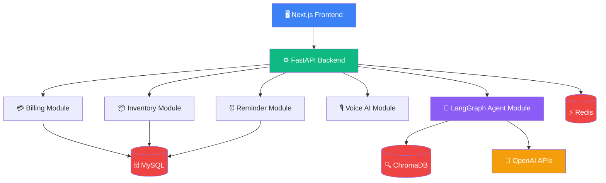
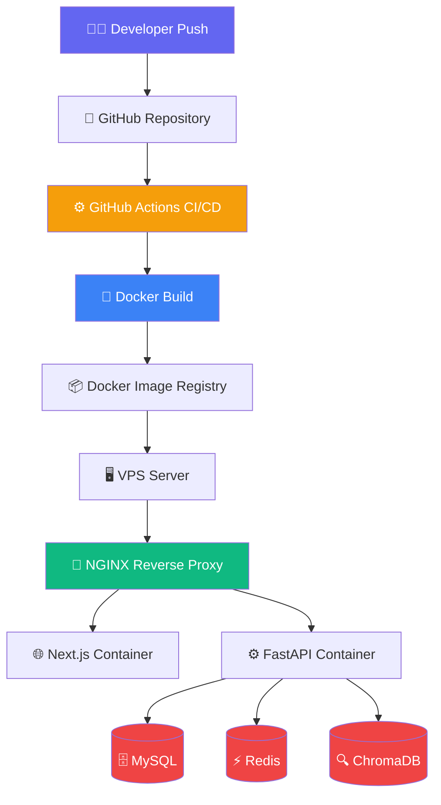
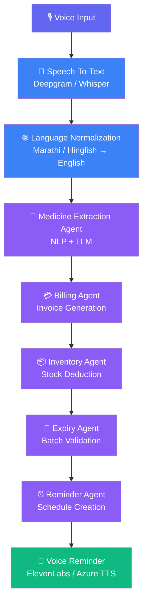
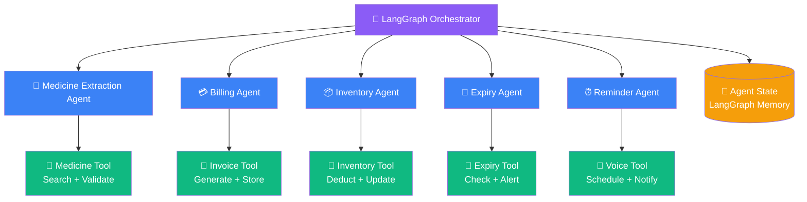
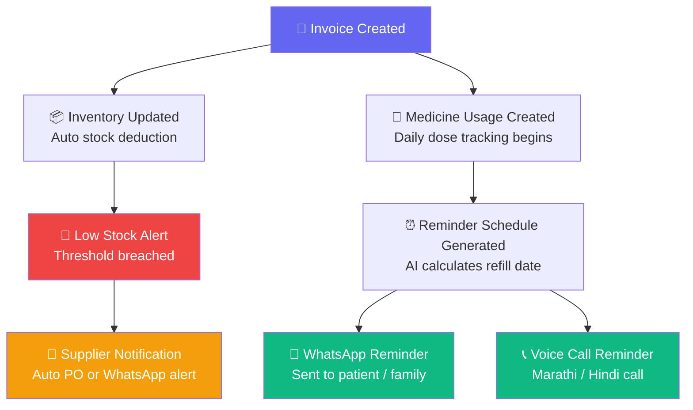
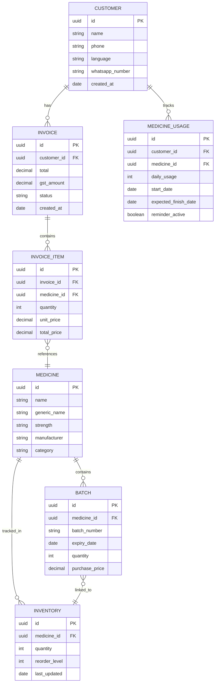
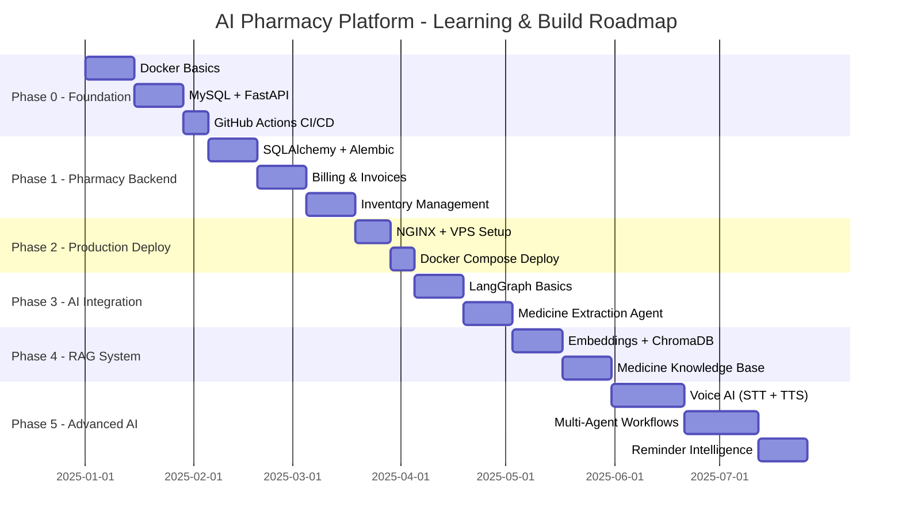

# 🏥 AI-Powered Connected Pharmacy Ecosystem
### Production-Grade Tech Stack & Architecture Document

---

## 📌 Table of Contents

1. [Project Vision](#1-project-vision)
2. [Core Product Modules](#2-core-product-modules)
3. [Final Recommended Tech Stack](#3-final-recommended-tech-stack)
4. [Development Architecture](#4-development-architecture)
5. [Production Deployment Architecture](#5-production-deployment-architecture)
6. [AI Workflow Architecture](#6-ai-workflow-architecture)
7. [LangGraph Multi-Agent Architecture](#7-langgraph-multi-agent-architecture)
8. [Event-Driven Workflow](#8-event-driven-workflow)
9. [Database Architecture](#9-database-architecture)
10. [Folder Structure](#10-folder-structure)
11. [Learning Roadmap](#11-learning-roadmap)
12. [Engineering Principles](#12-engineering-principles)
13. [Stack Summary](#13-final-stack-summary)

---

## 1. Project Vision

> **AI Operating System for Pharmacies & Chronic Healthcare**

A production-grade AI platform combining:

- 🎙️ Voice-based pharmacy billing
- 📦 Inventory automation
- 🔮 AI refill prediction
- 👴 Elderly medicine reminders
- 🗣️ Regional-language voice AI (Marathi / Hindi)
- 🤖 Multi-agent orchestration
- ☁️ SaaS pharmacy management

---

## 2. Core Product Modules

### 🏪 Pharmacy Side

| Module | Features |
|---|---|
| Voice Billing | Speak medicines, auto-generate bills |
| Invoice Generation | PDF invoices, GST-ready |
| Inventory Management | Real-time stock tracking |
| Batch & Expiry Tracking | Auto-alerts before expiry |
| Supplier Management | PO generation, supplier contacts |
| Customer Management | Customer profiles, purchase history |

### 📱 Customer Side

| Module | Features |
|---|---|
| Medicine Tracking | Daily intake tracking |
| Refill Prediction | AI-predicted refill dates |
| Voice Reminders | Marathi / Hindi reminders |
| Family Notifications | Alerts to family members |
| WhatsApp Alerts | Automated WhatsApp messages |

### 🤖 AI Layer

| Module | Features |
|---|---|
| Voice Understanding | Marathi / Hinglish STT |
| Medicine Extraction | NLP-based medicine parsing |
| Agent Orchestration | LangGraph multi-agent |
| RAG Knowledge System | Medicine knowledge retrieval |
| Reminder Intelligence | Smart reminder scheduling |

---

## 3. Final Recommended Tech Stack

### Frontend Stack

```
Pharmacy Dashboard  →  Next.js + JavaScript + TailwindCSS + ShadCN UI
Customer Mobile App →  React Native
```

> ⚠️ **Note:** JavaScript is used throughout — no TypeScript.

### Backend Stack

```
Core Backend  →  FastAPI (Python 3.12+)
```

**Why FastAPI?**
- ✅ Excellent Python ecosystem
- ✅ Async support (perfect for AI tasks)
- ✅ AI-friendly integrations
- ✅ High performance with Uvicorn

### Database Stack

```
Primary DB    →  MySQL
Cache Layer   →  Redis
Vector DB     →  ChromaDB (→ Pinecone / Qdrant later)
```

### AI Stack

```
Agent Orchestration  →  LangGraph
LLM Provider         →  OpenAI (GPT-4.1 / GPT-4o)
Embeddings           →  OpenAI Embeddings
```

### Voice AI Stack

```
Speech-To-Text  →  Deepgram / Whisper / Google Speech
Text-To-Speech  →  ElevenLabs / Azure Speech / Google TTS
```

### Communication Stack

```
WhatsApp   →  Twilio WhatsApp API  OR  Meta WhatsApp Cloud API
Calling    →  Twilio / Exotel
```

### DevOps Stack

```
Containerization  →  Docker
Orchestration     →  Docker Compose
CI/CD             →  GitHub Actions
Reverse Proxy     →  NGINX
Hosting           →  VPS (Hetzner / DigitalOcean) → AWS / Azure
```

---

## 4. Development Architecture

> ✅ Start with **Modular Monolith** — NOT microservices.

**Why Modular Monolith first?**
- Easier learning curve
- Easier debugging
- Faster development cycles
- Less infrastructure complexity
- Ideal for startups & MVPs



---

## 5. Production Deployment Architecture



---

## 6. AI Workflow Architecture



---

## 7. LangGraph Multi-Agent Architecture



---

## 8. Event-Driven Workflow



---

## 9. Database Architecture



---

## 10. Folder Structure

```
project-root/
│
├── 🌐 frontend/                     # Next.js (JavaScript)
│   ├── app/
│   │   ├── (dashboard)/
│   │   ├── (billing)/
│   │   └── (inventory)/
│   ├── components/
│   ├── lib/
│   └── public/
│
├── ⚙️ backend/                      # FastAPI (Python)
│   ├── app/
│   │   ├── api/                     # Route handlers
│   │   │   ├── v1/
│   │   │   │   ├── billing.py
│   │   │   │   ├── inventory.py
│   │   │   │   ├── customers.py
│   │   │   │   └── reminders.py
│   │   ├── agents/                  # LangGraph agents
│   │   │   ├── medicine_extraction.py
│   │   │   ├── billing_agent.py
│   │   │   ├── inventory_agent.py
│   │   │   └── reminder_agent.py
│   │   ├── services/                # Business logic
│   │   ├── repositories/            # DB access layer
│   │   ├── models/                  # SQLAlchemy models
│   │   ├── schemas/                 # Pydantic schemas
│   │   ├── workflows/               # LangGraph workflows
│   │   ├── ai/                      # AI utilities
│   │   ├── voice/                   # STT / TTS
│   │   └── core/                    # Config, DB, security
│   ├── tests/
│   └── requirements.txt
│
├── 📱 mobile/                       # React Native app
│   ├── src/
│   │   ├── screens/
│   │   ├── components/
│   │   └── services/
│
├── 🐳 docker/
│   ├── Dockerfile.backend
│   ├── Dockerfile.frontend
│   └── Dockerfile.nginx
│
├── 🔀 nginx/
│   └── nginx.conf
│
├── 📚 docs/
│   └── architecture.md
│
└── docker-compose.yml
```

---

## 11. Learning Roadmap



### Phase Details

#### 🔵 Phase 0 — Foundation
- **Learn:** Docker, MySQL, FastAPI, GitHub Actions
- **Build:** Basic backend, CRUD APIs, Dockerized dev environment

#### 🟢 Phase 1 — Pharmacy Backend
- **Learn:** SQLAlchemy, Alembic migrations, JWT authentication, DB transactions
- **Build:** Billing module, Inventory module, Invoice generation

#### 🟡 Phase 2 — Production Deployment
- **Learn:** NGINX configuration, VPS deployment, Docker Compose, CI/CD pipelines
- **Deploy:** Full backend + frontend on live server

#### 🟣 Phase 3 — AI Integration
- **Learn:** LangGraph, Tool calling, Agent state management, Workflow graphs
- **Build:** Medicine extraction workflow

#### 🔴 Phase 4 — RAG System
- **Learn:** Embeddings, text chunking, vector retrieval, semantic search
- **Build:** Medicine knowledge assistant with ChromaDB

#### ⚫ Phase 5 — Advanced AI
- **Build:** Reminder Agent, Voice AI (Marathi/Hindi), Full multi-agent orchestration

---

## 12. Engineering Principles

> These are the non-negotiables for building a production-grade system.

| # | Principle | Description |
|---|---|---|
| 1 | 🧠 **Learn While Building** | Do not blindly generate or copy code. Understand every line. |
| 2 | 🚀 **Deploy Early** | Production exposure teaches real-world engineering skills. |
| 3 | 🏗️ **Keep Architecture Simple** | Avoid premature microservices. Start modular monolith. |
| 4 | 🔀 **Separate Business & AI Logic** | Not everything needs AI. Keep boundaries clear. |
| 5 | 🔭 **Build Production Thinking** | Focus on: reliability, scalability, maintainability, observability. |

---

## 13. Final Stack Summary

| Layer | Technology | Notes |
|---|---|---|
| 🌐 Frontend | Next.js (JavaScript) | No TypeScript |
| 📱 Mobile | React Native | Patient-facing app |
| ⚙️ Backend | FastAPI (Python 3.12+) | REST + async |
| 🗄️ Database | MySQL | Primary operational DB |
| ⚡ Cache | Redis | Sessions, rate limiting |
| 🔍 Vector DB | ChromaDB → Pinecone | RAG & AI memory |
| 🤖 AI Orchestration | LangGraph | Multi-agent workflows |
| 🧠 LLM | OpenAI GPT-4.1 / GPT-4o | Reasoning & extraction |
| 🐳 Containerization | Docker + Docker Compose | Dev & prod |
| ⚙️ CI/CD | GitHub Actions | Automated pipelines |
| 🔀 Reverse Proxy | NGINX | HTTPS + routing |
| 🖥️ Hosting | VPS → AWS / Azure | Scale when ready |
| 🎙️ Voice AI | Whisper + ElevenLabs | STT + TTS |
| 📲 Messaging | Twilio / WhatsApp API | Reminders + alerts |

---

## 🎯 Final Vision

> This platform is **not** just pharmacy software, a chatbot, or a reminder app.

It is an:

### 🏥 AI-Powered Pharmacy & Chronic Healthcare Operating System

Combining:

- ⚙️ **Operational Automation** — Billing, inventory, invoices
- 🤖 **AI Workflows** — LangGraph multi-agent orchestration
- 🗣️ **Regional Voice Intelligence** — Marathi / Hindi AI
- 🏥 **Healthcare Coordination** — Refill prediction, family alerts
- 🔗 **Multi-Agent Orchestration** — Stateful, event-driven AI

Into **one connected ecosystem** built for Bharat. 🇮🇳

---

*Document Version: 1.0 | Stack: JavaScript + Python + FastAPI + LangGraph*
