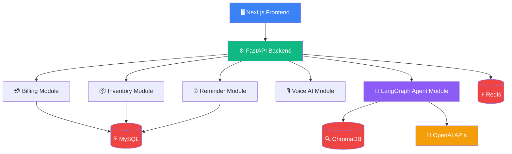
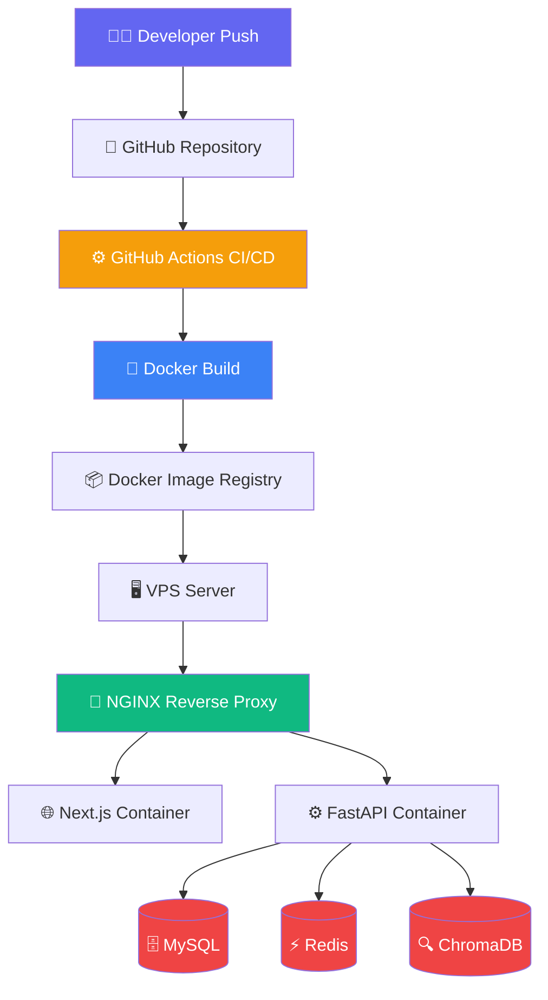
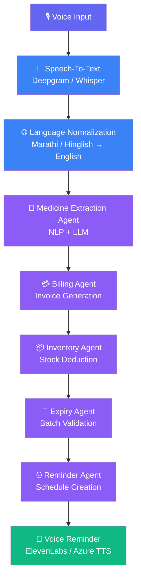
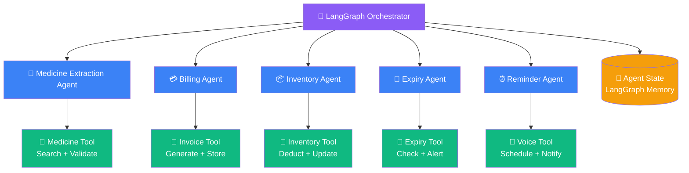
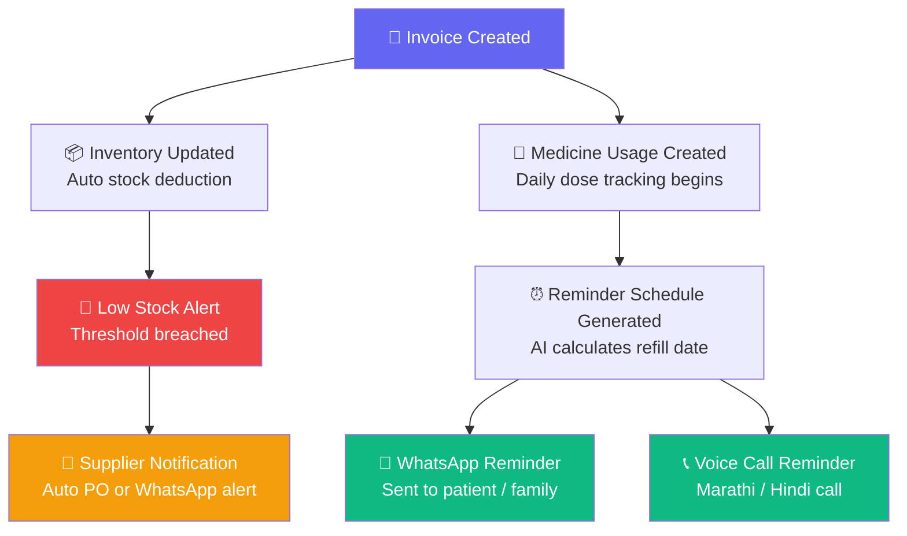
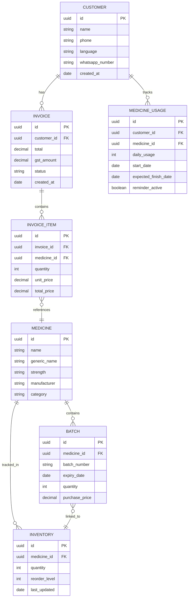
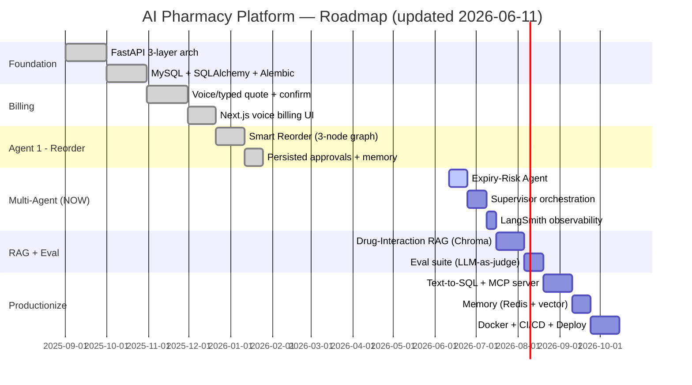

# 🏥 AI-Powered Connected Pharmacy Ecosystem
### Production-Grade Tech Stack & Architecture Document

---

## 📌 Table of Contents

1. [Project Vision](#1-project-vision)
2. [Core Product Modules](#2-core-product-modules)
3. [Final Recommended Tech Stack](#3-final-recommended-tech-stack)
4. [Development Architecture](#4-development-architecture)
5. [Production Deployment Architecture](#5-production-deployment-architecture)
6. [AI Workflow Architecture](#6-ai-workflow-architecture)
7. [LangGraph Multi-Agent Architecture](#7-langgraph-multi-agent-architecture)
8. [Event-Driven Workflow](#8-event-driven-workflow)
9. [Database Architecture](#9-database-architecture)
10. [Folder Structure](#10-folder-structure)
11. [Learning Roadmap](#11-learning-roadmap)
12. [Current State Snapshot](#12-current-state-snapshot)
13. [Agentic AI Learning Plan (Multi-Agent)](#13-agentic-ai-learning-plan-multi-agent)
14. [Engineering Principles](#14-engineering-principles)
15. [Stack Summary](#15-final-stack-summary)

---

## 1. Project Vision

> **AI Operating System for Pharmacies & Chronic Healthcare**

A production-grade AI platform combining:

- 🎙️ Voice-based pharmacy billing
- 📦 Inventory automation
- 🔮 AI refill prediction
- 👴 Elderly medicine reminders
- 🗣️ Regional-language voice AI (Marathi / Hindi)
- 🤖 Multi-agent orchestration
- ☁️ SaaS pharmacy management

---

## 2. Core Product Modules

### 🏪 Pharmacy Side

| Module | Features |
|---|---|
| Voice Billing | Speak medicines, auto-generate bills |
| Invoice Generation | PDF invoices, GST-ready |
| Inventory Management | Real-time stock tracking |
| Batch & Expiry Tracking | Auto-alerts before expiry |
| Supplier Management | PO generation, supplier contacts |
| Customer Management | Customer profiles, purchase history |

### 📱 Customer Side

| Module | Features |
|---|---|
| Medicine Tracking | Daily intake tracking |
| Refill Prediction | AI-predicted refill dates |
| Voice Reminders | Marathi / Hindi reminders |
| Family Notifications | Alerts to family members |
| WhatsApp Alerts | Automated WhatsApp messages |

### 🤖 AI Layer

| Module | Features |
|---|---|
| Voice Understanding | Marathi / Hinglish STT |
| Medicine Extraction | NLP-based medicine parsing |
| Agent Orchestration | LangGraph multi-agent |
| RAG Knowledge System | Medicine knowledge retrieval |
| Reminder Intelligence | Smart reminder scheduling |

---

## 3. Final Recommended Tech Stack

### Frontend Stack

```
Pharmacy Dashboard  →  Next.js + JavaScript + TailwindCSS + ShadCN UI
Customer Mobile App →  React Native
```

> ⚠️ **Note:** JavaScript is used throughout — no TypeScript.

### Backend Stack

```
Core Backend  →  FastAPI (Python 3.12+)
```

**Why FastAPI?**
- ✅ Excellent Python ecosystem
- ✅ Async support (perfect for AI tasks)
- ✅ AI-friendly integrations
- ✅ High performance with Uvicorn

### Database Stack

```
Primary DB    →  MySQL
Cache Layer   →  Redis
Vector DB     →  ChromaDB (→ Pinecone / Qdrant later)
```

### AI Stack

```
Agent Orchestration  →  LangGraph
LLM Provider         →  OpenAI (GPT-4.1 / GPT-4o)
Embeddings           →  OpenAI Embeddings
```

### Voice AI Stack

```
Speech-To-Text  →  Deepgram / Whisper / Google Speech
Text-To-Speech  →  ElevenLabs / Azure Speech / Google TTS
```

### Communication Stack

```
WhatsApp   →  Twilio WhatsApp API  OR  Meta WhatsApp Cloud API
Calling    →  Twilio / Exotel
```

### DevOps Stack

```
Containerization  →  Docker
Orchestration     →  Docker Compose
CI/CD             →  GitHub Actions
Reverse Proxy     →  NGINX
Hosting           →  VPS (Hetzner / DigitalOcean) → AWS / Azure
```

---

## 4. Development Architecture

> ✅ Start with **Modular Monolith** — NOT microservices.

**Why Modular Monolith first?**
- Easier learning curve
- Easier debugging
- Faster development cycles
- Less infrastructure complexity
- Ideal for startups & MVPs



---

## 5. Production Deployment Architecture



---

## 6. AI Workflow Architecture



---

## 7. LangGraph Multi-Agent Architecture



---

## 8. Event-Driven Workflow



---

## 9. Database Architecture



---

## 10. Folder Structure

```
project-root/
│
├── 🌐 frontend/                     # Next.js (JavaScript)
│   ├── app/
│   │   ├── (dashboard)/
│   │   ├── (billing)/
│   │   └── (inventory)/
│   ├── components/
│   ├── lib/
│   └── public/
│
├── ⚙️ backend/                      # FastAPI (Python)
│   ├── app/
│   │   ├── api/                     # Route handlers
│   │   │   ├── v1/
│   │   │   │   ├── billing.py
│   │   │   │   ├── inventory.py
│   │   │   │   ├── customers.py
│   │   │   │   └── reminders.py
│   │   ├── agents/                  # LangGraph agents
│   │   │   ├── medicine_extraction.py
│   │   │   ├── billing_agent.py
│   │   │   ├── inventory_agent.py
│   │   │   └── reminder_agent.py
│   │   ├── services/                # Business logic
│   │   ├── repositories/            # DB access layer
│   │   ├── models/                  # SQLAlchemy models
│   │   ├── schemas/                 # Pydantic schemas
│   │   ├── workflows/               # LangGraph workflows
│   │   ├── ai/                      # AI utilities
│   │   ├── voice/                   # STT / TTS
│   │   └── core/                    # Config, DB, security
│   ├── tests/
│   └── requirements.txt
│
├── 📱 mobile/                       # React Native app
│   ├── src/
│   │   ├── screens/
│   │   ├── components/
│   │   └── services/
│
├── 🐳 docker/
│   ├── Dockerfile.backend
│   ├── Dockerfile.frontend
│   └── Dockerfile.nginx
│
├── 🔀 nginx/
│   └── nginx.conf
│
├── 📚 docs/
│   └── architecture.md
│
└── docker-compose.yml
```

---

## 11. Learning Roadmap

> **Updated 2026-06-11.** The roadmap below reflects the real path taken, including the
> **pivot from voice-first to agentic/multi-agent** (voice hit a Marathi/Hindi STT accuracy
> ceiling — see §12). `done` = shipped, `active` = building now, plain = planned.



### Phase Details

#### 🔵 Phase 0 — Foundation ✅ DONE
- **Learned:** FastAPI 3-layer architecture (router → service → repository), Pydantic, DI, venv, Git
- **Built:** Backend skeleton, medicines CRUD, health endpoint — runs locally on `uvicorn`

#### 🟢 Phase 1 — Persistent Backend ✅ DONE
- **Learned:** SQLAlchemy 2.0 models, Alembic migrations, FEFO, indexes, DB transactions
- **Built:** MySQL-backed medicines + batches, FEFO batch selection

#### 🟣 Phase 2 — Billing (LangGraph) ✅ DONE
- **Learned:** LangGraph state/nodes/reducers, structured output, tool use, server-side pricing
- **Built:** Voice/typed billing — `/quote` + `/confirm`, 5-node graph, Next.js voice UI

#### 🤖 Phase 3 — Agent 1: Smart Reorder ✅ DONE
- **Learned:** the ReAct + Reflection loop, crisp-vs-fuzzy (math in tools, LLM for judgment),
  idempotency, human-in-the-loop, **agent memory** (reads its own past approvals)
- **Built:** 3-node reorder agent (fetch → decide → LLM judge), `/suggestions` + `/approve`,
  `reorder_requests` table, frontend Reorder screen

#### 🟠 Phase 4 — Multi-Agent System 🔵 IN PROGRESS (current)
- **Learn:** supervisor orchestration, recursion guard, shared state, LangSmith tracing
- **Build:** Expiry-Risk agent → Supervisor over Reorder + Expiry → observability
- → full plan in **§13** and `AGENTIC_RESEARCH.md`

#### 🔴 Phase 5 — RAG + Evaluation ⚪ PLANNED
- **Learn:** embeddings, chunking, vector retrieval, eval sets, LLM-as-judge
- **Build:** Drug-Interaction agent (ChromaDB), eval suite

#### ⚫ Phase 6 — Productionize ⚪ PLANNED
- **Build:** Text-to-SQL agent + MCP server, Redis+vector memory, Docker/CI-CD/deploy

---

## 12. Current State Snapshot

> Where the project actually is on **2026-06-11**. Single source of truth for "what's done".

| Area | Status | Notes |
|------|--------|-------|
| FastAPI 3-layer backend | ✅ Done | router → service → repository, runs on `uvicorn` |
| MySQL + SQLAlchemy + Alembic | ✅ Done | native MySQL 8 + PyMySQL; migrations in `migrations/versions/` |
| Medicines / Batches / FEFO | ✅ Done | expiry-aware batch selection |
| Billing (LangGraph) | ✅ Done | `/quote` + `/confirm`, 5-node graph, server-side pricing |
| Frontend (Next.js Pages Router, JS) | ✅ Done | voice billing UI + Reorder screen + sidebar |
| **Agent 1 — Smart Reorder** | ✅ Done | 3-node graph (fetch → decide → LLM judge), idempotent approve |
| Reorder agent **memory** | ✅ Done | excludes already-approved medicines via `pending_medicine_ids()` |
| **Agent 2 — Expiry-Risk** | 🔵 Next | the immediate next build |
| Supervisor / multi-agent | ⚪ Planned | routes Reorder + Expiry (+ future agents) |
| LangSmith observability | ⚪ Planned | tracing across all nodes |
| Drug-Interaction (RAG) | ⚪ Planned | ChromaDB — Phase 5 |
| Ask-Your-Pharmacy (text-to-SQL) | ⚪ Planned | Phase 6 |
| MCP server | ⚪ Planned | expose pharmacy tools via MCP |
| Eval suite | ⚪ Planned | LLM-as-judge + test sets |
| Docker / CI-CD / Deploy | ⚪ Planned | containerize the working app |
| Voice STT (Marathi/Hindi) | ⏸️ Parked | accuracy ceiling → pivoted to agentic; stays as one input, not centerpiece |

**The pivot (why the roadmap changed):** voice billing has a real accuracy ceiling on Marathi/Hindi
STT + medicine names. Rather than fight it, the project broadened into **agentic AI** — agents that
plan, reason, remember, use tools, and self-correct — which is both higher-value for a 15+ LPA job
and not bottlenecked on STT. Voice remains *one* input, not the whole product.

---

## 13. Agentic AI Learning Plan (Multi-Agent)

> Condensed from **`AGENTIC_RESEARCH.md`** (full version has job-market numbers, supervisor-vs-swarm
> tradeoffs, and the market product landscape). This is the learning track that turns the project
> into a complete agentic-AI portfolio piece.

### Goal
Evolve the single Smart Reorder Agent into a **Supervisor multi-agent system**, and touch all **8
must-know production techs** on the way — so every one becomes a real interview story.

### The 8 must-know techs (what every 2026 agentic JD asks for)

| # | Tech | Where it lives in our project |
|---|------|-------------------------------|
| 1 | **Multi-agent orchestration** | NEW: supervisor routing to specialist agents |
| 2 | **Tool use / function calling** | ✅ `reorder_tools.py` (pure math), repos (SQL) |
| 3 | **RAG** | NEW: Drug-Interaction agent over ChromaDB |
| 4 | **Agent memory** | ✅ started (reorder reads `reorder_requests`) → Redis + vector |
| 5 | **MCP (Model Context Protocol)** | NEW: wrap pharmacy tools as an MCP server |
| 6 | **Human-in-the-loop** | ✅ pharmacist approves reorders → formalize with `interrupt()` |
| 7 | **Observability / tracing** | NEW: LangSmith on every node (89% of orgs expect this) |
| 8 | **Evaluation (evals)** | NEW: test set + LLM-as-judge |

### The agent roster (specialists the supervisor will route to)

| Agent | Status | Teaches | Realistic for a single pharmacy? |
|-------|--------|---------|----------------------------------|
| Smart Reorder | ✅ built | tool use, structured output, HITL, memory | ✅ |
| **Expiry-Risk** | 🔵 next | 2nd agent + risk scoring | ✅ (cuts waste up to 25% in real products) |
| Drug-Interaction (RAG) | ⚪ planned | RAG + ChromaDB + embeddings | ✅ ("AI pharmacist" — Sully.ai, Pharmie) |
| Ask-Your-Pharmacy (text-to-SQL) | ⚪ planned | safe text-to-SQL | ✅ (saves ~15 hrs/week) |
| Adherence / Re-purchase | 💡 candidate | scheduled/cron-triggered agents | ✅ (WestCX, Pharmie do this) |
| Demand-Forecast | 💡 stretch | agent-feeding-agent | ✅ feeds the reorder agent |

> Deliberately **out of scope** (real products lead with these, but we can't do them well):
> voice refill (STT ceiling), prior-authorization (US-insurance), robotic dispensing (hardware).
> Knowing what to *skip* is product judgment — itself an interview talking point.

### Architecture: Supervisor pattern (start here, graduate to swarm later)
A dedicated routing node uses structured output to pick the next specialist, regains control after
each, and enforces a **recursion guard** (`handoff_count` limit → escalate to human). The target
architecture diagram lives in `diagrams.md` → *"TARGET — Supervisor Multi-Agent System"*.

### Build order (one new concept per step)
1. **Expiry-Risk Agent** — a 2nd specialist (cheap win, reuses batch data) ← **doing now**
2. **Supervisor** over Reorder + Expiry — the multi-agent moment
3. **LangSmith observability** — wire once, covers everything
4. **Drug-Interaction RAG** — the highest-value single skill
5. **Eval suite** — prove correctness (LLM-as-judge)
6. **Text-to-SQL agent + MCP server** — safe queries + standards-compliant tools
7. **Memory upgrade** — Redis short-term + vector long-term

---

## 14. Engineering Principles

> These are the non-negotiables for building a production-grade system.

| # | Principle | Description |
|---|---|---|
| 1 | 🧠 **Learn While Building** | Do not blindly generate or copy code. Understand every line. |
| 2 | 🚀 **Deploy Early** | Production exposure teaches real-world engineering skills. |
| 3 | 🏗️ **Keep Architecture Simple** | Avoid premature microservices. Start modular monolith. |
| 4 | 🔀 **Separate Business & AI Logic** | Not everything needs AI. Keep boundaries clear. |
| 5 | 🔭 **Build Production Thinking** | Focus on: reliability, scalability, maintainability, observability. |

---

## 15. Final Stack Summary

| Layer | Technology | Notes |
|---|---|---|
| 🌐 Frontend | Next.js (JavaScript) | No TypeScript |
| 📱 Mobile | React Native | Patient-facing app |
| ⚙️ Backend | FastAPI (Python 3.12+) | REST + async |
| 🗄️ Database | MySQL | Primary operational DB |
| ⚡ Cache | Redis | Sessions, rate limiting |
| 🔍 Vector DB | ChromaDB → Pinecone | RAG & AI memory |
| 🤖 AI Orchestration | LangGraph | Multi-agent workflows |
| 🧠 LLM | OpenAI GPT-4.1 / GPT-4o | Reasoning & extraction |
| 🐳 Containerization | Docker + Docker Compose | Dev & prod |
| ⚙️ CI/CD | GitHub Actions | Automated pipelines |
| 🔀 Reverse Proxy | NGINX | HTTPS + routing |
| 🖥️ Hosting | VPS → AWS / Azure | Scale when ready |
| 🎙️ Voice AI | Whisper + ElevenLabs | STT + TTS |
| 📲 Messaging | Twilio / WhatsApp API | Reminders + alerts |

---

## 🎯 Final Vision

> This platform is **not** just pharmacy software, a chatbot, or a reminder app.

It is an:

### 🏥 AI-Powered Pharmacy & Chronic Healthcare Operating System

Combining:

- ⚙️ **Operational Automation** — Billing, inventory, invoices
- 🤖 **AI Workflows** — LangGraph multi-agent orchestration
- 🗣️ **Regional Voice Intelligence** — Marathi / Hindi AI
- 🏥 **Healthcare Coordination** — Refill prediction, family alerts
- 🔗 **Multi-Agent Orchestration** — Stateful, event-driven AI

Into **one connected ecosystem** built for Bharat. 🇮🇳

---

*Document Version: 2.0 (updated 2026-06-11 — agentic/multi-agent pivot) | Stack: JavaScript + Python + FastAPI + LangGraph*
