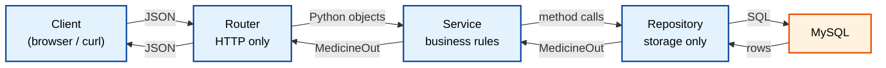
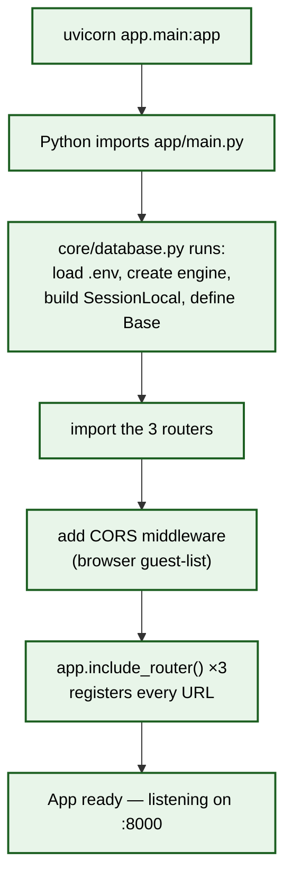
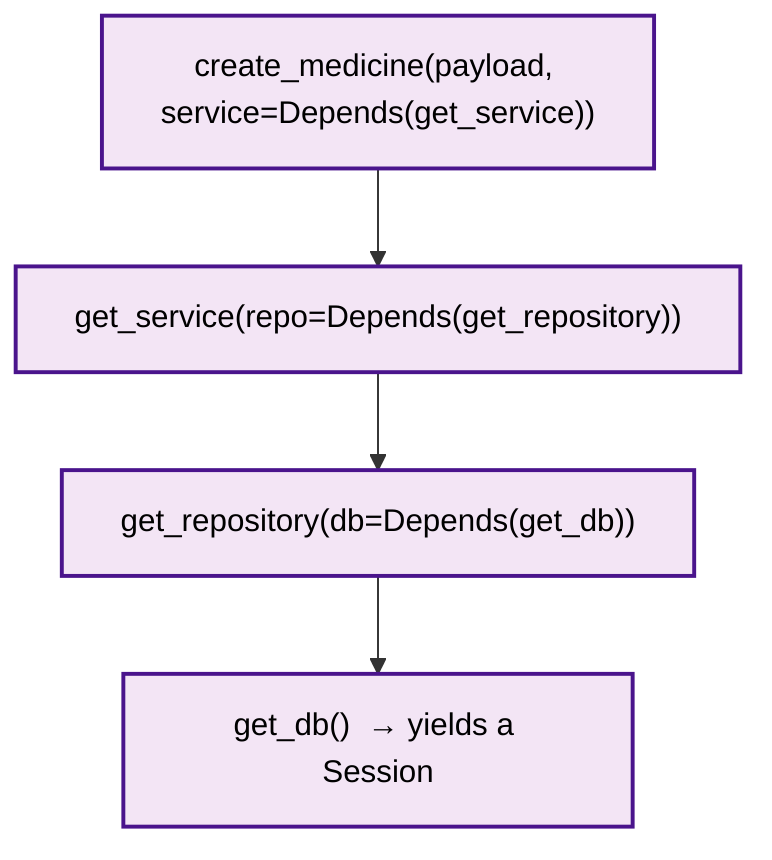

# Backend Architecture — AI Pharmacy Ecosystem

> **The complete, current picture of the FastAPI backend.**
> Grounded in the real code as it exists today (SQLAlchemy + MySQL + Dependency Injection).
> Read top to bottom once; after that, use it as a map.
>
> ⚠️ The older `Request-Lifecycle-Architecture.md` describes a Phase-1 *in-memory dict*
> repository that no longer reflects reality. **This file supersedes it.**

---

## 0. The one-sentence mental model

> **A request walks in the front door (Router), a manager decides what to do (Service),
> a storekeeper fetches/saves the data (Repository), and a strict form-checker (Pydantic)
> guards both the entrance and the exit.**

Everything below is just that sentence, zoomed in.

---

## 1. Overall Architecture (the shop analogy)

Picture your pharmacy backend as a **real shop with a back office**:

| Real shop role | In your code | File |
|----------------|-------------|------|
| Front counter (takes requests, hands out receipts) | **Router** | `app/routers/*.py` |
| Shop manager (knows the rules, makes decisions) | **Service** | `app/services/*.py` |
| Storekeeper (the ONLY one who touches the shelves) | **Repository** | `app/repositories/*.py` |
| The shelves themselves | **MySQL database** | (via SQLAlchemy) |
| Form-checker at the door | **Pydantic schemas** | `app/schemas/*.py` |
| The label on each shelf slot | **ORM models** | `app/models/*.py` |
| The "who-gets-what-helper" rulebook | **Dependency Injection** | `Depends(...)` |

**The golden rule of this design — each layer only talks to its neighbour:**



**Why bother with layers at all?** Because when you later swap MySQL for something else,
or add caching, or add auth, you change **one layer** and the others don't even notice.
You already proved this: in Phase 1 the repository was an in-memory dict; in Phase 2 you
swapped in `SQLAlchemyMedicineRepository` and **the service file did not change one line.**

### ⚠️ 3 beginner mistakes this avoids
1. **Fat routers** — putting SQL and business rules inside the endpoint function. Impossible to test, impossible to reuse.
2. **Leaky layers** — a service that returns an HTTP 404, or a repository that knows about pricing rules. Each layer must stay in its lane.
3. **One giant `main.py`** — everything in one file. Works for a toy, collapses the moment the app grows.

---

## 2. Folder Structure (what each folder is *for*)

```text
pharmacy-core-backend/
│
├── app/
│   ├── main.py                 # ← the front door: boots FastAPI, wires routers
│   │
│   ├── core/
│   │   └── database.py         # engine + SessionLocal + Base + get_db()  (the DB plumbing)
│   │
│   ├── routers/                # LAYER 1 — HTTP in, HTTP out
│   │   ├── medicines.py
│   │   ├── billing.py
│   │   └── reorder.py
│   │
│   ├── services/               # LAYER 2 — business rules, no HTTP, no SQL
│   │   ├── medicine_service.py
│   │   ├── billing_service.py
│   │   └── reorder_service.py
│   │
│   ├── repositories/           # LAYER 3 — the ONLY code that touches storage
│   │   ├── protocols.py                       # the CONTRACT (interface)
│   │   └── sqlalchemy_*_repository.py         # the MySQL implementations
│   │
│   ├── schemas/                # Pydantic — validate JSON in/out (the door check)
│   │   └── medicine.py         #   MedicineCreate (in) + MedicineOut (out)
│   │
│   ├── models/                 # SQLAlchemy ORM — Python ↔ MySQL row mapping
│   │   ├── medicine.py
│   │   ├── batch.py
│   │   ├── sale.py ...
│   │
│   ├── ai/                     # LangGraph agents (billing + reorder) — see AGENTIC_RESEARCH.md
│   │
│   └── exceptions.py           # domain errors (PharmacyError → DuplicateMedicineError ...)
│
├── migrations/                 # Alembic — versioned DB schema history
├── scripts/                    # dev tools (seed data, smoke tests)
├── requirements.txt
└── .env                        # DATABASE_URL, API keys (gitignored — never commit)
```

**The pattern to notice:** every *domain* (medicine, billing, reorder) has the same
four touch-points — a router, a service, a repository, and schemas. Learn one domain
and you understand all of them.

---

## 3. How FastAPI Starts (application boot)

**Analogy:** before the shop opens, the owner unlocks the door, calls in the manager and
storekeeper, and pins the price list to the wall. Nothing happens *per customer* yet —
this is one-time setup.

You start it with:

```powershell
# from pharmacy-core-backend, venv activated
uvicorn app.main:app --reload
```

`app.main:app` means: *"in the file `app/main.py`, find the variable named `app`."*

### What happens at boot, in order



The key boot facts, tied to real code:

1. **`app/core/database.py` runs its top-level code exactly once** — it reads `DATABASE_URL`
   from `.env`, then builds:
   - `engine` — the **process-wide connection pool** to MySQL (one for the whole app).
   - `SessionLocal` — a **factory**; calling `SessionLocal()` opens a fresh short-lived session.
   - `Base` — the declarative base every ORM model inherits from.
   If `DATABASE_URL` is missing, it raises immediately — the app refuses to boot half-configured.

2. **`app/main.py` builds the `FastAPI()` object**, adds CORS (so the Next.js frontend on
   `localhost:3000` is allowed to call the API on `:8000`), and registers each router with
   `app.include_router(...)`. That last step is what makes `/api/v1/medicines`,
   `/api/v1/billing/...`, and `/api/v1/reorder/...` real, reachable URLs.

3. **A `/health` endpoint** returns `{"status": "ok"}` — your "is the shop open?" ping.

### ⚠️ 3 beginner mistakes
1. **Creating the engine per request** instead of once at boot — exhausts MySQL connections in minutes.
2. **Reading `.env` in twenty different files** — `database.py` is the single place that knows the DB URL; everyone else imports from it.
3. **Forgetting `include_router`** — you write a perfect endpoint, hit the URL, get 404, and can't see why. The router exists but was never plugged in.

---

## 4. Pydantic — the form-checker at the door

**Analogy:** a customer fills a form to register a new medicine. A strict clerk checks
*every* field before it's allowed in: name can't be blank, price must be positive, HSN code
must be exactly 8 characters. Reject bad forms **at the door**, not deep inside the office.

Your real schemas (`app/schemas/medicine.py`) split **input** from **output** — always:

```python
class MedicineCreate(BaseModel):        # what the CLIENT sends IN
    name: str = Field(..., min_length=1, max_length=200)
    mrp: float = Field(..., gt=0)                     # must be > 0
    hsn_code: str = Field(..., min_length=8, max_length=8)   # exactly 8 chars
    manufacturer: str | None = Field(default=None, max_length=200)

class MedicineOut(BaseModel):           # what the SERVER sends OUT
    model_config = ConfigDict(from_attributes=True)   # can read from an ORM row
    id: int
    name: str
    mrp: float
    hsn_code: str
    manufacturer: str | None
    created_at: datetime
```

Two things this buys you **for free**:
- **Automatic validation.** If the client sends `mrp: -5`, FastAPI returns **HTTP 422** with a
  clear error — *you never write that check.*
- **Output filtering.** `response_model=MedicineOut` guarantees only these fields ship to the
  client. Even if the ORM row carries a secret `cost_price`, it **cannot leak** — it's not in the schema.

**Why two classes and not one?** The input has no `id` or `created_at` (the DB makes those).
The output must include them. Mixing them lets clients try to set server-owned fields. Keep them separate — always.

### Schema vs Model — don't confuse them
| | Pydantic **Schema** (`schemas/`) | SQLAlchemy **Model** (`models/`) |
|---|---|---|
| Job | Validate JSON at the API edge | Map Python objects ↔ MySQL rows |
| Shape | HTTP-shaped | DB-shaped (columns, indexes, `Numeric(10,2)`) |
| Example | `MedicineCreate`, `MedicineOut` | `Medicine` (the table) |

The service layer is the only place that converts one into the other
(`MedicineOut.model_validate(orm_row)`).

### ⚠️ 3 beginner mistakes
1. **Using the ORM model as the API response type** — leaks internal columns and couples your API shape to your DB shape.
2. **One schema for input and output** — lets clients set `id`/`created_at`, and forces optional fields everywhere.
3. **Using `float` for money in the DB** — your model correctly uses `Numeric(10,2)`; `float` can't store `0.1` exactly (a real billing bug).

---

## 5. Router → Service → Repository (the three layers, precisely)

Here is exactly what each layer may and may not do, tied to your real medicine domain.

### Layer 1 — Router (`app/routers/medicines.py`)
**Only job:** translate between HTTP and Python.
- Parse incoming JSON → `MedicineCreate` (Pydantic validates).
- Call the service.
- Catch **domain exceptions** and turn them into HTTP status codes.
- Return the result (FastAPI serializes it to JSON via `response_model`).

```python
@router.post("", response_model=MedicineOut, status_code=201)
def create_medicine(payload: MedicineCreate,
                    service: MedicineService = Depends(get_service)):
    try:
        return service.create_medicine(payload)
    except DuplicateMedicineError as e:
        raise HTTPException(status_code=409, detail=str(e))
```

**Never:** run SQL, decide business rules. Notice it catches `DuplicateMedicineError`
(a domain concept) and maps it to `409 Conflict` (an HTTP concept). That translation is the
router's whole reason to exist.

### Layer 2 — Service (`app/services/medicine_service.py`)
**Only job:** business rules + orchestration.

```python
def create_medicine(self, payload: MedicineCreate) -> MedicineOut:
    normalized = normalize_medicine_name(payload.name)          # a rule
    if self._repo.find_by_normalized_name(normalized) is not None:
        raise DuplicateMedicineError(payload.name)              # enforce it
    return self._repo.add(name=payload.name, mrp=payload.mrp, ...)
```

**Never:** know about HTTP, status codes, or SQL. It raises a *domain* exception
(`DuplicateMedicineError`) and lets the router decide the HTTP consequence. It depends on
the **repository Protocol**, not any concrete DB class — that's what made the Phase-1→Phase-2
swap free.

### Layer 3 — Repository (`app/repositories/sqlalchemy_medicine_repository.py`)
**Only job:** talk to storage. The **only** layer allowed to touch SQLAlchemy.

```python
def add(self, *, name, mrp, hsn_code, manufacturer) -> MedicineOut:
    medicine = Medicine(name=name, normalized_name=normalize_medicine_name(name), ...)
    self._db.add(medicine)
    self._db.commit()
    self._db.refresh(medicine)          # reload id + timestamps MySQL generated
    return MedicineOut.model_validate(medicine)
```

**Never:** enforce business rules or know about HTTP. It takes a `Session` (injected), reads/writes rows, converts them to `MedicineOut`, and hands them up.

### The Protocol — why the swap was free (`app/repositories/protocols.py`)
```python
class MedicineRepository(Protocol):     # a CONTRACT, not a class to inherit
    def add(self, *, name, mrp, hsn_code, manufacturer) -> MedicineOut: ...
    def get_by_id(self, medicine_id: int) -> MedicineOut | None: ...
    def list_all(self) -> list[MedicineOut]: ...
    def find_by_normalized_name(self, normalized_name: str) -> MedicineOut | None: ...
```

Python's `Protocol` is **structural typing**: any class with these 4 methods *is* a
`MedicineRepository` — no inheritance needed. The service asks for "something shaped like this
contract." The in-memory repo satisfied it; the SQLAlchemy repo satisfies it; a fake test repo
satisfies it. **This is the seam that makes the whole thing testable and swappable.**

---

## 6. Dependency Injection (the "who-brings-what" system)

**Analogy:** the manager doesn't *build* their own storekeeper from scratch each morning.
When a customer arrives, the shop's rulebook says *"here is today's storekeeper, already set up."*
The manager just uses them. That "here, already set up" delivery is **dependency injection**.

FastAPI's `Depends(...)` is that rulebook. In `medicines.py`:



Read it **bottom-up** — that's the order FastAPI resolves it, fresh for every request:
1. `get_db()` opens a new `Session` from `SessionLocal`, `yield`s it, and closes it when the request ends.
2. `get_repository(db)` wraps that session in a `SQLAlchemyMedicineRepository`.
3. `get_service(repo)` wraps that repo in a `MedicineService`.
4. The endpoint receives a fully-built `service` — it never constructs one itself.

**Why `yield` in `get_db()` and not `return`?** (from `core/database.py`)
- Code **before** `yield` runs on the way IN (open session).
- Code **after** `yield` (in `finally`) runs on the way OUT (close session) — **even if the endpoint crashed.**
- Result: the DB connection is **never leaked**, ever.

**Why this matters for your career:** "How does FastAPI dependency injection work, and why
one DB session per request?" is a *guaranteed* interview question. Your answer:
*one session per request — not per app (concurrent requests would corrupt each other's identity
map), not per repo method (would exhaust the connection pool).* That sentence is straight from your `get_db` docstring.

### ⚠️ 3 beginner mistakes
1. **`return`ing the session instead of `yield`ing** — it never closes, connections pile up, MySQL starts refusing new ones.
2. **One global session for the whole app** — two simultaneous requests stomp on each other's transaction. Nightmare to debug.
3. **`new MedicineService(...)` inside the endpoint** — you lose testability; DI exists so tests can inject a fake repo.

---

## 7. One Request, End to End (the full worked example)

Let's trace a **real** call: creating the medicine "Dolo".

**Request:**
```http
POST /api/v1/medicines
Content-Type: application/json

{ "name": "Dolo", "mrp": 30.0, "hsn_code": "30049099", "manufacturer": "Micro Labs" }
```

```mermaid
sequenceDiagram
    actor Client
    participant FastAPI
    participant Router as Router<br/>medicines.py
    participant DI as Depends<br/>get_db→repo→service
    participant Service as MedicineService
    participant Repo as SQLAlchemy Repo
    participant DB as MySQL

    Client->>FastAPI: POST /api/v1/medicines  (JSON)
    FastAPI->>FastAPI: validate JSON → MedicineCreate<br/>(bad input → 422 here, auto)
    FastAPI->>DI: build dependencies for this request
    DI->>DB: get_db() opens a Session
    DI-->>Router: inject ready-built service
    Router->>Service: create_medicine(payload)
    Service->>Service: normalize_medicine_name("Dolo") → "dolo"
    Service->>Repo: find_by_normalized_name("dolo")
    Repo->>DB: SELECT ... WHERE normalized_name='dolo'
    DB-->>Repo: no row
    Repo-->>Service: None
    Service->>Repo: add(name="Dolo", mrp=30.0, ...)
    Repo->>DB: INSERT INTO medicines ...; COMMIT
    DB-->>Repo: id=13, created_at=...
    Repo-->>Service: MedicineOut(id=13, ...)
    Service-->>Router: MedicineOut
    Router-->>FastAPI: MedicineOut
    FastAPI->>FastAPI: serialize via response_model
    FastAPI-->>Client: 201 Created  (JSON)
    Note over DI,DB: request ends → get_db finally: Session.close()
```

**The three ways this same request can end** — and which layer decides:
| Situation | Who decides | Result |
|-----------|-------------|--------|
| `mrp: -5` (bad input) | **Pydantic**, before any layer runs | `422 Unprocessable Entity` |
| "Dolo" already exists | **Service** raises `DuplicateMedicineError` → **Router** maps it | `409 Conflict` |
| All good | Repository commits, returns the new row | `201 Created` |

That single table *is* the layered architecture in action: input validation at the edge,
business rules in the service, storage in the repository, HTTP translation in the router.

---

## 8. The Ultimate Mental Model (memorize this shape)

```text
        Client
          │  JSON in
          ▼
      ┌─────────┐   Pydantic validates at the edge (422 on bad input)
      │ FastAPI │
      └────┬────┘
          ▼
      ┌─────────┐   HTTP ⇄ Python.  Catches domain errors → status codes.
      │ Router  │
      └────┬────┘
          ▼   (Depends builds service→repo→session, fresh per request)
      ┌─────────┐   Business rules. Raises domain exceptions. No HTTP, no SQL.
      │ Service │
      └────┬────┘
          ▼
      ┌──────────┐  The ONLY layer that touches storage. Returns MedicineOut.
      │Repository│
      └────┬─────┘
          ▼
      ┌─────────┐   Rows on shelves.
      │  MySQL  │
      └─────────┘

   … and the exact reverse path back up to the Client as JSON.
```

**If you can draw this from memory and explain why each arrow exists, you understand your own backend.**

---

## 9. Quick reference — where things live

| I want to… | Go to |
|------------|-------|
| Add a new URL | a file in `app/routers/`, then `include_router` in `main.py` |
| Add/change a business rule | the matching file in `app/services/` |
| Change how data is stored/queried | `app/repositories/sqlalchemy_*_repository.py` |
| Change what fields go in/out of the API | `app/schemas/` |
| Change the DB table shape | `app/models/` + a new Alembic migration in `migrations/` |
| Change DB connection / session behaviour | `app/core/database.py` |
| Add a new domain error | `app/exceptions.py` |
| Understand the AI agents | `AGENTIC_RESEARCH.md` + `app/ai/` |

---

*End of BACKEND_ARCHITECTURE.md — the current, accurate map of the FastAPI backend.*
