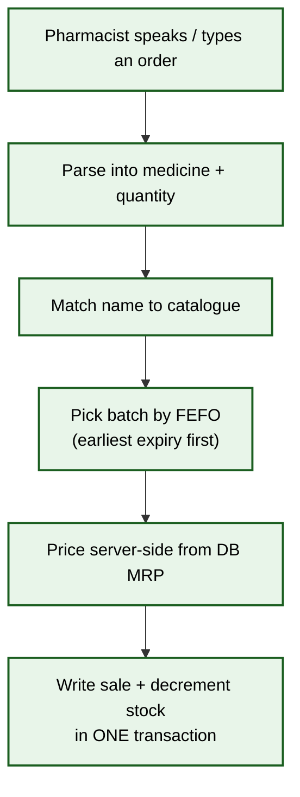
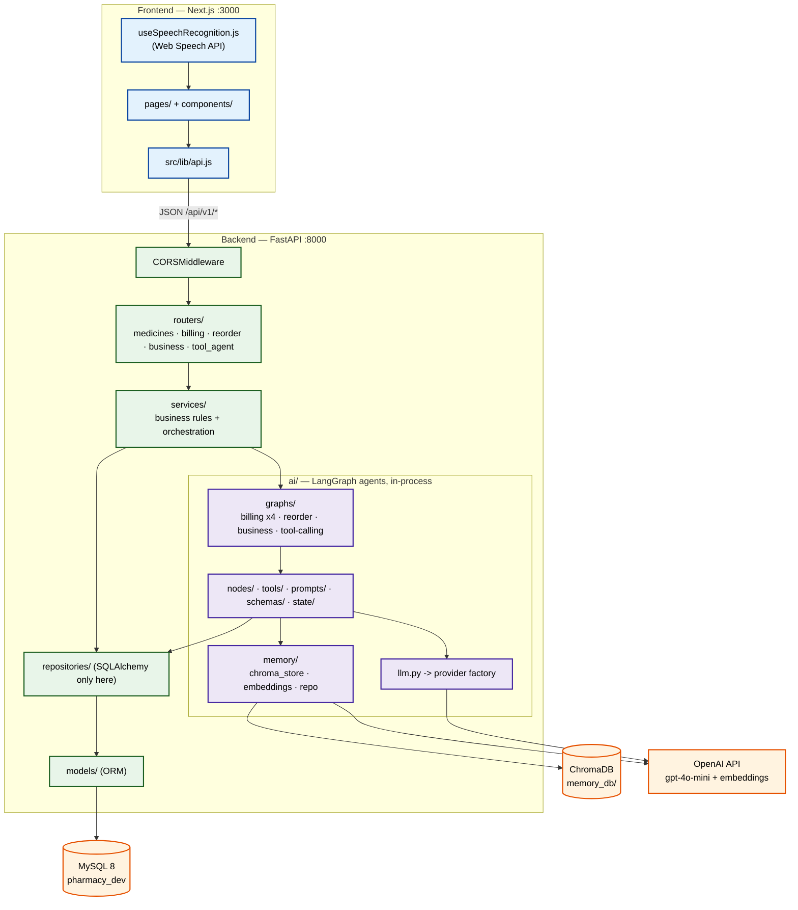
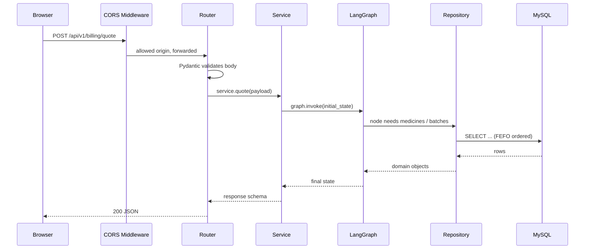
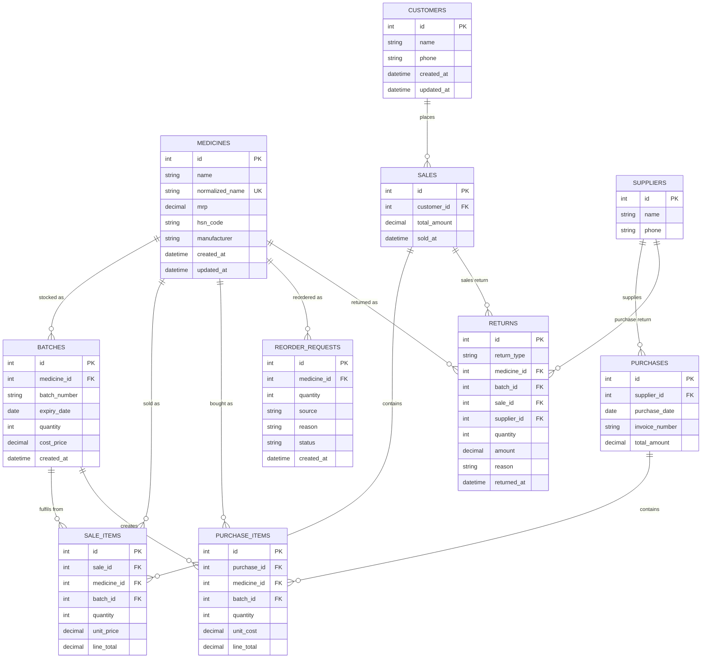
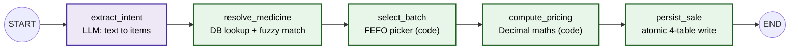
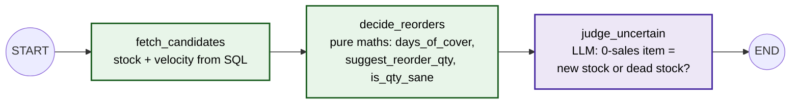
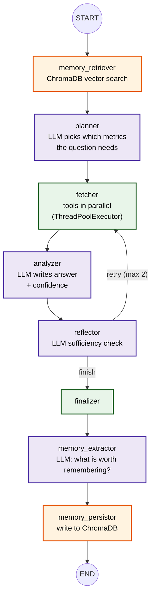
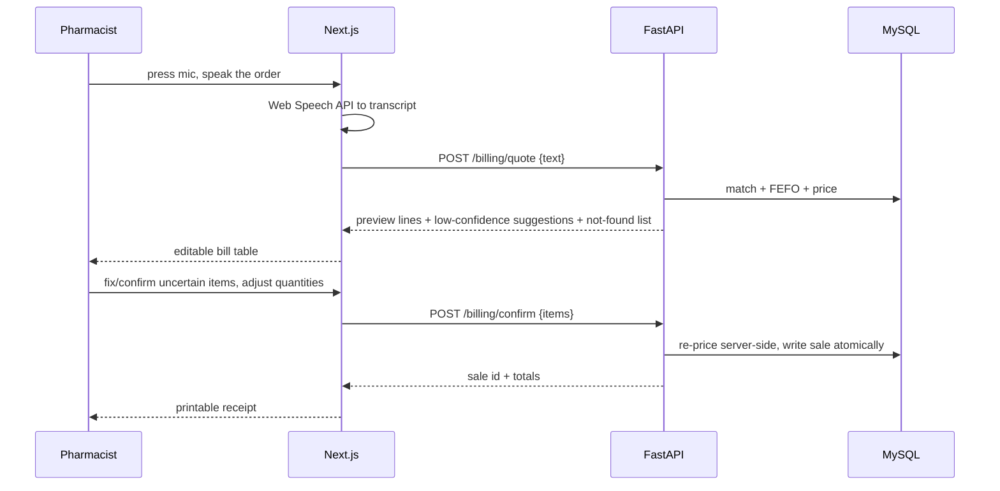
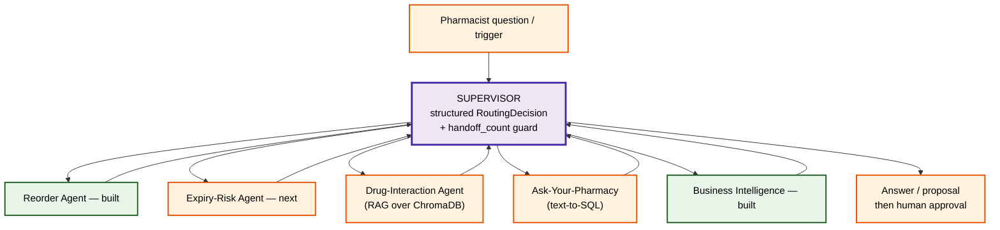
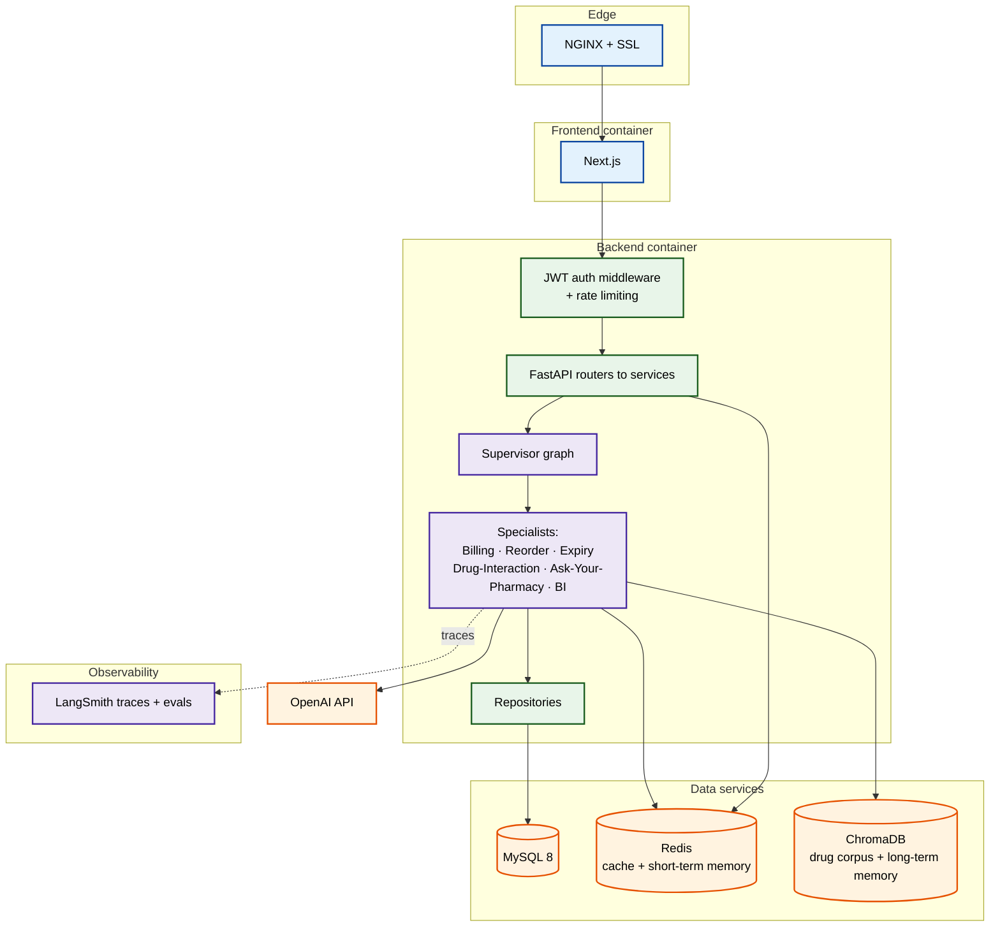

# AI Pharmacy Ecosystem — Complete Project Document

> **What this file is:** the single, detailed explanation of the whole project — what it is,
> why it exists, how it is architected, exactly what is built today, what is broken, and what
> is planned next. Grounded entirely in the current codebase and committed docs
> (`docs/00`–`docs/04`, `AGENTIC_RESEARCH.md`, `CLAUDE.md`).
>
> Last updated: 2026-09-06 · Branch `main` · HEAD `81c88be`

---

## Table of Contents

1. [What the project is](#1-what-the-project-is)
2. [Why it exists (the goal behind it)](#2-why-it-exists-the-goal-behind-it)
3. [The domain: how a real pharmacy works](#3-the-domain-how-a-real-pharmacy-works)
4. [Tech stack](#4-tech-stack)
5. [System architecture](#5-system-architecture)
6. [Backend layering (the contract every domain follows)](#6-backend-layering-the-contract-every-domain-follows)
7. [Data model (ERD)](#7-data-model-erd)
8. [The AI agents built so far](#8-the-ai-agents-built-so-far)
9. [API surface](#9-api-surface)
10. [Frontend](#10-frontend)
11. [Repository layout](#11-repository-layout)
12. [Current status — what works, what does not](#12-current-status--what-works-what-does-not)
13. [Known bugs and gaps (from the QA report)](#13-known-bugs-and-gaps-from-the-qa-report)
14. [Future plans — the roadmap](#14-future-plans--the-roadmap)
15. [Target architecture (where this is heading)](#15-target-architecture-where-this-is-heading)
16. [How to run it locally](#16-how-to-run-it-locally)
17. [Engineering principles used throughout](#17-engineering-principles-used-throughout)

---

## 1. What the project is

The **AI Pharmacy Ecosystem** is a production-shaped pharmacy management system with an
**AI back-office**. It is not a chatbot bolted onto a CRUD app — the AI *is* the workflow layer.

Three things it does today:

1. **AI billing.** A pharmacist types or speaks a free-text order ("do crocin aur ek dolo 650").
   The system parses it into structured items, matches medicine names tolerantly (voice/typo
   safe), picks stock batches by **FEFO** (First-Expiry-First-Out), prices everything
   **server-side**, and writes an auditable sale in one atomic transaction.
2. **Smart reorder.** An agent inspects stock levels against sales velocity, computes days-of-cover,
   proposes reorder quantities, and uses an LLM only for the genuinely ambiguous call —
   is a zero-sales item *new stock* or *dead stock*? The pharmacist approves; approvals persist and
   the agent remembers them next run.
3. **Business intelligence.** A pharmacist asks a plain-English question ("what is my profit
   margin?", "how much am I losing to expired stock?"). A plan → fetch → analyze → reflect
   LangGraph agent selects which metrics it needs, fetches them in parallel through tools,
   self-critiques whether the data is sufficient, and answers — with conversation memory and a
   long-term vector memory store.

Everything runs on real data: MySQL holds medicines, batches, customers, sales, suppliers,
purchases and returns, seeded with ~3 months of realistic business history.

---

## 2. Why it exists (the goal behind it)

Two goals, deliberately stacked:

- **Product goal:** build something a single independent pharmacy could actually run — billing,
  stock, expiry, reordering, analytics — without needing US-style insurance/EHR integrations.
- **Career goal:** the project is the vehicle for mastering **agentic AI engineering** end to end.
  `AGENTIC_RESEARCH.md` maps the 8 skills every 2026 agent-engineering job description demands
  (multi-agent orchestration, tool use, RAG, agent memory, MCP, human-in-the-loop, observability,
  evals) onto concrete features of this system, so each one can be spoken about from real
  experience rather than theory.

That is why the build order looks the way it does: working end-to-end software first
(FastAPI + MySQL + LangGraph running locally on `uvicorn`), then containerization, auth, caching,
CI/CD and deployment. Docker packages something that already works — it is not a prerequisite
for writing the first endpoint.

---

## 3. The domain: how a real pharmacy works

Every example, table and agent in this project uses the real pharmacy domain.

**Core entities:** Medicines · Batches (each with its own expiry and cost price) · Customers ·
Sales + Sale Items · Suppliers · Purchases + Purchase Items · Returns · Reorder Requests.

**The core sale flow:**



**Invariants that must never break:**

| Invariant | Why it matters | How it is enforced |
|---|---|---|
| Stock can never go negative | Selling what you don't have is a real-money bug | Quantity re-checked *inside* the transaction before decrement |
| Expired batches are never sold | Legal + safety | FEFO selector filters on `expiry_date` |
| Price is computed server-side | A client could otherwise send its own price | MRP read from DB; client price input ignored |
| Every sale is auditable | Tax, returns, disputes | Sale + sale_items rows written atomically with batch linkage |

---

## 4. Tech stack

| Layer | Technology | Status |
|---|---|---|
| Frontend | Next.js 16 (**Pages Router**, JavaScript only), React 19, Tailwind v4, Radix + CVA (shadcn-style), framer-motion | ✅ in use |
| Backend | FastAPI 0.136, Python 3.13, Uvicorn | ✅ in use |
| ORM / migrations | SQLAlchemy 2.0 (`Mapped` / `mapped_column`) + Alembic 1.18 | ✅ in use |
| Database | MySQL 8 via PyMySQL (`pharmacy_dev`) | ✅ in use |
| AI workflow | LangGraph 1.2 (`StateGraph`, reducers, `MessagesState`, `ToolNode`, checkpointer) | ✅ in use |
| LLM | OpenAI `gpt-4o-mini` (active); NVIDIA AI Endpoints (alternate), switched by `LLM_PROVIDER` | ✅ in use |
| Embeddings / Vector DB | OpenAI `text-embedding-3-small` + ChromaDB (`memory_db/`, collection `long_term_memory`) | ✅ in use (long-term memory) |
| Fuzzy matching | rapidfuzz | ✅ in use |
| Validation | Pydantic v2 (`schemas/` + `ai/schemas/`) | ✅ in use |
| Tracing | LangSmith | ⚠️ **wired, off by default** — set `LANGSMITH_TRACING=true` to enable; the app logs its real tracing state at startup (see `docs/observability.md`) |
| Cache | Redis 7 | ⛔ planned (Phase 6) |
| Auth | JWT access + refresh, bcrypt | ⛔ planned (Phase 5) |
| Containers | Docker + Docker Compose | ⛔ planned (Phase 4) |
| CI/CD | GitHub Actions | ⛔ planned (Phase 7) |
| Deployment | Ubuntu VPS + NGINX + Let's Encrypt SSL | ⛔ planned (Phase 8) |
| Voice STT | OpenAI Whisper API | ⛔ planned (Phase 9); browser Web Speech API used today |

---

## 5. System architecture

Three tiers — browser → HTTP API → data. The AI layer lives **inside** the FastAPI process and is
invoked by services; it is not a separate microservice.



**Two design rules span the whole system:**

1. **`crisp → code, fuzzy → LLM`.** Deterministic maths and SQL stay in Python. The LLM is used
   only where the problem is irreducibly fuzzy: parsing free text, matching a misheard medicine
   name, judging a zero-sales item, planning which metrics a question needs, writing prose.
2. **Never trust the client for money or stock.** Prices come from the database; stock decrements
   are atomic and re-validated inside the transaction.

---

## 6. Backend layering (the contract every domain follows)

```text
Router   → HTTP only. Parse request, call service, map exceptions → status codes.
Service  → Business rules / orchestration. Runs graphs, shapes responses.
   ├─ AI graphs → LangGraph state machines (billing, reorder, business, tool-agent)
   └─ Repository → the ONLY layer allowed to touch SQLAlchemy / MySQL
Models   → ORM row ↔ Python object
Schemas  → Pydantic validation at the HTTP edge (the in/out contract)
```

A request's lifecycle:



Why the repository seam exists: `repositories/protocols.py` declares a `MedicineRepository`
Protocol, and there are two implementations — an in-memory one (Phase-1 reference, proves the
seam is real) and the SQLAlchemy one used in production paths. Services depend on the Protocol,
not on SQLAlchemy.

---

## 7. Data model (ERD)

Ten tables, five Alembic migrations.



**Design notes worth knowing:**

- `medicines.normalized_name` carries a **unique index** — it is how duplicates are detected and
  how voice/typo-tolerant lookup starts.
- `batches` carries a **FEFO index** on `(medicine_id, expiry_date)` so "earliest non-expired
  batch with stock" is an index scan, not a table sort.
- Stock lives on `batches.quantity`, never on `medicines` — a medicine has *many* stock pools with
  different expiries and different cost prices. That is the whole reason FEFO exists.
- `returns` is a single table for both directions (`return_type` = sales return vs purchase return)
  with nullable `sale_id` / `supplier_id` — the pair that is populated tells you which kind it is.

---

## 8. The AI agents built so far

Three agents, seven compiled graphs.

### 8.1 Billing Agent (5 nodes, 4 graph variants)



The same five nodes are composed into **four graphs**, one per endpoint — this is the key idea:

| Graph | Nodes | Endpoint | Purpose |
|---|---|---|---|
| `get_billing_graph` | all 5 | `POST /billing/sale` | one-shot: text → finished sale |
| `get_quote_graph` | 4 (no persist) | `POST /billing/quote` | **preview** — show the bill, write nothing |
| `get_price_graph` | 2 (batch + price) | `POST /billing/price-item` | price a single manually added line |
| `get_confirm_graph` | 2 (price + persist) | `POST /billing/confirm` | finalize the previewed bill |

Splitting quote from confirm is what makes the UI safe: the pharmacist sees and edits the bill
before a single row is written, and pricing is recomputed server-side at confirm time so an edited
client payload cannot change the money.

**Voice-tolerant matching** (`ai/matching.py` + `fetch_candidates` + `confidence_reflector`):
rapidfuzz produces a shortlist, the LLM confirms the right one, and matches below a confidence
threshold are **not guessed** — they surface in the UI as owner-confirm suggestions
(`ConfirmSuggestions.jsx`). Ambiguity is escalated to the human, not resolved by the model.

### 8.2 Smart Reorder Agent (3 nodes)



- All arithmetic is **pure functions** in `ai/tools/reorder_tools.py` — unit-testable, no LLM.
- The LLM is called for exactly one judgement call, returning a structured `ReorderJudgment`.
- **Human-in-the-loop:** `GET /reorder/suggestions` proposes; `POST /reorder/approve` is
  idempotent and writes to `reorder_requests`.
- **Memory:** the next run reads `reorder_requests` and excludes already-approved medicines —
  the simplest real agent memory, "the agent remembers what it already did."

### 8.3 Business Intelligence Agent (8 nodes + reflection loop)

The most advanced agent in the project.



**Mechanisms it demonstrates:**

| Mechanism | Implementation |
|---|---|
| Planning | `business_planner` — the LLM returns a structured plan (`['sales','margin']`), not keyword matching |
| Tool use | 5 `@tool`-decorated metric tools: sales, purchases, returns, expiry, margin |
| Parallel fetch | `ThreadPoolExecutor`, with **per-tool failure isolation** — one tool failing does not crash the run |
| Reflection / self-correction | `business_reflector` LLM sufficiency check; loops back to fetch missing metrics, hard-capped at `MAX_REFLECTIONS = 2` |
| Short-term memory | `MessagesState` + `MemorySaver` checkpointer, keyed by conversation id; graph is `lru_cache`d so the checkpointer survives across requests |
| Long-term memory | `memory_extractor` → `memory_persistor` → ChromaDB with OpenAI embeddings |
| Serialization safety | `MemoryFact` registered with `JsonPlusSerializer` so checkpointing does not hit the deprecated path |

### 8.4 Native Tool-Calling Agent (the alternative pattern)

`business_tool_graph.py` is a second, deliberately different implementation over the same five
tools: `agent ⇄ ToolNode` with `tools_condition`, the LangGraph prebuilt ReAct-style loop, served
at `POST /tool-agent/chat`.

Keeping both is intentional — it is the direct comparison between a **hand-built explicit
pipeline** (plan/fetch/analyze/reflect, fully controllable and traceable) and a **model-driven
tool loop** (fewer lines, less control). That comparison is exactly what an interview asks for.

---

## 9. API surface

Base: `http://localhost:8000` · Docs: `/docs` · Health: `GET /health`

| Method | Path | What it does |
|---|---|---|
| POST | `/api/v1/medicines` | Create a medicine (duplicate-checked on normalized name → 409) |
| GET | `/api/v1/medicines` | List medicines |
| GET | `/api/v1/medicines/{id}` | Fetch one medicine |
| POST | `/api/v1/billing/sale` | One-shot: free text → finished, persisted sale |
| POST | `/api/v1/billing/quote` | Preview a bill from free text — **writes nothing** |
| POST | `/api/v1/billing/price-item` | Price one manually added line (FEFO + server-side price) |
| POST | `/api/v1/billing/confirm` | Finalize a previewed bill (re-prices server-side, then persists) |
| GET | `/api/v1/reorder/suggestions` | Run the reorder agent, return proposals |
| POST | `/api/v1/reorder/approve` | Idempotently approve a proposal → `reorder_requests` |
| POST | `/api/v1/business/analyze` | Ask the BI agent a business question |
| POST | `/tool-agent/chat` | Same questions via the native tool-calling agent |

---

## 10. Frontend

`pharmacy-frontend/` — Next.js 16 **Pages Router**, **JavaScript only** (no TypeScript), Tailwind v4,
shadcn-style primitives (CVA + Radix), UI shell ported from an earlier project.

```text
pages/
├── _app.jsx, _document.jsx
├── index.jsx        # voice billing screen (the main flow)
├── medicines.jsx    # catalogue
├── sales.jsx        # sales history
└── reorder.jsx      # reorder suggestions + approve

src/components/
├── VoiceButton.jsx          # mic capture
├── BillTable.jsx            # editable bill lines
├── ConfirmSuggestions.jsx   # low-confidence matches → owner confirms
├── NotFoundWarnings.jsx     # medicines that could not be matched
├── Receipt.jsx              # printable receipt
├── DashboardLayout.jsx, sidebar.jsx, Logo.jsx
└── ui/                      # button, card, input, badge, avatar, label, skeleton, textarea, icon

src/lib/
├── api.js                    # fetch client for the FastAPI backend
├── useSpeechRecognition.js   # browser Web Speech API hook
└── utils.js                  # cn() helper
```

**The voice billing flow:**



Speech today uses the **browser Web Speech API**; Whisper STT is the Phase-9 upgrade.

---

## 11. Repository layout

```text
c:\ai-pharmacy-ecosystem/
├── CLAUDE.md                       # project brain: rules, stack, agent routing
├── PROJECT_OVERVIEW.md             # ← THIS FILE
├── AGENTIC_RESEARCH.md             # multi-agent roadmap + market research
├── AI_Pharmacy_Ecosystem.md        # original vision doc
├── BACKEND_ARCHITECTURE.md         # earlier beginner-oriented backend guide
├── Request-Lifecycle-Architecture.md  # OUTDATED (Phase-1 in-memory repo)
├── notes.md                        # append-only learning notes
├── diagrams.md                     # append-only Mermaid diagram log
├── docs/
│   ├── 00_project_architecture.md  # whole-system reference
│   ├── 01_middleware_working.md    # CORS middleware
│   ├── 02_billing_agent.md         # billing graph deep-dive
│   ├── 03_reorder_agent.md         # reorder graph deep-dive
│   ├── 04_bi_agent_qa_report.md    # 42-case QA report on the BI agent
│   ├── 05_architecture_audit.md    # repo-wide audit vs the 15 LPA roadmap + execution plan
│   ├── testing.md                  # test + evaluation foundation: how to run, extend, and read it
│   ├── observability.md            # request_id / thread_id / run_id, log events, LangSmith setup
│   └── business_queries.md         # structured queries, date semantics, memory scope + policy
├── agents/   hooks/   skills/   .claude/commands/   # Claude Code workflow config
│
├── pharmacy-core-backend/
│   ├── app/
│   │   ├── main.py                 # FastAPI app, CORS, 5 routers, /health
│   │   ├── exceptions.py
│   │   ├── core/database.py        # engine, SessionLocal, Base, get_db()
│   │   ├── routers/                # medicines, billing, reorder, business, tool_agent
│   │   ├── services/               # medicine, billing, reorder, business, tool_agent
│   │   ├── repositories/           # protocols + SQLAlchemy impls + in-memory reference
│   │   ├── models/                 # 10 ORM models
│   │   ├── schemas/                # HTTP-edge Pydantic contracts
│   │   └── ai/
│   │       ├── llm.py, config.py, matching.py
│   │       ├── graphs/             # billing, reorder, business, business_tool
│   │       ├── nodes/              # 17 nodes across the 3 agents
│   │       ├── tools/              # business_tools (@tool x5), reorder_tools (pure fns)
│   │       ├── prompts/            # billing, business, planner, reflection, memory, reorder
│   │       ├── schemas/            # structured-output models
│   │       ├── state/              # BillingState, ReorderState, BusinessState
│   │       ├── memory/             # chroma_store, embedding_service, memory_repository
│   │       └── utils/message_utils.py
│   ├── migrations/versions/        # 5 Alembic migrations
│   ├── scripts/                    # seed_catalog, seed_business_data, seed_test_batch, smoke tests
│   ├── tests/                      # pytest suite + BI golden evaluation set (docs/testing.md)
│   ├── pytest.ini                  # test config: SQLite paths, markers
│   ├── requirements-dev.txt        # test-only dependencies
│   ├── memory_db/                  # ChromaDB persistence (gitignored)
│   └── requirements.txt
│
└── pharmacy-frontend/              # Next.js app (see section 10)
```

---

## 12. Current status — what works, what does not

### ✅ Built and working

| Area | Detail |
|---|---|
| 3-layer FastAPI backend | Router → Service → Repository, with a Protocol seam and DI throughout |
| MySQL persistence | 10 tables, 5 Alembic migrations, FEFO index, unique normalized-name index |
| Seed data | ~3 months of realistic sales/purchases/returns via `seed_business_data.py` |
| Billing Agent | 5 nodes, 4 graph variants, atomic 4-table writes, server-side pricing |
| Voice-tolerant matching | rapidfuzz shortlist + LLM confirm + confidence gate + owner-confirm escalation |
| Smart Reorder Agent | pure-maths tools, LLM judgement node, persisted approvals, memory of past approvals |
| BI Agent | plan → parallel fetch → analyze → capped reflection → finalize, with conversation + long-term memory |
| Native tool-calling agent | `ToolNode` + `tools_condition` ReAct loop over the same 5 tools |
| Long-term memory | ChromaDB + OpenAI embeddings, extractor and persistor nodes wired into the graph |
| Frontend | Voice billing screen, editable bill, receipt printing, medicines, sales, reorder screens |
| Observability | request/run correlation ids, structured JSON or console logs, node/tool/LLM timing, LangSmith status reporting — `docs/observability.md` |
| Structured business queries | LLM emits a validated `BusinessQuery` (metric · dimension · period · sort · limit); dates resolved in code, all filtering/grouping/ranking in SQL — `docs/business_queries.md` |
| Test + evaluation foundation | 385 pytest tests (unit / integration / evaluation) against SQLite with a fake LLM — no network, no API key; plus a 33-case BI golden set with a standalone runner |
| Documentation | 8 senior-level docs including a 42-case QA report, an architecture audit, and the testing guide |

### ⛔ Not built yet

Docker · JWT auth / users / roles · Redis caching and rate limiting · CI/CD · VPS deployment ·
Whisper STT · RAG drug-interaction agent · multi-agent supervisor · eval suite · MCP server.

### Phase tracker (from `CLAUDE.md`, 12 phases)

| Phase | Status |
|---|---|
| 0 — Foundation | ✅ done |
| 1 — FastAPI (3-layer, DI, Pydantic) | ✅ done |
| 2 — MySQL (ERD, SQLAlchemy, Alembic, FEFO) | ✅ done |
| 3 — LangGraph (billing workflow) | ✅ done, and gone well beyond scope (3 agents) |
| 4 — Docker | ⛔ not started |
| 5 — Auth (JWT + bcrypt + roles) | ⛔ not started |
| 6 — Redis | ⛔ not started |
| 7 — CI/CD | ⛔ not started |
| 8 — Deployment | ⛔ not started |
| 9 — Voice AI (Whisper) | 🟡 partial — browser Web Speech API only |
| 10 — RAG (ChromaDB) | 🟡 partial — Chroma in use for memory, not yet for drug knowledge |
| 11 — Next.js frontend | 🟡 substantially built (4 screens working) |

> **Note on ordering:** the project deliberately jumped ahead of the phase list into agentic work.
> The pivot is recorded in `AGENTIC_RESEARCH.md`: voice recognition has an accuracy ceiling that
> caps how impressive it can be, whereas plan/reason/remember/tool-use/self-correct agents are what
> the target job market actually screens for. Infrastructure phases (4–8) remain on the list.

---

## 13. Known bugs and gaps (from the QA report)

`docs/04_bi_agent_qa_report.md` is a 42-case QA pass against the **running** BI agent — real
FastAPI, real MySQL, real OpenAI calls, real ChromaDB, streamed node-by-node. Scores:

| Dimension | Score |
|---|---|
| Functional | 6 / 10 |
| AI reasoning | 6 / 10 |
| Planner | 7 / 10 |
| Reflection | 8 / 10 |
| Memory | 3 / 10 |
| Tool calling | 9 / 10 |
| Production readiness | 5 / 10 |

**Bugs, by severity:**

| ID | Severity | Bug |
|---|---|---|
| B1 | 🔴 Critical | **Cross-conversation memory does not work.** Memories are saved and searched filtered by `thread_id`, so a new conversation retrieves nothing from prior ones — confirmed by querying ChromaDB directly. There is no `user_id`/`business_id` identity independent of the conversation. |
| B2 | 🔴 Critical | **A hallucinated, period-mislabeled fact was persisted as durable truth.** "Last month's sales" returned the all-time total, the analyzer framed it as period-specific, and the extractor stored that claim. |
| B3 | 🟠 High | **No date/period filtering anywhere in the repository layer.** "Today", "last month", "this quarter" all silently return identical all-time aggregates. |
| B4 | 🟠 High | **No confidence gate before persisting a memory.** Every extracted fact is written regardless of its own confidence score. |
| B5 | 🟡 Medium | **No memory deduplication** — near-identical facts accumulate as separate documents. |
| B6 | 🟡 Medium | LangGraph checkpoint-serialization warning for `MemoryFact`. *Fix committed in `04c034c` (type registered with `JsonPlusSerializer`).* |
| B7 | 🟡 Medium | Planner inconsistent on out-of-domain input (weather → empty plan, joke → all 5 capabilities). *Fix committed in `cd04005`.* |
| B8 | 🟡 Medium | Reflector's corrective action is crude when no capability can help — it fills in every remaining capability instead of recognizing that no fetch will help. |
| B9 | 🟢 Low | "State missing data" instruction not reliably honored. *Fix committed in `6a555da`.* |
| B10 | 🟢 Low | No repository support for breakdowns/rankings (top sellers, top suppliers, expiring-batch lists). |
| B11 | 🟢 Low | No explicit refusal for destructive/action requests ("delete my sales", "email my supplier"). *Fix committed in `6a555da`.* |

> The four bugs marked with a committed fix were addressed in the three commits immediately
> preceding the report's own commit; they have not been re-tested in a fresh QA pass. B1–B5, B8
> and B10 are confirmed open.

**Design-level weaknesses:**

- "Long-term memory" is functionally **same-thread scratch memory** until B1 is fixed.
- The repository layer is **aggregate-only** — no time series, grouping, or ranking, so a whole
  class of "which / who / what's the breakdown" questions is structurally unanswerable.
- `MemorySaver` (conversation) and the local ChromaDB directory (long-term) are both
  **single-process, local-disk** stores — fine for dev, not survivable across restarts or instances.
- The analyzer's self-reported confidence is trusted by the reflector but is not calibrated
  against any actual measure of data completeness.
- LangSmith env vars are present but **trace ingestion was never independently confirmed**.

---

## 14. Future plans — the roadmap

Two tracks run in parallel: **agentic depth** (the career goal) and **infrastructure**
(the production goal).

### Track A — Agentic depth (priority; from `AGENTIC_RESEARCH.md` §6)

| # | Milestone | The one new concept it teaches |
|---|---|---|
| 0 | **BI Agent V2 fixes** | Real `user_id`/`business_id` identity for memory (fixes B1), memory-write gate with confidence threshold + dedup (B4, B5), date-range and grouping parameters in the repository (B3, B10) |
| 1 | **Expiry-Risk Agent** | A second independent specialist + risk scoring. Flags batches expiring soon, ranks by value-at-risk, suggests discount or supplier return. Reuses batch data already in the DB. Industry reports ~25% waste reduction |
| 2 | **Supervisor multi-agent graph** | The orchestration itself — a routing node returning a structured `RoutingDecision`, a `handoff_count` recursion guard, and shared state with reducers. This is the moment the project becomes genuinely "multi-agent" |
| 3 | **LangSmith observability** | Tracing across every node of every agent — and *verifying* ingestion, not just setting env vars. 89% of orgs running agents expect this |
| 4 | **Drug-Interaction Agent (RAG)** | Full RAG: chunk → embed → ChromaDB → retrieve → answer, over a drug-information corpus. "Can I sell ibuprofen alongside this BP medicine?" |
| 5 | **Eval suite** | Proving correctness: a fixed test set + LLM-as-judge for the reorder and interaction agents. The answer to "how do you know it works?" |
| 6 | **Ask-Your-Pharmacy (text-to-SQL) + MCP server** | Safe read-only text-to-SQL with query guards; and wrapping the pharmacy tools as an MCP server so any MCP-aware client can call them |
| 7 | **Memory upgrade** | Redis-backed short-term + a durable shared vector store for long-term, replacing `MemorySaver` and the local Chroma directory |
| 8 | **Adherence / Re-purchase Agent** (candidate) | Proactive, **cron-triggered** agents rather than request-triggered — detects customers overdue for a monthly refill from sales history |

**Target supervisor topology:**



Why supervisor before swarm: one routing point, easy to debug, every routing decision visible in
traces. Swarm (direct agent-to-agent handoff via `Command`) is faster but prone to ping-pong —
graduate to it only when traces prove latency is the bottleneck and misrouting is rare.

### Track B — Infrastructure (the remaining CLAUDE.md phases)

| Phase | Work |
|---|---|
| 4 — Docker | Dockerfile for the backend, docker-compose for backend + MySQL + Redis + Chroma, networking, volumes, healthchecks |
| 5 — Auth | JWT access + refresh tokens, bcrypt hashing, pharmacist/admin roles, middleware. Also supplies the real `user_id` that Track A milestone 0 needs |
| 6 — Redis | Medicine catalogue caching, rate limiting, cache invalidation on write, graceful fallback when Redis is down |
| 7 — CI/CD | GitHub Actions: lint → test → build image → push to registry |
| 8 — Deployment | Ubuntu VPS, NGINX reverse proxy, Let's Encrypt SSL |
| 9 — Voice | Replace the browser Web Speech API with Whisper STT + Marathi/Hindi normalization + WebSocket status |

### The 8 must-know agentic skills — coverage tracker

| # | Skill | Where it lives | Status |
|---|---|---|---|
| 1 | Multi-agent orchestration | Supervisor graph | ⛔ planned |
| 2 | Tool use / function calling | `business_tools.py` (`@tool` x5), `reorder_tools.py` | ✅ done |
| 3 | RAG | Drug-Interaction agent over ChromaDB | 🟡 Chroma in use for memory only |
| 4 | Agent memory | Reorder approvals; BI short-term checkpointer + Chroma long-term | 🟡 built, but B1 breaks cross-session |
| 5 | MCP | Wrap pharmacy tools as an MCP server | ⛔ planned |
| 6 | Human-in-the-loop | Reorder approval; owner-confirm on uncertain matches | ✅ done (formalize with `interrupt()`) |
| 7 | Observability / tracing | Structured logs + correlation ids; LangSmith | 🟡 local observability done (`docs/observability.md`); LangSmith delivery unverified |
| 8 | Evaluation | Eval suite + LLM-as-judge | ⛔ planned (the QA report is the manual precursor) |

---

## 15. Target architecture (where this is heading)



---

## 16. How to run it locally

All commands are **PowerShell**.

**Backend**

```powershell
cd c:\ai-pharmacy-ecosystem\pharmacy-core-backend
.\venv\Scripts\Activate.ps1
pip install -r requirements.txt
alembic upgrade head
python -m scripts.seed_catalog          # medicines + batches
python -m scripts.seed_business_data    # ~3 months of sales/purchases/returns
uvicorn app.main:app --reload
```

Backend: `http://localhost:8000` · Swagger: `http://localhost:8000/docs` · Health: `/health`

**Frontend**

```powershell
cd c:\ai-pharmacy-ecosystem\pharmacy-frontend
npm install
npm run dev
```

Frontend: `http://localhost:3000` (already in the backend's CORS allow-list).

**Environment** — `pharmacy-core-backend/.env` (gitignored; template in `.env.example`):

```text
DATABASE_URL=mysql+pymysql://<user>:<password>@localhost:3306/pharmacy_dev
LLM_PROVIDER=openai
OPENAI_API_KEY=<key>
```

---

## 17. Engineering principles used throughout

1. **`crisp → code, fuzzy → LLM`.** If a computer can compute it exactly, a computer computes it.
   The LLM handles only what has no deterministic answer.
2. **Never trust the client for money or stock.** Prices come from the database; stock is
   re-validated inside the transaction.
3. **One layer, one job.** Only repositories touch SQLAlchemy. Routers only do HTTP. Services hold
   business rules. Violating this is what makes codebases untestable.
4. **Structured output, never string parsing.** Every LLM decision comes back as a Pydantic model
   (`ExtractedIntent`, `ReorderJudgment`, `Reflection`, `MemoryFact`).
5. **Every loop has a hard cap.** `MAX_REFLECTIONS = 2`; the future supervisor gets a
   `handoff_count` guard. An agent loop without a cap is a production incident waiting to happen.
6. **Escalate ambiguity to a human.** Low-confidence matches become owner-confirm prompts; reorder
   proposals require approval. The agent proposes; the pharmacist decides.
7. **Preview before write.** `/quote` shows the bill and writes nothing; `/confirm` re-prices
   server-side and then persists.
8. **Provider-agnostic LLM access.** Everything goes through `get_llm()`, switched by
   `LLM_PROVIDER`, so swapping OpenAI for NVIDIA is one env variable.
9. **Fail honestly.** Per-tool failure isolation means one broken tool degrades the answer rather
   than crashing the run — and the agent says what it could not fetch instead of inventing it.
