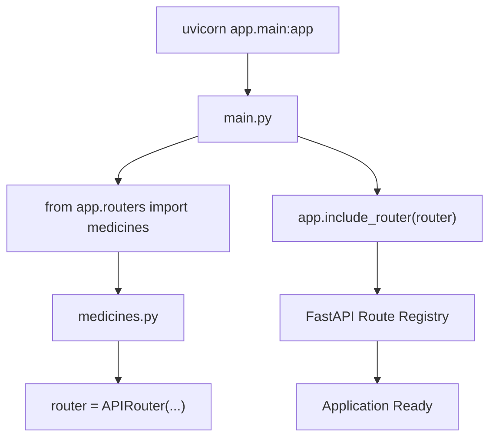
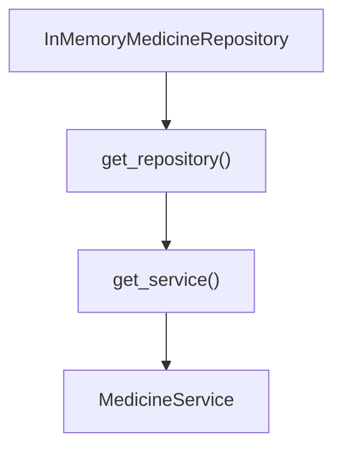
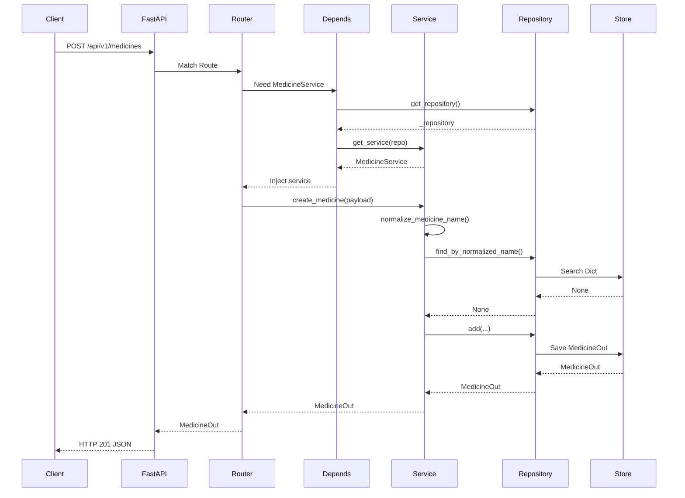
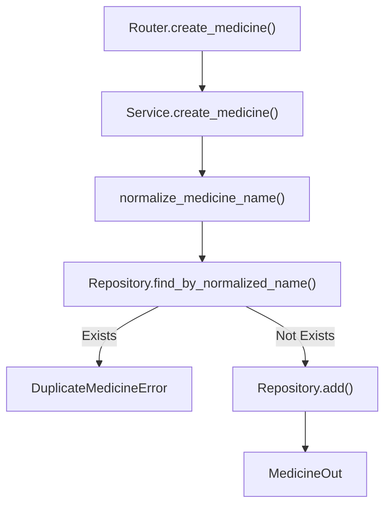
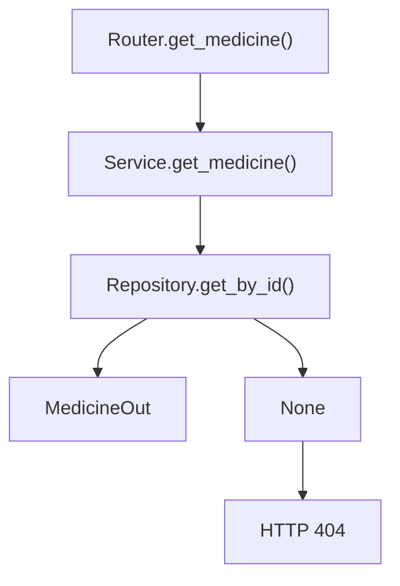
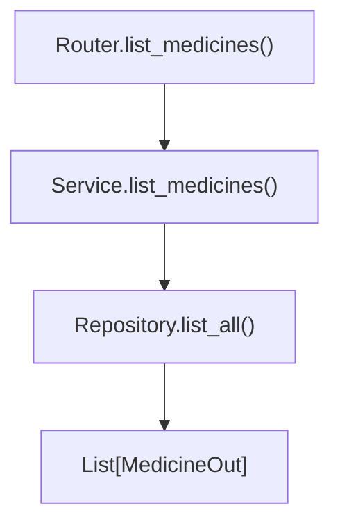
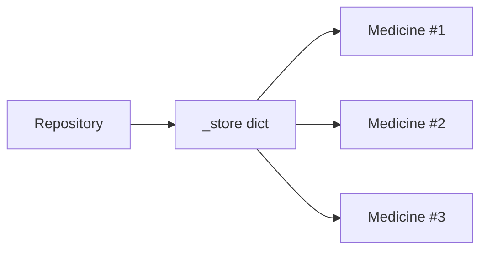
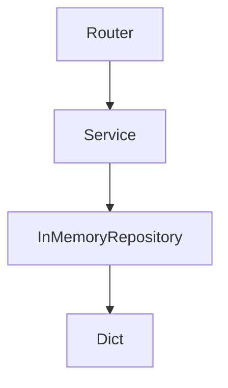
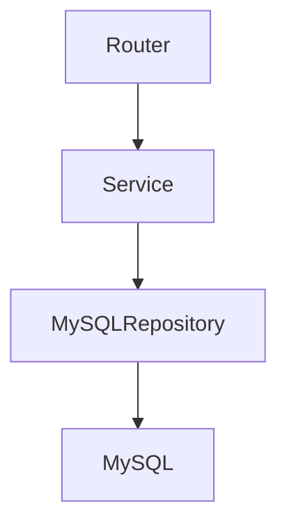

# AI Pharmacy Ecosystem - Complete Request Lifecycle Architecture

## Project Structure

```text id="8a1ttc"
app/
│
├── main.py
│
├── routers/
│   └── medicines.py
│
├── services/
│   └── medicine_service.py
│
├── repositories/
│   └── medicine_repository.py
│
├── schemas/
│   └── medicine.py
│
└── exceptions.py
```

---

# Startup Wiring (Application Boot)

When you run:

```bash id="8j0ayr"
uvicorn app.main:app --reload
```

Python executes:

```python id="wxkgt7"
app/main.py
```

---

## Import Flow



---

# Dependency Wiring

Inside medicines.py

```python id="3r8w5d"
_repository = InMemoryMedicineRepository()
```

Creates:

```text id="gjlwmc"
ONE repository object
shared by all requests
```

---

Dependency Graph



---

# Complete POST Request Flow

Client sends:

```http id="1xzv6l"
POST /api/v1/medicines
```

Body:

```json id="evuixq"
{
  "name": "Dolo",
  "mrp": 50,
  "hsn_code": "3004",
  "manufacturer": "Micro Labs"
}
```

---

# Runtime Request Lifecycle



---

# Detailed Layer Responsibilities

## Layer 1 - Router

File:

```text id="7wgmsr"
app/routers/medicines.py
```

Functions:

```python id="2b06v4"
create_medicine()

list_medicines()

get_medicine()
```

Responsibilities:

```text id="vqsd9k"
Receive HTTP requests

Convert JSON → MedicineCreate

Call Service

Convert Exceptions → HTTP Errors

Return JSON Response
```

Never:

```text id="6f0zmg"
SQL

Database

Business Logic
```

---

## Layer 2 - Service

File:

```text id="jtvd6o"
app/services/medicine_service.py
```

Functions:

```python id="4th4c9"
create_medicine()

get_medicine()

list_medicines()

normalize_medicine_name()
```

Responsibilities:

```text id="5ulv7r"
Business Rules

Duplicate Check

Validation Beyond Pydantic

Future Pricing Logic

Future FEFO Logic
```

Never:

```text id="m98fgd"
HTTP

Status Codes

Database Queries
```

---

## Layer 3 - Repository

File:

```text id="yw48d7"
app/repositories/medicine_repository.py
```

Functions:

```python id="rtnf3v"
add()

get_by_id()

list_all()

find_by_normalized_name()
```

Responsibilities:

```text id="e6p2gx"
Store Data

Fetch Data

Update Data

Delete Data
```

Never:

```text id="67gtly"
Duplicate Logic

Pricing Logic

HTTP Logic
```

---

# create_medicine() Call Chain



---

# get_medicine() Call Chain



---

# list_medicines() Call Chain



---

# Current In-Memory Storage

Repository currently stores:

```python id="5i8g6r"
_store = {
    1: MedicineOut(...),
    2: MedicineOut(...),
}
```

Visual:



---

# Future Architecture (Phase 2)

Nothing changes in Router.

Nothing changes in Service.

Only Repository changes.

Today:



Tomorrow:



This is the reason the 3-layer architecture exists.

---

# Ultimate Mental Model

```text id="0xsyh1"
Client
   ↓
FastAPI
   ↓
Router
   ↓
Service
   ↓
Repository
   ↓
Database
   ↓
Repository
   ↓
Service
   ↓
Router
   ↓
FastAPI
   ↓
Client
```

Every request follows this exact path.
