# AI Pharmacy Ecosystem — Diagrams

> Single source of truth for every architecture / flow diagram in this project.
> New diagrams are **appended** under a phase heading. Older ones are never deleted.
> Open this file in any Markdown viewer (VS Code preview, GitHub, Obsidian) to see all diagrams rendered.

---

## Phase 0 — Foundation roadmap

The order of steps to lay the project foundation before any application code is written.

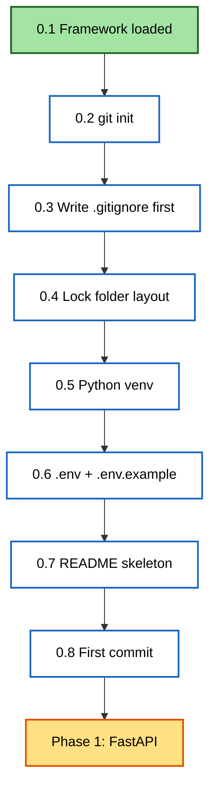

---

## Phase 1 — FastAPI 3-layer architecture

### Phase 1 step roadmap

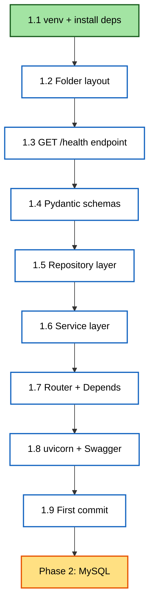

### 3-layer request flow (the heart of Phase 1)

Solid arrows = request going IN. Dotted arrows = response coming BACK.

```mermaid
graph LR
    Client[Client / Browser] -->|POST /medicines| Router
    Router[Router — Reception] -->|MedicineCreate| Service
    Service[Service — Pharmacist] -->|domain object| Repo
    Repo[Repository — Storeroom] -->|insert / fetch| Storage[(Storage)]

    Storage -.->|raw record| Repo
    Repo -.->|Medicine| Service
    Service -.->|MedicineOut| Router
    Router -.->|HTTP 201 JSON| Client

    classDef client fill:#f3e5f5,stroke:#4a148c,stroke-width:2px,color:#000
    classDef router fill:#bbdefb,stroke:#0d47a1,stroke-width:2px,color:#000
    classDef service fill:#c8e6c9,stroke:#1b5e20,stroke-width:2px,color:#000
    classDef repo fill:#fff9c4,stroke:#f57f17,stroke-width:2px,color:#000
    classDef storage fill:#e0e0e0,stroke:#424242,stroke-width:2px,color:#000

    class Client client
    class Router router
    class Service service
    class Repo repo
    class Storage storage
```

### Duplicate-detection flow — where does the rule live?

Shows why "Crocin 500MG " vs "Crocin 500mg" deduplication is a **Service** responsibility, not Repository.
The Service normalizes + decides; the Repository only fetches by exact criteria.

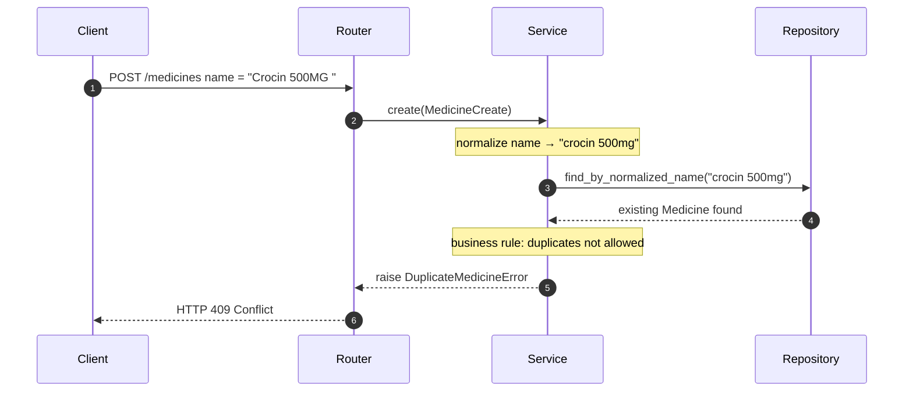

### Step 1.1 — venv + install ecosystem

How the system Python, the venv, the installed packages, requirements.txt, and .gitignore relate.

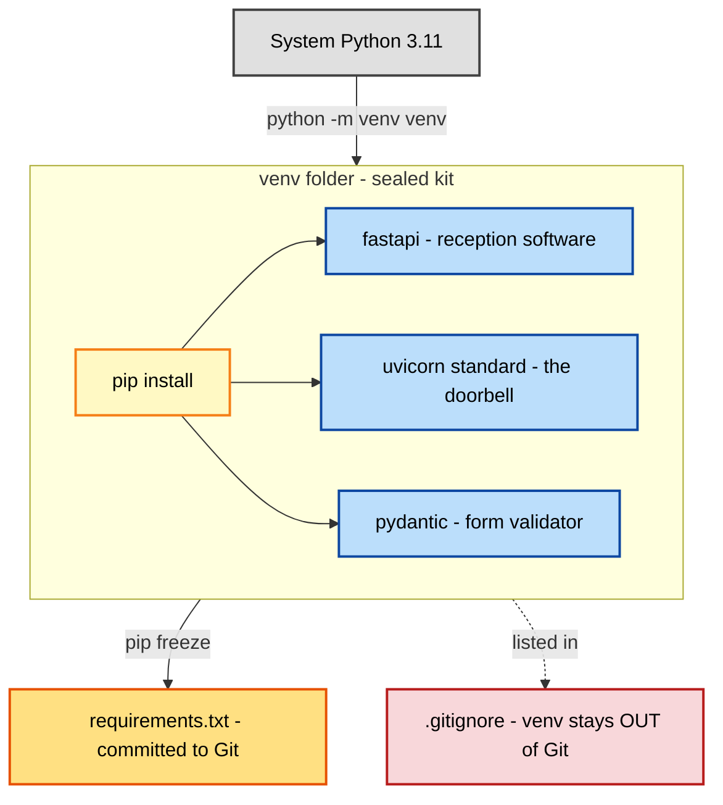

### Local repo ↔ GitHub remote

How working files flow through .gitignore → staging → local history → remote (origin).

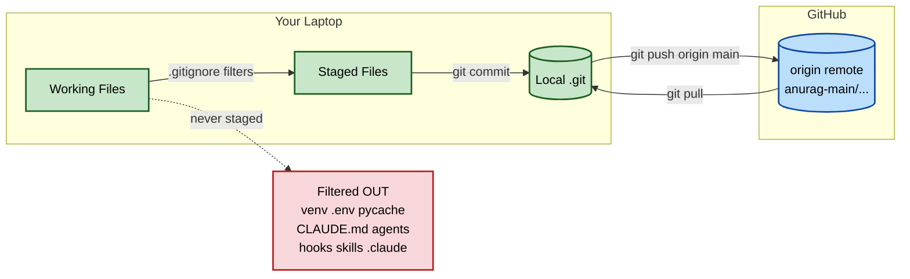

### Step 1.1 — requirements.txt reproducibility loop

Shows why we commit requirements.txt (NOT venv/) — so any teammate or future machine recreates the exact same package set with one command.

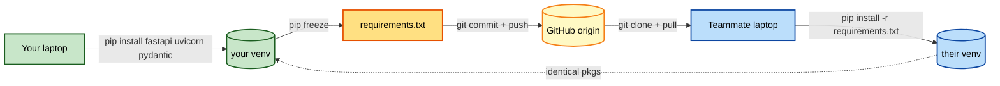

### Step 1.2 — backend folder layout (the locked floor plan)

The directory structure for `pharmacy-core-backend/`. Each folder maps to one pharmacy zone with one clear responsibility.

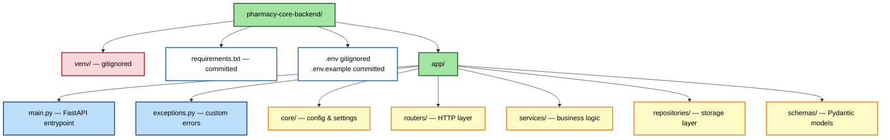

### Step 1.3 — GET /health endpoint flow

How a load balancer's /health probe travels through FastAPI's decorator into your function and back.

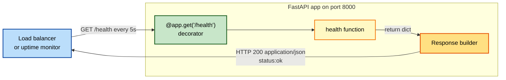

### Step 1.4 — Pydantic schema split (input vs output)

Why we never use one schema for both: input fields (MedicineCreate) ⊆ DB fields ⊆ output fields (MedicineOut), and some DB fields (cost_price, supplier_notes) never leave the repository.

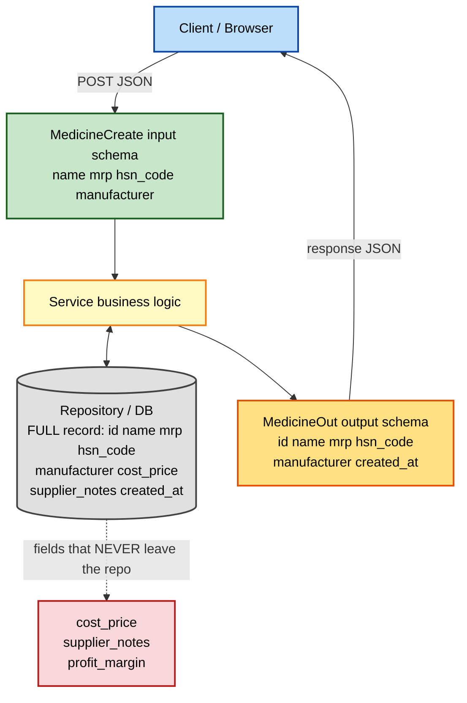

### Step 1.5 — Repository contract (service ↔ in-memory repo)

The 4 repo methods, and how the service's "normalize then ask" flow lands on `find_by_normalized_name`. The repo never decides; it only fetches/stores.

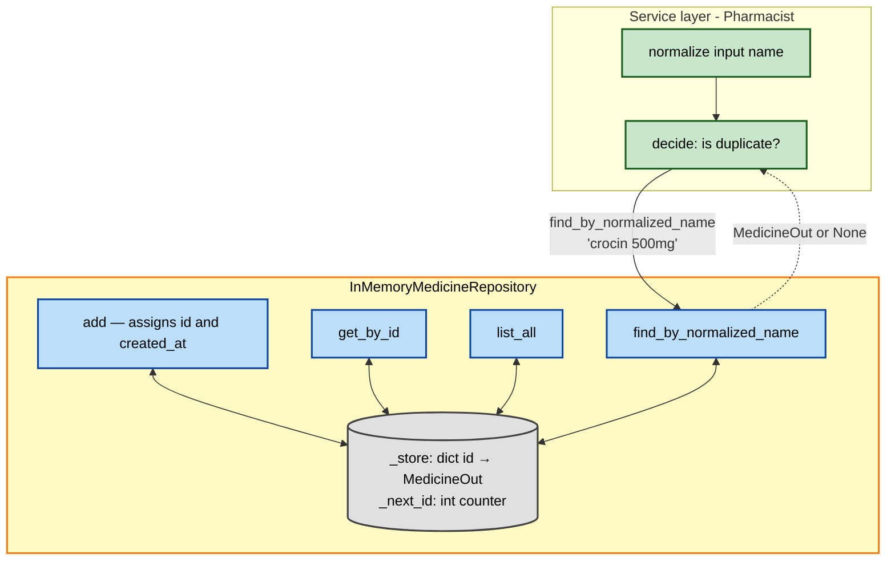

### POST /medicines — full request lifecycle

Shows what every layer DOES to the data on the way IN (Frontend → MedicineCreate → Service → Repository) and the way OUT (Repository attaches id+created_at → MedicineOut → Response → Frontend).

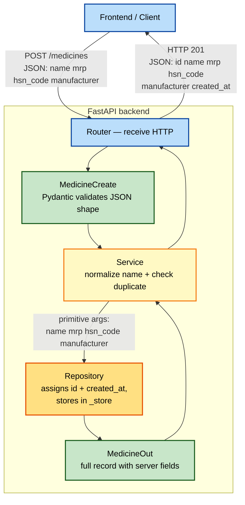

### Step 1.6 — MedicineService.create_medicine decision flow

The 3 steps the service runs on every POST, and where each one routes if it short-circuits (duplicate → 409, clean → 201).

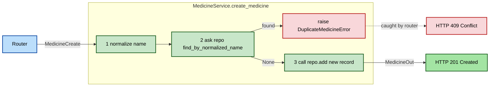

### Step 1.7 — Router with Depends() — full request lifecycle

Shows how FastAPI resolves Depends() per request, builds the service, calls the endpoint, and translates domain exceptions into HTTP status codes.

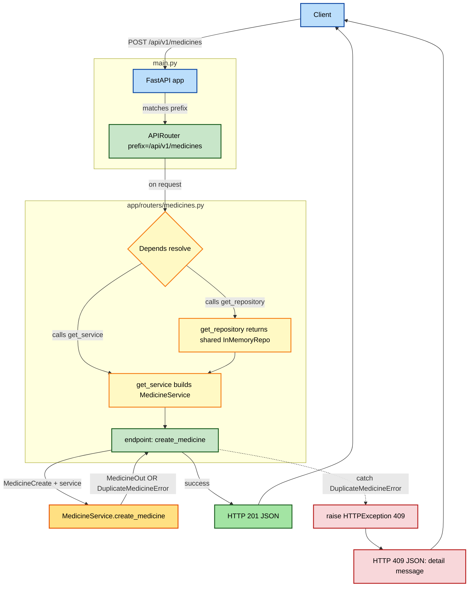

---
