# AI Pharmacy Ecosystem — Diagrams

> Single source of truth for every architecture / flow diagram in this project.
> New diagrams are **appended** under a phase heading. Older ones are never deleted.
> Open this file in any Markdown viewer (VS Code preview, GitHub, Obsidian) to see all diagrams rendered.

---

## Phase 0 — Foundation roadmap

The order of steps to lay the project foundation before any application code is written.

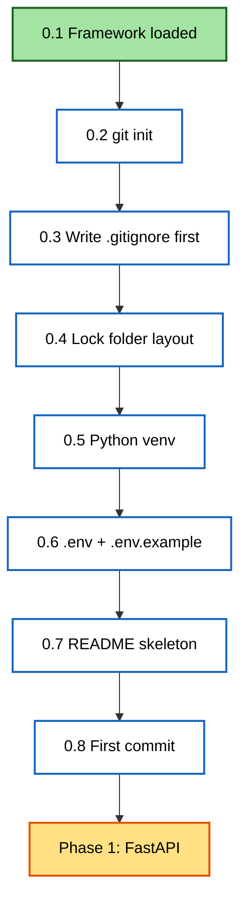

---

## Phase 1 — FastAPI 3-layer architecture

### Phase 1 step roadmap

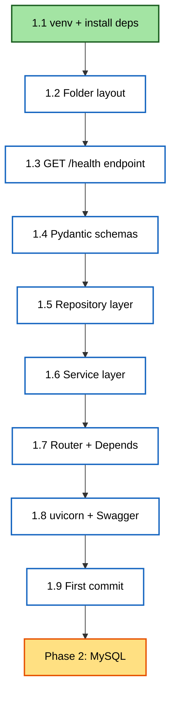

### 3-layer request flow (the heart of Phase 1)

Solid arrows = request going IN. Dotted arrows = response coming BACK.

```mermaid
graph LR
    Client[Client / Browser] -->|POST /medicines| Router
    Router[Router — Reception] -->|MedicineCreate| Service
    Service[Service — Pharmacist] -->|domain object| Repo
    Repo[Repository — Storeroom] -->|insert / fetch| Storage[(Storage)]

    Storage -.->|raw record| Repo
    Repo -.->|Medicine| Service
    Service -.->|MedicineOut| Router
    Router -.->|HTTP 201 JSON| Client

    classDef client fill:#f3e5f5,stroke:#4a148c,stroke-width:2px,color:#000
    classDef router fill:#bbdefb,stroke:#0d47a1,stroke-width:2px,color:#000
    classDef service fill:#c8e6c9,stroke:#1b5e20,stroke-width:2px,color:#000
    classDef repo fill:#fff9c4,stroke:#f57f17,stroke-width:2px,color:#000
    classDef storage fill:#e0e0e0,stroke:#424242,stroke-width:2px,color:#000

    class Client client
    class Router router
    class Service service
    class Repo repo
    class Storage storage
```

### Duplicate-detection flow — where does the rule live?

Shows why "Crocin 500MG " vs "Crocin 500mg" deduplication is a **Service** responsibility, not Repository.
The Service normalizes + decides; the Repository only fetches by exact criteria.

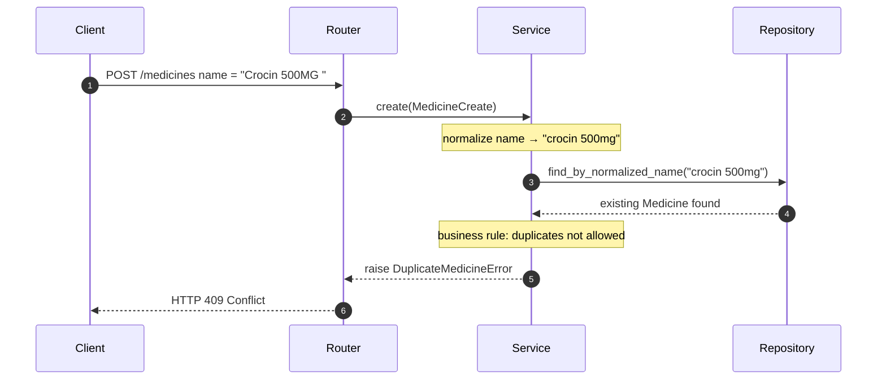

### Step 1.1 — venv + install ecosystem

How the system Python, the venv, the installed packages, requirements.txt, and .gitignore relate.

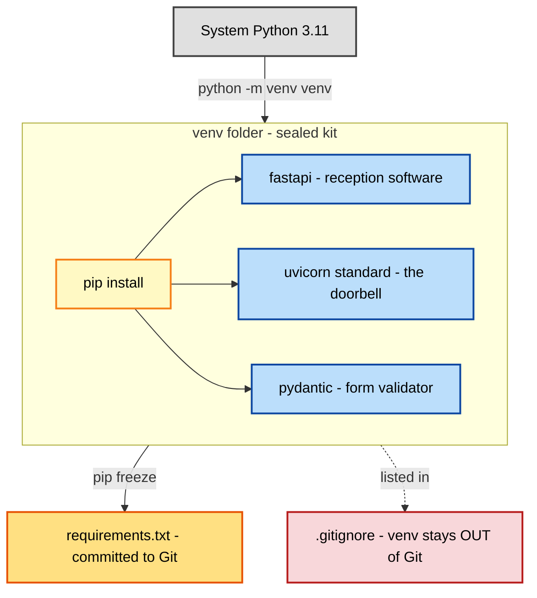

### Local repo ↔ GitHub remote

How working files flow through .gitignore → staging → local history → remote (origin).

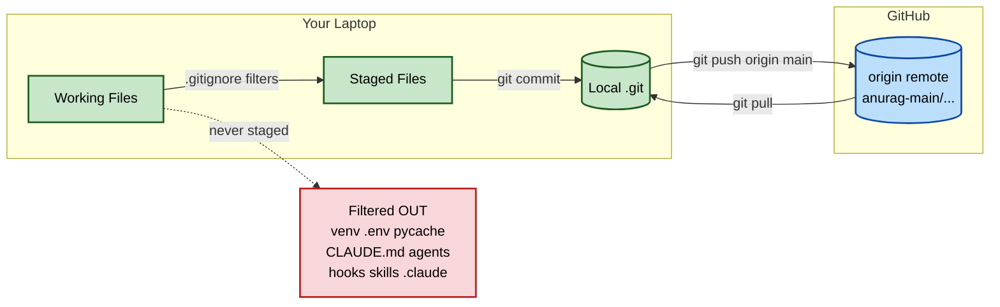

### Step 1.1 — requirements.txt reproducibility loop

Shows why we commit requirements.txt (NOT venv/) — so any teammate or future machine recreates the exact same package set with one command.

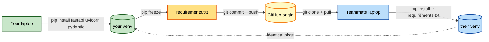

### Step 1.2 — backend folder layout (the locked floor plan)

The directory structure for `pharmacy-core-backend/`. Each folder maps to one pharmacy zone with one clear responsibility.

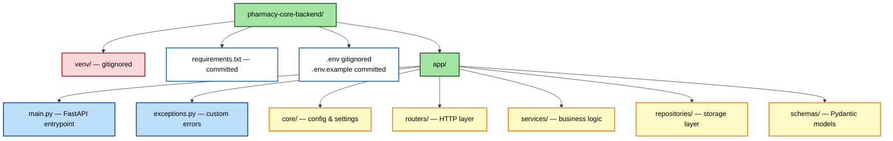

### Step 1.3 — GET /health endpoint flow

How a load balancer's /health probe travels through FastAPI's decorator into your function and back.

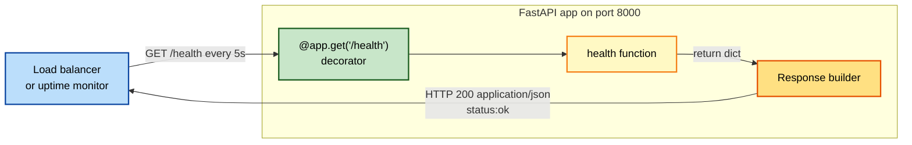

### Step 1.4 — Pydantic schema split (input vs output)

Why we never use one schema for both: input fields (MedicineCreate) ⊆ DB fields ⊆ output fields (MedicineOut), and some DB fields (cost_price, supplier_notes) never leave the repository.

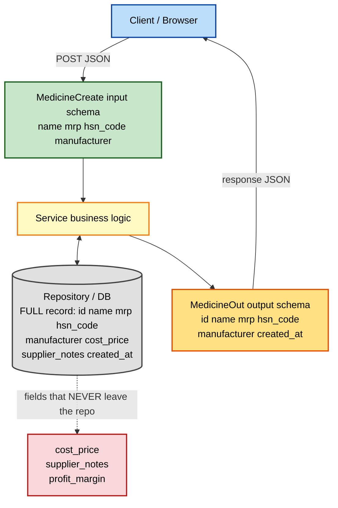

### Step 1.5 — Repository contract (service ↔ in-memory repo)

The 4 repo methods, and how the service's "normalize then ask" flow lands on `find_by_normalized_name`. The repo never decides; it only fetches/stores.

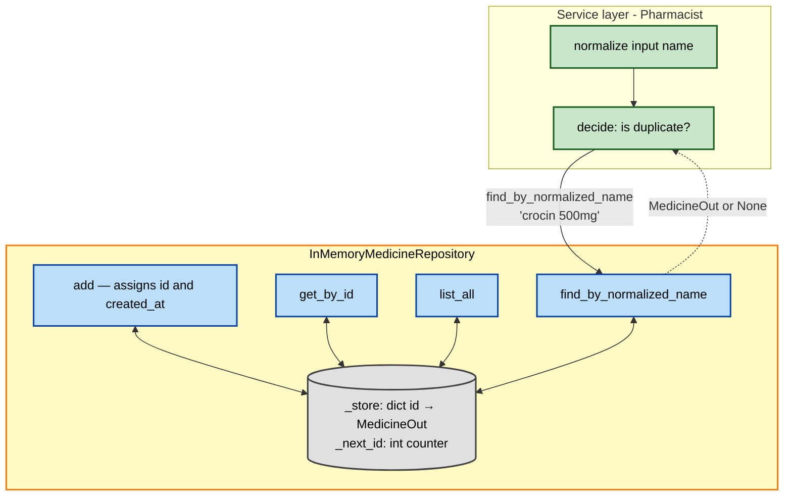

### POST /medicines — full request lifecycle

Shows what every layer DOES to the data on the way IN (Frontend → MedicineCreate → Service → Repository) and the way OUT (Repository attaches id+created_at → MedicineOut → Response → Frontend).

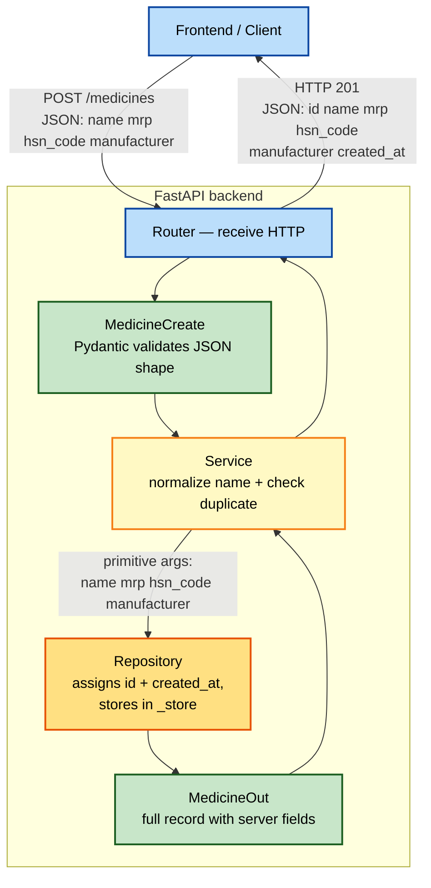

### Step 1.6 — MedicineService.create_medicine decision flow

The 3 steps the service runs on every POST, and where each one routes if it short-circuits (duplicate → 409, clean → 201).

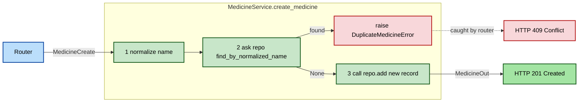

### Step 1.7 — Router with Depends() — full request lifecycle

Shows how FastAPI resolves Depends() per request, builds the service, calls the endpoint, and translates domain exceptions into HTTP status codes.

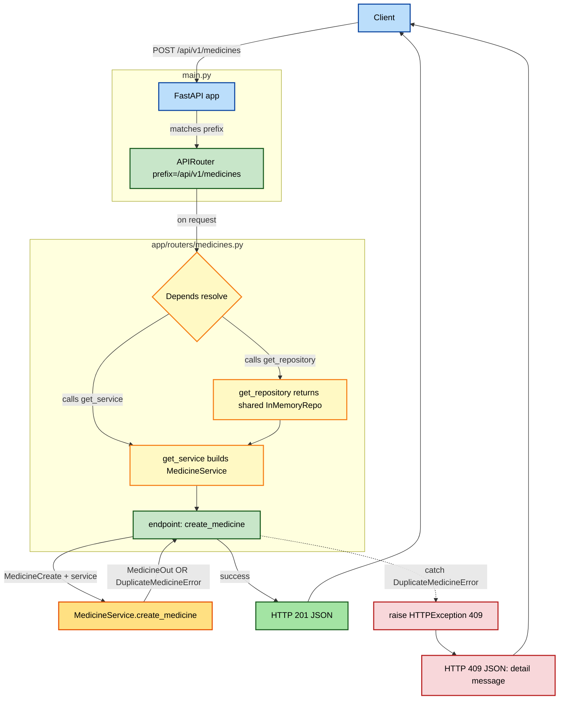

---

## Phase 2 — Persistent Storage (MySQL + SQLAlchemy + Alembic)

### Phase 2 step roadmap

The order matters: get DB connectivity working before models, models before migrations, migrations before sessions, sessions before the new repository.

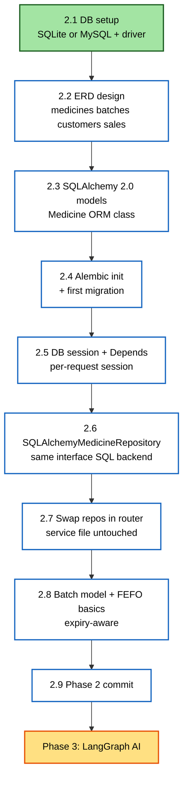

### Step 2.2 — Full pharmacy ERD

Six entities, designed up front so we never refactor primary keys / foreign keys later.
Phase 2 implements only MEDICINES + BATCHES (steps 2.3–2.8); CUSTOMERS / SALES / SALE_ITEMS / USERS land in Phase 3.

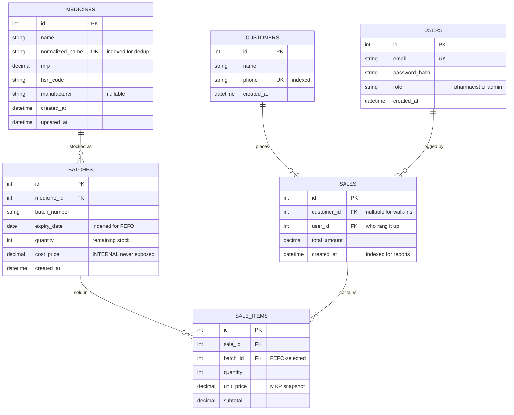

### Step 2.3 — Where each Medicine "shape" lives (HTTP / Domain / DB / Foundation)

The 3-way class separation senior backends always have. Conflating any two re-introduces the Phase-1 mistakes we already cured.

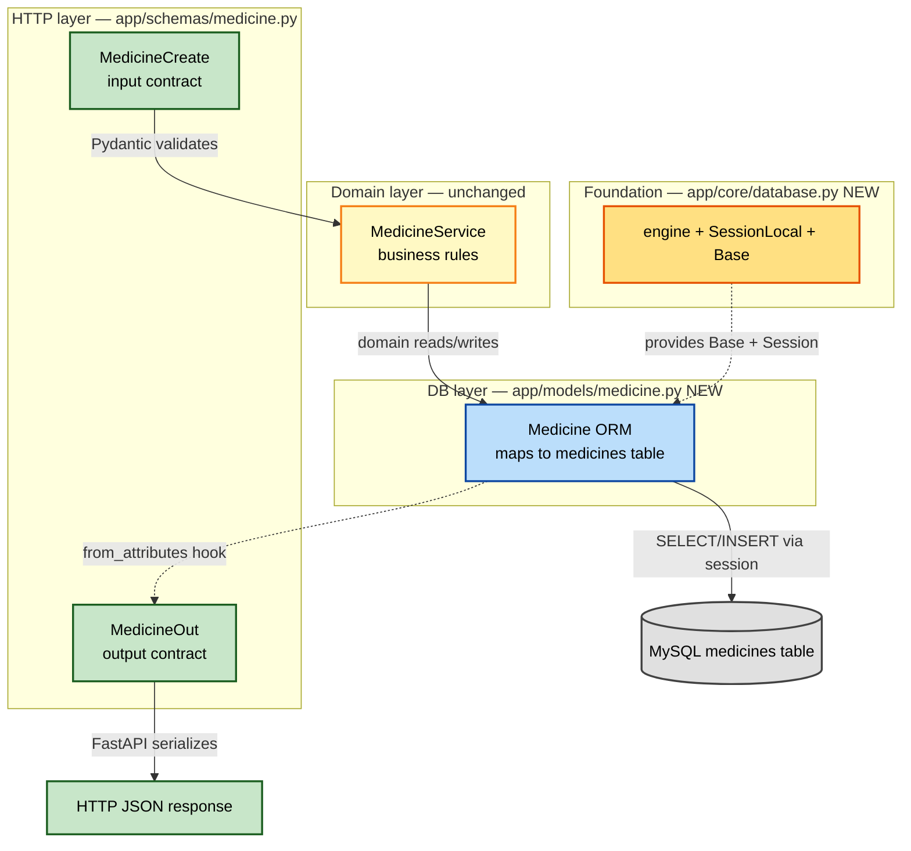

### Step 2.5 — Per-request DB session lifecycle (yield-based Depends)

One Session per HTTP request: opened on entry, closed on exit even if the endpoint raised. Connections borrowed from the engine pool, returned on close.

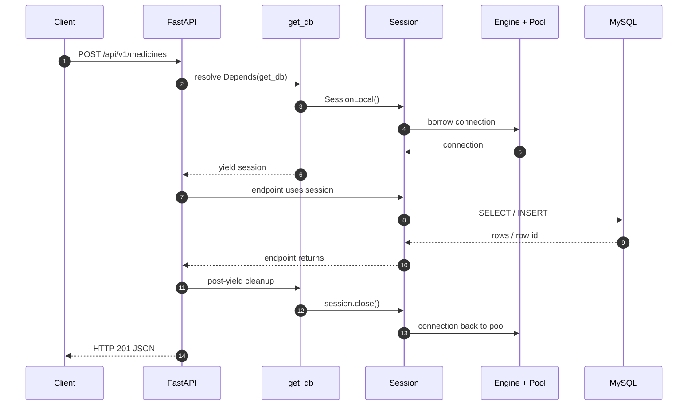

### Step 2.8 — Medicine 1:N Batches + FEFO selection

One medicine → many batches. FEFO query picks the batch with the soonest non-expired expiry that still has stock.

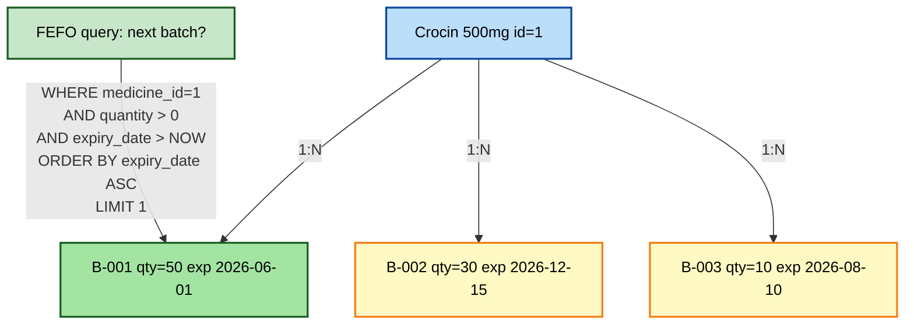

---

## Phase 3 / Step 3.1 — NVIDIA + Mistral-Nemotron smoke test (verified path)

The exact path traced during the verification call. Every future node call follows this same path — only the prompt content differs.

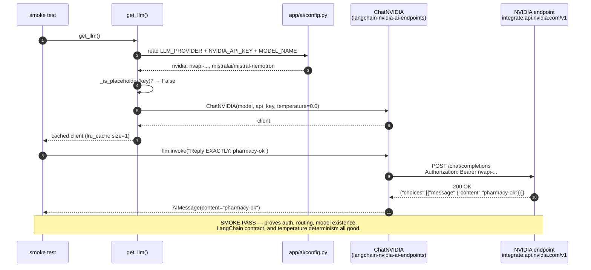

```mermaid
graph LR
    subgraph user[Your code — provider-agnostic]
        N1[extract_intent node]
        N2[resolve_medicine node]
        N3[select_batch node]
        N4[compute_pricing node]
    end

    subgraph factory[app/ai/llm.py — the only place that knows providers]
        GL{{"get_llm()<br/>cached"}}
        BN["_build_nvidia_client()"]
        BO["_build_openai_client()"]
    end

    subgraph providers[Hosted LLM providers]
        CN[ChatNVIDIA<br/>mistral-nemotron]
        CO[ChatOpenAI<br/>gpt-4o-mini]
    end

    N1 --> GL
    N2 --> GL
    N3 --> GL
    N4 --> GL
    GL -->|LLM_PROVIDER=nvidia| BN
    GL -->|LLM_PROVIDER=openai| BO
    BN --> CN
    BO --> CO

    classDef code fill:#fff5d6,stroke:#a86b00,stroke-width:2px,color:#000
    classDef router fill:#e3f0ff,stroke:#003a8c,stroke-width:2px,color:#000
    classDef provider fill:#e5fbe5,stroke:#1f7a1f,stroke-width:2px,color:#000

    class N1,N2,N3,N4 code
    class GL,BN,BO router
    class CN,CO provider
```

---

## Phase 3 / Step 3.2 — `ExtractedIntent` schema (the notebook with boxes)

### The candy-shop analogy → the schema shape

```mermaid
graph TB
    subgraph notebook[Notebook page = one MedicineItem]
        N1["Box 1<br/>Name<br/>'Crocin 500mg'"]
        N2["Box 2<br/>Quantity<br/>2"]
        N3["Box 3<br/>Unit<br/>'strip'"]
    end

    subgraph top[Top of stack of pages = ExtractedIntent]
        T1["Customer name<br/>'Anurag'"]
        T2["Customer phone<br/>'9876543210'"]
        T3["Items list<br/>= many MedicineItem pages"]
    end

    T3 -.contains many.-> notebook

    classDef box fill:#fff5d6,stroke:#a86b00,stroke-width:2px,color:#000
    classDef top fill:#e3f0ff,stroke:#003a8c,stroke-width:2px,color:#000
    class N1,N2,N3 box
    class T1,T2,T3 top
```

### What happens at runtime

```mermaid
sequenceDiagram
    autonumber
    participant U as Pharmacist input
    participant L as Maverick (LLM)
    participant P as Pydantic (the mom)
    participant S as ExtractedIntent

    U->>L: "2 strips Crocin 500mg for Anurag 9876543210"
    Note over L: LLM tries to fill the notebook<br/>(produces JSON)
    L->>P: JSON output
    Note over P: Mom checks every box<br/>- types correct?<br/>- nothing missing?<br/>- no extra boxes?
    alt Mom approves
        P-->>S: Valid ExtractedIntent instance
        S-->>U: Ready to use downstream
    else Mom rejects
        P-->>L: ValidationError → retry
    end
```

---

## Phase 3 / Step 3.2 — File 2 — System prompt = Rohit's instruction card

### How the prompt sits next to the schema

```mermaid
graph LR
    subgraph card[Rohit's instruction card<br/>= billing_prompts.py]
        R[Role: 'You are a strict order-taker']
        T[Task: 'Parse the sentence']
        RU[Rules: 'don't invent, lowercase, etc.']
        E[Examples: input → output]
    end

    subgraph notebook[The notebook<br/>= extracted_intent.py]
        SCH[Pydantic schema<br/>ExtractedIntent]
    end

    subgraph helper[Rohit at work<br/>= extract_intent node]
        L[LLM Maverick]
    end

    card -- glued to --> L
    notebook -- glued to --> L
    KID["Kid says:<br/>'2 strips Crocin for Anurag'"] --> L
    L --> OUT["Filled notebook<br/>= ExtractedIntent instance"]

    classDef card fill:#ffe5e5,stroke:#a83333,stroke-width:2px,color:#000
    classDef book fill:#fff5d6,stroke:#a86b00,stroke-width:2px,color:#000
    classDef helper fill:#e3f0ff,stroke:#003a8c,stroke-width:2px,color:#000
    classDef io fill:#e5fbe5,stroke:#1f7a1f,stroke-width:2px,color:#000

    class R,T,RU,E,card card
    class SCH,notebook book
    class L,helper helper
    class KID,OUT io
```

### The 5-section prompt structure (industry standard)

```mermaid
graph TB
    P["System prompt<br/>EXTRACT_INTENT_SYSTEM_PROMPT_V1"]
    P --> S1["1. ROLE<br/>'You are a strict pharmacy order-taker'"]
    P --> S2["2. TASK<br/>'Parse the sentence into ExtractedIntent fields'"]
    P --> S3["3. RULES<br/>'never invent, lowercase, leave optional fields null'"]
    P --> S4["4. OUTPUT FORMAT<br/>'Return JSON matching the schema, nothing else'"]
    P --> S5["5. EXAMPLES<br/>Few-shot: 1-3 input → output pairs"]

    classDef prompt fill:#ffe5e5,stroke:#a83333,stroke-width:2px,color:#000
    classDef section fill:#fff5d6,stroke:#a86b00,stroke-width:2px,color:#000
    class P prompt
    class S1,S2,S3,S4,S5 section
```

---

## Phase 3 / Step 3.2 — File 3 — `extract_intent` node (Rohit's work routine)

### Inside one call to the node

```mermaid
flowchart TD
    A["state in:<br/>pharmacist_input = '2 strips Crocin...'"] --> B{Empty<br/>input?}
    B -- yes --> Z["return:<br/>state.errors += ['empty input']"]
    B -- no --> C["llm = get_llm()<br/>= cached ChatNVIDIA Maverick"]
    C --> D["structured_llm =<br/>llm.with_structured_output(ExtractedIntent)"]
    D --> E["messages = [<br/>  SystemMessage(prompt),<br/>  HumanMessage(input)<br/>]"]
    E --> F["result = structured_llm.invoke(messages)"]
    F --> G["NVIDIA API call<br/>integrate.api.nvidia.com/v1<br/>(real LLM round trip)"]
    G --> H["Pydantic validates JSON<br/>→ ExtractedIntent instance"]
    H --> I["return:<br/>state.extracted_intent =<br/>result.model_dump()"]

    classDef start fill:#e3f0ff,stroke:#003a8c,stroke-width:2px,color:#000
    classDef step fill:#fff5d6,stroke:#a86b00,stroke-width:2px,color:#000
    classDef net fill:#ffe5e5,stroke:#a83333,stroke-width:2px,color:#000
    classDef out fill:#e5fbe5,stroke:#1f7a1f,stroke-width:2px,color:#000

    class A start
    class B,C,D,E,F,H step
    class G net
    class Z,I out
```

### How the 4 files for Step 3.2 fit together

```mermaid
graph TB
    subgraph state[Phase 3 / app/ai/state/]
        S["BillingState<br/>TypedDict"]
    end
    subgraph schemas[Phase 3 / app/ai/schemas/]
        SCH["ExtractedIntent<br/>+ MedicineItem"]
    end
    subgraph prompts[Phase 3 / app/ai/prompts/]
        PR["EXTRACT_INTENT_SYSTEM_PROMPT_V1"]
    end
    subgraph llm[Phase 3 / app/ai/]
        LL["get_llm()<br/>ChatNVIDIA Maverick"]
    end
    subgraph node[Phase 3 / app/ai/nodes/]
        N["extract_intent(state)"]
    end

    S -. read .-> N
    SCH -. wraps LLM .-> N
    PR -. SystemMessage .-> N
    LL -. invoked by .-> N
    N -. writes .-> S

    classDef def fill:#fff5d6,stroke:#a86b00,stroke-width:2px,color:#000
    classDef node fill:#e3f0ff,stroke:#003a8c,stroke-width:2px,color:#000
    class S,SCH,PR,LL def
    class N node
```

---

## Phase 3 / Step 3.3 — `resolve_medicine` node (Priya the inventory clerk)

### What flows through the node

```mermaid
flowchart LR
    A["state in:<br/>extracted_intent.items =<br/>[{name:'Crocin 500mg',qty:2,unit:'strip'},<br/>{name:'Unicorn Dust',qty:1,unit:'tube'}]"] --> B[open SessionLocal]
    B --> C{for each item}
    C --> D[normalize_medicine_name<br/>'Crocin 500mg' → 'crocin500mg']
    D --> E[repo.find_by_normalized_name]
    E -->|found| F["resolved_items.append<br/>{**item, medicine_id: 42}"]
    E -->|None| G["errors.append<br/>'Medicine not found: ...'"]
    F --> C
    G --> C
    C -->|done| H[close session]
    H --> I["state out:<br/>resolved_items: [...]<br/>errors: [...]"]

    classDef start fill:#e3f0ff,stroke:#003a8c,stroke-width:2px,color:#000
    classDef step fill:#fff5d6,stroke:#a86b00,stroke-width:2px,color:#000
    classDef ok fill:#e5fbe5,stroke:#1f7a1f,stroke-width:2px,color:#000
    classDef err fill:#ffe5e5,stroke:#a83333,stroke-width:2px,color:#000
    classDef out fill:#e3f0ff,stroke:#003a8c,stroke-width:2px,color:#000

    class A,I start
    class B,C,D,E,H step
    class F ok
    class G err
```

### State evolution across the billing graph

```mermaid
graph LR
    A[pharmacist_input<br/>raw text] --> B[extract_intent<br/>LLM]
    B --> C[extracted_intent<br/>+ items list]
    C --> D[resolve_medicine<br/>DB lookup]
    D --> E[resolved_items<br/>+ medicine_id per item]
    E --> F[select_batch<br/>FEFO]
    F --> G[priced_items<br/>+ batch_id + unit_price]
    G --> H[compute_pricing]
    H --> I[total_amount]
    I --> J[persist_sale<br/>DB tx]
    J --> K[sale_id]

    classDef text fill:#fff5d6,stroke:#a86b00,stroke-width:2px,color:#000
    classDef node fill:#e3f0ff,stroke:#003a8c,stroke-width:2px,color:#000
    classDef todo fill:#f0f0f0,stroke:#666,stroke-width:1px,color:#666,stroke-dasharray: 5 5

    class A,C,E,G,I,K text
    class B,D node
    class F,H,J todo
```

Solid blue = done, dashed grey = next steps.

---

## Phase 3 / Step 3.4 — `select_batch` node (Sanjay the storeroom manager)

### Inside one call to the node

```mermaid
flowchart TD
    A["state in:<br/>resolved_items =<br/>[{name, qty, unit, medicine_id}, ...]"] --> B[open SessionLocal]
    B --> C{for each item}
    C --> D["repo.select_fefo(medicine_id)<br/>SQL: WHERE medicine_id = X<br/>AND quantity > 0<br/>AND expiry_date > today<br/>ORDER BY expiry_date ASC LIMIT 1"]
    D --> E{batch found?}
    E -- "None — no usable batch" --> F["errors.append<br/>'No stocked batch for X'"]
    E -- found --> G{batch.qty<br/>>= item.qty?}
    G -- no --> H["errors.append<br/>'Insufficient stock: need N, only M'"]
    G -- yes --> I["batched_items.append<br/>{...item, batch_id, expiry_date}"]
    F --> C
    H --> C
    I --> C
    C -->|done| J[close session]
    J --> K["state out:<br/>batched_items: [...]<br/>errors: [...]"]

    classDef start fill:#e3f0ff,stroke:#003a8c,stroke-width:2px,color:#000
    classDef step fill:#fff5d6,stroke:#a86b00,stroke-width:2px,color:#000
    classDef ok fill:#e5fbe5,stroke:#1f7a1f,stroke-width:2px,color:#000
    classDef err fill:#ffe5e5,stroke:#a83333,stroke-width:2px,color:#000

    class A,K start
    class B,C,D,E,G,J step
    class I ok
    class F,H err
```

### FEFO visualized — why Sanjay always picks the older box

```mermaid
graph TB
    subgraph crocin[All batches of Crocin 500mg in DB]
        B1["Batch #A001<br/>Expires: 2026-02-15<br/>Qty: 25"]
        B2["Batch #A002<br/>Expires: 2026-04-30<br/>Qty: 100"]
        B3["Batch #A003<br/>Expires: 2025-11-30<br/>EXPIRED — ignored"]
        B4["Batch #A004<br/>Expires: 2027-01-10<br/>Qty: 0 (empty) — ignored"]
    end
    Q["select_fefo(medicine_id=Crocin)"]
    P["Pick = Batch #A001<br/>(soonest-expiring with stock)"]

    Q -.filter expired.-> crocin
    Q -.filter empty.-> crocin
    Q -.order by expiry ASC, LIMIT 1.-> crocin
    crocin --> P

    classDef batch fill:#fff5d6,stroke:#a86b00,stroke-width:2px,color:#000
    classDef expired fill:#f0f0f0,stroke:#999,stroke-width:1px,color:#666
    classDef pick fill:#e5fbe5,stroke:#1f7a1f,stroke-width:3px,color:#000
    classDef query fill:#e3f0ff,stroke:#003a8c,stroke-width:2px,color:#000

    class B1,B2 batch
    class B3,B4 expired
    class P pick
    class Q query
```

The composite index `(medicine_id, expiry_date)` makes this a single B-tree seek — fast even with millions of batch rows.

---

## Phase 3 / Step 3.5 — `compute_pricing` node (Meera the cashier)

### Inside one call

```mermaid
flowchart TD
    A["state in:<br/>batched_items =<br/>[{...item, medicine_id, batch_id, expiry_date}, ...]"] --> B[open SessionLocal]
    B --> C[total_amount = Decimal 0]
    C --> D{for each batched_item}
    D --> E["medicine = med_repo.get_by_id(medicine_id)<br/>(price-tag lookup — SERVER-SIDE only)"]
    E --> F["unit_price = Decimal(str(medicine.mrp))"]
    F --> G["line_total = unit_price × quantity<br/>quantized to 2 decimals"]
    G --> H["priced_items.append<br/>{...item, unit_price, line_total}"]
    H --> I["total_amount += line_total"]
    I --> D
    D -->|done| J["close session"]
    J --> K["state out:<br/>priced_items: [...]<br/>total_amount: float"]

    classDef start fill:#e3f0ff,stroke:#003a8c,stroke-width:2px,color:#000
    classDef step fill:#fff5d6,stroke:#a86b00,stroke-width:2px,color:#000
    classDef money fill:#e5fbe5,stroke:#1f7a1f,stroke-width:2px,color:#000
    classDef sec fill:#ffe5e5,stroke:#a83333,stroke-width:2px,color:#000

    class A,K start
    class B,C,D,J step
    class F,G,H,I money
    class E sec
```

### The server-side pricing rule visualized

```mermaid
graph LR
    subgraph attacker[Attacker tampers HTTP body]
        A1["Client sent:<br/>quantity=2<br/>price=0.01 (FAKE)"]
    end
    subgraph naive[Naive code]
        N1["bill = price × qty<br/>= 0.01 × 2<br/>= 0.02 ₹  (free medicine!)"]
    end
    subgraph ours[Our compute_pricing]
        O1["bill = DB.mrp × qty<br/>= 25.00 × 2<br/>= 50.00 ₹  (correct)"]
    end

    A1 -.-> N1
    A1 -.-> O1

    classDef bad fill:#ffe5e5,stroke:#a83333,stroke-width:2px,color:#000
    classDef good fill:#e5fbe5,stroke:#1f7a1f,stroke-width:2px,color:#000
    classDef att fill:#fff5d6,stroke:#a86b00,stroke-width:2px,color:#000
    class A1 att
    class N1 bad
    class O1 good
```

---

## Phase 3 / Step 3.7 — `persist_sale` node (Mom writing the bill)

### The 4-table transaction

```mermaid
flowchart TD
    A["state in:<br/>extracted_intent.customer_*<br/>priced_items + total_amount"] --> B["with SessionLocal() as db"]
    B --> T["with db.begin():<br/>(opens transaction)"]
    T --> C{phone given?}
    C -- yes --> D["SELECT customers WHERE phone=...<br/>found?"]
    D -- no --> E["INSERT customers<br/>db.flush() → customer.id"]
    D -- yes --> F["use existing customer.id"]
    C -- no --> G["customer_id = NULL"]
    E --> H["INSERT sales (customer_id, total)<br/>db.flush() → sale.id"]
    F --> H
    G --> H
    H --> I{for each priced_item}
    I --> J["batch = db.get(Batch, batch_id)<br/>check qty sufficient"]
    J -- ok --> K["batch.quantity -= sold_qty<br/>(UPDATE batches)"]
    J -- insufficient --> X["raise → rollback"]
    K --> L["INSERT sale_items"]
    L --> I
    I -->|done| M["db.commit()<br/>(transaction sealed)"]
    M --> Z["state out:<br/>sale_id = N"]
    X --> Y["state out:<br/>errors = ['persist_sale failed: ...']"]

    classDef start fill:#e3f0ff,stroke:#003a8c,stroke-width:2px,color:#000
    classDef step fill:#fff5d6,stroke:#a86b00,stroke-width:2px,color:#000
    classDef tx fill:#fce5ff,stroke:#7d2280,stroke-width:3px,color:#000
    classDef ok fill:#e5fbe5,stroke:#1f7a1f,stroke-width:2px,color:#000
    classDef err fill:#ffe5e5,stroke:#a83333,stroke-width:2px,color:#000

    class A,Z,Y start
    class C,D,I,J step
    class T,M tx
    class E,F,G,H,K,L ok
    class X err
```

### Why it must be one transaction — partial-write disaster scenarios

```mermaid
graph LR
    subgraph p1[Scenario A: crash after Sale insert]
        S1["INSERT sales ✓"] --> S2["INSERT sale_items ✗ crashed"]
        S2 --> S3["Result: header with no lines<br/>= an empty invoice<br/>Money charged, no record of WHAT"]
    end
    subgraph p2[Scenario B: crash after sale_items but before batch UPDATE]
        T1["INSERT sales ✓"] --> T2["INSERT sale_items ✓"]
        T2 --> T3["UPDATE batches ✗ crashed"]
        T3 --> T4["Result: sale recorded but stock NOT decremented<br/>= phantom stock<br/>Same units sold twice"]
    end
    subgraph p3[Our atomic transaction]
        A1["BEGIN"] --> A2["INSERT sales"] --> A3["INSERT sale_items"] --> A4["UPDATE batches"] --> A5["COMMIT"]
        A6["Any failure anywhere → ROLLBACK<br/>= as if nothing happened"]
    end

    classDef bad fill:#ffe5e5,stroke:#a83333,stroke-width:2px,color:#000
    classDef good fill:#e5fbe5,stroke:#1f7a1f,stroke-width:2px,color:#000
    classDef warn fill:#fff5d6,stroke:#a86b00,stroke-width:2px,color:#000
    class S1,S2,T1,T2,T3 warn
    class S3,T4 bad
    class A1,A2,A3,A4,A5,A6 good
```

---

## Phase 3 / Step 3.8 — The compiled billing graph (the manager)

```mermaid
flowchart LR
    S((START)) --> E[extract_intent<br/>LLM]
    E --> R[resolve_medicine<br/>DB lookup]
    R --> B[select_batch<br/>FEFO]
    B --> P[compute_pricing<br/>Decimal math]
    P --> W[persist_sale<br/>atomic transaction]
    W --> X((END))

    classDef sentinel fill:#222,color:#fff,stroke:#000,stroke-width:2px
    classDef llm fill:#ffe5e5,stroke:#a83333,stroke-width:2px,color:#000
    classDef db fill:#e3f0ff,stroke:#003a8c,stroke-width:2px,color:#000
    classDef math fill:#fff5d6,stroke:#a86b00,stroke-width:2px,color:#000
    classDef write fill:#fce5ff,stroke:#7d2280,stroke-width:3px,color:#000

    class S,X sentinel
    class E llm
    class R,B db
    class P math
    class W write
```

### State flowing between the nodes

```mermaid
graph LR
    S0["state in:<br/>{pharmacist_input: '...'}"] --> N1[extract_intent]
    N1 --> S1["+ extracted_intent"]
    S1 --> N2[resolve_medicine]
    N2 --> S2["+ resolved_items<br/>+ errors[+]"]
    S2 --> N3[select_batch]
    N3 --> S3["+ batched_items<br/>+ errors[+]"]
    S3 --> N4[compute_pricing]
    N4 --> S4["+ priced_items<br/>+ total_amount"]
    S4 --> N5[persist_sale]
    N5 --> S5["+ sale_id<br/>+ errors[+]"]

    classDef state fill:#e5fbe5,stroke:#1f7a1f,stroke-width:2px,color:#000
    classDef node fill:#e3f0ff,stroke:#003a8c,stroke-width:2px,color:#000

    class S0,S1,S2,S3,S4,S5 state
    class N1,N2,N3,N4,N5 node
```

`[+]` next to errors means the list is **appended to**, not overwritten — the LangGraph reducer pattern via `Annotated[list[str], operator.add]`.

---

## Phase 3 / Step 3.9 — HTTP layer wrapping the graph (the waiter)

```mermaid
sequenceDiagram
    autonumber
    participant C as Client<br/>(curl / Swagger)
    participant R as Router<br/>POST /api/v1/billing/sale
    participant S as BillingService
    participant G as Compiled Graph
    participant DB as MySQL

    C->>R: POST {pharmacist_input: "2 strips Crocin for Anurag 98..."}
    Note over R: FastAPI validates body<br/>against BillingRequest
    R->>S: create_sale(pharmacist_input)
    S->>G: graph.invoke({pharmacist_input})
    Note over G: 5 nodes run<br/>(extract→resolve→batch→price→persist)
    G->>DB: atomic write (Sale + items + stock)
    DB-->>G: committed
    G-->>S: final state {sale_id, priced_items, total, errors}
    S->>S: map state → BillingResponse
    S-->>R: BillingResponse
    alt sale_id present
        R-->>C: 201 Created + receipt JSON
    else sale_id missing (no usable line)
        R-->>C: 422 Unprocessable + errors
    end
```

### Why the billing router does NOT use Depends(get_db)

The medicine router injects a request-scoped session via `Depends(get_db)` because its repository needs one. But the billing graph's nodes EACH open their own `SessionLocal()` internally (persist_sale owns its transaction). So the billing endpoint stays session-free at the HTTP layer — the graph is self-contained. Different domains, different session-ownership patterns; both valid.

---

## Phase 3 — FULL END-TO-END WORKING DIAGRAM (request to response)

> The complete journey of one HTTP call: `POST /api/v1/billing/sale` with a plain-English
> order, through every module, to a written invoice and JSON receipt. Three views.

---

### VIEW 1 — Module & import map (the static wiring)

Who imports whom. Solid arrow = "imports / calls into". Grouped by architectural layer.

```mermaid
graph TD
    subgraph ext[External services]
        OAI[OpenAI API<br/>gpt-4o-mini]
        SQL[(MySQL 8<br/>pharmacy_dev)]
        ENV[.env<br/>secrets + config]
    end

    subgraph http[HTTP layer]
        MAIN[main.py<br/>FastAPI app]
        ROUT[routers/billing.py<br/>POST /billing/sale]
        SCHEMA[schemas/billing.py<br/>BillingRequest<br/>BillingResponse]
    end

    subgraph svc[Service layer]
        SVC[services/billing_service.py<br/>BillingService.create_sale]
    end

    subgraph graphlyr[Graph layer]
        GRAPH[graphs/billing_graph.py<br/>get_billing_graph]
        STATE[state/billing_state.py<br/>BillingState TypedDict]
    end

    subgraph nodes[Node layer — 5 nodes]
        N1[nodes/extract_intent.py]
        N2[nodes/resolve_medicine.py]
        N3[nodes/select_batch.py]
        N4[nodes/compute_pricing.py]
        N5[nodes/persist_sale.py]
    end

    subgraph aiinfra[AI infrastructure]
        LLM[ai/llm.py<br/>get_llm factory]
        CFG[ai/config.py<br/>LLM_PROVIDER MODEL_NAME]
        PROMPT[prompts/billing_prompts.py<br/>EXTRACT_INTENT_..._V1]
        EISCHEMA[schemas/extracted_intent.py<br/>ExtractedIntent]
    end

    subgraph data[Data layer]
        DB[core/database.py<br/>SessionLocal engine Base]
        MEDREPO[repositories/<br/>sqlalchemy_medicine_repository]
        BATREPO[repositories/<br/>sqlalchemy_batch_repository]
        MODELS[models/<br/>Medicine Batch Customer<br/>Sale SaleItem]
    end

    MAIN --> ROUT
    ROUT --> SCHEMA
    ROUT --> SVC
    SVC --> SCHEMA
    SVC --> GRAPH
    SVC --> STATE
    GRAPH --> STATE
    GRAPH --> N1 & N2 & N3 & N4 & N5

    N1 --> LLM
    N1 --> PROMPT
    N1 --> EISCHEMA
    LLM --> CFG
    CFG --> ENV
    LLM --> OAI

    N2 --> DB
    N2 --> MEDREPO
    N3 --> DB
    N3 --> BATREPO
    N4 --> DB
    N4 --> MEDREPO
    N5 --> DB
    N5 --> MODELS

    MEDREPO --> MODELS
    BATREPO --> MODELS
    DB --> ENV
    DB --> SQL
    MODELS --> DB

    classDef ext fill:#ffe5e5,stroke:#a83333,stroke-width:2px,color:#000
    classDef http fill:#bbdefb,stroke:#0d47a1,stroke-width:2px,color:#000
    classDef svc fill:#c8e6c9,stroke:#1b5e20,stroke-width:2px,color:#000
    classDef graphlyr fill:#fce5ff,stroke:#7d2280,stroke-width:2px,color:#000
    classDef nodes fill:#fff9c4,stroke:#f57f17,stroke-width:2px,color:#000
    classDef aiinfra fill:#ffe082,stroke:#e65100,stroke-width:2px,color:#000
    classDef data fill:#e0e0e0,stroke:#424242,stroke-width:2px,color:#000

    class OAI,SQL,ENV ext
    class MAIN,ROUT,SCHEMA http
    class SVC svc
    class GRAPH,STATE graphlyr
    class N1,N2,N3,N4,N5 nodes
    class LLM,CFG,PROMPT,EISCHEMA aiinfra
    class DB,MEDREPO,BATREPO,MODELS data
```

---

### VIEW 2 — Request → Response sequence (the live working flow)

Every actor in one call. `Note over` boxes show the BillingState contents after each node.
Coloured boxes group the architectural layers.

```mermaid
sequenceDiagram
    autonumber

    box rgb(187,222,251) HTTP layer
    participant C as Client
    participant R as Router<br/>billing.py
    participant SC as Schemas<br/>billing.py
    end
    box rgb(200,230,201) Service
    participant SV as BillingService
    end
    box rgb(252,229,255) Graph
    participant G as Graph<br/>billing_graph.py
    end
    box rgb(255,249,196) Nodes
    participant N1 as extract_intent
    participant N2 as resolve_medicine
    participant N3 as select_batch
    participant N4 as compute_pricing
    participant N5 as persist_sale
    end
    box rgb(255,229,229) External
    participant LLM as get_llm + OpenAI
    participant DB as SessionLocal + repos
    participant SQL as MySQL
    end

    C->>R: POST /api/v1/billing/sale<br/>{"pharmacist_input": "1 strip Crocin 500mg for Anurag 9876543210"}
    R->>SC: validate body
    Note over SC: BillingRequest<br/>min_length 1, max_length 1000<br/>fail → 422 (no LLM call)
    SC-->>R: valid BillingRequest
    R->>SV: create_sale(pharmacist_input)
    SV->>G: graph.invoke({pharmacist_input})
    Note over G: state = {pharmacist_input}

    G->>N1: extract_intent(state)
    N1->>LLM: get_llm().with_structured_output(ExtractedIntent)<br/>.invoke([System(prompt), Human(input)])
    LLM-->>N1: ExtractedIntent(items, customer_name, phone)
    N1-->>G: {"extracted_intent": {...}}
    Note over G: + extracted_intent

    G->>N2: resolve_medicine(state)
    N2->>DB: find_by_normalized_name("crocin 500mg")
    DB->>SQL: SELECT * FROM medicines WHERE normalized_name=?
    SQL-->>DB: row id=5
    DB-->>N2: MedicineOut
    N2-->>G: {"resolved_items":[{...,medicine_id:5}], "errors":[]}
    Note over G: + resolved_items

    G->>N3: select_batch(state)
    N3->>DB: select_fefo(medicine_id=5)
    DB->>SQL: SELECT * FROM batches WHERE medicine_id=5<br/>AND quantity>0 AND expiry>CURDATE()<br/>ORDER BY expiry ASC LIMIT 1
    SQL-->>DB: batch id=6 SEED-EARLY
    DB-->>N3: BatchOut (qty ok)
    N3-->>G: {"batched_items":[{...,batch_id:6,expiry}], "errors":[]}
    Note over G: + batched_items

    G->>N4: compute_pricing(state)
    N4->>DB: get_by_id(5)
    DB->>SQL: SELECT * FROM medicines WHERE id=5
    SQL-->>DB: row mrp=25.50
    DB-->>N4: MedicineOut
    Note over N4: Decimal(str(mrp)) × qty<br/>= line_total, rounded to paise
    N4-->>G: {"priced_items":[{...,unit_price,line_total}], "total_amount":25.5}
    Note over G: + priced_items + total_amount

    G->>N5: persist_sale(state)
    N5->>DB: with db.begin()  (ONE transaction)
    DB->>SQL: SELECT customer WHERE phone=? → INSERT if new
    DB->>SQL: INSERT sales (customer_id, total)
    DB->>SQL: INSERT sale_items (frozen unit_price, line_total)
    DB->>SQL: UPDATE batches SET quantity = quantity - 1
    SQL-->>DB: COMMIT (all-or-nothing)
    DB-->>N5: sale.id = 6
    N5-->>G: {"sale_id":6, "errors":[]}
    Note over G: + sale_id (final state)

    G-->>SV: final BillingState
    SV->>SC: map state → BillingResponse
    Note over SV: priced_items → BillingLineItem[]<br/>+ sale_id, total, customer, errors
    SV-->>R: BillingResponse
    alt sale_id present
        R-->>C: 201 Created + receipt JSON
    else sale_id is None
        R-->>C: 422 Unprocessable + errors
    end
```

---

### VIEW 3 — State object lifecycle (what each node adds)

`BillingState` is the single dict threaded through every node. Each node only ADDS its own
keys (single-writer). `errors` is special — it ACCUMULATES via the `operator.add` reducer.

```mermaid
graph LR
    S0["{pharmacist_input}"]
    S1["+ extracted_intent<br/>{items, customer_name, customer_phone}"]
    S2["+ resolved_items<br/>[{...item, medicine_id}]"]
    S3["+ batched_items<br/>[{...item, batch_id, batch_number, expiry_date}]"]
    S4["+ priced_items + total_amount<br/>[{...item, unit_price, line_total}]"]
    S5["+ sale_id<br/>(persistent invoice id)"]

    S0 -->|extract_intent| S1
    S1 -->|resolve_medicine| S2
    S2 -->|select_batch| S3
    S3 -->|compute_pricing| S4
    S4 -->|persist_sale| S5

    ERR["errors: Annotated[list, operator.add]<br/>every node may append;<br/>list ACCUMULATES, never overwritten"]
    S1 -.-> ERR
    S2 -.-> ERR
    S3 -.-> ERR
    S4 -.-> ERR
    S5 -.-> ERR

    classDef state fill:#e5fbe5,stroke:#1f7a1f,stroke-width:2px,color:#000
    classDef err fill:#ffe5e5,stroke:#a83333,stroke-width:2px,color:#000
    class S0,S1,S2,S3,S4,S5 state
    class ERR err
```

---

### Input / Output reference (the two contracts)

**INPUT — `BillingRequest`** (what the client POSTs):
```json
{ "pharmacist_input": "1 strip Crocin 500mg for Anurag 9876543210" }
```

**OUTPUT — `BillingResponse`** (201 on success):
```json
{
  "sale_id": 6,
  "total_amount": 25.5,
  "customer_name": "Anurag",
  "customer_phone": "9876543210",
  "items": [
    { "name": "Crocin 500mg", "quantity": 1, "unit": "strip",
      "medicine_id": 5, "batch_id": 6, "batch_number": "SEED-EARLY",
      "expiry_date": "2026-08-30", "unit_price": 25.5, "line_total": 25.5 }
  ],
  "errors": []
}
```

**OUTPUT — 422** (nothing billable): `detail.errors` lists the failure cascade through the nodes.

---

## Phase 3 — Smart Reorder Agent (agentic loop)

> First "real agent" in the project: plans, reasons, uses tools, self-corrects, remembers.
> Same ReAct + Reflection loop, pointed at the reorder problem.
> LLM is for fuzzy judgment only — the math lives in deterministic tool functions it calls.

```mermaid
graph TD
    A[Start: nightly trigger] --> B[fetch_candidates<br/>medicines + 4 numbers]
    B --> C[analyze<br/>compute days_of_cover]
    C --> D{needs reorder?}
    D -- No --> H[skip]
    D -- Yes --> E[decide_qty<br/>how many to order]
    E --> F[sanity_check<br/>SELF-CORRECT]
    F -- bad number --> E
    F -- ok --> G[record + propose<br/>to pharmacist]
    H --> I{more meds?}
    G --> I
    I -- Yes --> C
    I -- No --> J[Final: reorder list]
    classDef box fill:#e8f0ff,stroke:#1a3a8f,stroke-width:2px,color:#000;
    classDef warn fill:#ffe8e8,stroke:#a00,stroke-width:2px,color:#000;
    class A,B,C,E,G,J,H box;
    class D,F,I warn;
```

**The 4 numbers per medicine:** current_stock, daily_velocity (30-day rolling),
lead_time_days, days_of_cover (= stock ÷ velocity, computed).
**Reorder rule:** days_of_cover < lead_time + safety_buffer → propose reorder.

---

## Phase 3 — Reorder Agent: node + orchestration graph

> 2-node LangGraph. fetch (repo → state) then decide (state → pure tools → proposals).
> Deterministic v1; the LLM "judgment" node is a future 3rd node for fuzzy cases.

```mermaid
graph TD
    START([START]) --> F[fetch_candidates<br/>repo → stock + velocity]
    F --> D[decide_reorders]
    D --> ENDN([END: proposals])
    subgraph INSIDE["inside decide_reorders, per medicine"]
        C[days_of_cover] --> Q{cover < lead+safety?}
        Q -- No / inf --> SKIP[skip]
        Q -- Yes --> QTY[suggest_reorder_qty]
        QTY --> SANE{is_qty_sane?}
        SANE -- No --> ERR[self-correct: reject]
        SANE -- Yes --> PROP[add proposal]
    end
    classDef box fill:#e8f0ff,stroke:#1a3a8f,stroke-width:2px,color:#000;
    classDef pure fill:#e8ffe8,stroke:#1a7f1a,stroke-width:2px,color:#000;
    classDef warn fill:#ffe8e8,stroke:#a00,stroke-width:2px,color:#000;
    class START,F,D,ENDN,SKIP,PROP box;
    class C,QTY pure;
    class Q,SANE,ERR warn;
```

**Layering:** fetch = repo→node; decide = node→tools. SQL in repo, math in tools,
decisions in the node. Files: `app/ai/state/reorder_state.py`,
`app/ai/nodes/{fetch_candidates,decide_reorders}.py`, `app/ai/graphs/reorder_graph.py`.

---

## Phase 3 — Reorder Agent v2: + LLM judgment node (crisp vs fuzzy)

> 3-node graph. Math (code) handles clear cases; the LLM handles ONLY the
> fuzzy 0-sales judgment. proposals has an `add` reducer (two writers).

```mermaid
graph TD
    START([START]) --> F[fetch_candidates<br/>repo: stock + velocity + age]
    F --> D[decide_reorders<br/>CODE: clear math cases]
    D -->|clear| P[(proposals)]
    D -->|0 sales = fuzzy| J[judge_uncertain<br/>LLM: new vs dead stock]
    J -->|reorder verdicts| P
    P --> ENDN([END])
    classDef box fill:#e8f0ff,stroke:#1a3a8f,stroke-width:2px,color:#000;
    classDef llm fill:#f3e8ff,stroke:#6b1a8f,stroke-width:2px,color:#000;
    class START,F,D,P,ENDN box;
    class J llm;
```

**Live proof:** Vicks (new) → reorder; Old Tonic (400d) → ignore. Same zero-sales
numbers, opposite verdicts — because the LLM read context (`days_since_added`, name).
Guardrails: structured output (Pydantic) + is_qty_sane + needs_review (owner approves).
