# AI Pharmacy Ecosystem — Diagrams

> Single source of truth for every architecture / flow diagram in this project.
> New diagrams are **appended** under a phase heading. Older ones are never deleted.
> Open this file in any Markdown viewer (VS Code preview, GitHub, Obsidian) to see all diagrams rendered.

---

## Phase 0 — Foundation roadmap

The order of steps to lay the project foundation before any application code is written.

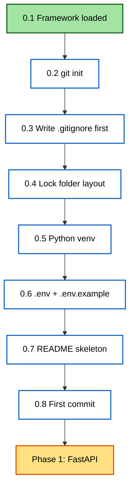

---

## Phase 1 — FastAPI 3-layer architecture

### Phase 1 step roadmap

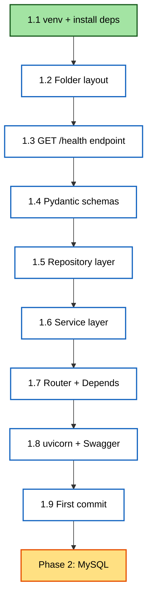

### 3-layer request flow (the heart of Phase 1)

Solid arrows = request going IN. Dotted arrows = response coming BACK.

```mermaid
graph LR
    Client[Client / Browser] -->|POST /medicines| Router
    Router[Router — Reception] -->|MedicineCreate| Service
    Service[Service — Pharmacist] -->|domain object| Repo
    Repo[Repository — Storeroom] -->|insert / fetch| Storage[(Storage)]

    Storage -.->|raw record| Repo
    Repo -.->|Medicine| Service
    Service -.->|MedicineOut| Router
    Router -.->|HTTP 201 JSON| Client

    classDef client fill:#f3e5f5,stroke:#4a148c,stroke-width:2px,color:#000
    classDef router fill:#bbdefb,stroke:#0d47a1,stroke-width:2px,color:#000
    classDef service fill:#c8e6c9,stroke:#1b5e20,stroke-width:2px,color:#000
    classDef repo fill:#fff9c4,stroke:#f57f17,stroke-width:2px,color:#000
    classDef storage fill:#e0e0e0,stroke:#424242,stroke-width:2px,color:#000

    class Client client
    class Router router
    class Service service
    class Repo repo
    class Storage storage
```

### Duplicate-detection flow — where does the rule live?

Shows why "Crocin 500MG " vs "Crocin 500mg" deduplication is a **Service** responsibility, not Repository.
The Service normalizes + decides; the Repository only fetches by exact criteria.

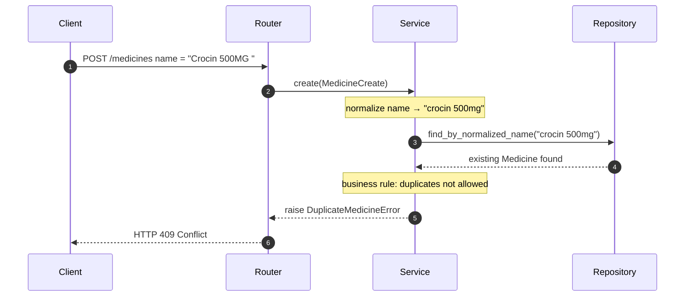

### Step 1.1 — venv + install ecosystem

How the system Python, the venv, the installed packages, requirements.txt, and .gitignore relate.

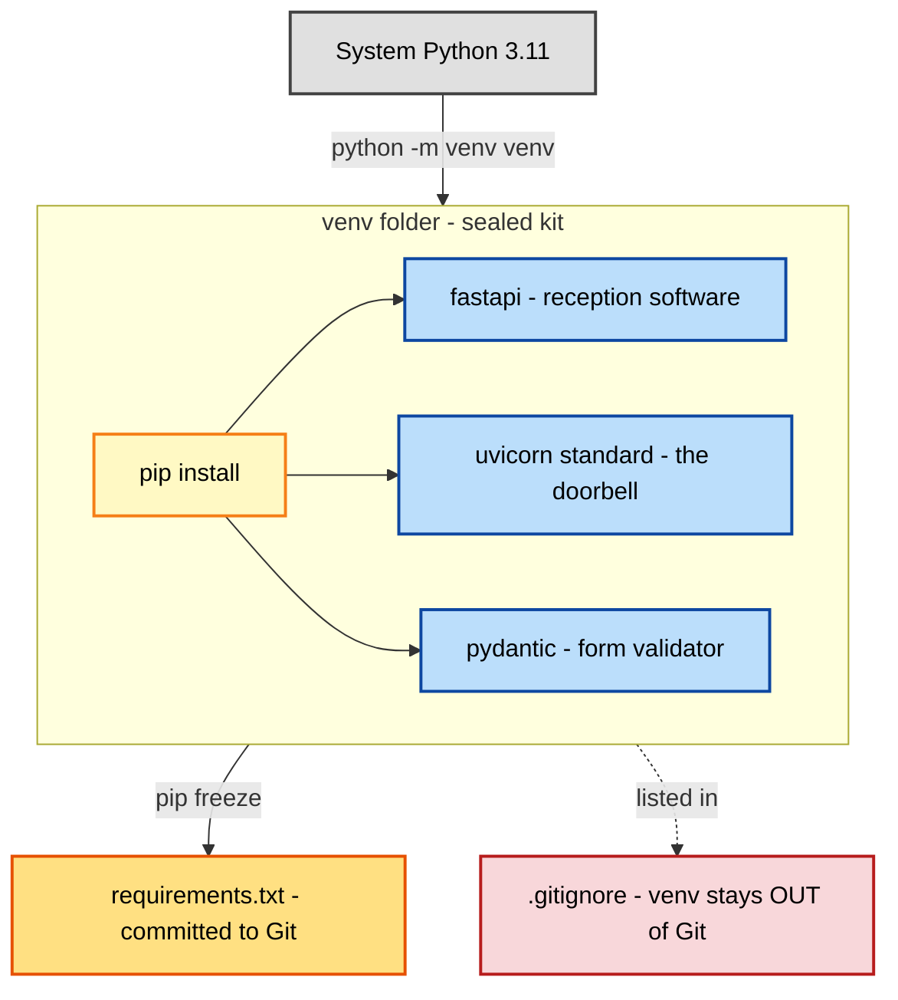

### Local repo ↔ GitHub remote

How working files flow through .gitignore → staging → local history → remote (origin).

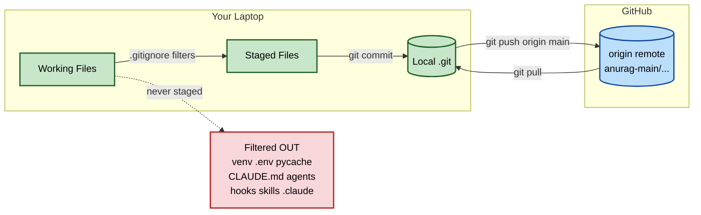

### Step 1.1 — requirements.txt reproducibility loop

Shows why we commit requirements.txt (NOT venv/) — so any teammate or future machine recreates the exact same package set with one command.

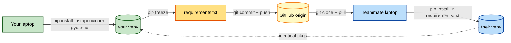

### Step 1.2 — backend folder layout (the locked floor plan)

The directory structure for `pharmacy-core-backend/`. Each folder maps to one pharmacy zone with one clear responsibility.

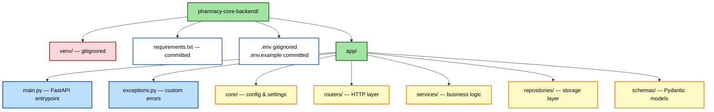

### Step 1.3 — GET /health endpoint flow

How a load balancer's /health probe travels through FastAPI's decorator into your function and back.

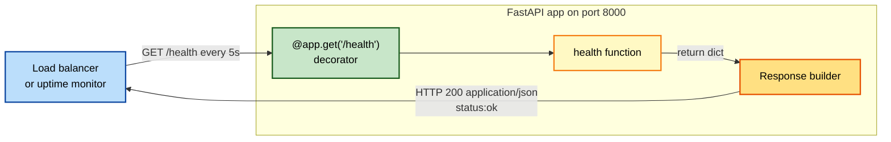

### Step 1.4 — Pydantic schema split (input vs output)

Why we never use one schema for both: input fields (MedicineCreate) ⊆ DB fields ⊆ output fields (MedicineOut), and some DB fields (cost_price, supplier_notes) never leave the repository.

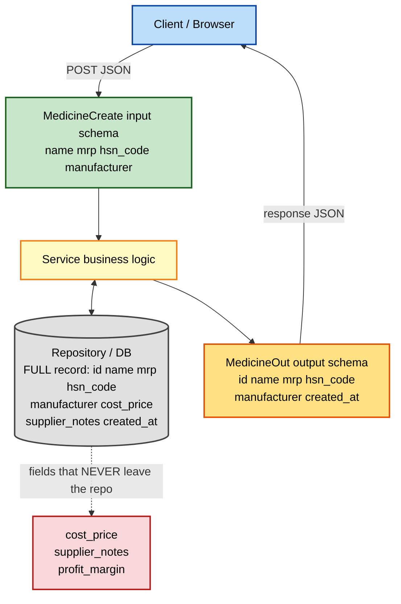

### Step 1.5 — Repository contract (service ↔ in-memory repo)

The 4 repo methods, and how the service's "normalize then ask" flow lands on `find_by_normalized_name`. The repo never decides; it only fetches/stores.

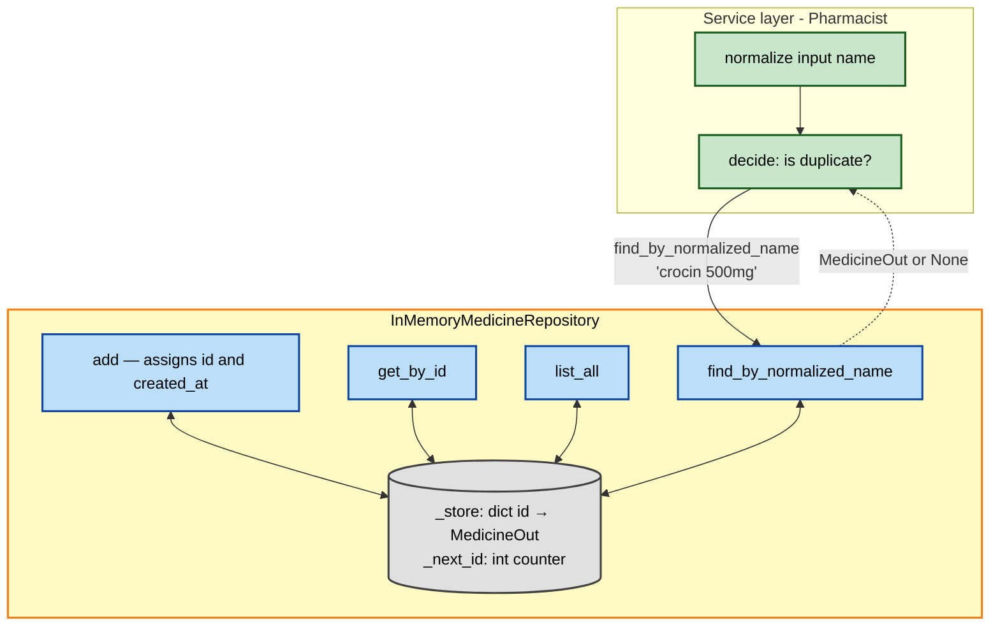

### POST /medicines — full request lifecycle

Shows what every layer DOES to the data on the way IN (Frontend → MedicineCreate → Service → Repository) and the way OUT (Repository attaches id+created_at → MedicineOut → Response → Frontend).

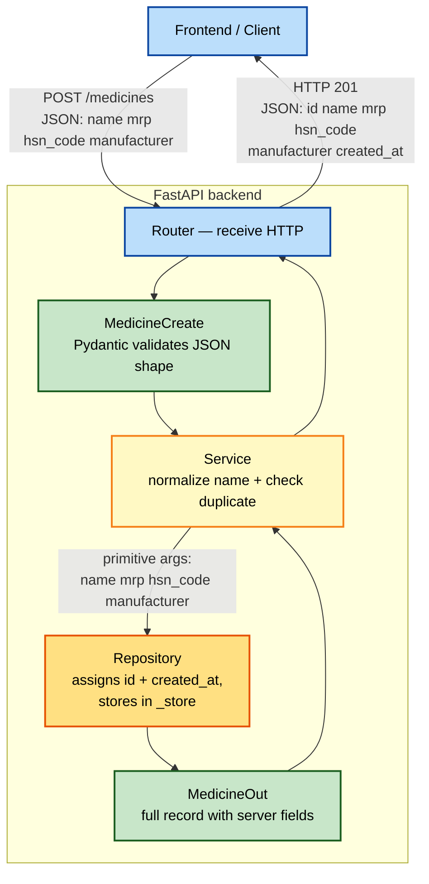

### Step 1.6 — MedicineService.create_medicine decision flow

The 3 steps the service runs on every POST, and where each one routes if it short-circuits (duplicate → 409, clean → 201).

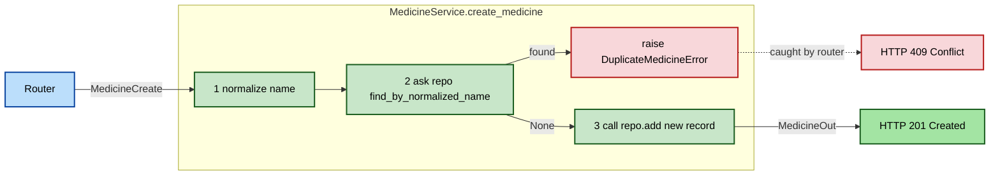

### Step 1.7 — Router with Depends() — full request lifecycle

Shows how FastAPI resolves Depends() per request, builds the service, calls the endpoint, and translates domain exceptions into HTTP status codes.

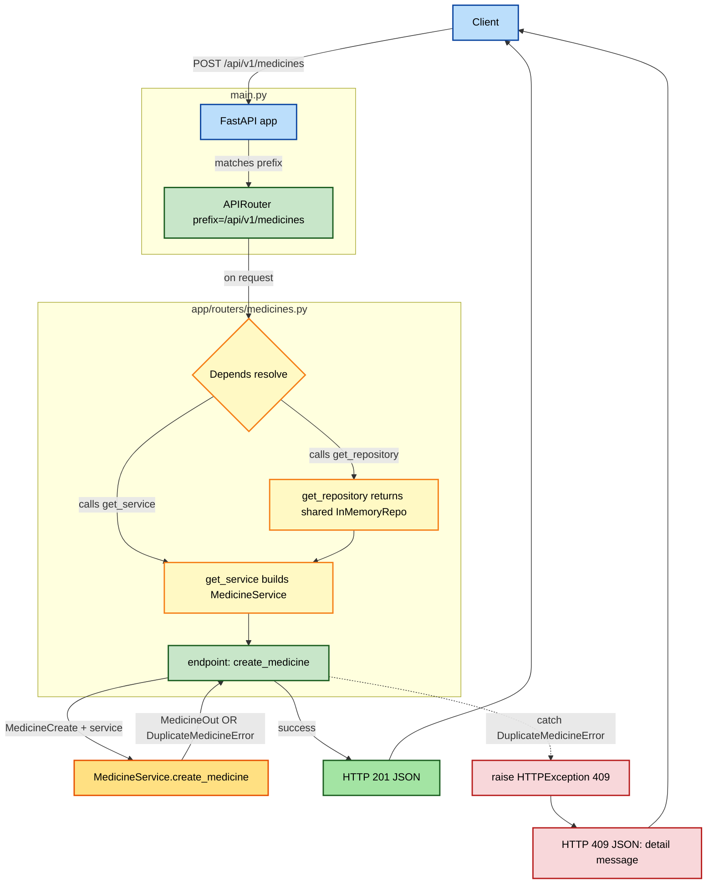

---

## Phase 2 — Persistent Storage (MySQL + SQLAlchemy + Alembic)

### Phase 2 step roadmap

The order matters: get DB connectivity working before models, models before migrations, migrations before sessions, sessions before the new repository.

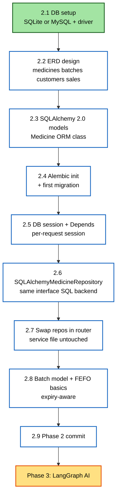

### Step 2.2 — Full pharmacy ERD

Six entities, designed up front so we never refactor primary keys / foreign keys later.
Phase 2 implements only MEDICINES + BATCHES (steps 2.3–2.8); CUSTOMERS / SALES / SALE_ITEMS / USERS land in Phase 3.

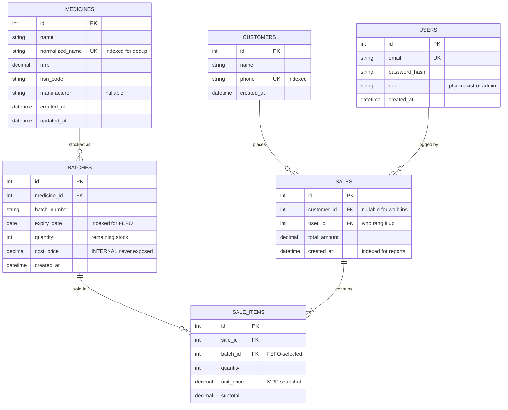

### Step 2.3 — Where each Medicine "shape" lives (HTTP / Domain / DB / Foundation)

The 3-way class separation senior backends always have. Conflating any two re-introduces the Phase-1 mistakes we already cured.

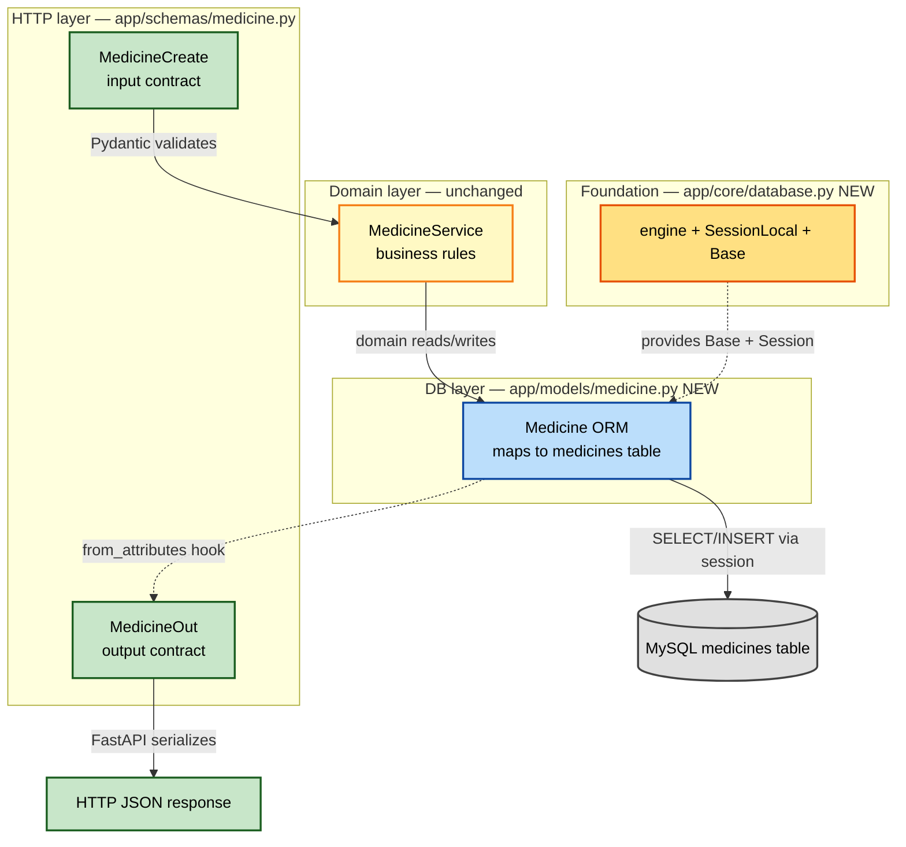

### Step 2.5 — Per-request DB session lifecycle (yield-based Depends)

One Session per HTTP request: opened on entry, closed on exit even if the endpoint raised. Connections borrowed from the engine pool, returned on close.

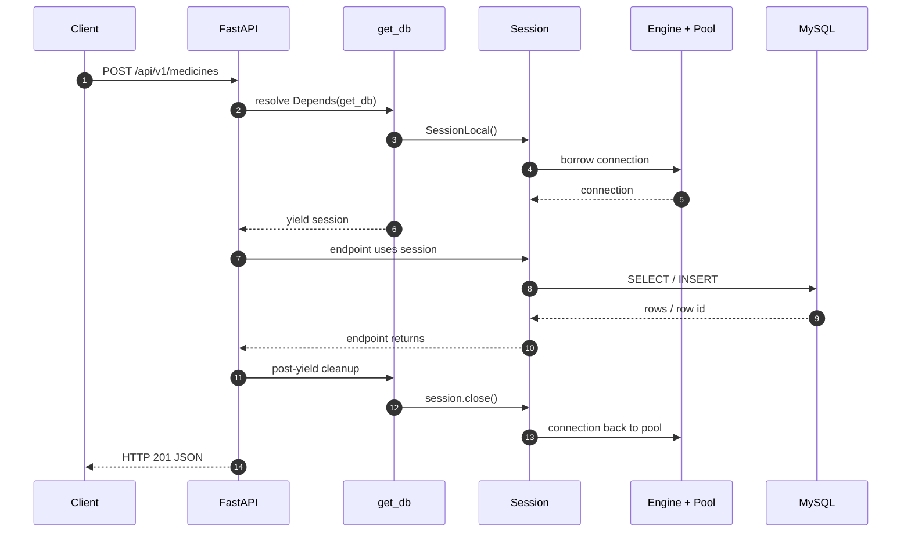

### Step 2.8 — Medicine 1:N Batches + FEFO selection

One medicine → many batches. FEFO query picks the batch with the soonest non-expired expiry that still has stock.

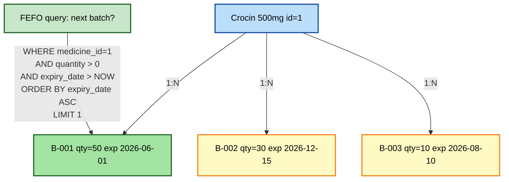

---

## Phase 3 / Step 3.1 — NVIDIA + Mistral-Nemotron smoke test (verified path)

The exact path traced during the verification call. Every future node call follows this same path — only the prompt content differs.

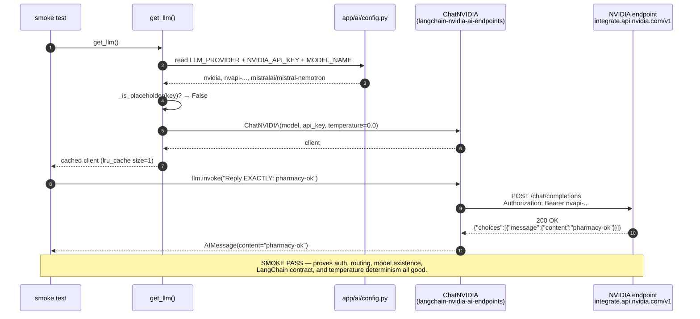

```mermaid
graph LR
    subgraph user[Your code — provider-agnostic]
        N1[extract_intent node]
        N2[resolve_medicine node]
        N3[select_batch node]
        N4[compute_pricing node]
    end

    subgraph factory[app/ai/llm.py — the only place that knows providers]
        GL{{"get_llm()<br/>cached"}}
        BN["_build_nvidia_client()"]
        BO["_build_openai_client()"]
    end

    subgraph providers[Hosted LLM providers]
        CN[ChatNVIDIA<br/>mistral-nemotron]
        CO[ChatOpenAI<br/>gpt-4o-mini]
    end

    N1 --> GL
    N2 --> GL
    N3 --> GL
    N4 --> GL
    GL -->|LLM_PROVIDER=nvidia| BN
    GL -->|LLM_PROVIDER=openai| BO
    BN --> CN
    BO --> CO

    classDef code fill:#fff5d6,stroke:#a86b00,stroke-width:2px,color:#000
    classDef router fill:#e3f0ff,stroke:#003a8c,stroke-width:2px,color:#000
    classDef provider fill:#e5fbe5,stroke:#1f7a1f,stroke-width:2px,color:#000

    class N1,N2,N3,N4 code
    class GL,BN,BO router
    class CN,CO provider
```

---

## Phase 3 / Step 3.2 — `ExtractedIntent` schema (the notebook with boxes)

### The candy-shop analogy → the schema shape

```mermaid
graph TB
    subgraph notebook[Notebook page = one MedicineItem]
        N1["Box 1<br/>Name<br/>'Crocin 500mg'"]
        N2["Box 2<br/>Quantity<br/>2"]
        N3["Box 3<br/>Unit<br/>'strip'"]
    end

    subgraph top[Top of stack of pages = ExtractedIntent]
        T1["Customer name<br/>'Anurag'"]
        T2["Customer phone<br/>'9876543210'"]
        T3["Items list<br/>= many MedicineItem pages"]
    end

    T3 -.contains many.-> notebook

    classDef box fill:#fff5d6,stroke:#a86b00,stroke-width:2px,color:#000
    classDef top fill:#e3f0ff,stroke:#003a8c,stroke-width:2px,color:#000
    class N1,N2,N3 box
    class T1,T2,T3 top
```

### What happens at runtime

```mermaid
sequenceDiagram
    autonumber
    participant U as Pharmacist input
    participant L as Maverick (LLM)
    participant P as Pydantic (the mom)
    participant S as ExtractedIntent

    U->>L: "2 strips Crocin 500mg for Anurag 9876543210"
    Note over L: LLM tries to fill the notebook<br/>(produces JSON)
    L->>P: JSON output
    Note over P: Mom checks every box<br/>- types correct?<br/>- nothing missing?<br/>- no extra boxes?
    alt Mom approves
        P-->>S: Valid ExtractedIntent instance
        S-->>U: Ready to use downstream
    else Mom rejects
        P-->>L: ValidationError → retry
    end
```

---

## Phase 3 / Step 3.2 — File 2 — System prompt = Rohit's instruction card

### How the prompt sits next to the schema

```mermaid
graph LR
    subgraph card[Rohit's instruction card<br/>= billing_prompts.py]
        R[Role: 'You are a strict order-taker']
        T[Task: 'Parse the sentence']
        RU[Rules: 'don't invent, lowercase, etc.']
        E[Examples: input → output]
    end

    subgraph notebook[The notebook<br/>= extracted_intent.py]
        SCH[Pydantic schema<br/>ExtractedIntent]
    end

    subgraph helper[Rohit at work<br/>= extract_intent node]
        L[LLM Maverick]
    end

    card -- glued to --> L
    notebook -- glued to --> L
    KID["Kid says:<br/>'2 strips Crocin for Anurag'"] --> L
    L --> OUT["Filled notebook<br/>= ExtractedIntent instance"]

    classDef card fill:#ffe5e5,stroke:#a83333,stroke-width:2px,color:#000
    classDef book fill:#fff5d6,stroke:#a86b00,stroke-width:2px,color:#000
    classDef helper fill:#e3f0ff,stroke:#003a8c,stroke-width:2px,color:#000
    classDef io fill:#e5fbe5,stroke:#1f7a1f,stroke-width:2px,color:#000

    class R,T,RU,E,card card
    class SCH,notebook book
    class L,helper helper
    class KID,OUT io
```

### The 5-section prompt structure (industry standard)

```mermaid
graph TB
    P["System prompt<br/>EXTRACT_INTENT_SYSTEM_PROMPT_V1"]
    P --> S1["1. ROLE<br/>'You are a strict pharmacy order-taker'"]
    P --> S2["2. TASK<br/>'Parse the sentence into ExtractedIntent fields'"]
    P --> S3["3. RULES<br/>'never invent, lowercase, leave optional fields null'"]
    P --> S4["4. OUTPUT FORMAT<br/>'Return JSON matching the schema, nothing else'"]
    P --> S5["5. EXAMPLES<br/>Few-shot: 1-3 input → output pairs"]

    classDef prompt fill:#ffe5e5,stroke:#a83333,stroke-width:2px,color:#000
    classDef section fill:#fff5d6,stroke:#a86b00,stroke-width:2px,color:#000
    class P prompt
    class S1,S2,S3,S4,S5 section
```

---

## Phase 3 / Step 3.2 — File 3 — `extract_intent` node (Rohit's work routine)

### Inside one call to the node

```mermaid
flowchart TD
    A["state in:<br/>pharmacist_input = '2 strips Crocin...'"] --> B{Empty<br/>input?}
    B -- yes --> Z["return:<br/>state.errors += ['empty input']"]
    B -- no --> C["llm = get_llm()<br/>= cached ChatNVIDIA Maverick"]
    C --> D["structured_llm =<br/>llm.with_structured_output(ExtractedIntent)"]
    D --> E["messages = [<br/>  SystemMessage(prompt),<br/>  HumanMessage(input)<br/>]"]
    E --> F["result = structured_llm.invoke(messages)"]
    F --> G["NVIDIA API call<br/>integrate.api.nvidia.com/v1<br/>(real LLM round trip)"]
    G --> H["Pydantic validates JSON<br/>→ ExtractedIntent instance"]
    H --> I["return:<br/>state.extracted_intent =<br/>result.model_dump()"]

    classDef start fill:#e3f0ff,stroke:#003a8c,stroke-width:2px,color:#000
    classDef step fill:#fff5d6,stroke:#a86b00,stroke-width:2px,color:#000
    classDef net fill:#ffe5e5,stroke:#a83333,stroke-width:2px,color:#000
    classDef out fill:#e5fbe5,stroke:#1f7a1f,stroke-width:2px,color:#000

    class A start
    class B,C,D,E,F,H step
    class G net
    class Z,I out
```

### How the 4 files for Step 3.2 fit together

```mermaid
graph TB
    subgraph state[Phase 3 / app/ai/state/]
        S["BillingState<br/>TypedDict"]
    end
    subgraph schemas[Phase 3 / app/ai/schemas/]
        SCH["ExtractedIntent<br/>+ MedicineItem"]
    end
    subgraph prompts[Phase 3 / app/ai/prompts/]
        PR["EXTRACT_INTENT_SYSTEM_PROMPT_V1"]
    end
    subgraph llm[Phase 3 / app/ai/]
        LL["get_llm()<br/>ChatNVIDIA Maverick"]
    end
    subgraph node[Phase 3 / app/ai/nodes/]
        N["extract_intent(state)"]
    end

    S -. read .-> N
    SCH -. wraps LLM .-> N
    PR -. SystemMessage .-> N
    LL -. invoked by .-> N
    N -. writes .-> S

    classDef def fill:#fff5d6,stroke:#a86b00,stroke-width:2px,color:#000
    classDef node fill:#e3f0ff,stroke:#003a8c,stroke-width:2px,color:#000
    class S,SCH,PR,LL def
    class N node
```

---
