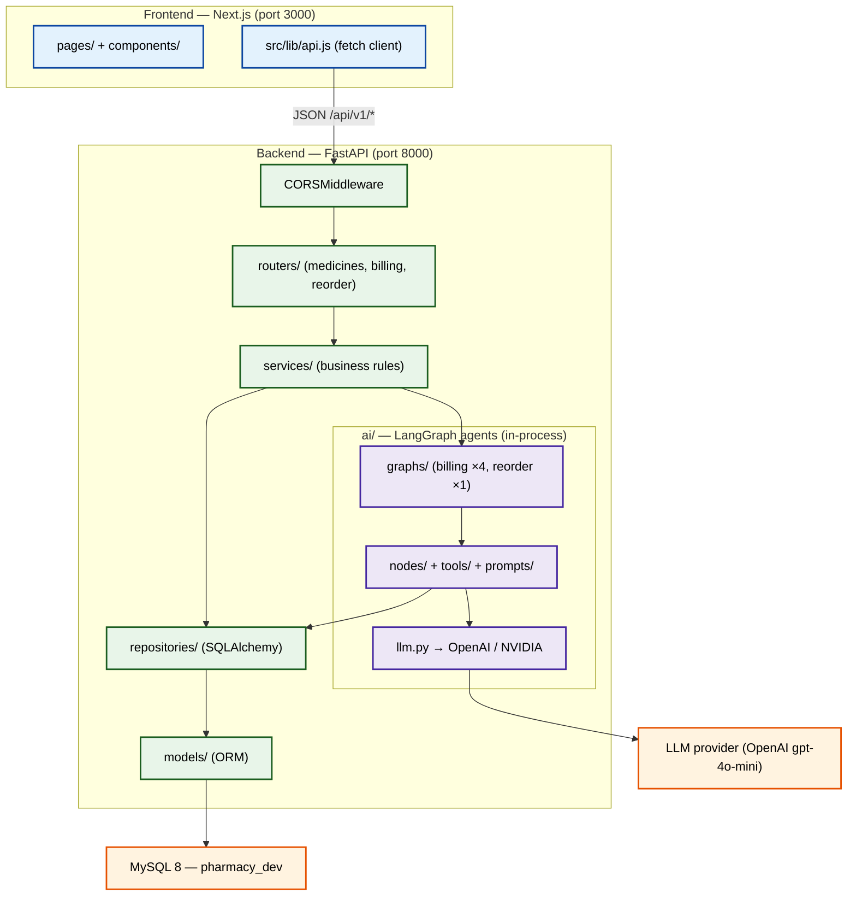
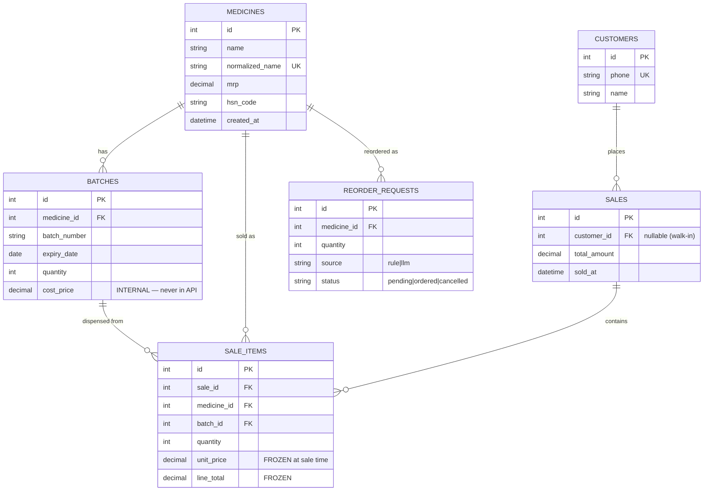

# 00 — Whole Project Architecture

> The complete map of the AI Pharmacy Ecosystem: what it is, how the pieces fit, every
> significant file and what it does, the data model, and the end-to-end request flows.
> Grounded only in the current codebase. Read this first; the numbered topic docs
> (`01_…`, `02_…`, `03_…`) drill into individual features.

---

## Purpose

A production-shaped pharmacy system with an **AI back-office**. A pharmacist types or speaks a
free-text order; the system parses it, matches medicines (voice-tolerant), picks batches by
**FEFO**, prices server-side, and writes an auditable sale. A second AI agent inspects stock vs.
demand and **proposes reorders**. The whole thing is split into a **FastAPI backend** and a
**Next.js frontend**, with **MySQL** as the source of truth and **LangGraph** orchestrating the
AI workflows.

Two AI agents ship today:
- **Billing Agent** — free text → structured order → FEFO batch → priced, atomic sale. (`02_billing_agent.md`)
- **Smart Reorder Agent** — stock + velocity → reorder proposals, LLM-judged for 0-sales items, with memory. (`03_reorder_agent.md`)

---

## Architecture

Three tiers: browser (Next.js) → HTTP API (FastAPI) → data (MySQL). The AI layer (LangGraph +
LLM) lives **inside** the FastAPI process, invoked by services.



**The layered contract inside the backend** (every domain follows it):

```text
Router  → HTTP only (parse, call service, map errors → status codes)
Service → business rules / orchestration (runs graphs, shapes responses)
  ├─ AI graphs → LangGraph state machines (billing, reorder)
  └─ Repository → the ONLY layer that touches SQLAlchemy / MySQL
Models  → ORM row ↔ Python object
Schemas → Pydantic validation at the HTTP edge (in/out contract)
```

Two deliberate design rules span the whole system:
1. **`crisp → code, fuzzy → LLM`** — deterministic math/SQL in code; the LLM only for the
   irreducibly fuzzy calls (parsing free text, matching misheard names, judging 0-sales items).
2. **Never trust the client for money or stock** — prices come from the DB, stock decrements are
   atomic and re-checked inside the transaction.

---

## Tech Stack

| Layer | Technology | Notes |
|-------|-----------|-------|
| Frontend | Next.js 16 (Pages Router, **JS only**), React 19, Tailwind v4, Radix, CVA, framer-motion | `pharmacy-frontend/` |
| Backend | FastAPI, Python 3.13, Uvicorn | `pharmacy-core-backend/` |
| ORM / migrations | SQLAlchemy 2.0 (`Mapped`/`mapped_column`) + Alembic | `models/`, `migrations/` |
| Database | MySQL 8 (PyMySQL driver) | `pharmacy_dev` |
| AI workflow | LangGraph 1.x (`StateGraph`, reducers) | `ai/graphs/`, `ai/nodes/` |
| LLM | OpenAI `gpt-4o-mini` (active) or NVIDIA (alternate), via `langchain-openai` / `langchain-nvidia-ai-endpoints` | switch by `LLM_PROVIDER` |
| Fuzzy match | rapidfuzz | `ai/matching.py` |
| Validation | Pydantic v2 | `schemas/` + `ai/schemas/` |

Not yet wired (roadmap): Docker, JWT auth, Redis, CI/CD, deployment, RAG/ChromaDB, Whisper voice.

---

## Folder Structure (COMPLETE — every file and path)

> Exhaustive. Excludes only generated/vendored dirs: `.git/`, `node_modules/`, `venv/`,
> `__pycache__/`, `.next/`. `__init__.py` files are Python package markers (make a directory
> importable) — listed for completeness.

### Repository root — `c:\ai-pharmacy-ecosystem\`

```text
c:\ai-pharmacy-ecosystem/
├── CLAUDE.md                       # project "brain" — rules, stack, agent routing (read each session)
├── AGENTIC_RESEARCH.md             # multi-agent roadmap + market research (next: Expiry-Risk agent)
├── AI_Pharmacy_Ecosystem.md        # original project vision doc
├── BACKEND_ARCHITECTURE.md         # earlier beginner-oriented backend guide (superseded by docs/00)
├── Request-Lifecycle-Architecture.md  # OUTDATED — describes the Phase-1 in-memory repo
├── phase3_step3.6_explainer.md     # phase-3 step notes (ORM models / migration)
├── gpt-explanation.md              # notes on the LLM/GPT integration
├── notes.md                        # append-only learning notes (analogies, mistakes)
├── diagrams.md                     # append-only Mermaid diagram log
├── help.txt                        # misc scratch notes
├── .gitignore
│
├── docs/                           # ← senior documentation series (this set)
│   ├── 00_project_architecture.md  # THIS FILE — whole-system overview
│   ├── 01_middleware_working.md    # CORS middleware
│   ├── 02_billing_agent.md         # billing LangGraph (5 nodes / 4 graphs)
│   └── 03_reorder_agent.md         # reorder LangGraph (3 nodes)
│
├── agents/                         # Claude Code custom-agent role definitions
│   ├── architect_agent.md
│   ├── debug_agent.md
│   ├── interview_agent.md
│   ├── reviewer_agent.md
│   └── teacher_agent.md
│
├── hooks/                          # Claude Code response-hook definitions
│   ├── pre_code_hook.md
│   ├── post_code_hook.md
│   └── error_hook.md
│
├── skills/                         # per-topic skill reference files
│   ├── docker_skill.md
│   ├── fastapi_skill.md
│   ├── langgraph_skill.md
│   ├── mysql_skill.md
│   ├── rag_skill.md
│   └── voice_skill.md
│
├── .claude/
│   └── commands/                   # slash-command definitions
│       ├── debug.md
│       ├── diagram.md
│       ├── implement.md
│       ├── quiz.md
│       ├── review.md
│       └── teach.md
│
├── pharmacy-core-backend/          # ← FastAPI backend  (tree below)
└── pharmacy-frontend/              # ← Next.js frontend  (tree below)
```

### Backend — `pharmacy-core-backend/`

```text
pharmacy-core-backend/
├── .env                            # DATABASE_URL, LLM_PROVIDER, API keys (gitignored)
├── .env.example                    # template for .env (committed)
├── alembic.ini                     # Alembic config (migration tooling)
├── requirements.txt                # pinned Python dependencies
│
├── app/
│   ├── __init__.py                 # marks `app` as a package
│   ├── main.py                     # FastAPI app; CORS; includes 3 routers; /health
│   ├── exceptions.py               # PharmacyError → DuplicateMedicineError (router maps → 409)
│   │
│   ├── core/
│   │   ├── __init__.py
│   │   └── database.py             # engine + SessionLocal + Base + get_db(); loads .env; pool_pre_ping
│   │
│   ├── routers/                    # LAYER 1 — HTTP
│   │   ├── __init__.py
│   │   ├── medicines.py            # POST/GET medicines; DI chain get_db→repo→service
│   │   ├── billing.py              # POST /sale /quote /price-item /confirm
│   │   └── reorder.py              # GET /suggestions, POST /approve
│   │
│   ├── services/                   # LAYER 2 — business rules
│   │   ├── __init__.py
│   │   ├── medicine_service.py     # duplicate check via normalize_medicine_name(); pass-through reads
│   │   ├── billing_service.py      # picks 1 of 4 billing graphs per endpoint; state → BillingResponse
│   │   └── reorder_service.py      # runs reorder graph; idempotent approve()
│   │
│   ├── repositories/               # LAYER 3 — storage (only layer touching SQLAlchemy)
│   │   ├── __init__.py
│   │   ├── protocols.py            # MedicineRepository Protocol (structural typing seam)
│   │   ├── medicine_repository.py  # InMemoryMedicineRepository — Phase-1 reference impl (dict; proves the seam)
│   │   ├── sqlalchemy_medicine_repository.py         # CRUD + find_by_normalized_name (unique index)
│   │   ├── sqlalchemy_batch_repository.py            # select_fefo() — FEFO via composite index
│   │   ├── sqlalchemy_reorder_repository.py          # read-only analytics: stock + velocity (3 queries, no N+1)
│   │   └── sqlalchemy_reorder_request_repository.py  # write approvals + pending_medicine_ids() (memory)
│   │
│   ├── models/                     # SQLAlchemy ORM (one file per table)
│   │   ├── __init__.py
│   │   ├── medicine.py             # medicines — catalog; UNIQUE normalized_name; 1:N batches
│   │   ├── batch.py                # batches — expiry, quantity, internal cost_price; (medicine_id,expiry) index
│   │   ├── customer.py             # customers — UNIQUE phone (find-or-create key)
│   │   ├── sale.py                 # sales — invoice header; total_amount; sold_at index
│   │   ├── sale_item.py            # sale_items — invoice lines; FROZEN unit_price/line_total
│   │   └── reorder_request.py      # reorder_requests — approved reorders; (medicine_id,status) index
│   │
│   ├── schemas/                    # Pydantic HTTP contracts (in/out split)
│   │   ├── __init__.py
│   │   ├── medicine.py             # MedicineCreate / MedicineOut (from_attributes)
│   │   ├── batch.py                # BatchOut
│   │   ├── billing.py              # BillingRequest/Response, ConfirmLineItem (NO price field), PriceItemRequest
│   │   └── reorder.py              # ReorderProposal (extra=ignore), ApproveReorderRequest, ReorderRequestOut
│   │
│   └── ai/                         # The AI layer (LangGraph)
│       ├── __init__.py
│       ├── llm.py                  # get_llm() — provider-agnostic BaseChatModel (lru_cache)
│       ├── config.py               # LLM_PROVIDER, MODEL_NAME, keys, TEMPERATURE=0.0, timeout
│       ├── matching.py             # shortlist() — rapidfuzz WRatio, dose-stripped keys
│       ├── graphs/
│       │   ├── __init__.py
│       │   ├── billing_graph.py    # 4 compiled graphs: sale / quote / price / confirm
│       │   └── reorder_graph.py    # 1 compiled graph: fetch → decide → judge
│       ├── state/
│       │   ├── __init__.py
│       │   ├── billing_state.py    # BillingState TypedDict + errors reducer
│       │   └── reorder_state.py    # ReorderState + proposals & errors reducers
│       ├── nodes/
│       │   ├── __init__.py
│       │   ├── extract_intent.py   # LLM: free text → ExtractedIntent
│       │   ├── resolve_medicine.py # exact→fuzzy→LLM confirm; confidence gate → needs_confirm
│       │   ├── select_batch.py     # FEFO pick + stock sufficiency
│       │   ├── compute_pricing.py  # DB MRP × qty, Decimal, paise rounding
│       │   ├── persist_sale.py     # atomic 4-table tx (customer/sale/sale_items/batch--)
│       │   ├── fetch_candidates.py # reorder: stock+velocity, minus pending (memory)
│       │   ├── decide_reorders.py  # reorder: cover math; 0-sales → uncertain
│       │   └── judge_uncertain.py  # reorder: the ONE LLM call (new vs dead stock)
│       ├── schemas/
│       │   ├── __init__.py
│       │   ├── extracted_intent.py # ExtractedIntent / MedicineItem (qty capped 1..1000)
│       │   ├── match_result.py     # MatchResult / MatchDecision (chosen + confidence)
│       │   └── reorder_judgment.py # ReorderJudgment / ItemJudgment (action + suggested_qty)
│       ├── prompts/
│       │   ├── __init__.py
│       │   ├── billing_prompts.py  # EXTRACT_INTENT_… + MATCH_CONFIRM_… (versioned V1)
│       │   └── reorder_prompts.py  # JUDGE_REORDER_… (versioned V1)
│       └── tools/
│           ├── __init__.py
│           └── reorder_tools.py    # days_of_cover / suggest_reorder_qty / is_qty_sane / MAX_REORDER_QTY
│
├── migrations/                     # Alembic migration environment
│   ├── README                      # Alembic-generated readme
│   ├── env.py                      # migration runtime — points Alembic at Base.metadata + DATABASE_URL
│   ├── script.py.mako              # template for new migration files
│   └── versions/                   # ordered schema history (upgrade/downgrade)
│       ├── 513bbb4255c8_create_medicines_table.py
│       ├── bd6ef9e6c10a_create_batches_table_with_fefo_index.py
│       ├── b1fcfceb3993_create_customers_sales_sale_items_tables.py
│       └── 833f20648fab_create_reorder_requests_table.py
│
└── scripts/                        # dev tools (run as python -m scripts.<name>)
    ├── __init__.py
    ├── seed_catalog.py             # seed medicines for the frontend
    ├── seed_test_batch.py          # insert FEFO test batches
    ├── http_smoke_billing.py       # end-to-end billing smoke test
    └── http_smoke_quote_confirm.py # quote→confirm smoke test
```

### Frontend — `pharmacy-frontend/`

```text
pharmacy-frontend/
├── package.json                    # deps: next 16, react 19, tailwind v4, radix, cva, framer-motion
├── package-lock.json               # locked dependency tree
├── next.config.js                  # Next.js config
├── jsconfig.json                   # JS path aliases (@/ → src)
├── postcss.config.mjs              # PostCSS/Tailwind pipeline
├── .env.local                      # NEXT_PUBLIC_API_BASE_URL (default http://localhost:8000)
│
├── pages/                          # Next.js Pages Router (JS/JSX only)
│   ├── _app.jsx                    # app shell wrapper (global layout/providers)
│   ├── _document.jsx               # html document (fonts, lang)
│   ├── index.jsx                   # Voice/text billing screen (quote → review → confirm)
│   ├── medicines.jsx               # catalog list
│   ├── reorder.jsx                 # Reorder screen (suggestions + Approve)
│   └── sales.jsx                   # sales view
│
└── src/
    ├── globals.css                 # Tailwind v4 entry + theme
    ├── lib/
    │   ├── api.js                  # fetch client → backend; returns {ok,status,data}
    │   ├── useSpeechRecognition.js # browser STT hook (voice input)
    │   └── utils.js                # cn() classname helper
    └── components/
        ├── DashboardLayout.jsx     # page shell (sidebar + content)
        ├── sidebar.jsx             # nav sidebar
        ├── Logo.jsx                # brand mark
        ├── VoiceButton.jsx         # mic control (start/stop STT)
        ├── BillTable.jsx           # editable priced line items
        ├── ConfirmSuggestions.jsx  # needs_confirm rows + candidate dropdown
        ├── NotFoundWarnings.jsx    # renders errors[] from the API
        ├── Receipt.jsx             # printable receipt
        └── ui/                     # shadcn-style primitives (cva + Radix)
            ├── avatar.jsx
            ├── badge.jsx
            ├── button.jsx
            ├── card.jsx
            ├── icon.jsx
            ├── input.jsx
            ├── label.jsx
            ├── skeleton.jsx
            └── textarea.jsx
```

---

## Data Model (ERD)

Six tables. Header+lines for invoices; batches carry expiry for FEFO; reorder_requests is the
agent's memory.



Key modeling decisions (all in `app/models/`):
- **Money is `Numeric(10,2)`**, never float. `sale_items.unit_price`/`line_total` are **frozen**
  (stored, not recomputed) — the audit trail survives future MRP changes.
- **`normalized_name` UNIQUE** on medicines powers duplicate detection + fast lookup.
- **`(medicine_id, expiry_date)` composite index** on batches makes FEFO a single index seek.
- **FK delete rules encode audit policy**: `RESTRICT` on medicine/batch refs (can't delete with
  history), `CASCADE` sale→sale_items, `SET NULL` sale→customer.
- **`(medicine_id, status)` index** on reorder_requests powers idempotent approvals + the memory read.

---

## Request Flow (the three domains)

| Domain | Endpoint | What runs |
|--------|----------|-----------|
| Medicines | `POST /api/v1/medicines`, `GET …`, `GET …/{id}` | router → service (dup check) → SQLAlchemy repo (request-scoped session via `get_db`) |
| Billing | `POST /api/v1/billing/{sale,quote,price-item,confirm}` | router → `BillingService` → 1 of 4 LangGraph graphs (nodes own their sessions) |
| Reorder | `GET /api/v1/reorder/suggestions`, `POST …/approve` | router → `ReorderService` → reorder graph / idempotent write |

**Primary frontend flow (billing, human-in-the-loop):**

```mermaid
sequenceDiagram
    actor Pharmacist
    participant FE as Next.js (api.js)
    participant BE as FastAPI /billing
    participant G as LangGraph
    participant DB as MySQL

    Pharmacist->>FE: speak/type "2 strips Crocin for Anurag 98765..."
    FE->>BE: POST /quote {pharmacist_input}
    BE->>G: quote graph (extract→resolve→batch→price, NO persist)
    G->>DB: catalog, FEFO batch, MRP
    G-->>BE: priced rows (+ needs_confirm flags)
    BE-->>FE: 200 preview
    Pharmacist->>FE: review / fix uncertain rows / edit qty
    FE->>BE: POST /confirm {items, customer}
    BE->>G: confirm graph (re-price from DB → persist atomically)
    G->>DB: BEGIN customer→sale→sale_items→batch--; COMMIT
    G-->>BE: sale_id
    BE-->>FE: 201 {sale_id, total, items}
    Pharmacist->>FE: print receipt
```

See `02_billing_agent.md` and `03_reorder_agent.md` for node-level sequence diagrams.

---

## Cross-Cutting Concerns

- **LLM provider abstraction** — `ai/config.py` + `ai/llm.py`. `get_llm()` returns a
  `BaseChatModel` (OpenAI or NVIDIA) chosen by `LLM_PROVIDER`; `TEMPERATURE=0.0` (deterministic);
  every node calls `get_llm()`, never constructs a client directly. Swap providers = one env var.
- **DB session strategy — two patterns, on purpose.** Medicine domain: **request-scoped** session
  via `Depends(get_db)` (opened/closed by FastAPI per request). Billing/Reorder graphs: **each node
  opens its own `SessionLocal()`** because the graph runs outside the request's dependency scope.
- **Transactions / Unit-of-Work** — single-table writes commit inside the repo; the multi-table
  sale uses one `with db.begin()` in `persist_sale` (repos are bypassed there to keep one commit
  boundary).
- **Config / env** — `core/database.py` and `ai/config.py` each load `.env` with `setdefault`
  (real shell/CI/Docker env wins over `.env`). `DATABASE_URL` is validated at import.
- **CORS** — the only middleware; allow-list for `localhost:3000/3001`. See `01_middleware_working.md`.
- **Migrations** — Alembic reads `Base.metadata`; four versioned migrations build the schema.
- **Validation** — Pydantic at the HTTP edge (schemas/) and at the LLM boundary (ai/schemas/), so
  neither client JSON nor raw LLM text is ever acted on unvalidated.

---

## Running Locally

```powershell
# --- Backend (PowerShell) ---
cd c:\ai-pharmacy-ecosystem\pharmacy-core-backend
.\venv\Scripts\Activate.ps1
alembic upgrade head                    # build/upgrade schema
python -m scripts.seed_catalog          # optional: seed medicines
uvicorn app.main:app --reload           # → http://localhost:8000 (docs at /docs)

# --- Frontend (separate terminal) ---
cd c:\ai-pharmacy-ecosystem\pharmacy-frontend
npm install
npm run dev                             # → http://localhost:3000
```

Prereqs: MySQL 8 running with database `pharmacy_dev`; `.env` set (`DATABASE_URL`, `LLM_PROVIDER=openai`, `OPENAI_API_KEY`); `.env.local` with `NEXT_PUBLIC_API_BASE_URL`.

---

## Common Production Mistakes (system-wide)

1. **Float money** — every money column is `Numeric(10,2)`; pricing uses `Decimal`. Introducing
   `float` anywhere in the money path corrupts invoices.
2. **Trusting client prices** — pricing is always re-fetched from the DB; the confirm contract has
   no price field. Never accept a client-supplied price.
3. **Non-atomic sale** — the 4-table write must stay in one `with db.begin()`; splitting it (or
   reusing the per-write-commit repos) breaks atomicity and can oversell.
4. **N+1 queries** — the reorder analytics deliberately use 3 aggregate queries; per-medicine loops
   don't scale.
5. **Session lifecycle leaks** — `get_db()` yields+closes; graph nodes use `with SessionLocal()`.
   Returning a session without closing exhausts the pool.
6. **Timezone skew on expiry** — FEFO + stock filters use DB-side `func.current_date()`, not
   Python `date.today()`.
7. **Acting on unvalidated LLM output** — always via `with_structured_output(<PydanticModel>)`;
   parsing raw text is the classic agent bug.
8. **Auto-acting without human review** — both agents only *propose*; sales are confirmed by the
   pharmacist, reorders approved by the owner.

---

## Interview Questions (architecture-level)

1. **Walk me through the layers.** Router (HTTP) → Service (rules) → Repository (SQL) → Models,
   with Pydantic at the edge and LangGraph in the service layer for AI flows.
2. **Where does the AI live and why in-process?** LangGraph graphs are compiled singletons invoked
   by services; no separate AI service yet — keeps latency low and deployment simple for a single
   pharmacy.
3. **How do you keep the system provider-agnostic?** `get_llm()` returns a `BaseChatModel`; nodes
   never import a concrete client; provider is one env var.
4. **Why two DB-session strategies?** Request-scoped `Depends(get_db)` for plain endpoints; node-owned
   sessions for graph runs that execute outside the request dependency scope.
5. **How is the schema versioned?** Alembic migrations over `Base.metadata`; four ordered revisions.
6. **What makes a sale auditable?** Frozen `unit_price`/`line_total`, `RESTRICT` FKs on medicine/batch,
   header+lines model, server-side pricing.
7. **How does FEFO stay fast?** Composite `(medicine_id, expiry_date)` index → single seek in
   `select_fefo`.
8. **How do the frontend and backend stay decoupled?** `src/lib/api.js` is the only integration point;
   CORS allow-lists the frontend origins; contracts are Pydantic-validated JSON.

---

## Summary

- **Two-app system**: Next.js frontend (`pharmacy-frontend/`) ↔ FastAPI backend
  (`pharmacy-core-backend/`) ↔ MySQL, with **LangGraph AI agents running in-process** in the
  backend.
- The backend enforces a strict **Router → Service → Repository** layering, with **Pydantic** at
  the HTTP edge and **SQLAlchemy ORM** over six tables (medicines, batches, customers, sales,
  sale_items, reorder_requests).
- **Two AI agents**: the **Billing Agent** (5 nodes wired into 4 graphs) and the **Smart Reorder
  Agent** (3 nodes), both following `crisp → code, fuzzy → LLM` and both **human-in-the-loop**.
- System-wide invariants — **Decimal money, server-side pricing, atomic multi-table sale, FEFO,
  frozen invoice prices, provider-agnostic LLM, validated LLM output, agent memory** — are the
  through-lines that make this a production-shaped project rather than a demo.
- Not yet built (roadmap): auth, Docker, Redis, CI/CD, deployment, RAG, and the voice STT pipeline.
