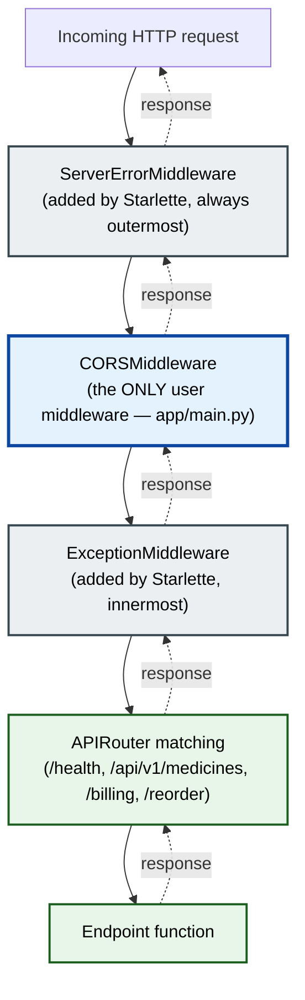
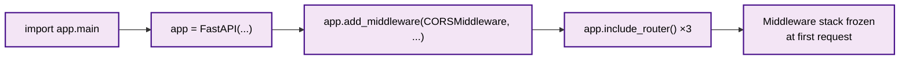
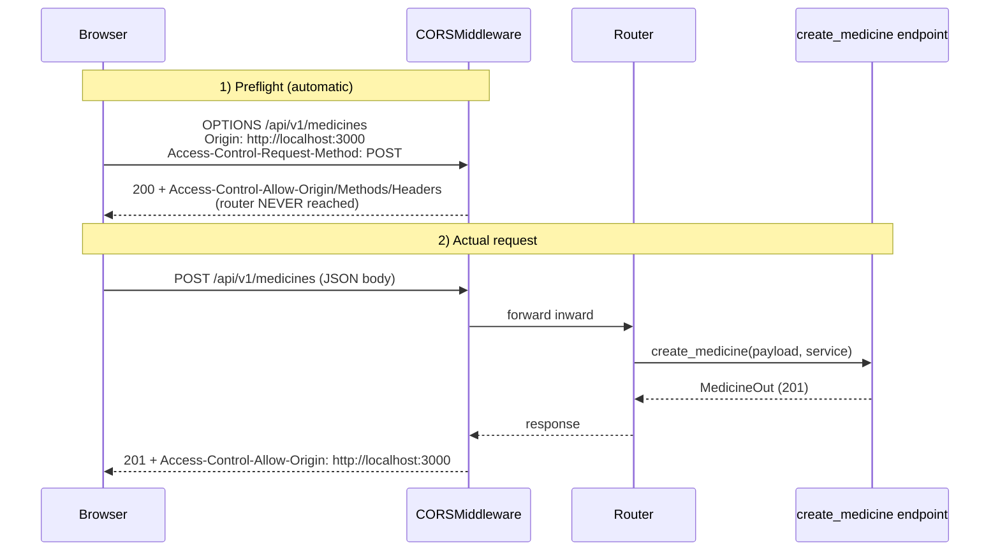

# 01 — Middleware Working

> Scope: how HTTP middleware actually works in the `pharmacy-core-backend` FastAPI app,
> as implemented today. Grounded only in the current codebase.
>
> **Ground truth:** the app registers exactly **one** middleware — `CORSMiddleware`.
> There are **no** custom `@app.middleware("http")` handlers in the project. This document
> describes that reality and where future middleware would slot in.

---

## Purpose

The backend (`http://localhost:8000`) and the Next.js frontend (`http://localhost:3000`)
run on **different origins**. Browsers block cross-origin XHR/fetch unless the server
explicitly opts in via CORS response headers. The single middleware in this project exists
to make the browser allow the frontend to call the API.

Middleware is the layer that runs **on every request, before the router**, and **on every
response, after the endpoint**. In this project that cross-cutting layer currently does one
job: apply CORS policy.

---

## Architecture

FastAPI is built on Starlette. Middleware is ASGI-level: each middleware **wraps** the app
below it, forming an onion. A request travels inward through every layer to reach the
endpoint; the response travels back outward through the same layers in reverse.

The effective stack for this app (outermost → innermost):



Key facts specific to this codebase:
- `ServerErrorMiddleware` and `ExceptionMiddleware` are added automatically by Starlette —
  they are not in this project's source, but they bracket the user middleware at runtime.
- `CORSMiddleware` is the only layer the project explicitly adds, so it is the outermost
  **user** layer. It runs before route matching and can short-circuit the request entirely
  (for CORS preflight).
- Because there is only one user middleware, ordering questions ("last added runs first")
  do not yet bite this project — but the rule still governs any middleware added later.

---

## Request Flow

Registration happens once, at import time, in `app/main.py`:

```python
from fastapi.middleware.cors import CORSMiddleware

_ALLOWED_ORIGINS = [
    "http://localhost:3000",
    "http://127.0.0.1:3000",
    "http://localhost:3001",   # Next falls back here if 3000 is taken
    "http://127.0.0.1:3001",
]

app.add_middleware(
    CORSMiddleware,
    allow_origins=_ALLOWED_ORIGINS,
    allow_credentials=True,
    allow_methods=["*"],   # GET, POST, etc.
    allow_headers=["*"],   # Content-Type, Authorization, ...
)
```

Two distinct runtime paths through the CORS layer:

1. **Preflight (`OPTIONS`) request** — the browser sends this automatically before a
   "non-simple" cross-origin call (e.g. a `POST` with `Content-Type: application/json`).
   `CORSMiddleware` **answers it directly and returns** — the request never reaches the
   router or any endpoint. If the `Origin` is in `_ALLOWED_ORIGINS`, it responds with the
   `Access-Control-Allow-*` headers; otherwise the browser blocks the follow-up call.

2. **Actual request (`GET`/`POST`/...)** — passes through `CORSMiddleware` inward to the
   router and endpoint. On the way out, `CORSMiddleware` **adds** `Access-Control-Allow-Origin`
   (and, because `allow_credentials=True`, echoes the specific origin rather than `*`) to the
   response headers so the browser hands the body to the frontend JS.

---

## Folder Structure

```text
pharmacy-core-backend/
└── app/
    └── main.py          # THE ONLY middleware registration lives here
```

Middleware in this project is centralized in one file by design. There is no
`app/middleware/` package because there is exactly one middleware and it is framework-provided.

---

## File Responsibilities

| File | Responsibility re: middleware |
|------|-------------------------------|
| `app/main.py` | Builds the `FastAPI()` app, registers `CORSMiddleware` via `app.add_middleware(...)`, defines `_ALLOWED_ORIGINS`, then includes the routers. This is the single source of truth for the middleware stack. |
| (Starlette internals) | Supply `ServerErrorMiddleware` (outermost) and `ExceptionMiddleware` (innermost) automatically. Not in project source, but part of the runtime stack. |

Everything else (routers, services, repositories) sits **inside** the middleware onion and
is unaffected by CORS logic.

---

## Important Classes

| Class | Source | Role in this project |
|-------|--------|----------------------|
| `CORSMiddleware` | `fastapi.middleware.cors` (re-exported from Starlette) | The one registered middleware. Enforces the allow-list, answers preflight, injects CORS headers on responses. |
| `FastAPI` (`app`) | `fastapi` | Holds the middleware stack; `add_middleware` mutates its builder before the first request. |

No project-defined middleware classes exist.

---

## Important Functions

| Function / call | Where | What it does here |
|-----------------|-------|-------------------|
| `app.add_middleware(CORSMiddleware, ...)` | `app/main.py` | Registers CORS with the allow-list, credentials, methods, headers. Runs once at import. |
| `app.include_router(...)` (×3) | `app/main.py` | Registers routers **after** middleware — they run inside the onion. |
| `health_check()` → `{"status": "ok"}` | `app/main.py` | A route that still passes through the CORS layer like any other. |

Note: `get_db()` in `app/core/database.py` is a **dependency**, not middleware. It runs
per request inside the endpoint resolution, not in the ASGI middleware stack. Do not conflate
the two — see Interview Questions.

---

## Dependency Flow



Ordering rule (matters the moment a 2nd middleware is added): Starlette builds the stack so
the **last** middleware added is the **outermost** user layer. Since this app adds only CORS,
CORS is currently the sole/outermost user layer.

---

## Sequence Diagram

Cross-origin `POST /api/v1/medicines` from the frontend, which triggers a preflight first:



For same-origin or non-browser callers (e.g. `curl`, the smoke-test scripts in `scripts/`),
no `Origin` header is sent, no preflight occurs, and CORS effectively passes the request
through untouched.

---

## Data Flow

What the CORS layer reads and writes, per request:

- **Reads (request):** `Origin`, and for preflight `Access-Control-Request-Method` /
  `Access-Control-Request-Headers`.
- **Decides:** is `Origin` in `_ALLOWED_ORIGINS`? Is the method/header allowed
  (`["*"]` here → all)?
- **Writes (response):**
  - `Access-Control-Allow-Origin` — the exact origin (not `*`, because `allow_credentials=True`).
  - `Access-Control-Allow-Credentials: true`.
  - On preflight: `Access-Control-Allow-Methods`, `Access-Control-Allow-Headers`.
- **Does NOT touch:** the request/response **body**, auth, DB sessions, or business data.
  CORS is header-and-status only.

---

## Common Bugs

Project-relevant failure modes:

1. **`allow_origins=["*"]` combined with `allow_credentials=True`** — invalid per spec;
   browsers reject it. This project correctly uses an explicit allow-list *because* it sets
   `allow_credentials=True`. Do not "simplify" it back to `"*"`.
2. **Frontend served from an unlisted origin** — e.g. the machine's LAN IP, a deployed
   domain, or Next falling back to a port other than 3000/3001. The request is blocked in the
   browser with a CORS error even though the API is healthy. Fix = add the origin to
   `_ALLOWED_ORIGINS`, not disable CORS.
3. **"CORS error" that is really a 500** — if the endpoint throws before the response is
   built, the CORS headers may be missing and the browser reports it as a CORS failure,
   masking the real server error. Check the server logs / the `Network` tab status code,
   not just the console message.
4. **Assuming CORS protects the API** — it does not. CORS is a *browser* policy; `curl`,
   scripts, and servers ignore it entirely. Authorization is a separate concern (Phase 5 JWT),
   not something this middleware provides.
5. **Registering middleware after the app starts serving** — `add_middleware` must run at
   import time in `main.py`; the stack is frozen once requests begin.

---

## Interview Questions

Questions this implementation lets you answer from real experience:

1. **What is middleware and where does it run relative to the router?**
   → It wraps the ASGI app; runs on every request before route matching and on every response
   after the endpoint. In this app, `CORSMiddleware` is the sole user layer.
2. **Middleware vs. dependency (`Depends`) — what's the difference?**
   → Middleware is global ASGI-level and runs for *every* request including unmatched routes;
   dependencies like `get_db()` run *per endpoint* during handler resolution. This project uses
   middleware for CORS and dependencies for the DB session — deliberately, not interchangeably.
3. **Why an explicit origin allow-list instead of `"*"`?**
   → `allow_credentials=True` forbids the `*` wildcard; the browser requires a specific echoed
   origin. Hence `_ALLOWED_ORIGINS`.
4. **What is a CORS preflight and when does it fire?**
   → An automatic `OPTIONS` before non-simple cross-origin requests (e.g. JSON `POST`).
   `CORSMiddleware` answers it directly without hitting the router.
5. **If you added logging + auth middleware, what order would you register them?**
   → Last added = outermost. You'd order so that, e.g., error-handling is outermost and
   request-logging wraps the rest, mindful that CORS must still tag error responses.
6. **Does CORS secure the backend?**
   → No — it's browser-enforced only. Non-browser clients bypass it. Security is JWT/auth,
   a separate layer.

---

## Summary

- The `pharmacy-core-backend` app runs **one** middleware: `CORSMiddleware`, registered in
  `app/main.py`, to let the Next.js frontend on `localhost:3000/3001` call the API on `:8000`.
- It sits as the outermost **user** layer, between Starlette's auto `ServerErrorMiddleware`
  (outer) and `ExceptionMiddleware` (inner); all routers/endpoints run inside it.
- It handles CORS **preflight** (short-circuits `OPTIONS`) and **injects CORS headers** on
  real responses; it touches headers/status only, never the body or business logic.
- The explicit allow-list is required because `allow_credentials=True` rules out `"*"`.
- CORS is a browser policy, **not** a security boundary — auth remains a separate future layer.
- No custom middleware exists yet; when one is added, the "last registered is outermost" rule
  in `main.py` governs its position.
