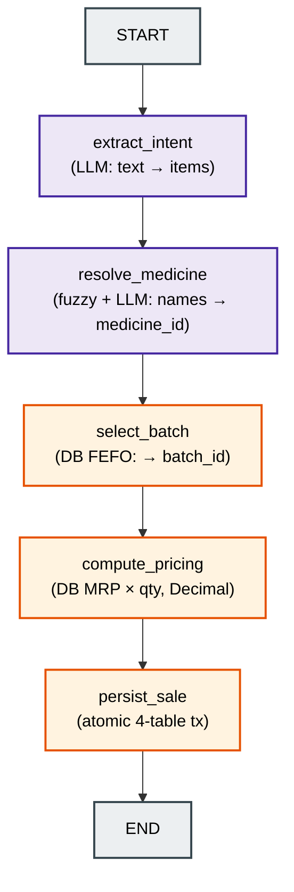
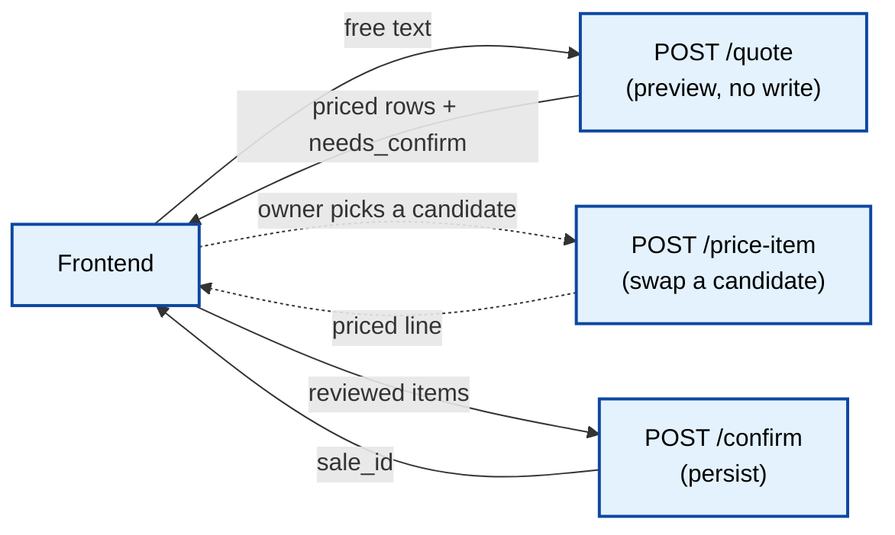
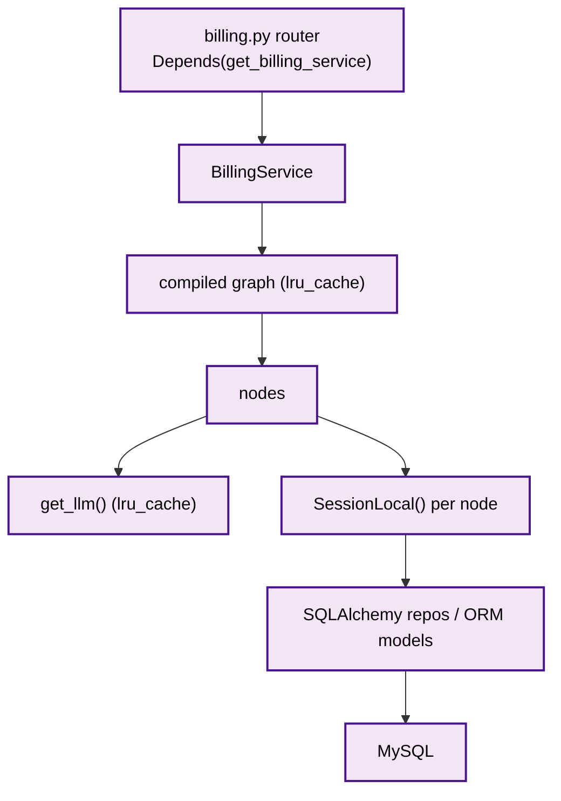

# 02 — Billing Agent

> Scope: the LangGraph-based billing pipeline that turns one free-text pharmacist
> order ("2 strips Crocin for Anurag 9876543210") into a persisted, stock-decrementing
> invoice. Grounded only in the current codebase.
>
> Key fact: there is **one set of 5 node functions** wired into **four different
> compiled graphs** (`sale`, `quote`, `price`, `confirm`). Same nodes, different wiring —
> that reuse is the central design decision of this feature.

---

## Purpose

Convert a single unstructured sentence (typed or voice-transcribed) into a correct sale:

- Parse the sentence into structured items + customer (LLM).
- Match possibly-misheard names to real catalog medicines (fuzzy + LLM, confidence-gated).
- Pick the correct batch per item using **FEFO** (First-Expiry-First-Out).
- Price every line **server-side** from the DB MRP (never trust the client).
- Persist the sale atomically across 4 tables, decrementing stock.

It also supports a **human-in-the-loop** two-step flow (`/quote` → owner reviews → `/confirm`)
so uncertain voice matches never auto-bill the wrong medicine.

---

## Architecture

The billing agent is a **linear LangGraph** state machine. Nodes are pure
`state -> partial-state` functions; the graph carries a shared `BillingState` (a `TypedDict`)
between them.



**The four graphs (same nodes, different wiring)** — all in
`app/ai/graphs/billing_graph.py`, each a `@lru_cache`-compiled singleton:

| Graph factory | Wiring | Endpoint | LLM? | Writes DB? |
|---------------|--------|----------|------|------------|
| `get_billing_graph()` | extract → resolve → batch → price → persist | `POST /sale` | Yes | Yes |
| `get_quote_graph()` | extract → resolve → batch → price | `POST /quote` | Yes | No (preview) |
| `get_price_graph()` | batch → price | `POST /price-item` | No | No |
| `get_confirm_graph()` | price → persist | `POST /confirm` | No | Yes |

Design rationale:
- **Linear, no conditional edges.** Every node guards its own input and no-ops cleanly on
  bad/missing data, propagating soft errors via `state["errors"]`. Conditional short-circuit
  edges were deliberately deferred as premature optimization (see graph docstring).
- **Pure nodes ⇒ graph reuse.** Because nodes are stateless `state->state`, the same five can
  be re-wired into a preview graph, a repricing graph, and a finalize graph with zero node
  changes. This is why the two-step HITL flow exists cheaply.
- **`crisp → code, fuzzy → LLM`.** LLM is used only where no formula exists (parsing free text,
  disambiguating misheard names). FEFO and pricing are deterministic code.

---

## Request Flow

Two supported flows share the same nodes.

**A) One-shot sale** (`POST /api/v1/billing/sale`) — extract *and* persist in a single call.

**B) Human-in-the-loop** (the frontend's real flow):
1. `POST /quote` — price a preview, **no DB write**. Uncertain matches come back flagged
   `needs_confirm=true` with candidate options.
2. (optional) `POST /price-item` — owner switches an uncertain row to a different medicine;
   server returns that medicine's FEFO batch + price.
3. `POST /confirm` — owner-reviewed items are persisted; prices are **re-fetched from the DB**
   so a tampered client price is ignored.



---

## Folder Structure

```text
pharmacy-core-backend/app/
├── routers/
│   └── billing.py                 # HTTP: /sale /quote /price-item /confirm
├── services/
│   └── billing_service.py         # invokes the graphs, maps state → BillingResponse
├── schemas/
│   └── billing.py                 # HTTP contract (request/response Pydantic)
└── ai/
    ├── graphs/
    │   └── billing_graph.py       # the 4 compiled graphs (sale/quote/price/confirm)
    ├── state/
    │   └── billing_state.py       # BillingState TypedDict + errors reducer
    ├── nodes/
    │   ├── extract_intent.py      # LLM: sentence → ExtractedIntent
    │   ├── resolve_medicine.py    # fuzzy + LLM confirm, confidence-gated
    │   ├── select_batch.py        # FEFO batch pick
    │   ├── compute_pricing.py     # DB MRP × qty, Decimal
    │   └── persist_sale.py        # atomic 4-table transaction
    ├── schemas/
    │   ├── extracted_intent.py    # ExtractedIntent / MedicineItem (LLM output shape)
    │   └── match_result.py        # MatchResult / MatchDecision (LLM confirm shape)
    ├── prompts/
    │   └── billing_prompts.py     # versioned system prompts (V1)
    ├── matching.py                # rapidfuzz shortlist() helper
    └── llm.py                     # get_llm() provider-agnostic client factory
```

---

## File Responsibilities

| File | Responsibility |
|------|----------------|
| `routers/billing.py` | Thin HTTP layer. Validates via Pydantic, calls the service, maps result → status code (`201`/`200`/`422`). No logic. |
| `services/billing_service.py` | Chooses which graph to invoke per endpoint; converts loose graph state → typed `BillingResponse`. The seam for future auth/rate-limit/audit. |
| `ai/graphs/billing_graph.py` | Builds/compiles the 4 graphs; each cached via `lru_cache`. |
| `ai/state/billing_state.py` | The shared clipboard `BillingState` + the `errors` reducer. |
| `ai/nodes/extract_intent.py` | Node 1 — LLM structured extraction (`ExtractedIntent`). |
| `ai/nodes/resolve_medicine.py` | Node 2 — exact → fuzzy → LLM confirm; gates weak matches to `needs_confirm`. |
| `ai/nodes/select_batch.py` | Node 3 — FEFO batch selection + stock sufficiency check. |
| `ai/nodes/compute_pricing.py` | Node 4 — server-side Decimal pricing from DB MRP. |
| `ai/nodes/persist_sale.py` | Node 5 — the only DB-mutating node; one atomic transaction. |
| `ai/matching.py` | `shortlist()` — dose-stripped rapidfuzz WRatio candidate narrowing. |
| `ai/llm.py` | `get_llm()` — returns `ChatOpenAI` or `ChatNVIDIA` per `LLM_PROVIDER`. |
| `ai/prompts/billing_prompts.py` | Versioned system prompts for extract + confirm. |

---

## Important Classes

| Class | File | Role |
|-------|------|------|
| `BillingState(TypedDict, total=False)` | `ai/state/billing_state.py` | The graph's shared state. `total=False` → each node sets only fields it owns. |
| `ExtractedIntent` / `MedicineItem` | `ai/schemas/extracted_intent.py` | Forced LLM output shape for extraction. `quantity` capped `ge=1, le=1000` (guards a hallucinated `2×10^400`). |
| `MatchResult` / `MatchDecision` | `ai/schemas/match_result.py` | Forced LLM output for name confirmation (`chosen`, `confidence`). |
| `BillingService` | `services/billing_service.py` | Orchestrates the 4 graphs; `_state_to_response()` maps state → response. |
| `BillingRequest` / `BillingResponse` / `BillingLineItem` / `ConfirmSaleRequest` / `ConfirmLineItem` / `PriceItemRequest` | `schemas/billing.py` | The public HTTP contract. `ConfirmLineItem` deliberately has **no price field**. |

---

## Important Functions

| Function | File | What it does |
|----------|------|--------------|
| `get_billing_graph()` / `get_quote_graph()` / `get_price_graph()` / `get_confirm_graph()` | `graphs/billing_graph.py` | Compile + cache each wiring variant. |
| `extract_intent(state)` | `nodes/extract_intent.py` | Empty-input guard → `get_llm().with_structured_output(ExtractedIntent)` → `{"extracted_intent": ...}`. |
| `resolve_medicine(state)` | `nodes/resolve_medicine.py` | Exact hit → done; else `shortlist()` → `_confirm_matches()` LLM → gate by score/confidence. |
| `_confirm_matches(pending)` | `nodes/resolve_medicine.py` | ONE LLM call for all fuzzy items; on any exception returns `(None,"low")` per item (degrade, don't crash). |
| `shortlist(spoken, catalog)` | `ai/matching.py` | rapidfuzz `WRatio` over dose-stripped keys; ≤5 candidates, cutoff 50. |
| `select_batch(state)` | `nodes/select_batch.py` | `repo.select_fefo(medicine_id)`; errors on no-batch or insufficient qty. |
| `compute_pricing(state)` | `nodes/compute_pricing.py` | Re-reads MRP from DB, `Decimal` math, rounds to paise, casts to float at state boundary. |
| `persist_sale(state)` | `nodes/persist_sale.py` | `with db.begin()`: customer upsert → sale header → sale_items → batch decrement. |
| `get_llm()` | `ai/llm.py` | Cached, provider-agnostic `BaseChatModel`. |
| `_state_to_response(final_state)` | `services/billing_service.py` | Loose state dict → validated `BillingResponse`. |

### The confidence gate (the safety-critical branch)

In `resolve_medicine.py`, thresholds `_STRONG_SCORE = 90.0`, `_CONFIDENT_SCORE = 70.0`:

```python
strong    = chosen_score >= _STRONG_SCORE
confident = confidence == "high" and chosen_score >= _CONFIDENT_SCORE
if strong or confident:
    base["match"] = "fuzzy"            # auto-billed
else:
    base["match"] = "suggested"
    base["needs_confirm"] = True       # NOT auto-billed — owner must confirm
    base["candidates"] = [...]         # dropdown options for the UI
```

Both auto-billed and `needs_confirm` items still flow through pricing (so the owner sees a
price either way); the frontend separates them into a "confirm these" section.

---

## Dependency Flow



Notable, project-specific detail: **the billing router's DI does NOT inject a DB session**
(`get_billing_service()` takes no `Depends(get_db)`). Unlike the medicine domain, **each node
opens its own `SessionLocal()`**. The graph owns its sessions, not the request. This is a
deliberate divergence documented in the router/service files.

---

## Sequence Diagram

Full one-shot `POST /api/v1/billing/sale` with `"1 strip Crocin for Anurag 9876543210"`:

```mermaid
sequenceDiagram
    actor Client
    participant Router as billing.py
    participant Svc as BillingService
    participant Graph as get_billing_graph()
    participant EI as extract_intent
    participant RM as resolve_medicine
    participant SB as select_batch
    participant CP as compute_pricing
    participant PS as persist_sale
    participant DB as MySQL
    participant LLM

    Client->>Router: POST /sale {pharmacist_input}
    Router->>Svc: create_sale(text)
    Svc->>Graph: invoke({"pharmacist_input": text})
    Graph->>EI: state
    EI->>LLM: structured_output(ExtractedIntent)
    LLM-->>EI: items + customer
    EI-->>Graph: {extracted_intent}
    Graph->>RM: state
    RM->>DB: catalog list_all()
    RM->>LLM: confirm fuzzy candidates (if any)
    RM-->>Graph: {resolved_items, errors}
    Graph->>SB: state
    SB->>DB: select_fefo(medicine_id)
    SB-->>Graph: {batched_items, errors}
    Graph->>CP: state
    CP->>DB: get_by_id → MRP
    CP-->>Graph: {priced_items, total_amount}
    Graph->>PS: state
    PS->>DB: BEGIN; customer→sale→sale_items→batch-=qty; COMMIT
    PS-->>Graph: {sale_id, errors}
    Graph-->>Svc: final_state
    Svc-->>Router: BillingResponse
    Router-->>Client: 201 (sale_id) or 422 (sale_id None)
```

---

## Data Flow

State fields populated progressively (from `billing_state.py`):

```text
pharmacist_input   (input)
  → extract_intent   sets  extracted_intent : {items[], customer_name, customer_phone}
  → resolve_medicine sets  resolved_items[]  (+ needs_confirm/candidates on weak matches)
  → select_batch     sets  batched_items[]   (+ batch_id, batch_number, expiry_date)
  → compute_pricing  sets  priced_items[] (+ unit_price, line_total) and total_amount
  → persist_sale     sets  sale_id
errors : accumulates across ALL nodes (reducer, see below)
```

**The `errors` reducer** — the one non-obvious state mechanic:

```python
errors: Annotated[list[str], add]
```

Without the `add` reducer, each node returning `{"errors": [...]}` would **overwrite** the
list, discarding earlier warnings. With it, LangGraph **concatenates** — so
`resolve_medicine`'s "Crocin not found" survives even though later nodes also return an
(often empty) `errors` list. This is why a partial sale can succeed while still reporting
which individual lines were skipped.

**Serialization boundary:** `expiry_date` is stored in state as an ISO **string**
(`batch.expiry_date.isoformat()`), and money is computed as `Decimal` internally but cast to
`float` when written into state — because LangGraph state gets JSON-serialized downstream.

---

## Common Bugs

Project-specific failure modes and how the code guards them:

1. **Client-supplied price tampering.** Guarded: `compute_pricing` and `/confirm` **re-fetch
   MRP from the DB**; `ConfirmLineItem` has no price field at all. Never add one.
2. **Overselling under concurrency.** `select_batch` checks stock, but stock can change before
   `persist_sale`. Guarded: `persist_sale` re-checks `batch.quantity` **inside** the
   transaction and raises → rollback. Removing that inner check reintroduces oversell.
3. **Partial multi-table write.** Guarded by the single `with db.begin()` boundary. Do **not**
   reuse the Phase-2 repositories here — they `commit()` per `.add()`, which would break
   atomicity. `persist_sale` uses ORM models directly (Unit-of-Work).
4. **Float money.** Using `float` arithmetic (`0.1 + 0.2`) corrupts invoices. Guarded: `Decimal`
   + `ROUND_HALF_UP` to paise; float only at the state boundary.
5. **Auto-billing a misheard medicine.** Guarded by the confidence gate → `needs_confirm`.
   Lowering `_STRONG_SCORE`/`_CONFIDENT_SCORE` risks silently billing the wrong drug.
6. **LLM confirm crash aborting the whole order.** Guarded: `_confirm_matches` catches all
   exceptions and returns `(None, "low")` per item → items degrade to "needs confirm / not
   found" rather than a 500.
7. **Insufficient-stock across multiple batches.** Known limitation: `select_batch` does **not**
   split an order across batches — if the FEFO winner lacks the full quantity, it errors.
   Multi-batch split is a documented future enhancement.
8. **`sale_id` present but with warnings.** `errors` may be non-empty on a `201` (some lines
   skipped). Consumers must read both `sale_id` and `errors`, not just the status code.

---

## Interview Questions

1. **Why LangGraph instead of a plain function chain?** Explicit typed state, a reducer for
   accumulating errors, and re-wirable pure nodes that produced 4 graphs from 5 functions with
   zero duplication.
2. **Explain the state reducer.** `Annotated[list[str], add]` concatenates instead of
   overwriting, so errors from early nodes survive to the response.
3. **How do you prevent price tampering?** Server-side pricing: `compute_pricing`/`/confirm`
   re-read MRP from the DB; the confirm contract carries no price.
4. **How is the sale made atomic?** One `with db.begin()` in `persist_sale` spanning customer +
   sale + sale_items + batch decrement; any raise → rollback. Repos aren't reused because they
   commit per write (Unit-of-Work reasoning).
5. **Why `Decimal` and not `float` for money?** IEEE-754 rounding errors; `Decimal` + paise
   quantization is exact.
6. **How do you handle voice-misheard medicine names safely?** Exact → rapidfuzz shortlist →
   one LLM confirm → confidence gate; weak matches become `needs_confirm` for human approval
   rather than auto-billing.
7. **Where's the human-in-the-loop?** The `/quote` → `/price-item` → `/confirm` split; uncertain
   rows never persist without owner confirmation.
8. **Why does each node open its own session instead of injecting one?** The graph owns its
   session lifecycle (graph is invoked outside the request's DB dependency); documented tradeoff
   vs. the request-scoped `get_db()` used elsewhere.
9. **Why cache the compiled graph and the LLM client with `lru_cache`?** Compilation/client
   construction cost is paid once per process, not per request.
10. **Why is `quantity` capped at 1000 in the schema?** Defensive cap against LLM hallucinating
    an astronomically large quantity that would explode invoice math.

---

## Summary

- The billing agent is a **linear LangGraph** of 5 pure nodes:
  `extract_intent → resolve_medicine → select_batch → compute_pricing → persist_sale`.
- Those 5 nodes are wired into **4 cached graphs** — `sale`, `quote` (no persist),
  `price` (no LLM/persist), `confirm` (no LLM) — enabling a safe two-step HITL flow with no
  code duplication.
- LLM is used only for the two irreducibly fuzzy jobs (parsing text, confirming misheard
  names); FEFO batch selection and pricing are deterministic code.
- Safety invariants are enforced in code, not trusted from the client: **server-side pricing**,
  **atomic 4-table transaction with in-transaction stock re-check**, **Decimal money**, and a
  **confidence gate** that routes uncertain matches to human confirmation.
- Cross-cutting warnings survive via the `errors` **reducer**; the HTTP layer maps
  `sale_id`-present → `201` and `sale_id`-None → `422`, carrying structured errors either way.
