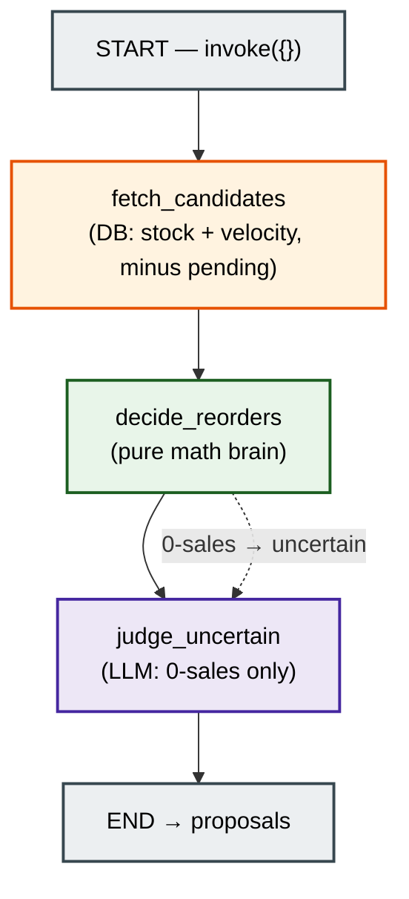
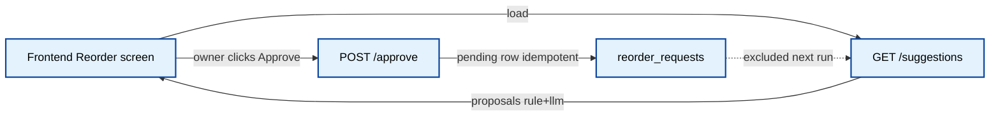
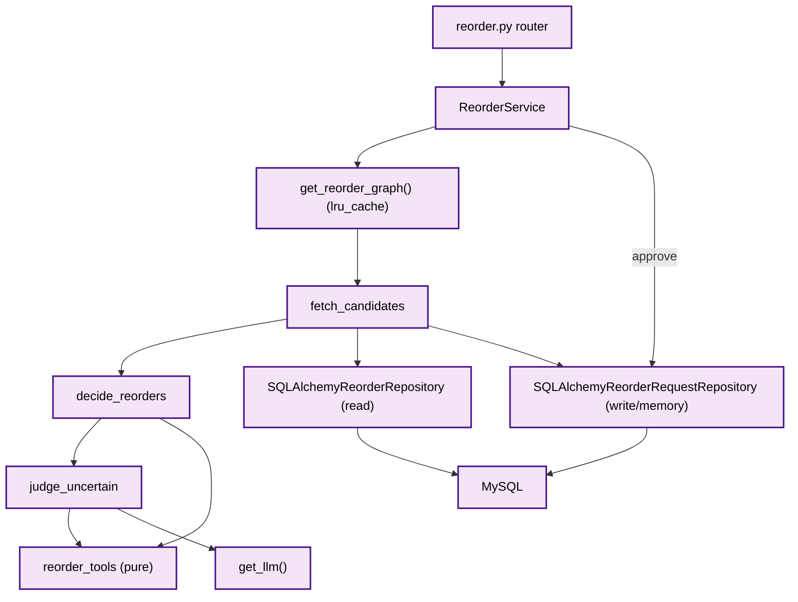
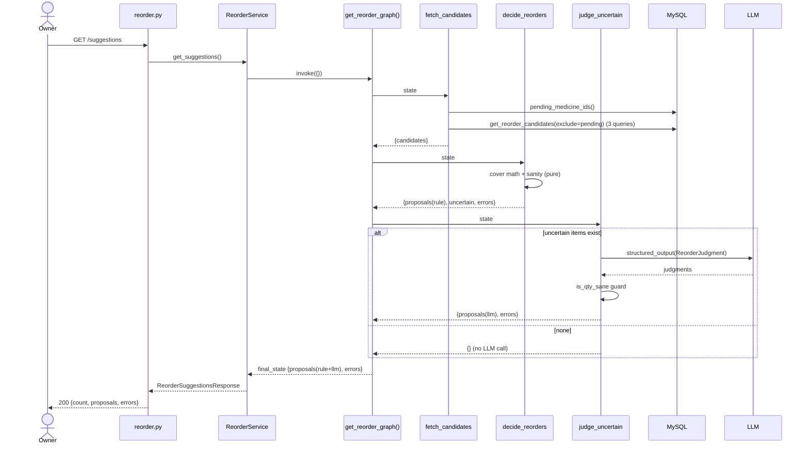

# 03 — Reorder Agent

> Scope: the Smart Reorder Agent — a LangGraph pipeline that inspects every medicine's
> stock vs. recent sell-through and proposes what to reorder, judging ambiguous 0-sales
> items with an LLM, remembering what the owner already approved. Grounded only in the
> current codebase.
>
> Central design line (from the code): **`crisp → code, fuzzy → LLM`**. All the math is
> deterministic Python; the LLM is used in exactly one node, only for the one call no
> formula can make (brand-new product vs. dead stock).

---

## Purpose

Answer "what should I reorder right now?" without ever auto-buying:

- For each medicine, compute **days of cover** = stock ÷ recent daily velocity.
- Propose a reorder when cover falls below the reorder point (lead time + safety).
- For **0-sales** medicines (no formula applies), ask the LLM: new stock or dead stock?
- **Remember** approvals: medicines with a pending reorder request are excluded from the
  next run, so the agent doesn't nag about orders already placed.
- Everything is a **suggestion** the owner approves (human-in-the-loop); approval persists a
  `reorder_requests` row **idempotently**.

This agent demonstrates the five agent capabilities the project set out to build: **REASON**
(cover math), **PLAN** (suggest qty), **SELF-CORRECT** (sanity guard), **TOOLS** (pure functions +
SQL repos), **MEMORY** (pending-request exclusion).

---

## Architecture

A **3-node linear LangGraph**. State is `ReorderState` (`TypedDict`). The graph is invoked
with **empty state** — unlike billing, the agent pulls its own data.



Why this shape:
- **LLM only at the end, and only for the fuzzy call.** `decide_reorders` answers everything
  with a formula; only 0-velocity items (no formula can tell "new" from "dead") flow to
  `judge_uncertain`. If there are none, **no LLM call is made** (zero cost).
- **Two nodes write `proposals`.** `decide_reorders` (rule-based) and `judge_uncertain`
  (LLM-based) both append — handled by a state **reducer** (see Data Flow).
- **Read/write split across two repositories.** One repo does read-only analytics (the
  numbers); a separate repo owns the write path (approvals + memory).

---

## Request Flow

Two endpoints, both under `/api/v1/reorder`:

**A) `GET /suggestions`** — run the whole agent, return proposals. Always `200` (empty list is
a valid "nothing to reorder"). Read-only: computes but writes nothing.

**B) `POST /approve`** — owner approves one suggestion; persists a `pending` `reorder_requests`
row. **Idempotent**: approving the same medicine twice returns the existing row (`200`), never a
duplicate. That approval is what the next `GET /suggestions` remembers and excludes.



---

## Folder Structure

```text
pharmacy-core-backend/app/
├── routers/
│   └── reorder.py                       # GET /suggestions, POST /approve
├── services/
│   └── reorder_service.py               # runs graph; idempotent approve()
├── schemas/
│   └── reorder.py                       # HTTP contract (proposal/response/approve)
├── models/
│   └── reorder_request.py               # reorder_requests table (the MEMORY)
├── repositories/
│   ├── sqlalchemy_reorder_repository.py          # READ-only analytics (numbers)
│   └── sqlalchemy_reorder_request_repository.py  # WRITE path + memory lookup
└── ai/
    ├── graphs/
    │   └── reorder_graph.py             # get_reorder_graph() — 3-node compile
    ├── state/
    │   └── reorder_state.py             # ReorderState + proposals/errors reducers
    ├── nodes/
    │   ├── fetch_candidates.py          # node 1 — pull numbers, exclude pending
    │   ├── decide_reorders.py           # node 2 — deterministic math
    │   └── judge_uncertain.py           # node 3 — the ONE LLM call
    ├── tools/
    │   └── reorder_tools.py             # days_of_cover / suggest_reorder_qty / is_qty_sane
    ├── schemas/
    │   └── reorder_judgment.py          # ReorderJudgment / ItemJudgment (LLM output)
    └── prompts/
        └── reorder_prompts.py           # JUDGE_REORDER_SYSTEM_PROMPT_V1
```

---

## File Responsibilities

| File | Responsibility |
|------|----------------|
| `routers/reorder.py` | Thin HTTP: `GET /suggestions` (always 200), `POST /approve` (200, idempotent). |
| `services/reorder_service.py` | `get_suggestions()` invokes the graph with `{}`; `approve()` does find-pending-or-create. |
| `ai/graphs/reorder_graph.py` | Builds/compiles the 3-node graph, `lru_cache` singleton. |
| `ai/state/reorder_state.py` | `ReorderState` + the `proposals` and `errors` `add` reducers. |
| `ai/nodes/fetch_candidates.py` | Node 1 — reads pending ids + candidates; excludes already-approved. |
| `ai/nodes/decide_reorders.py` | Node 2 — cover math, qty plan, sanity guard; routes 0-sales to `uncertain`. |
| `ai/nodes/judge_uncertain.py` | Node 3 — single LLM call over all uncertain items; degrade on failure. |
| `ai/tools/reorder_tools.py` | Pure math: `days_of_cover`, `suggest_reorder_qty`, `is_qty_sane`, `MAX_REORDER_QTY`. |
| `ai/schemas/reorder_judgment.py` | Forced LLM output shape (`action`, `suggested_qty`, `reason`, `confidence`). |
| `ai/prompts/reorder_prompts.py` | Versioned judgment prompt (new≤14d → reorder; >60d → ignore; seasonal hint). |
| `repositories/sqlalchemy_reorder_repository.py` | Read-only aggregates (stock, velocity) — **no N+1**. |
| `repositories/sqlalchemy_reorder_request_repository.py` | Write approvals + `pending_medicine_ids()` for memory. |
| `models/reorder_request.py` | The `reorder_requests` table + `(medicine_id, status)` index. |

---

## Important Classes

| Class | File | Role |
|-------|------|------|
| `ReorderState(TypedDict, total=False)` | `ai/state/reorder_state.py` | Shared state; `candidates`, `uncertain`, `proposals` (reducer), `errors` (reducer). |
| `ItemJudgment` / `ReorderJudgment` | `ai/schemas/reorder_judgment.py` | LLM verdict per 0-sales item: `action ∈ {reorder, watch, ignore}`, optional `suggested_qty`. |
| `SQLAlchemyReorderRepository` | `repositories/...reorder_repository.py` | Read-only analytics. `get_reorder_candidates()` = **3 queries total**. |
| `SQLAlchemyReorderRequestRepository` | `repositories/...reorder_request_repository.py` | `find_pending`, `create`, `pending_medicine_ids` (the memory read). |
| `ReorderRequest` | `models/reorder_request.py` | Persisted approval; `status ∈ {pending, ordered, cancelled}`. |
| `ReorderService` | `services/reorder_service.py` | Orchestrates graph + idempotent approve. |
| `ReorderProposal` / `ReorderSuggestionsResponse` / `ApproveReorderRequest` / `ReorderRequestOut` | `schemas/reorder.py` | HTTP contract; `ReorderProposal` uses `extra="ignore"`. |

---

## Important Functions

| Function | File | What it does |
|----------|------|--------------|
| `fetch_candidates(state)` | `nodes/fetch_candidates.py` | `pending_medicine_ids()` → `get_reorder_candidates(exclude_ids=pending)`. |
| `decide_reorders(state)` | `nodes/decide_reorders.py` | Per candidate: 0-velocity → `uncertain`; else cover vs reorder point → propose or skip. |
| `judge_uncertain(state)` | `nodes/judge_uncertain.py` | One LLM call → `reorder` verdicts become proposals (`source="llm"`, `needs_review=True`). |
| `days_of_cover(stock, velocity)` | `tools/reorder_tools.py` | `inf` if velocity ≤ 0 (divide-by-zero guard), else `stock/velocity`. |
| `suggest_reorder_qty(velocity, lead, safety)` | `tools/reorder_tools.py` | `ceil(velocity × (lead+safety))`. |
| `is_qty_sane(qty)` | `tools/reorder_tools.py` | `0 < qty ≤ MAX_REORDER_QTY (100_000)` — the self-correction net. |
| `get_reorder_candidates(window_days, exclude_ids)` | `repositories/...reorder_repository.py` | Stitches stock + sold + medicine list into one dict/medicine. |
| `stock_on_hand_by_medicine()` / `units_sold_since(cutoff)` | `repositories/...reorder_repository.py` | Two `GROUP BY` aggregates (non-expired stock; rolling-window sales). |
| `pending_medicine_ids()` | `repositories/...reorder_request_repository.py` | Set of medicine_ids with a `pending` request (memory). |
| `find_pending()` / `create()` | `repositories/...reorder_request_repository.py` | Idempotency lookup + insert. |
| `get_suggestions()` / `approve()` | `services/reorder_service.py` | Graph run; find-pending-or-create. |

### The deterministic brain (constants that define behavior)

`decide_reorders.py`:
```python
DEFAULT_LEAD_TIME_DAYS = 3
DEFAULT_SAFETY_DAYS = 2
reorder_point = 3 + 2  # = 5 days of cover

if c["daily_velocity"] <= 0:      # no formula → LLM
    uncertain.append(c); continue
cover = days_of_cover(...)
if cover >= reorder_point:        # confident skip
    continue
qty = suggest_reorder_qty(...)
if not is_qty_sane(qty):          # SELF-CORRECT
    errors.append(...); continue
proposals.append({**c, "days_of_cover": cover, "reorder_qty": qty})
```

`reorder_repository.py`: `daily_velocity = units_sold / window_days` where the window is a
**rolling** `VELOCITY_WINDOW_DAYS = 30` — a medicine hot last year must not look urgent today.

---

## Dependency Flow



Project-specific: like billing, the reorder router's DI injects **no** DB session — each node
opens its own `SessionLocal()`. The graph owns its sessions. `approve()` on the service opens
its own session too (it runs outside the graph).

---

## Sequence Diagram

`GET /api/v1/reorder/suggestions` end to end:



---

## Data Flow

State progression (`reorder_state.py`):

```text
{}  (empty input)
 → fetch_candidates  sets  candidates[]  {medicine_id, name, current_stock, daily_velocity, days_since_added}
 → decide_reorders   sets  proposals[] (source implicitly rule) + uncertain[] + errors[]
 → judge_uncertain   ADDS  proposals[] (source="llm", needs_review, reason, confidence) + errors[]
proposals : accumulated across BOTH writer nodes via reducer
```

**The two-writer reducer** — the key LangGraph mechanic here:

```python
proposals: Annotated[list[dict], add]
```

`proposals` is written by **two** nodes (`decide_reorders` and `judge_uncertain`). Without the
`add` reducer, `judge_uncertain`'s return would **overwrite** the rule-based proposals and the
math results would vanish. The reducer concatenates both lists. `errors` uses the same pattern.

**The memory loop** (across runs, not within one):
```text
GET /suggestions → owner approves → POST /approve inserts reorder_requests(status='pending')
next GET /suggestions → fetch_candidates calls pending_medicine_ids() → excludes those medicines
```

**Provenance:** every proposal carries `source` (`"rule"` vs `"llm"`). LLM ones also carry
`reason`, `confidence`, and `needs_review=True` so the UI flags them for explicit approval. The
`ReorderProposal` schema sets `extra="ignore"`, so internal keys (`daily_velocity`,
`days_since_added`) are dropped rather than leaked or erroring.

---

## Common Bugs

1. **N+1 queries.** Guarded: `get_reorder_candidates` runs **3 aggregate queries total**
   (stock GROUP BY, sales GROUP BY, medicine list) regardless of catalog size — not one SUM per
   medicine. Reverting to per-medicine queries is the classic scale-killer.
2. **Reducer overwrite.** Two nodes write `proposals`; dropping `Annotated[..., add]` silently
   discards the rule-based proposals when the LLM node returns.
3. **Divide-by-zero on velocity.** `days_of_cover` returns `inf` when velocity ≤ 0; without that
   guard, 0-sales medicines crash the math. (And 0-velocity is deliberately routed to the LLM.)
4. **Acting on a hallucinated quantity.** `is_qty_sane` is applied to the LLM's `suggested_qty`
   too — not just the math — so a hallucinated giant order is rejected, not proposed.
5. **Duplicate orders on double-click.** `approve()` is idempotent via `find_pending()` +
   the `(medicine_id, status)` index; a retried/double POST returns the existing pending row.
6. **All-time vs. rolling demand.** Velocity uses a rolling `VELOCITY_WINDOW_DAYS=30` cutoff; an
   all-time sum would make last-year's hot sellers look urgent forever.
7. **Timezone skew on expiry.** Stock aggregation filters `Batch.expiry_date > func.current_date()`
   (evaluated **DB-side**), not Python's `date.today()`, so app/DB timezone differences can't skew
   what counts as sellable cover.
8. **LLM outage crashing the agent.** `judge_uncertain` catches all exceptions and returns a soft
   error ("N items need manual review") — the rule-based proposals still return.
9. **Nagging about placed orders.** Without the pending-exclusion memory, the agent re-proposes
   the same medicines every run even after approval.

---

## Interview Questions

1. **How does this agent have "memory"?** Approvals persist as `reorder_requests(status='pending')`;
   `fetch_candidates` reads `pending_medicine_ids()` and excludes them next run.
2. **Why is the LLM used in only one node?** `crisp → code, fuzzy → LLM`: all cover/qty math is
   deterministic; the LLM makes only the one judgment no formula can (new vs. dead stock), and
   only when 0-sales items exist.
3. **Explain the two-writer reducer.** `proposals` is appended by both the rule node and the LLM
   node; `Annotated[list, add]` concatenates instead of overwriting.
4. **How do you avoid N+1?** Two `GROUP BY` aggregates + one medicine scan = 3 queries total,
   independent of catalog size.
5. **How is `POST /approve` made safe against double submission?** Idempotent find-pending-or-create
   backed by a `(medicine_id, status)` index.
6. **Where's the self-correction / guardrail?** `is_qty_sane` (`0 < qty ≤ 100_000`) gates both the
   math output and the LLM's suggested quantity.
7. **Why compute velocity over a rolling 30-day window?** Recent demand, not all-time — avoids
   stale urgency.
8. **Why does the agent never auto-buy?** Human-in-the-loop: it only proposes; the owner approves,
   and LLM proposals are additionally tagged `needs_review=True`.
9. **What happens if the LLM is down?** Degrade gracefully — soft error, rule-based proposals still
   returned; the agent never 500s on LLM failure.
10. **Why two separate repositories for one domain?** Read-only analytics vs. the write/memory path
    have different concerns (no commit vs. commit + idempotency); splitting keeps each cohesive.

---

## Summary

- The Smart Reorder Agent is a **3-node linear LangGraph**:
  `fetch_candidates → decide_reorders → judge_uncertain`, invoked with empty state (it pulls its
  own data).
- **Deterministic math** (cover, qty, sanity) lives in pure `reorder_tools`; the **LLM runs in one
  node** (`judge_uncertain`) purely for the 0-sales new-vs-dead judgment, and only when such items
  exist.
- Two nodes append to `proposals`; a **`add` reducer** merges rule-based and LLM-based proposals.
  Each proposal carries `source` provenance and (for LLM) `needs_review`.
- **Memory** is real and cross-run: approvals persist to `reorder_requests`; already-approved
  medicines are excluded from the next run via `pending_medicine_ids()`.
- **Scale + safety are engineered in code**: 3-query aggregates (no N+1), a rolling velocity window,
  DB-side expiry comparison, `is_qty_sane` guarding both math and LLM output, idempotent approvals,
  and graceful degradation when the LLM is unavailable.
- The agent **never auto-buys** — it proposes; the owner approves (human-in-the-loop).
