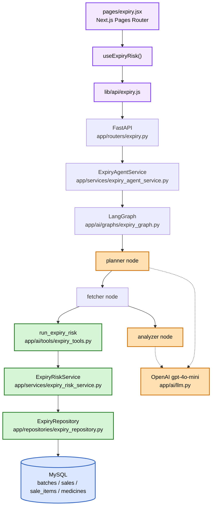
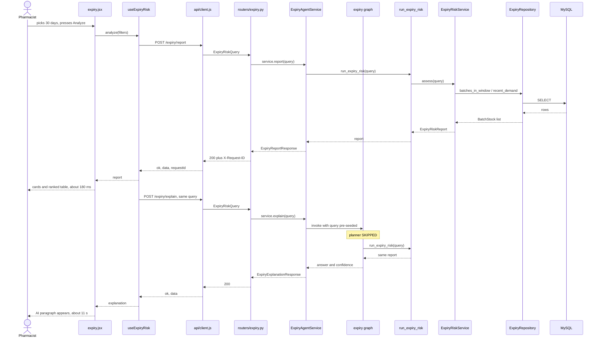
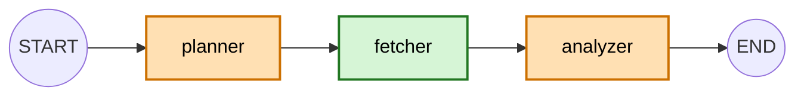
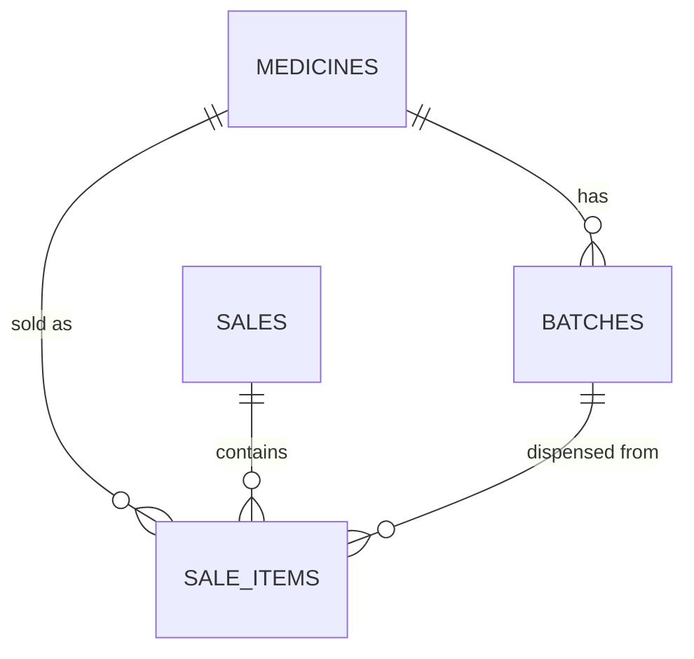

# Expiry Risk Agent

> Code-level documentation. Every file, class and function named here exists in the
> repository and was verified against the source while this was written.
> Backend paths are relative to `pharmacy-core-backend/`, frontend paths to
> `pharmacy-frontend/`.

| | |
|---|---|
| Agent name | `expiry` (`AGENT_NAME` in `app/ai/graphs/expiry_graph.py`) |
| Version | `expiry-agent-v1` (`AGENT_VERSION`, same file) |
| Endpoints | `POST /api/v1/expiry/report` (deterministic) · `/explain` (prose) · `/analyze` (chat) |
| Frontend | `pages/expiry.jsx` — Next.js Pages Router |
| Graph | `START -> planner -> fetcher -> analyzer -> END` |
| Tools | one: `get_expiry_risk` |
| Writes to the database | none — read-only |
| Migrations required | none |

---

## 1. Overview

The Expiry Risk Agent answers natural-language questions about stock that may expire
before it sells, and ranks that stock by how much money is at stake.

It is the first pharma-specific AI capability in the project. Its defining property is
that **no number in its answer comes from a language model**. Days to expiry, expected
demand, excess units, value at risk, risk level and priority are all computed in
Python from database facts, in `ExpiryRiskService`. The LLM does exactly two things:
turn a question into a structured query, and explain the computed report in English.

**What it does not do.** It never changes a price, raises a purchase order, contacts a
supplier, moves stock or edits a record. Its only tool is a read. It does not forecast
demand — it projects a recent average forward at a flat rate and says so, in the
report's own `notes` and in the analyst prompt.

---

## 2. Business Use Case

A pharmacy holds inventory in batches, each with an expiry date. Stock that expires on
the shelf is a direct write-off: the money was already spent, and there is no revenue
against it.

The naive tool for this is an expiry report — "here is everything expiring in 30
days". It is close to useless, because it flags fast-moving stock that will sell out
anyway. A pharmacist who is shown twenty rows of which two matter learns to ignore the
report.

The actual question is narrower:

> Of the stock expiring soon, how much of it will **not** sell in time, what is that
> worth, and which of it should I deal with first?

```text
Current problem
    Expiry dates are visible, but risk is not. Everything expiring looks
    equally urgent, so nothing gets acted on until it is a write-off.
       |
       v
AI capability
    A deterministic model computes expected demand per batch in FEFO order,
    subtracts it from stock, prices the remainder, and ranks by money lost
    per remaining day. An LLM interprets the question and explains the result.
       |
       v
Business outcome
    A short, ranked list of batches that genuinely need attention, each with
    the number behind it and a suggested action a person can accept or ignore.
```

The distinction it exists to make, from the seeded scenario:

| Batch | Stock | Expires in | Sells | Verdict |
|---|---|---|---|---|
| Vitamin C `V1` | 40 | 15 days | ~10/day | **low** — clears with room to spare |
| Amoxicillin `A1` | 50 | 10 days | never sold | **high** — 1,000 at risk |

A date-only report puts these side by side. This agent does not.

---

## 3. High-Level Architecture



Green is deterministic, orange touches the model, blue is data. The money is computed
entirely inside the green boxes.

---

## 4. Complete Round-Trip Data Flow

**Down (request):**

```text
HTTP client
  |  POST /api/v1/expiry/analyze  {"question": "...", "thread_id": "..."}
  v
app/main.py                       RequestContextMiddleware binds request_id
  v
app/routers/expiry.py             analyze_expiry_risk()
  |                               Depends(get_expiry_agent_service)
  |                               body validated as ExpiryAnalysisRequest
  v
app/services/expiry_agent_service.py   ExpiryAgentService.analyze()
  |                               opens ai_run("expiry") -> binds run_id
  v
app/ai/graphs/expiry_graph.py     get_expiry_graph().invoke(...)
  v
app/ai/nodes/expiry_planner.py    expiry_planner()  -> LLM -> ExpiryRiskQuery
  v
app/ai/nodes/expiry_fetcher.py    expiry_fetcher()
  v
app/ai/tools/expiry_tools.py      run_expiry_risk(query)
  |                               opens its own SessionLocal()
  v
app/services/expiry_risk_service.py    ExpiryRiskService.assess()
  v
app/repositories/expiry_repository.py  batches_in_window()
  |                                    recent_demand()
  |                                    medicines_with_any_sales()
  v
SQLAlchemy Core Select
  v
MySQL   batches JOIN medicines ; sale_items JOIN sales
```

**Up (response):**

```text
MySQL rows
  v
ExpiryRepository        -> list[BatchStock], dict[medicine_id, units], set[medicine_id]
  v
ExpiryRiskService       -> _assess_batches()  FEFO demand allocation
  |                        _build_item()      excess, value, level, reasons
  |                        _ranking_key()     sort
  |                        _build_notes()     caveats
  |                     -> ExpiryRiskReport
  v
run_expiry_risk         returns the typed report (no dict round-trip)
  v
expiry_fetcher          -> state["report"]
  v
expiry_analyzer         report.model_dump_json() -> LLM -> ExpiryAnalysis
  |                     -> state["answer"], state["confidence"], AIMessage
  v
ExpiryAgentService      reads state["report"] AND state["answer"]
  v
ExpiryAnalysisResponse  prose + structured items + notes + timing
  v
HTTP 200  (X-Request-ID header set by the middleware)
```

The single most important thing on the way up: `ExpiryAgentService.analyze()` reads
`final_state["report"]` for the numbers and `final_state["answer"]` for the prose.
The figures in the JSON response **never pass through the model**.

---

## 5. File-by-File Flow

| File | Responsibility |
|---|---|
| `app/main.py` | Boots the app, installs `RequestContextMiddleware`, includes `expiry_router` |
| `app/routers/expiry.py` | One route, `POST /api/v1/expiry/analyze`. `get_expiry_agent_service()` is the DI seam a test overrides |
| `app/schemas/expiry.py` | `ExpiryAnalysisRequest` (question, thread_id), `ExpiryAnalysisResponse` (prose **and** structured items) |
| `app/services/expiry_agent_service.py` | `ExpiryAgentService.analyze()` — one graph invocation, wrapped in `ai_run`, shaped into the HTTP contract |
| `app/ai/graphs/expiry_graph.py` | `get_expiry_graph()` — three nodes, linear, `MemorySaver`, `lru_cache(maxsize=1)` |
| `app/ai/state/expiry_state.py` | `ExpiryState(MessagesState)` — `query`, `report`, `answer`, `confidence` |
| `app/ai/nodes/expiry_planner.py` | `expiry_planner()` — question to `ExpiryRiskQuery` via structured output |
| `app/ai/nodes/expiry_fetcher.py` | `expiry_fetcher()` — one line; calls the tool **through the module** |
| `app/ai/nodes/expiry_analyzer.py` | `expiry_analyzer()` — report to prose via structured output; appends the `AIMessage` |
| `app/ai/prompts/expiry_prompts.py` | `EXPIRY_PLANNER_SYSTEM_PROMPT`, `EXPIRY_ANALYST_SYSTEM_PROMPT` |
| `app/ai/schemas/expiry_query.py` | `RiskLevel`, `RISK_ORDER`, `ExpiryRiskQuery`, `ExpiryRiskItem`, `ExpiryRiskReport` |
| `app/ai/schemas/expiry_analysis.py` | `ExpiryAnalysis` — `summary`, `confidence` |
| `app/ai/tools/expiry_tools.py` | `run_expiry_risk()` (the real entry point), `get_expiry_risk` (the `@tool` wrapper), `EXPIRY_TOOLS` |
| `app/services/expiry_risk_service.py` | **All the maths.** `ExpiryRiskConfig`, `ExpiryRiskService`, `_priority_score`, `_ranking_key`, `_recommendation` |
| `app/repositories/expiry_repository.py` | **All the SQL.** `BatchStock`, `batches_in_window`, `recent_demand`, `medicines_with_any_sales` |
| `app/models/batch.py` · `medicine.py` · `sale.py` · `sale_item.py` | ORM models. Unchanged by this milestone |
| `app/core/time_range.py` | `today()` — the reference date, in the pharmacy's timezone |
| `app/ai/observability.py` | `ai_run`, `observe_node`, `observe_tool` — reused unchanged |
| *(frontend)* | see §6 — `pharmacy-frontend/pages/expiry.jsx` and below |

---

## 6. Frontend Architecture

> Root for frontend paths: `pharmacy-frontend/`.

The page is a **pharma operations screen**, not a chat window. The pharmacist picks
filters and reads a ranked table; the AI adds a paragraph beside it.

| File | Responsibility |
|---|---|
| `pages/expiry.jsx` | The route. Owns filter state, chooses which of loading / error / empty / results to render. Opts into the app shell via `ExpiryPage.getLayout` |
| `src/hooks/useExpiryRisk.js` | `useExpiryRisk()` — owns the two-call sequence and six pieces of state (`report`, `loading`, `error`, `explanation`, `explaining`, `explainError`) |
| `src/lib/api/expiry.js` | `getExpiryReport()`, `explainExpiryRisk()`, `toQuery()`, and the filter option lists |
| `src/lib/api/client.js` | Shared fetch plumbing. Never throws; always returns `{ ok, status, data, requestId, error }` |
| `src/lib/api/index.js` | The existing billing / medicines / reorder calls, now on the same client, re-exporting `./expiry` so `@/lib/api` stays one import path |
| `src/components/expiry/ExpiryFilters.jsx` | Window / risk level / limit selects and the Analyze button |
| `src/components/expiry/ExpirySummaryCards.jsx` | The four KPI cards, plus `ExpirySummaryCardsSkeleton` |
| `src/components/expiry/ExpiryRiskTable.jsx` | The ranked table with an expandable "why" row. Exports `ExpiryRiskTableSkeleton` and `ExpiryRiskEmpty` |
| `src/components/expiry/ExpiryAiSummary.jsx` | The AI paragraph and the report's data caveats |
| `src/components/expiry/RiskBadge.jsx` | `RiskBadge` and `riskStyle()` — one place that maps a risk level to colour and wording |
| `src/components/sidebar.jsx` | Gains the `/expiry` nav entry |

### Two calls, not one

This is the decision the whole page is built around.

```text
Analyze pressed
   |
   +-- POST /api/v1/expiry/report    ~180 ms, no LLM, free
   |      -> cards + table render immediately
   |
   +-- POST /api/v1/expiry/explain   ~11 s, one model call
          -> paragraph fills in above the table
```

The obvious design is one endpoint returning numbers and prose together. It is worse
for three reasons, each of which showed up in practice:

1. **The table would wait on the model.** Measured on real data: 180 ms versus 11.5 s.
   Bundling them makes the fast half as slow as the slow half.
2. **An outage would cost the report, not just the paragraph.**
   `test_the_table_still_loads_when_the_model_is_down` pins this.
3. **The prose could contradict the filters.** `/analyze` runs a planner that picks
   its own window from a sentence. The dashboard already *has* the window — it came
   from a dropdown. Sending both endpoints the same structured query, and letting the
   backend skip its planner, is what guarantees the paragraph describes the rows on
   screen.

`useExpiryRisk` therefore keeps `error` and `explainError` apart: the first replaces
the page, the second is a line inside the AI card and nothing else changes.

### State

| State | Owner | Notes |
|---|---|---|
| `filters` | `pages/expiry.jsx` | `{ windowDays, riskLevel, limit }`. Changing a select does **not** fetch — three adjustments would otherwise cost three reports |
| `report` | `useExpiryRisk` | The whole `/report` body. The only source of numbers on the page |
| `loading` / `error` | `useExpiryRisk` | Fatal path: replaces the results area |
| `explanation` / `explaining` / `explainError` | `useExpiryRisk` | Non-fatal: confined to the AI card |

Two guards in the hook, both for real races: a `runIdRef` counter so a slow first
response cannot paint over a fast second one when Analyze is pressed twice, and a
`mountedRef` so a late response never calls `setState` after navigation.

### Loading, error and empty

| State | What the user sees |
|---|---|
| Loading | Skeleton cards and skeleton table rows, matching the real layout — no blank screen, no layout jump |
| Loading (AI) | Three shimmer lines inside the AI card, `aria-live="polite"`, while the table is already usable |
| Network failure | "Cannot reach the server. Check that the backend is running." + Try again |
| Validation (422) | "That request was not valid. Try different filters." |
| Server (5xx) | "The server could not complete this request." + Try again |
| AI failure | Inline: "…The figures above are unaffected — they are calculated without the AI." |
| Empty | "No stock is at expiry risk in this view." with the window and level spelled out, and a hint to widen the filter |

Backend exception text and SQL never reach the screen. `client.js` maps a status to
one of four fixed sentences; the server's own `detail` is not rendered.

When an error carries a `requestId` (from the `X-Request-ID` response header) the page
prints it small under the message, so a bug report can quote it and the whole run can
be grepped out of the backend logs.

### What the frontend does not do

It does not compute risk, demand, excess, value, ranking or counts. The summary cards
read `counts_by_risk` and `total_*` from the response rather than counting rows,
because rows are truncated by `limit` — asking for the top 5 would otherwise cap every
card at 5. `test_counts_survive_a_limit` exists for exactly this.

The table does not re-sort. Row order is the backend's ranking, and a client that
reordered it would silently disagree with the paragraph above it.

---

## 7. Frontend File-by-File Flow

```text
User picks filters, presses Analyze
        |
pages/expiry.jsx                 filters state -> analyze(filters)
        |
src/hooks/useExpiryRisk.js       useExpiryRisk().analyze()
        |
src/lib/api/expiry.js            toQuery(filters) -> ExpiryRiskQuery body
        |                        getExpiryReport(query)
        |                        explainExpiryRisk(query)
        |
src/lib/api/client.js            postJSON() -> fetch
        |
POST /api/v1/expiry/report       (and /explain)
```

and back:

```text
JSON response
        |
src/lib/api/client.js            { ok, status, data, requestId, error }
        |
src/lib/api/expiry.js            passthrough - no reshaping, no computation
        |
src/hooks/useExpiryRisk.js       setReport() / setExplanation()
        |
pages/expiry.jsx                 picks loading | error | empty | results
        |
        +-- ExpirySummaryCards   counts_by_risk, total_value_at_risk
        +-- ExpiryAiSummary      explanation.answer, report.notes
        +-- ExpiryRiskTable      report.items, in the given order
        |
User
```

---

## 8. Complete Round Trip — User to Database and Back



The second call re-runs the calculation rather than passing the first result back
down. That is a deliberate trade: one extra sub-second query in exchange for never
trusting a client-supplied report — a browser could otherwise post edited figures and
have the model narrate them as fact.

---

## 9. Code-Level Entry Point

`app/routers/expiry.py`:

```python
@router.post(
    "/analyze",
    response_model=ExpiryAnalysisResponse,
    status_code=status.HTTP_200_OK,
    summary="Assess which stock is at risk of expiring, and what to do about it",
)
def analyze_expiry_risk(
    request: ExpiryAnalysisRequest,
    service: ExpiryAgentService = Depends(get_expiry_agent_service),
) -> ExpiryAnalysisResponse:
    return service.analyze(request)
```

1. **Who calls it** — any HTTP client asking a free-text question. The dashboard does
   **not**; it uses `/report` and `/explain` below.
2. **Request schema** — `ExpiryAnalysisRequest`.
3. **What it calls** — `ExpiryAgentService.analyze()`, resolved through
   `Depends(get_expiry_agent_service)` so a test can override the dependency.
4. **What it returns** — `ExpiryAnalysisResponse`.

### All three routes

| Route | Body | Service | LLM calls | Used by |
|---|---|---|---|---|
| `POST /api/v1/expiry/analyze` | `ExpiryAnalysisRequest` (question + thread_id) | `analyze()` | 2 (planner, analyst) | chat / API clients |
| `POST /api/v1/expiry/report` | `ExpiryRiskQuery` | `report()` | **0** | the dashboard table and cards |
| `POST /api/v1/expiry/explain` | `ExpiryRiskQuery` | `explain()` | 1 (analyst only) | the dashboard AI card |

`/report` and `/explain` take **`ExpiryRiskQuery` itself** as the request body — the
same model the tool uses. The HTTP contract and the agent's contract therefore cannot
drift apart, and every bound on the query is enforced at the edge.

`explain()` seeds `query` into the initial graph state, which makes `_entry_point`
route `START` straight to `fetcher`. Same nodes, same prompt, same observability as
the chat path; one fewer model call, and no chance of the planner choosing a window
that disagrees with the dropdown.

The route is a pass-through by design: no branching, no error handling of its own, so
there is nothing in it that can be wrong independently of the service.

---

## 10. Request Schema

```text
HTTP JSON body
    |  FastAPI + Pydantic v2
    v
ExpiryAnalysisRequest        app/schemas/expiry.py
    |  expiry_planner + LLM structured output
    v
ExpiryRiskQuery              app/ai/schemas/expiry_query.py
```

**`ExpiryAnalysisRequest`**

| Field | Type | Validation |
|---|---|---|
| `question` | `str` | required, `min_length=3`, `max_length=500` |
| `thread_id` | `str` | required, `min_length=1`, `max_length=100` |

A violation returns FastAPI's standard `422` before any service, graph or model call
happens. The 500-character bound is what stops a caller from paying to send an essay
to the planner.

**`ExpiryRiskQuery`** — the query the model is allowed to build:

| Field | Type | Bounds | Default |
|---|---|---|---|
| `window_days` | `int` | `1 .. 365` | `90` |
| `risk_level` | `RiskLevel \| None` | closed enum of five | `None` |
| `include_expired` | `bool` | — | `True` |
| `medicine_id` | `int \| None` | `>= 1` | `None` |
| `limit` | `int` | `1 .. 100` | `10` |

**Every field is a bounded integer, a boolean, or a closed enum. Not one accepts free
text.** That is the security property: there is no string for a model to smuggle
anything into, so there is no blocklist to defeat. A unit test asserts it directly.

`ExpiryRiskQuery.describe()` renders a log-safe summary — the *shape* of the request,
never its results.

---

## 11. LangGraph Flow



Three nodes, linear, **no loop**. LangGraph earns its place here for the checkpointed
conversation state (`MemorySaver`) and for putting this agent on the same footing as
the BI agent for a future Supervisor to route to — not for branching it does not need.

**Why there is deliberately no reflection loop.** The BI agent has one because its
planner picks among five metrics and can genuinely choose the wrong one. Here the
query is a single object with sensible defaults, and the calculation is deterministic:
a second pass over the same window returns byte-identical numbers. A retry could only
burn a model call. This is written into the module docstring so the omission reads as
a decision rather than an oversight.

---

### Node: `planner`

- **Function** — `expiry_planner(state)` in `app/ai/nodes/expiry_planner.py`
- **Purpose** — turn the question into a validated `ExpiryRiskQuery`
- **Reads** — `state["messages"]`, via `get_latest_user_message(state)`
- **Writes** — `state["query"]`
- **Calls** — `get_llm().with_structured_output(ExpiryRiskQuery)` with
  `EXPIRY_PLANNER_SYSTEM_PROMPT`
- **Failure** — a provider error or a schema violation raises. There is no retry and
  no default query: guessing a window on the user's behalf would silently answer a
  different question from the one asked.

### Node: `fetcher`

- **Function** — `expiry_fetcher(state)` in `app/ai/nodes/expiry_fetcher.py`
- **Purpose** — connect the plan to the calculation. Nothing else.
- **Reads** — `state["query"]`
- **Writes** — `state["report"]`
- **Calls** — `expiry_tools.run_expiry_risk(state["query"])`
- **Failure** — a database error propagates. The graph stops; the analyzer never runs
  on a partial report.

> **Read this line carefully:**
> ```python
> from app.ai.tools import expiry_tools     # the module
> ...
> return {"report": expiry_tools.run_expiry_risk(state["query"])}
> ```
> `from x import f` binds the function **by value**, so a test patching
> `expiry_tools.run_expiry_risk` would never be seen here. This bit the project three
> times (`get_llm`, `execute_tool`, and this) before the rule was written down: **in a
> node, reach a patchable dependency through its module.** The DB-failure test caught
> it by showing a successful run where a failure was expected.

### Node: `analyzer`

- **Function** — `expiry_analyzer(state)` in `app/ai/nodes/expiry_analyzer.py`
- **Purpose** — explain the computed report in the pharmacist's terms
- **Reads** — `state["report"]`, `state["messages"]`
- **Writes** — `state["answer"]`, `state["confidence"]`, appends an `AIMessage` to
  `state["messages"]`
- **Calls** — `get_llm().with_structured_output(ExpiryAnalysis)` with
  `EXPIRY_ANALYST_SYSTEM_PROMPT`, the prior transcript, and the report serialised via
  `report.model_dump_json(indent=2)`
- **Failure** — raises. The report is already computed at this point, but the response
  contract requires prose, so a failed analyzer is a failed request rather than a
  half-answer.

The `AIMessage` is appended here rather than in a separate finalizer node. This graph
has no retry loop, so the analyzer runs exactly once per turn and cannot produce the
duplicate-message problem the BI agent's finalizer exists to prevent.

---

## 12. Agent State

`app/ai/state/expiry_state.py`:

```python
class ExpiryState(MessagesState):
    query: ExpiryRiskQuery       # planner
    report: ExpiryRiskReport     # fetcher
    answer: str                  # analyzer
    confidence: float            # analyzer
```

| Field | Written by | Read by |
|---|---|---|
| `messages` | START (user), `analyzer` (AI) | `planner`, `analyzer` |
| `query` | `planner` | `fetcher` |
| `report` | `fetcher` | `analyzer`, **`ExpiryAgentService`** |
| `answer` | `analyzer` | `ExpiryAgentService` |
| `confidence` | `analyzer` | `ExpiryAgentService` |

Every field is written by one node and read by another. No field exists "for later" —
that rule was applied retroactively to the BI agent in Milestone 3, where three dead
fields were removed, and it is why this state is four fields long.

`report` is held as the **typed `ExpiryRiskReport`**, not a dict, so the analyzer
cannot quietly reshape it on the way through — and so the service downstream gets the
same object the calculation produced.

`MessagesState` supplies `messages` plus the `add_messages` reducer, which is what
makes multi-turn conversation work: sending the same `thread_id` again replays the
checkpointed transcript.

---

## 13. Tool Flow

```text
analyzer/fetcher
      |
      v
run_expiry_risk(query)              app/ai/tools/expiry_tools.py
      |  observe_tool("expiry_risk")
      |  SessionLocal()
      v
ExpiryRiskService.assess(query)     app/services/expiry_risk_service.py
      |
      v
ExpiryRepository                    app/repositories/expiry_repository.py
      |
      v
MySQL
```

There is exactly **one** tool.

| | |
|---|---|
| Tool name | `get_expiry_risk` |
| Input schema | `ExpiryRiskQuery` (via `args_schema=`) |
| Validation | Pydantic at the graph boundary, then **re-validated** inside the tool: `run_expiry_risk(ExpiryRiskQuery(**kwargs))` |
| Service called | `ExpiryRiskService.assess()` |
| Repository called | `ExpiryRepository` — three methods |
| Returns | `report.model_dump(mode="json")` from the `@tool`; the typed `ExpiryRiskReport` from `run_expiry_risk` |

Re-validating inside the tool turns a malformed tool call into a clean
`ValidationError` at the boundary rather than a confusing `AttributeError` three
layers down.

`run_expiry_risk` opens its own `SessionLocal()` because LangGraph nodes do not
receive FastAPI's `Depends(get_db)`. It takes an optional `as_of` for testing; the
graph never passes one (see §27).

The `@tool`-decorated `get_expiry_risk` is registered in `EXPIRY_TOOLS` for a future
tool-calling or Supervisor graph. **The current graph does not use it** — the fetcher
calls `run_expiry_risk` directly. Both paths run the same code.

**What the LLM is not allowed to do:** choose a table, a column, an operator, a sort,
a join or a SQL condition; ask for an unbounded scan; decide a risk threshold; compute
or alter any figure; or invoke anything that writes.

---

## 14. Database Flow

```text
ExpiryRepository
      |
      +-- batches_in_window()        Batch JOIN Medicine
      +-- recent_demand()            SaleItem JOIN Sale, GROUP BY medicine_id
      +-- medicines_with_any_sales() SaleItem, GROUP BY medicine_id
      v
SQLAlchemy Core Select
      v
MySQL
```



**Columns actually read**

| Table | Columns | Used for |
|---|---|---|
| `batches` | `id`, `batch_number`, `medicine_id`, `expiry_date`, `quantity`, `cost_price` | stock, dates, value at risk |
| `medicines` | `id`, `name` | display only |
| `sale_items` | `medicine_id`, `quantity` | demand |
| `sales` | `id`, `sold_at` | the demand window |

**Filters and ordering**

`batches_in_window(as_of, window_days, include_expired, medicine_id)`:
- `WHERE expiry_date <= as_of + window_days`
- `AND quantity != 0` — nothing is at risk if the shelf is empty. Note `!= 0`, not
  `> 0`: **negative** quantities are kept deliberately, because `batches.quantity` has
  no CHECK constraint, bad data is therefore reachable, and hiding it would hide the
  bug. It surfaces as a note instead.
- `AND expiry_date >= as_of` only when `include_expired=False`
- `AND medicine_id = ?` only when given
- `ORDER BY medicine_id, expiry_date, id` — **FEFO order within each medicine**, which
  is exactly the order the service must walk. The `id` tiebreak makes the ordering
  total, so two batches sharing an expiry date always come back the same way and the
  final ranking cannot flap between runs.

`recent_demand(as_of, lookback_days, medicine_ids)`:
- `WHERE sales.sold_at >= as_of - lookback_days AND sales.sold_at < as_of`
- Half-open on purpose. `sold_at` is a `DateTime`; ending at midnight today keeps a
  partial day from dragging the daily average down.
- `GROUP BY sale_items.medicine_id`, `SUM(quantity)`

**Indexes** — `ix_batches_medicine_expiry (medicine_id, expiry_date)` covers the batch
scan; `ix_sale_items_medicine_id` and `ix_sales_sold_at` cover the demand aggregate.
No new index was added, and no migration was needed.

**Why two queries and not one join.** They aggregate at different grains: stock is
**per batch**, demand is **per medicine**. A customer asks for "Crocin", and FEFO
decides which batch it comes out of. Joining them would force a choice between
duplicating demand across a medicine's batches or dividing it arbitrarily, and both
are wrong. The service allocates instead — see §15.

---

## 15. SQL vs Python vs LLM

```text
SQL      fetch batches in the window (with medicine name)
         sum units sold per medicine in the lookback window
         list medicines that have ever sold

Python   days_to_expiry     = expiry_date - reference
         daily_demand       = units_in_lookback / lookback_days
         FEFO allocation of demand across a medicine's batches
         potential_excess   = max(0, max(quantity,0) - estimated_demand)
         value_at_risk      = round(excess * unit_cost, 2)
         risk_level         = threshold comparison, gated on excess
         priority_score     = round(value_at_risk / max(days, 1), 2)
         ranking, notes, recommendation text

LLM      question -> ExpiryRiskQuery      (planner)
         report   -> English + confidence (analyzer)
```

### The risk model

```text
potential excess = stock - demand expected before this batch expires
```

### FEFO demand allocation — `ExpiryRiskService._assess_batches()`

Demand belongs to the **medicine**; risk belongs to the **batch**. The service walks
each medicine's batches in FEFO order and allocates as it goes:

```python
claimed = 0
for batch in medicine_batches:                 # already in FEFO order from SQL
    days = (batch.expiry_date - reference).days

    if days < 0:
        expected_sold = 0                      # expired stock cannot sell, and must
                                               # not consume demand a live batch needs
    else:
        demand_by_expiry = daily_demand * days
        available = max(0.0, demand_by_expiry - claimed)
        expected_sold = min(max(batch.quantity, 0), int(available))
        claimed += expected_sold
```

Worked example from the seeded scenario — Paracetamol sells 2/day:

| Batch | Stock | Days | Demand by then | Already claimed | Allocated | Excess |
|---|---|---|---|---|---|---|
| `P1` | 30 | 5 | 10 | 0 | **10** | 20 |
| `P2` | 200 | 20 | 40 | 10 | **30** | 170 |

`P2` gets 30, not 40 — `P1` is ahead of it in the queue and takes 10 first. An even
split would give both batches the wrong number, and it is the single behaviour that
makes this an expiry *risk* model rather than an expiry report.

### Risk levels — `ExpiryRiskService._risk_level()`

```python
if days_to_expiry < 0:                    return EXPIRED
if excess <= 0:                           return LOW      # <- the gate
if days_to_expiry <= critical_days:       return CRITICAL # default 7
if days_to_expiry <= warning_days:        return HIGH     # default 30
if days_to_expiry <= horizon_days:        return MEDIUM   # default 90
                                          return LOW
```

**Excess is the gate, not the date.** A batch expiring tomorrow that sells out
tomorrow is `low`. Flagging it would train the pharmacist to ignore the report. Once
there *is* excess, time decides how urgent it is. Every boundary is inclusive and each
one has its own test.

### Prioritisation — `_priority_score()` and `_ranking_key()`

```python
priority_score = round(value_at_risk / max(days_to_expiry, 1), 2)   # money per day

_ranking_key = (
    RISK_ORDER[risk_level],   # severity first — how a pharmacist scans
    -priority_score,
    -value_at_risk,
    days_to_expiry,
    batch_id,                 # makes the ordering total, so it never flaps
)
```

Ranking by value alone buries an urgent small loss; ranking by date alone puts a
20-rupee batch above a 20,000-rupee one. Money per remaining day balances both and is
explainable in one sentence. Already-expired stock divides by 1, scoring its full
value and sorting to the top — correct, because it is realised loss, not risk.

**Ranking happens before the limit** (`items.sort(...)` then `items[: query.limit]`),
or "top 3" would mean "the first 3 rows SQL happened to return".

### Configuration — `ExpiryRiskConfig`

| Field | Default | Env var |
|---|---|---|
| `critical_days` | 7 | `EXPIRY_CRITICAL_DAYS` |
| `warning_days` | 30 | `EXPIRY_WARNING_DAYS` |
| `horizon_days` | 90 | `EXPIRY_HORIZON_DAYS` |
| `demand_lookback_days` | 90 | `EXPIRY_DEMAND_LOOKBACK_DAYS` |

`from_env()` rejects a non-integer, rejects anything below 1, and enforces
`critical < warning <= horizon`. Overlapping thresholds would make a risk level
unreachable and the report quietly wrong, so this fails at construction rather than at
runtime.

---

## 16. LLM Flow

```text
User question
     |
     v
EXPIRY_PLANNER_SYSTEM_PROMPT      app/ai/prompts/expiry_prompts.py
     v
get_llm().with_structured_output(ExpiryRiskQuery)
     v
Pydantic validation
     v
ExpiryRiskQuery


ExpiryRiskReport (JSON)
     |
     v
EXPIRY_ANALYST_SYSTEM_PROMPT
     v
get_llm().with_structured_output(ExpiryAnalysis)
     v
Pydantic validation
     v
{summary, confidence}
```

| | |
|---|---|
| Factory | `get_llm()` in `app/ai/llm.py`, `lru_cache(maxsize=1)` |
| Provider | `LLM_PROVIDER` env var — `openai` (active) or `nvidia` |
| Model | `AI_MODEL_NAME`, default `gpt-4o-mini` for OpenAI |
| Temperature | `0.0` (`app/ai/config.py`) — the planner should be reproducible |
| Timeout | 30s (OpenAI branch) |
| Callbacks | `LLMObservabilityHandler` attached at construction, so every call is timed and its token usage recorded without any node opting in |
| Prompts | `app/ai/prompts/expiry_prompts.py` — no prompt text is inlined in a node |
| Failure | Raises. No fallback model, no cached answer, no default query. |

Keys are read from the environment in `app/ai/config.py`. No key appears in code, in
a log line, or in this document.

Two prompt clauses do real work:

- The analyst prompt's **"THE NUMBERS ARE NOT YOURS"** section: quote exactly, do not
  recalculate, do not round, do not invent, keep the ranking.
- Its **"BE HONEST ABOUT THE ESTIMATE"** section: never describe demand as a forecast,
  and if `notes` says a medicine has no sales history, say so — a zero from missing
  data must not read as a confident zero.

---

## 17. What the LLM Does vs Does Not Do

### LLM DOES

- Interpret the question into a window, a risk level, a medicine filter and a limit
- Explain the computed report in a pharmacist's language
- Pass on the report's caveats
- Assign a confidence score reflecting how well the data supports the answer
- Refuse an action request in its first sentence, then give the recommendation

### LLM DOES NOT

- Calculate days to expiry, demand, excess, value at risk, risk level or priority
- Decide a threshold or a ranking
- Write, generate or reorder SQL
- Choose a table, column, operator or join
- Invent a medicine, a batch or a figure
- Re-round or "correct" any number
- Approve, authorise or execute any business action

Pinned by test, not just by prompt: the analyzer receives the report as data and the
service builds its response from `state["report"]`, so a model that hallucinated a
figure could put it in the prose but could never change `items`, `total_at_risk` or
`total_value_at_risk`.

---

## 18. Observability Flow

Reuses the Milestone 2 infrastructure unchanged.

```text
request_id     RequestContextMiddleware, per HTTP request, echoed as X-Request-ID
    |
run_id         ai_run("expiry", thread_id=...), per graph invocation
    |
agent=expiry   AGENT_NAME, on every node line
    |
node           observe_node("planner"|"fetcher"|"analyzer", agent="expiry")
    |
tool           observe_tool("expiry_risk")
    |
service        logger "app.services.expiry" -> expiry_risk_assessed
```

`request_id` and `run_id` are `ContextVar`s stamped onto every record by a
`logging.setLogRecordFactory` hook, so nothing has to be passed down by hand.
`thread_id` is **logged but never bound** — it identifies a conversation, which spans
many runs, and keeping it out of the context makes the two impossible to confuse.

**Events emitted by one request** (illustrative ids):

```text
request_started   request_id=r-4f2a9c  method=POST  path=/api/v1/expiry/analyze
ai_run_started    request_id=r-4f2a9c  run_id=a-77b104  agent=expiry  thread_id=conv-1
node_started      ... agent=expiry  node=planner
llm_completed     ... duration_ms=612  input_tokens=..  output_tokens=..
node_completed    ... agent=expiry  node=planner   duration_ms=618
node_started      ... agent=expiry  node=fetcher
tool_started      ... tool=expiry_risk
expiry_query_executing  ... window_days=90  risk_level=None  limit=10
expiry_risk_assessed    ... batches_reviewed=5  at_risk=4  window_days=90
tool_completed    ... tool=expiry_risk  duration_ms=41  status=success
node_completed    ... agent=expiry  node=fetcher   duration_ms=44
node_started      ... agent=expiry  node=analyzer
llm_completed     ... duration_ms=1904
node_completed    ... agent=expiry  node=analyzer  duration_ms=1911
ai_run_completed  ... agent=expiry  duration_ms=2579
request_completed ... status_code=200  duration_ms=2585
```

**What is deliberately not logged:** no medicine name, no batch number, no quantity,
no money, no prompt text, no tool arguments, no tool results. Only identifiers,
counts, shapes, durations and outcomes. `expiry_query_executing` logs the *shape* of
the query; `expiry_risk_assessed` logs counts. An integration test asserts that a full
run's log output contains **no medicine name and no monetary figure**.

LangSmith tracing, if enabled, captures the graph automatically — `tracing_status()`
reports at boot whether traces are genuinely being sent, because an API key without
`LANGCHAIN_TRACING_V2=true` silently produces nothing.

---

## 19. Error Flow

### LLM fails (planner or analyzer)

```text
get_llm().invoke  -> provider exception
    v
observe_node      -> logs node_failed (agent, node, duration_ms, error_type), re-raises
    v
graph             -> invocation aborts
    v
ai_run            -> logs ai_run_failed, re-raises
    v
FastAPI           -> 500
```

No retry, no fallback model, no default query. A guessed window would answer a
different question from the one asked, silently.

### Database fails

```text
ExpiryRepository  -> SQLAlchemyError
    v
ExpiryRiskService -> propagates
    v
observe_tool      -> logs tool_failed (tool, duration_ms, status=error, error_type)
    v
expiry_fetcher    -> propagates; the analyzer never runs
    v
ai_run            -> ai_run_failed
    v
FastAPI           -> 500
```

Only `error_type` is logged, never the exception message: a SQLAlchemy error text can
carry the statement and its parameters. The client gets a generic 500 — raw database
errors never reach it.

### Tool fails

The graph does **not** retry, does **not** reflect, and does **not** return a partial
result. It fails the run. This is the honest behaviour for a numeric report: a
half-computed risk report that looks complete is worse than an error.

### Validation fails

- Bad HTTP body -> `422` from FastAPI, before any model call.
- Model returns an out-of-range `window_days` -> `ValidationError` in the planner,
  before the repository is touched.
- Malformed tool call -> `ValidationError` from the re-validation inside
  `get_expiry_risk`.

---

## 20. Test Flow

```text
Unit          tests/unit/test_expiry_risk_service.py         65
              tests/unit/test_expiry_query.py                44
              tests/unit/test_expiry_repository.py           21
    v
Integration   tests/integration/test_expiry_agent.py         22
              tests/integration/test_expiry_dashboard_api.py 24
    v
Evaluation    tests/evaluation/test_expiry_golden_cases.py   20
                                                             ---
                                                             196
```

`test_expiry_dashboard_api.py` covers the two endpoints the UI uses. Three of its
assertions are load-bearing for the frontend and would be easy to lose:

* `test_the_report_endpoint_calls_no_model` — the fake LLM is scripted with nothing,
  so any model call raises. This is what keeps the table free.
* `test_explain_skips_the_planner` — the planner is never scripted either, so reaching
  it fails the test. This is what keeps the prose and the filters in agreement.
* `test_counts_survive_a_limit` — ask for the top 1 and the table has one row, but the
  summary cards must still report all four at-risk batches.

**Frontend tests: none yet.** `pharmacy-frontend` has no test runner installed (no
Jest, no Vitest, no Testing Library), so there is nothing to add them to. The six
checks the standard asks for — loading, success, empty, error, correct parameters
sent, backend values displayed — are not covered. Standing up Vitest + React Testing
Library is the next frontend task; this is a real gap, not a deliberate omission.

**Fake LLM** — `tests/fakes.py::FakeLLM` implements the slice of `BaseChatModel` the
nodes use. `with_structured_output(schema)` returns a scripted instance per schema, so
a test decides exactly what the planner plans. `error=` makes every call raise. **No
test calls a real provider.**

Patching is per-module, listed in `tests/conftest.py::_LLM_NODE_MODULES`, because
`from app.ai.llm import get_llm` binds by value.

**Test database** — file-based SQLite in a temp directory, not in-memory: the BI
fetcher uses a `ThreadPoolExecutor`, and an in-memory SQLite database is per
connection. `tests/_environment.py::assert_not_production_database` refuses to run
against anything that is not the test URL.

**Fixtures** (`tests/conftest.py`)

| Fixture | Purpose |
|---|---|
| `expiry_as_of` | A fixed Wednesday. Unit tests pass it explicitly, so no test changes meaning depending on the day it runs |
| `expiry_db` | `db_session` seeded via `seed_expiry_scenario(db, expiry_as_of)` |
| `expiry_app_db` | The same scenario anchored to the **real** `today()`, for tests that go through the graph — which always uses the real clock |

The split between the last two exists because of a real bug in my own tests: the
integration tests were anchored to the fixed date while the graph used the real one,
so days-to-expiry drifted by about nine days.

**Seeded scenario** — `tests/factories.py::seed_expiry_scenario`, relative to `D`:

| Batch | Medicine | Expiry | Stock | Cost | Expected |
|---|---|---|---|---|---|
| `P1` | Paracetamol 500 | D+5 | 30 | 10 | demand 10, excess 20, **critical** |
| `P2` | Paracetamol 500 | D+20 | 200 | 10 | demand 30, excess 170, **high** |
| `A1` | Amoxicillin 250 | D+10 | 50 | 20 | never sold, excess 50, **high** |
| `V1` | Vitamin C 500 | D+15 | 40 | 5 | sells out, excess 0, **low** |
| `C1` | Cough Syrup 100ml | D-10 | 25 | 40 | **expired**, excess 25 |
| `Z1` | Cetirizine | D+300 | 100 | 1 | excess 100, **low** (beyond horizon) |

No data was invented to make the demo work — the scenario is built from the same
seeding helpers the other agents use, and each row exists to pin one behaviour.

---

## 21. Evaluation

```text
question  ->  scripted planner (planned_query)  ->  deterministic pipeline
          ->  actual report  ->  exact assertions on computed values
```

`tests/evaluation/expiry_risk_cases.json` holds **16 cases**;
`tests/evaluation/expiry_runner.py` runs them; `test_expiry_golden_cases.py` turns
each into a pytest case so a regression fails CI rather than a report.

```powershell
python -m tests.evaluation.expiry_runner          # fake LLM, offline, free
python -m tests.evaluation.expiry_runner --real   # real provider, real cost
```

**What is actually being graded, and what is not.** Unlike the BI harness, this one
asserts **exact computed values** — excess counts, rupees at risk, which batch ranks
first — because the calculation is deterministic. In fake mode the planner is scripted
from each case's `planned_query`, so what is graded is:

- **pipeline correctness** — the numbers, the ranking, the notes. Genuinely tested.
- **LLM quality** — *not* tested in fake mode. Whether the planner picks the right
  `window_days` for "what expires this week" is graded only under `--real`, where the
  runner compares the planner's own choice against `planned_query`.

Two cases (`EXP-015`, `EXP-016`) are marked `requires_real_llm` because they test model
judgement — refusing to apply a discount or contact a supplier. They are **skipped in
fake mode and reported as skipped, never as passed.**

Coverage by category: basic (3), window (3), risk_level (2), prioritisation (3),
excess (1), value (1), fefo (1), missing_data (1), action_request (2).
`test_the_set_covers_the_capabilities_that_matter` fails if FEFO or missing-data cases
are ever dropped.

**Current results:** 14/14 graded cases pass, 2 skipped.

---

## 22. Security

**Authentication and authorization do not exist in this project yet.** There is no
auth module, no `get_current_user` dependency, and no RBAC anywhere in `app/`. This
endpoint is **unauthenticated**, like every other endpoint here. Auth is Phase 5 on
the roadmap. This is stated plainly rather than glossed, because these endpoints
expose `cost_price` — an internal figure — through `unit_cost` and `value_at_risk`,
and the dashboard now puts that on a screen. Anyone who can reach the host can read
the pharmacy's margins. Do not deploy this before Phase 5.

| Control | Status |
|---|---|
| Authentication | **Not implemented** |
| Authorization / RBAC | **Not implemented** |
| Input validation | Yes — `ExpiryAnalysisRequest` bounds; `ExpiryRiskQuery` all bounded/enum |
| Tool restrictions | One read-only tool; no field accepts free text |
| SQL safety | SQLAlchemy Core with bound parameters; no string interpolation; no raw SQL reaches the model |
| Write protection | The agent has no write path at all |
| Secret handling | Keys read from env in `app/ai/config.py`; none in code, logs or docs |
| Logging restrictions | No names, quantities, money, prompts, tool args or results — asserted by test |
| Client-supplied figures | Never trusted. `/explain` recomputes the report rather than accepting one from the browser |
| Error text to the browser | Mapped to four fixed sentences in `lib/api/client.js`; backend `detail`, tracebacks and SQL are never rendered |
| CORS | Origin allowlist in `app/main.py`; `X-Request-ID` explicitly exposed |
| Request id injection | An inbound `X-Request-ID` is honoured only if it matches `^[A-Za-z0-9_-]{1,64}$`; otherwise a fresh one is generated |

Prompt injection is bounded by construction rather than by filtering: a user could
tell the planner to "ignore instructions", but the widest possible outcome is a
differently-shaped `ExpiryRiskQuery` — a different window or limit. There is no field
in which arbitrary text can travel further, and the analyzer never executes anything.

---

## 23. Performance

**Lightly measured, not benchmarked.** The figures below come from single manual calls
against the development MySQL database (261 batches, 1,812 sale items) — indicative,
not a benchmark, and no load test has been run.

| Call | Observed | Notes |
|---|---|---|
| `POST /report` (30d, top 5) | **179 ms** | 3 queries, no model |
| `POST /report` (empty window) | **4 ms** | early return before the demand queries |
| `POST /explain` (same query) | **11.5 s** | one `gpt-4o-mini` call, dominates everything |

The 60x gap between the two is the entire justification for the dashboard making two
calls instead of one.

What is known from the code:

- **Three queries per request**, fixed. Not N+1: `recent_demand` and
  `medicines_with_any_sales` take an `IN (...)` list of the medicine ids found by the
  batch scan.
- **Indexes** — `ix_batches_medicine_expiry` covers the batch scan;
  `ix_sale_items_medicine_id` and `ix_sales_sold_at` cover the demand aggregate.
- **Two LLM calls per request** (planner + analyzer). These dominate wall-clock: in
  test runs the deterministic part is tens of milliseconds and the model calls are
  seconds.
- **No caching.** Redis is Phase 6. The report is cheap to recompute; the model calls
  are the thing worth caching later.
- **`MemorySaver` is in-process**, so conversation history is lost on restart and is
  not shared across workers. Fine for one process; it is not a production checkpointer.
- **Expected bottlenecks, in order:** analyzer LLM latency, planner LLM latency, the
  batch scan on a large `batches` table with a 365-day window.
- **Unbounded scan risk:** `window_days` is capped at 365 and `limit` at 100, but the
  *scan* is bounded only by the window — a pharmacy with a very large `batches` table
  and a 365-day window reads every one of those rows before ranking. Not a problem at
  current scale; the first thing to revisit if it becomes one.

---

## 24. Example End-to-End Request

```http
POST /api/v1/expiry/analyze
Content-Type: application/json

{
  "question": "Which medicines are at risk of expiring in the next 30 days?",
  "thread_id": "conv-8f3a1c2b"
}
```

```text
Route          analyze_expiry_risk()          request_id r-4f2a9c bound
Service        ExpiryAgentService.analyze()   ai_run -> run_id a-77b104
Planner        LLM -> ExpiryRiskQuery(window_days=30)
Fetcher        run_expiry_risk(query)
Repository     batches_in_window(as_of=today, window_days=30)  -> P1 P2 A1 V1 C1
               recent_demand(lookback_days=90)                 -> {para: 180, vitC: 900}
               medicines_with_any_sales(...)                   -> {para, vitC, cough}
Service        FEFO allocation, excess, value, level, ranking, notes
               -> ExpiryRiskReport(total_batches_reviewed=5,
                                   total_at_risk=4,
                                   total_value_at_risk=3900.00)
Analyzer       report JSON -> LLM -> {summary, confidence}
Response       200
```

Ranked items (the deterministic part, hand-checkable):

```text
[EXPIRED ] Cough Syrup  C1  -10d  stock  25  demand  0  excess  25  at risk 1000.00  score 1000.00
[CRITICAL] Paracetamol  P1    5d  stock  30  demand 10  excess  20  at risk  200.00  score   40.00
[HIGH    ] Amoxicillin  A1   10d  stock  50  demand  0  excess  50  at risk 1000.00  score  100.00
[HIGH    ] Paracetamol  P2   20d  stock 200  demand 30  excess 170  at risk 1700.00  score   85.00
[LOW     ] Vitamin C    V1   15d  stock  40  demand 40  excess   0  at risk    0.00  score    0.00
```

Response body (abridged, example data):

```json
{
  "answer": "About 3,900 is at risk across four batches...",
  "confidence": 0.8,
  "total_batches_reviewed": 5,
  "total_at_risk": 4,
  "total_value_at_risk": 3900.0,
  "items": [
    {
      "batch_number": "C1",
      "medicine_name": "Cough Syrup 100ml",
      "days_to_expiry": -10,
      "stock_quantity": 25,
      "estimated_demand": 0,
      "potential_excess": 25,
      "unit_cost": 40.0,
      "value_at_risk": 1000.0,
      "risk_level": "expired",
      "priority_score": 1000.0,
      "reasons": ["expired 10 day(s) ago", "25 unit(s) in stock", "..."],
      "recommendation": "Already expired - quarantine and write off, and check why it was not caught earlier."
    }
  ],
  "notes": [
    "No sales history at all for: Amoxicillin 250. Their demand estimate is zero because nothing is known, not because demand is known to be zero.",
    "Demand is the average over the last 90 days projected forward at a flat rate. It is an estimate from history, not a forecast."
  ],
  "execution_time_ms": 2585,
  "agent_version": "expiry-agent-v1"
}
```

Two things worth noticing. `V1` expires in 15 days and is correctly **not** at risk —
that is the whole point of the agent. And `total_value_at_risk` is 3,900 rather than
4,000 because the 90-day window excludes `Z1`; the number moves with the window, as it
should.

---

## 25. How to Debug This Feature

Work down the stack. Each step tells you whether to keep going.

| # | Layer | File | What to check |
|---|---|---|---|
| 0a | Browser | devtools Network | Did `/report` 200? Its `X-Request-ID` is the thread to pull |
| 0b | Page | `pages/expiry.jsx` | Which branch rendered — loading, error, empty, results? |
| 0c | Hook | `src/hooks/useExpiryRisk.js` | `error` is fatal; `explainError` only blanks the AI card |
| 0d | Client | `src/lib/api/client.js` | `status: 0` means the request never left — backend down or CORS |
| 1 | Route | `app/routers/expiry.py` | Is it a `422`? Then the body is wrong — nothing else ran |
| 2 | Service | `app/services/expiry_agent_service.py` | Did `ai_run_started` appear? If not, the graph was never invoked |
| 3 | Graph | `app/ai/graphs/expiry_graph.py` | Which `node_completed` lines appear, and which node is missing |
| 4 | Planner | `app/ai/nodes/expiry_planner.py` | Log the resolved `query.describe()`. A wrong window explains most "wrong answers" |
| 5 | Tool | `app/ai/tools/expiry_tools.py` | `expiry_query_executing` shows the query shape that reached the calculation |
| 6 | Service | `app/services/expiry_risk_service.py` | `expiry_risk_assessed` gives `batches_reviewed` and `at_risk`. Reviewed=0 means the repository found nothing |
| 7 | Repository | `app/repositories/expiry_repository.py` | Run `batches_in_window` by hand against the DB |
| 8 | Database | — | `SELECT id, batch_number, expiry_date, quantity FROM batches ORDER BY expiry_date` |
| 9 | LLM | `app/ai/llm.py` | `llm_client_created` logs the provider and model actually in use |
| 10 | Tracing | `app/core/tracing.py` | Boot log says whether LangSmith is really receiving traces |

Grep one request end to end:

```powershell
Select-String -Path .\logs\*.log -Pattern "r-4f2a9c"
```

To bypass the LLM entirely and check only the maths:

```python
from app.ai.schemas.expiry_query import ExpiryRiskQuery
from app.ai.tools.expiry_tools import run_expiry_risk

report = run_expiry_risk(ExpiryRiskQuery(window_days=90))
for item in report.items:
    print(item.batch_number, item.risk_level, item.potential_excess, item.value_at_risk)
```

If that is right and the answer is wrong, the problem is the prompt, not the model of
risk.

---

## 26. Common Failure Modes

**No results at all**
1. Does any batch actually expire within the window? (`SELECT MIN(expiry_date) FROM batches`)
2. `quantity != 0` — the repository excludes empty batches by design
3. `include_expired=False` combined with a short window can legitimately return nothing
4. `expiry_risk_assessed` with `batches_reviewed=0` confirms it is the repository, not the maths

**Everything comes back `low`**
1. That may be correct — it means demand clears the stock. Check `estimated_demand`
2. `demand_lookback_days` too short, or too long and inflating the average
3. `EXPIRY_*_DAYS` overridden in `.env` — `from_env()` would reject an *invalid*
   combination, but a valid-but-odd one (e.g. critical=1) is accepted

**Demand looks too high or too low**
1. `recent_demand` uses `sales.sold_at`, not `created_at`. Back-dated sales count
2. The window is `[as_of - lookback, as_of)` — today's sales are excluded on purpose
3. Demand is per **medicine**; a batch's share depends on its FEFO position

**A later batch shows more risk than an earlier one**
That is usually correct and is the FEFO allocation working. Check `estimated_demand`
on the earlier batch first — if it is absorbing all the demand, the later batch
legitimately has none left.

**The answer's numbers disagree with `items`**
The model paraphrased. `items` is authoritative — it comes from `state["report"]` and
never passes through the LLM. Tighten `EXPIRY_ANALYST_SYSTEM_PROMPT`; the response
contract is already correct.

**A test patch appears to do nothing**
The target was imported by value. Patch the module attribute
(`app.ai.nodes.expiry_planner.get_llm`, `app.ai.tools.expiry_tools.run_expiry_risk`),
not the definition site.

**Integration test dates drift**
Use `expiry_app_db` (real `today()`), not `expiry_db` (fixed date), for anything that
runs through the graph.

**The page shows "Cannot reach the server"**
1. Is the backend up on the port in `pharmacy-frontend/.env.local`
   (`NEXT_PUBLIC_API_BASE_URL`, default `http://localhost:8000`)?
2. CORS — `_ALLOWED_ORIGINS` in `app/main.py` lists ports 3000 and 3001 only
3. `status: 0` from the client means the request never left the browser

**The summary cards disagree with the table**
Expected when `limit` truncates: cards count the whole filtered result, the table
shows the top N. If they disagree with `limit: 100` and fewer rows than that, the
frontend is deriving a count it should be reading.

**The AI paragraph contradicts the filters**
The planner ran when it should have been skipped. Check that `/explain` was called
with the query object, not a question, and that `_entry_point` still routes a
pre-seeded `query` to `fetcher`.

**Prices show a dollar sign**
The analyst prompt states the currency is rupees. The model observed this only after
the prompt was fixed *and the server restarted* — `uvicorn` without `--reload` keeps
the old prompt module in memory.

---

## 27. Future Extensions

| Today | Later |
|---|---|
| Flat average demand from the last 90 days | **Forecast Agent** — seasonality, trend, confidence intervals. It replaces `_daily_demand()` and nothing else in this file has to change |
| Recommendation text only | Human-approved actions: discounting, supplier returns, purchase-order holds |
| No location awareness | Multi-branch stock transfer recommendations |
| No supplier return terms | Return eligibility windows per supplier, so "check whether the supplier will take it back" becomes a definite answer |
| No auth | Phase 5 — JWT + RBAC, at which point `unit_cost` exposure needs a role gate |
| `MemorySaver` in process | A durable checkpointer once there is more than one worker |
| No caching | Phase 6 Redis, on the LLM calls rather than the calculation |

**Deliberately not built: an `as_of` parameter through the graph.** `run_expiry_risk`
and `ExpiryRiskService.assess` both accept one for testing, but there is no route from
the HTTP request to it. Letting a caller ask for a report "as of" an arbitrary date
would let someone generate a plausible-looking risk report about a day that never
happened. If historical reporting is ever wanted, it should be an explicit, separate,
clearly-labelled capability.

---

## 28. How I would explain this in an interview

**The problem.** A pharmacy writes off stock that expires on the shelf. The obvious
tool is an expiry report, and it is close to useless, because it flags fast-moving
stock that will sell out anyway. A pharmacist shown twenty rows of which two matter
learns to ignore the report. The real question is which stock will *not* sell in time,
what that is worth, and what to deal with first.

**The architecture.** LLM interprets, deterministic code computes, LLM explains. A
planner node turns the question into a Pydantic `ExpiryRiskQuery` where every field is
a bounded integer or a closed enum — no field accepts free text, so there is no string
for a model to smuggle anything into and no blocklist to defeat. A fetcher runs a
single read-only tool. All the maths lives in `ExpiryRiskService`, in plain Python. An
analyzer node explains the finished report and is told, in the prompt, that the
numbers are not its own.

**Why the LLM is not allowed near the arithmetic.** Asking a model "how much of this
will expire" gets you a confident number with nothing behind it, that changes between
runs, that you cannot reproduce in a spreadsheet, and that you cannot put in front of
an owner. Everything the model could get wrong here — money, dates, stock — is exactly
what deterministic code is good at. Everything the model is genuinely good at —
mapping "what expires this week" to a 7-day window, and explaining a table to a person
— is what it does.

**The part I would actually talk about.** Demand belongs to the medicine, but risk
belongs to the batch. A customer asks for Crocin, not for batch B7, and FEFO decides
which box gets opened. So the service walks each medicine's batches in expiry order
and allocates demand as it goes: the earliest batch takes what it can sell, and later
batches only see what is left. In our scenario the second Paracetamol batch gets 30
units of demand rather than 40, because the first one takes 10 first. An even split
would understate the risk on later batches badly, and that single behaviour is what
makes it a risk model rather than a report.

Risk level is gated on excess, not on the date. A batch expiring tomorrow that sells
out tomorrow is low risk. Prioritisation is money at risk per remaining day, which
balances a large slow loss against a small urgent one and can be explained in one
sentence. The ranking key ends in `batch_id` so the ordering is total and the report
never flaps between runs.

**LangGraph's role.** Three nodes, linear, no reflection loop — and I would defend the
omission. The BI agent has a loop because its planner picks among five metrics and can
genuinely miss. Here the query is one object with defaults and the calculation is
deterministic, so a retry could only cost a model call. LangGraph is here for the
checkpointed conversation state and to put this agent on the same footing as the
others for a Supervisor to route to later.

**Testing.** 172 tests: 130 unit, 22 integration, 20 evaluation, over a 16-case golden
set. No test calls a real provider — a `FakeLLM` implements the slice of
`BaseChatModel` the nodes use, so a test scripts exactly what the planner plans.
Because the calculation is deterministic, the evaluation set can assert **exact
values** — rupees at risk, which batch ranks first — which most LLM eval suites cannot
do. I am careful to say what it does not test: in fake mode the planner is scripted,
so it grades the pipeline, not the model's judgement. The two cases about refusing an
action are marked real-LLM-only and reported as skipped, never as passed.

**Observability.** One `request_id` from the middleware and one `run_id` per graph
invocation, both `ContextVar`s stamped onto every log record, so a whole run greps
out with one id. Nodes, tools and LLM calls are all timed. No medicine name and no
money reaches a log line, and a test asserts it.

**The tradeoffs I would own.** Demand is a flat average, not a forecast — it is
labelled `estimated_demand` everywhere, the report carries a note saying so, and the
analyst prompt forbids calling it a prediction. There is no auth on this project yet,
and this endpoint exposes cost price, so it is not deployable as-is. The scan is
bounded by the window rather than by a row limit. And the agent is advisory: its only
tool is a read, and a test asserts no recommendation claims a completed action.

---

## 29. Verification

Everything in this document was checked against the source on 2026-09-09. The claims
most worth re-checking if the code moves:

- `AGENT_NAME`, `AGENT_VERSION`, node names and edges — `app/ai/graphs/expiry_graph.py`
- Field bounds — `app/ai/schemas/expiry_query.py`
- Thresholds and the FEFO loop — `app/services/expiry_risk_service.py`
- SQL filters and ordering — `app/repositories/expiry_repository.py`
- Test counts — `pytest tests/unit/test_expiry_*.py tests/integration/test_expiry_*.py tests/evaluation/test_expiry_golden_cases.py --collect-only -q`
- Frontend field names — every field the page reads was cross-checked against a
  live `/report` response; all 24 matched
