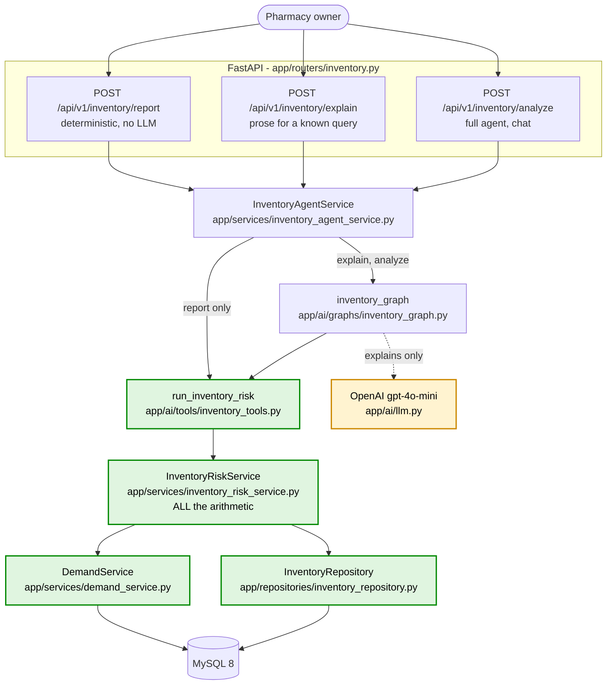
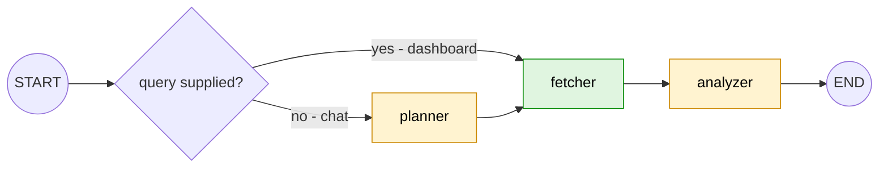

# Inventory Risk Agent

> Backend paths are relative to `pharmacy-core-backend/`.
> Last verified against the source and against real MySQL: **2026-09-13**.
>
> **Status: backend complete. No frontend yet.** `pages/inventory.jsx` is the next step.
> The deterministic layer underneath is documented separately in
> [`../features/inventory_risk.md`](../features/inventory_risk.md) — this document
> covers the agent, the API and the round trip.

---

## 1. Business problem

> "Which inventory is absorbing capital it shouldn't?"

Measured on the live database on 2026-09-13, through the endpoint this document
describes:

```text
96 medicines hold stock · 4 hold none
total inventory value   Rs 28,38,654.45
total capital at risk   Rs 23,87,886.26

dead 4 · critical 75 · high 6 · medium 5 · healthy 6
```

Three-quarters of the catalogue is critically overstocked and no other screen in the
system shows it. The Reorder agent answers "what is running out" — on this data that
returns almost nothing. The Expiry agent answers "what will expire before it sells".
Neither asks whether the money is in the right place.

### The boundary that keeps the three apart

```text
Reorder         what is running out?                       exists
Expiry Risk     what will expire before it sells?          M4
Inventory Risk  is the money misallocated, dates aside?    M5  <- this
```

82 medicines appear on both the expiry list and the overstock list. That is not a
bug: one batch can be both "expires in 200 days" and "180 days of cover". The rule
that keeps the two screens distinct is that **this agent never emits an expiry date**.
Unsellable stock is reported as a unit count. It is asserted in three places —
`test_the_reasons_never_mention_an_expiry_date` (unit),
`test_the_report_never_exposes_an_expiry_date` (integration), and `no_expiry_dates`
on evaluation cases INV-001 and INV-015.

---

## 2. Real pharmacy use cases

| The owner asks | Query the planner produces |
|---|---|
| "Which medicines have the highest inventory risk?" | `{}` |
| "Show me overstocked medicines." | `{}` |
| "Which medicines are dead stock?" | `{risk_level: dead}` |
| "How much capital is tied up in risky inventory?" | `{}` |
| "Which inventory should I review first?" | `{limit: 5}` |
| "Where is the most money stuck?" | `{sort: capital_at_risk, limit: 5}` |
| "What stock has been sitting longest?" | `{sort: stock_age}` |
| "Anything with more than Rs 20,000 tied up?" | `{min_capital_at_risk: 20000}` |
| "What if I only held 30 days of stock?" | `{target_cover_days: 30}` |
| "Write off the dead stock for me." | refuses to act, then recommends |
| "Which medicines are about to expire?" | redirects — wrong agent |

---

## 3. Architecture



`/report` bypasses the graph entirely. That is the proof the business calculation does
not depend on the model: pull the API key and the table still renders.

---

## 4. LangGraph



Three nodes, linear, **no reflection loop**. The BI agent has one because its planner
picks from five metrics and can genuinely miss one. Here the query is a single object
with defaults and the calculation is deterministic — a second pass over the same
target cover returns byte-identical numbers, so a retry could only burn a model call.

The conditional entry is not decoration. The dashboard already holds the target cover,
the risk level and the sort; they came from dropdowns. Making it phrase a sentence for
the planner to parse back into the same values would cost a model call and let the
planner pick a different target from the one on screen.

---

## 5. Complete round trip

Forward, with the real file and function names:

```text
app/main.py                       app.include_router(inventory_router.router)
 -> app/routers/inventory.py      inventory_report(query, service)
 -> app/services/inventory_agent_service.py   InventoryAgentService.report(query)
 -> app/ai/tools/inventory_tools.py           run_inventory_risk(query)
      observe_tool("inventory_risk")
      SessionLocal()
 -> app/services/inventory_risk_service.py    InventoryRiskService.assess(query)
      |
      +- app/repositories/inventory_repository.py  InventoryRepository.stock_by_medicine(as_of)
      |     SQLAlchemy Select -> SUM(CASE ...) GROUP BY medicine   -> MySQL
      +- InventoryRepository.count_medicines()
      +- app/services/demand_service.py   DemandWindow.trailing(lookback_days=90)
      |                                   DemandService.units_sold(window, ids)
      |                                   DemandService.last_sale_dates(ids)
      |                                   DemandService.medicines_ever_sold(ids)
      |     -> app/repositories/demand_repository.py -> MySQL
      +- InventoryRepository.oldest_receipt_by_medicine(ids)
      |     MIN(purchases.purchase_date) JOIN purchase_items JOIN batches -> MySQL
      |
      +- InventoryRiskService._assess_medicine()   per medicine, all arithmetic
      +- InventoryRiskService._filter()            risk level, capital floor, medicine
      +- _sort_key(query.sort)                     ranking
      -> InventoryRiskReport
```

And back:

```text
InventoryRiskReport
 -> InventoryAgentService.report()      maps to InventoryReportResponse
 -> app/routers/inventory.py            response_model validates the contract
 -> app/core/middleware.py              stamps X-Request-ID, logs request_completed
 -> JSON over HTTP
 -> (next step) src/lib/api/inventory.js -> useInventoryRisk -> pages/inventory.jsx
```

`/explain` and `/analyze` differ only in the middle — they go through
`get_inventory_graph().invoke(...)`, so the fetcher calls the same
`run_inventory_risk`, and the analyzer adds one LLM call on the way out.

---

## 6. Code-level component reference

### `app/routers/inventory.py`

| Function | Responsibility | Called by | Calls | In | Out |
|---|---|---|---|---|---|
| `inventory_report` | HTTP only | FastAPI | `InventoryAgentService.report` | `InventoryRiskQuery` | `InventoryReportResponse` |
| `explain_inventory_report` | HTTP only | FastAPI | `.explain` | `InventoryRiskQuery` | `InventoryExplanationResponse` |
| `analyze_inventory_risk` | HTTP only | FastAPI | `.analyze` | `InventoryAnalysisRequest` | `InventoryAnalysisResponse` |
| `get_inventory_agent_service` | DI provider so a test can swap the service | FastAPI `Depends` | — | — | `InventoryAgentService` |

### `app/services/inventory_agent_service.py`

| Method | Responsibility | Called by | Calls | Notes |
|---|---|---|---|---|
| `report(query)` | Deterministic path | router | `inventory_tools.run_inventory_risk` | **No graph, no LLM.** Reaches the tool through the module so a patch is seen |
| `explain(query)` | Prose for a known query | router | `get_inventory_graph().invoke` | Seeds `query`, so the planner is skipped. Throwaway `thread_id` |
| `analyze(request)` | Full agent | router | `get_inventory_graph().invoke` | The only path that runs the planner |

### `app/ai/graphs/inventory_graph.py`

| Name | Responsibility |
|---|---|
| `get_inventory_graph()` | Builds and compiles; `lru_cache` so the `MemorySaver` survives across requests |
| `_entry_point(state)` | `"fetcher"` when `query` is already set, else `"planner"` |
| `AGENT_NAME` | `"inventory"` — appears in every log line |
| `AGENT_VERSION` | `"inventory-agent-v1"` |

### `app/ai/nodes/`

| Node | Responsibility | Reads state | Writes state | LLM? |
|---|---|---|---|---|
| `inventory_planner` | Question → validated query | `messages` | `query` | yes, structured output |
| `inventory_fetcher` | Plan → computed report | `query` | `report` | **no** |
| `inventory_analyzer` | Report → English | `report`, `messages` | `answer`, `confidence`, `messages` | yes, structured output |

### `app/ai/tools/inventory_tools.py`

| Name | Responsibility | Called by | Calls |
|---|---|---|---|
| `run_inventory_risk(query, as_of)` | Open a session, run the service, return the report | `inventory_fetcher`, `InventoryAgentService.report` | `InventoryRiskService.assess` |
| `get_inventory_risk` | The `@tool`-decorated wrapper for native tool calling | a future Supervisor | `run_inventory_risk` |

Logs the **shape** of the query only — never the medicines, the stock or the money.
This endpoint exposes cost prices, which are more sensitive than the expiry figures.

### `app/ai/schemas/inventory_query.py`

`InventoryRiskLevel`, `RISK_ORDER`, `InventorySort`, `InventoryRiskQuery`,
`InventoryRiskItem`, `InventoryRiskReport`. Contract and answer types together, the
same arrangement as `expiry_query.py`.

---

## 7. API contract

### `POST /api/v1/inventory/report`

Request — every field optional:

```json
{ "target_cover_days": 60, "risk_level": "dead", "min_capital_at_risk": 0,
  "medicine_id": null, "sort": "risk", "limit": 10 }
```

| Field | Type | Bounds | Default |
|---|---|---|---|
| `target_cover_days` | int | 7–365 | 60 |
| `risk_level` | enum \| null | dead / critical / high / medium / healthy | null |
| `min_capital_at_risk` | float | ≥ 0 | 0 |
| `medicine_id` | int \| null | ≥ 1 | null |
| `sort` | enum | risk / capital_at_risk / days_of_cover / stock_age | risk |
| `limit` | int | 1–100 | 10 |

Response (abridged):

```json
{ "generated_for": "2026-09-13", "demand_lookback_days": 90, "target_cover_days": 60,
  "medicines_reviewed": 96, "medicines_without_stock": 4, "items_matching_filter": 4,
  "total_inventory_value": 2838654.45, "total_capital_at_risk": 2387886.26,
  "capital_at_risk_in_view": 10045.41,
  "counts_by_risk": {"dead":4,"critical":75,"high":6,"medium":5,"healthy":6},
  "items": [ ... ], "notes": [ ... ], "execution_time_ms": 44 }
```

**Which figures are filtered and which are not** — this caused a real bug, see §11:

```text
total_inventory_value    shop-wide, never filtered
total_capital_at_risk    shop-wide, never filtered
counts_by_risk           shop-wide, before filter AND before limit
medicines_reviewed       shop-wide
capital_at_risk_in_view  filtered, before limit
items_matching_filter    filtered, before limit
items                    filtered, sorted, limited
```

### `POST /api/v1/inventory/explain`

Same request body. Returns `answer`, `confidence`, `execution_time_ms`,
`agent_version` — **and no figures**. The dashboard already holds the numbers from
`/report`; duplicating them would create two sources of truth for one screen.

### `POST /api/v1/inventory/analyze`

```json
{ "question": "Where is the most money stuck?", "thread_id": "conv-8f3a1c2b" }
```

Returns the prose **and** the structured items, so a caller can render a table or
check a figure in the text against the number it came from.

### Why three endpoints

Inherited from M4, and the split earns its place on measurement: `/report` returned in
**44 ms** and `/explain` in **5.5 s** on the same live data. One endpoint doing both
would make the table wait on the model, and an LLM outage would cost the whole screen
instead of one paragraph.

### Errors

| Status | When | Body |
|---|---|---|
| 422 | Any bound violated, any invented enum | FastAPI validation detail — no SQL, no traceback |
| 500 | Repository or database failure | Generic; the exception is logged, not returned |
| 200 + empty `items` | A filter matched nothing | `items: []`, `items_matching_filter: 0` — **not** an error |

A filter matching nothing is a successful empty result, and a database failure
propagates rather than returning an empty report — a dashboard must never render
"nothing at risk" because a query broke. `test_a_database_failure_is_not_reported_as_success`
pins that.

**Known debt, inherited not introduced:** there is no global exception handler mapping
repository failures to a 500 envelope, and no authentication on any endpoint. This one
exposes cost price and total capital, so it is the most sensitive endpoint in the
system. Phase 5.

---

## 8. The LLM boundary

```text
DETERMINISTIC                                    MODEL
--------------------------------------------    ---------------------------
stock, inventory value, weighted cost            question -> query  (planner)
velocity, days of cover                          report -> English  (analyzer)
target stock, excess, capital at risk            a confidence score
stock age
risk level and its reasons
filtering, sorting, ranking, the subtotals
```

The model **cannot**: compute any figure, choose a threshold, name a column, write
SQL, reach the database, or take an action. It picks from a closed enum and writes
prose. `test_the_report_calls_no_model` asserts the deterministic path makes zero
model calls; the planner-skip tests assert `/explain` never invents its own query.

---

## 9. Observability

A real `/explain` trace, `request_id` and `run_id` correlated on every line:

```text
ai_run_started        [req=f05007674b86 run=f2058336ca06] agent=inventory thread_id=inventory-report-8da6bcb1f268
inventory_risk_assessed                                   matching=4 medicines_reviewed=96 sort=risk target_cover_days=60
tool_completed                                            tool=inventory_risk duration_ms=59.5 status=success
node_completed                                            agent=inventory node=fetcher duration_ms=59.9
llm_completed                                             duration_ms=3728.6 status=success completion_tokens=60 model=gpt-4o-mini
node_completed                                            agent=inventory node=analyzer duration_ms=13972.9
ai_run_completed                                          agent=inventory duration_ms=14343.7
request_completed     [req=f05007674b86 run=-]            duration_ms=14349.5 POST /api/v1/inventory/explain 200
```

No `planner` line — that is the planner-skip working, visible in production logs.

Never logged: medicine names, stock levels, cost prices, money, prompts, tool
arguments, tool results, or database exception messages.

---

## 10. Testing

```text
tests/unit/test_inventory_query.py                32   query validation / security boundary
tests/unit/test_inventory_repository.py           23   SQL
tests/unit/test_inventory_risk_service.py         52   the arithmetic
tests/integration/test_inventory_api.py           44   all three endpoints, real DB, fake LLM
tests/evaluation/test_inventory_golden_cases.py   22   17 golden cases + 5 set-integrity checks
```

Evaluation: **20 passed, 2 skipped**. The two skips are `requires_real_llm` cases —
refusing to act (INV-016) and redirecting an expiry question (INV-017). They are
reported as skipped, never as passed.

The golden runner asserts **exact computed values** — rupees, days of cover, which
medicine ranks first — because the pipeline is deterministic. It also asserts one
invariant on every case: `total_capital_at_risk` can never exceed
`total_inventory_value`, which would mean the dead-stock branch is double-counting.

---

## 11. Real round trip, and what it caught

Run against live MySQL on 2026-09-13.

| | Result |
|---|---|
| `POST /report` `{"limit":5}` | **200**, 52 ms wall / 44 ms server, request `036b5ec3b846` |
| | 96 reviewed, 4 unstocked, Rs 28,38,654.45 held, Rs 23,87,886.26 at risk |
| | dead 4 · critical 75 · high 6 · medium 5 · healthy 6 |
| `POST /explain` `{"risk_level":"dead"}` | **200**, 5.5 s, confidence 0.8, real gpt-4o-mini |
| `POST /analyze` "Where is the most money stuck?" | **200**, 8.9 s, confidence 0.9 |
| | planner chose `sort=capital_at_risk` — correct, visible in the trace |

Stock age resolved from real purchase dates (128, 102, 132, 121, 136 days), and two
medicines correctly reported `stock_age_days: null` rather than 0.

Spot-check that the model altered nothing: `/report` gave Protinex Powder 554 units,
673.8 days of cover, Rs 199,687.87 at risk. The prose quoted all three unchanged.

### Two bugs the round trip found — neither visible to the tests

**The model was doing arithmetic.** Asked to explain a filtered report, it claimed the
whole shop's Rs 23,87,886 was dead stock; corrected once, it then tried to add the
visible rows up and produced Rs 2,600.84 when the true subtotal was Rs 10,045.41. The
fix is not a better prompt — it is to stop asking. `capital_at_risk_in_view` is now
computed in the service over the filtered-but-unlimited set and handed to the model to
quote. Regression-tested by `test_the_filtered_view_states_its_own_subtotal`.

**A verbatim template in the prompt collapsed the answer.** The first fix included an
example sentence in quotes; the model emitted only that sentence and named no
medicine. Removed, and `InventoryAnalysis.summary`'s field description now states that
a summary quoting only totals is not an acceptable answer. Structured-output field
descriptions steer the model harder than the system prompt does — worth remembering.

Both were invisible to the fake-LLM suite by construction: a scripted fake returns
whatever it was told to. **Only a real round trip finds a prompt bug.**

---

## 12. Known limitations

1. **Turnover is still not computable.** No historical stock snapshots exist, so
   days-of-cover is the honest substitute.
2. **Stock age has partial coverage.** `purchase_items.batch_id` is nullable; 2 of 96
   medicines have no receipt record. Reported as `null` and counted in `notes`.
3. **`purchase_items.batch_id` is unindexed.** Irrelevant at 500 purchase lines; watch
   it as history grows.
4. **Filtering happens in Python, not SQL.** Risk level and capital at risk are
   Python-side conclusions, not columns, so there is nothing for `WHERE` to filter on.
   Fine at a few hundred medicines; it would need rethinking at tens of thousands.
5. **No authentication**, and this is the most sensitive endpoint in the system.
6. **Velocity is flat-projected history**, not a forecast.
7. **`target_cover_days` is one number for the whole catalogue.** A cold-chain
   injectable and a paracetamol strip genuinely warrant different targets; per-category
   targets need a category column that does not exist.
8. **No frontend yet.**

---

## 13. Next step

`pages/inventory.jsx`, following the `/expiry` full-stack pattern: `src/lib/api/inventory.js`,
`src/hooks/useInventoryRisk.js`, and components under `src/components/inventory/`. The
two-call sequence is already justified by measurement — `/report` at 44 ms paints the
cards and table, `/explain` fills the paragraph seconds later and fails softly.

`RiskBadge.jsx` should be generalised to take a level→style map rather than forked,
since this agent's levels differ from the expiry agent's.
