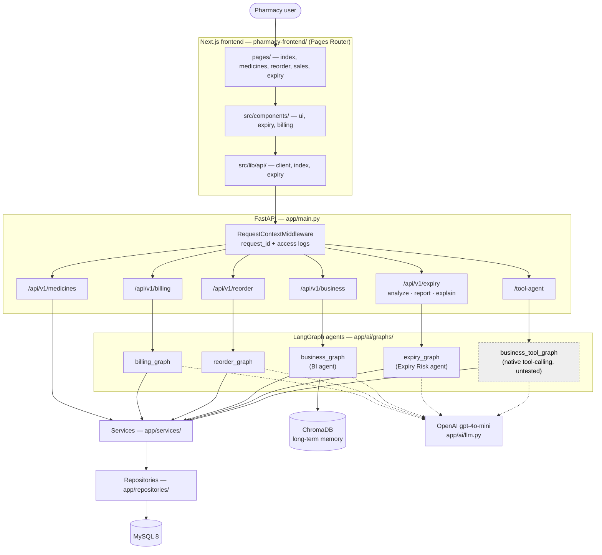
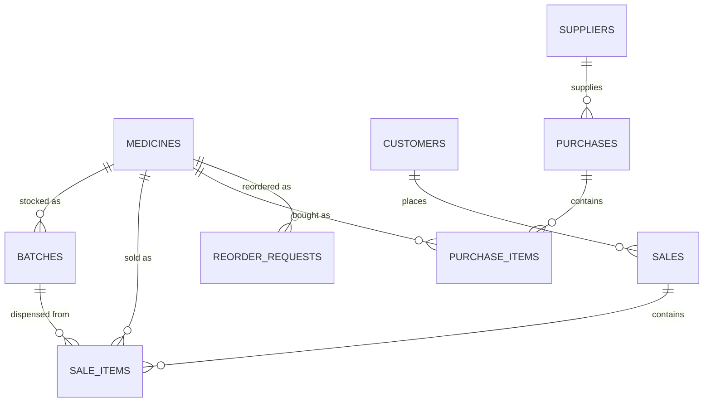

# System Architecture — Current State

> **This document describes what is implemented today.** Nothing is drawn here before
> it exists in the code. For where the project is going, see
> [`AI_Pharma_15LPA_Roadmap.md`](../AI_Pharma_15LPA_Roadmap.md) and
> [`05_architecture_audit.md`](05_architecture_audit.md).
>
> Last verified against the source: **2026-09-09**.
> Backend paths are relative to `pharmacy-core-backend/`, frontend paths to
> `pharmacy-frontend/`.

---

## 1. What exists today



**There is no Supervisor.** Each agent is reached by its own endpoint. Routing between
agents is a person choosing a URL.

**There is no authentication and no RBAC anywhere in the codebase.** Every endpoint is
open. That is Phase 5.

---

## 2. Layers

```text
Page          pages/                Next.js route. Owns filter/UI state.
Component     src/components/       Presentation. Renders what the API returned.
Hook          src/hooks/            Owns a feature's fetch sequence and its states.
API client    src/lib/api/          The only place fetch() is called.
                                    ---- HTTP ----
Router        app/routers/          HTTP only. Validates, delegates, returns.
Service       app/services/         Business logic. Owns transactions and orchestration.
Repository    app/repositories/     SQL only. No business rules.
Model         app/models/           SQLAlchemy ORM.

AI graph      app/ai/graphs/        LangGraph StateGraph per agent.
AI node       app/ai/nodes/         One step. Reads state, writes state.
AI tool       app/ai/tools/         The only route from a graph to data.
AI schema     app/ai/schemas/       Pydantic contracts for LLM input and output.
AI state      app/ai/state/         Typed graph state.
AI prompt     app/ai/prompts/       All prompt text. Never inlined in a node.

Core          app/core/             database, logging, context, middleware, tracing,
                                    time_range
```

The rule that shapes every AI feature here:

```text
LLM interprets  ->  validated structured query  ->  deterministic execution  ->  LLM explains
```

No agent is allowed to compute money, quantities, dates, risk scores or permissions.
Those are Python. The model chooses *what to ask for* and *how to say the answer*.

---

## 3. Agents

| Agent | Graph | Endpoint | Shape | Docs |
|---|---|---|---|---|
| Billing | `billing_graph.py` | `POST /api/v1/billing/*` | quote / price / confirm split | [`02_billing_agent.md`](02_billing_agent.md) |
| Reorder | `reorder_graph.py` | `GET`/`POST /api/v1/reorder` | deterministic reorder suggestions | [`03_reorder_agent.md`](03_reorder_agent.md) |
| Business Intelligence | `business_graph.py` | `POST /api/v1/business/analyze` | planner → fetcher → analyzer → reflection loop; ChromaDB memory | [`business_queries.md`](business_queries.md), [`04_bi_agent_qa_report.md`](04_bi_agent_qa_report.md) |
| **Expiry Risk** | `expiry_graph.py` | `POST /api/v1/expiry/{analyze,report,explain}` | planner → fetcher → analyzer, no loop; planner skipped when a query is supplied. **Has a UI** at `/expiry` | [`agents/expiry_risk_agent.md`](agents/expiry_risk_agent.md) |
| Tool Agent (experimental) | `business_tool_graph.py` | `POST /tool-agent/...` | native LangGraph tool calling | none — **untested**, `FakeLLM` does not script tool binding |

Billing is **not** being developed further as an AI agent. It stays as built; the
project's direction is operations intelligence, not billing.

---

## 4. Cross-cutting infrastructure

### Observability — [`observability.md`](observability.md)

```text
request_id   app/core/middleware.py    per HTTP request, echoed as X-Request-ID
run_id       app/ai/observability.py   per graph invocation, via ai_run()
thread_id    logged, never bound       identifies a conversation across many runs
```

Both ids are `ContextVar`s stamped onto every log record by a
`logging.setLogRecordFactory` hook. `observe_node`, `observe_tool` and
`LLMObservabilityHandler` time every node, tool and model call. LangSmith tracing is
optional and its real status is reported at boot.

Never logged: names, quantities, money, prompts, tool arguments, tool results,
secrets, or exception messages from the database.

### Testing — [`testing.md`](testing.md)

```text
579 passed, 5 skipped
  unit         431
  integration   96
  evaluation    52 passed + 5 skipped
```

**Frontend: no test runner installed yet.** Nothing in `pharmacy-frontend` is tested.
Vitest + React Testing Library is the next frontend task.

Two golden sets: BI (`golden_cases.json`, 30/30 graded) and Expiry
(`expiry_risk_cases.json`, 14/14 graded). No test calls a real LLM provider.

### Memory — `app/ai/memory/`

ChromaDB plus OpenAI embeddings, used by the BI agent only. Scoped per conversation
(`MemoryScope`) and gated by a confidence policy (`memory_policy.py`) so the model
cannot authorise its own writes. Not yet documented in `docs/features/`.

---

## 5. Data model



Tables: `medicines`, `batches`, `customers`, `sales`, `sale_items`, `suppliers`,
`purchases`, `purchase_items`, `returns`, `reorder_requests`. Migrations via Alembic.

---

## 6. What is deliberately not here yet

Drawn nowhere in this document because none of it exists:

Supervisor / multi-agent routing · frontend tests · Forecast Agent · Inventory Risk Agent · Supplier
Risk Agent · Procurement Agent · human-approval workflow · audit log · authentication ·
RBAC · RAG · Redis · MCP · Docker · CI/CD · deployment.

Add a component to the diagram in §1 **only** when its code exists and its document
does too.
