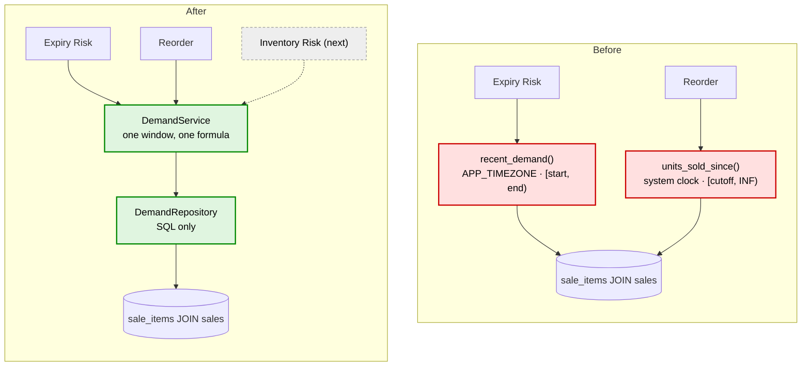

# DemandService — shared sales-velocity infrastructure

> Backend paths are relative to `pharmacy-core-backend/`.
> Last verified against the source: **2026-09-13**.

Not an agent. A deterministic domain service that three agents call. No LLM, no
LangGraph, no prompt, no tool binding anywhere in it.

---

## 1. Why it exists

Three features need "how fast does this medicine sell". Before this service, two of
them answered it with their own query, and the answers could differ for the same
medicine on the same day.

| | Expiry Risk | Reorder |
|---|---|---|
| Where | `expiry_repository.recent_demand()` | `sqlalchemy_reorder_repository.units_sold_since()` |
| Clock | `today()` → `APP_TIMEZONE` | `datetime.now()` → **system timezone** |
| Start | midnight of `as_of − N` | **a mid-day timestamp**, `now − N` |
| End | `< midnight as_of` | **none — unbounded** |
| Formula | `units / N` | `units / N` |

The formula already agreed. The **window** did not, in three separate ways:

1. **Two clocks.** One agent read `APP_TIMEZONE`, the other the system timezone.
2. **No midnight alignment.** The reorder cutoff was whatever time of day the report
   ran, so running it twice in one afternoon measured two different windows.
3. **No upper bound.** A back-dated correction or a future-dated sale counted toward
   the reorder agent's "last 30 days".

A pharmacist could open `/expiry` and the reorder screen, see two velocities for one
medicine, and find nothing on either screen explaining the gap.

---

## 2. Before and after



---

## 3. Files

| File | Role |
|---|---|
| `app/services/demand_service.py` | `DemandWindow`, `daily_velocity()`, `DemandService` |
| `app/repositories/demand_repository.py` | `DemandRepository` — the three SQL aggregates |
| `tests/unit/test_demand_service.py` | 35 tests, mostly boundaries |

---

## 4. Date semantics

A window is **half-open**:

```text
[start, end)        start included, end excluded
```

`DemandWindow.trailing(lookback_days=N, as_of=D)` gives:

```text
start = midnight of (D - N days)      INCLUDED
end   = midnight of D                 EXCLUDED
days  = N
```

Two consequences, both deliberate and both tested to the second:

**Today is excluded.** At 10am, today has banked two hours of trade. Counting it as a
whole day drags every average down, and the drag changes with the hour you press the
button. Ending at last midnight makes the same `as_of` always measure the same thing.

**The span is exactly `days` whole days**, which is what makes `units / days` an
honest average rather than a number divided by a window it does not match.
`test_the_window_spans_exactly_the_days_it_divides_by` pins this.

### Timezone

`as_of` defaults to `app.core.time_range.today()`, which reads `APP_TIMEZONE`
(`Asia/Kolkata`). A sale rung up at 00:30 IST belongs to that day's takings; resolving
in UTC would file it under the day before.

The datetimes compared against `sales.sold_at` are **naive**, because the column is
naive and stores server-local time. Correct only while the app server and database
share a timezone — true today, and the assumption to revisit at deployment. Same
caveat as `app/core/time_range.py`.

---

## 5. Public API

```python
DemandWindow.trailing(*, lookback_days: int, as_of: date | None = None) -> DemandWindow
DemandWindow.describe() -> str

daily_velocity(units_sold: int, days: int) -> float

DemandService(db: Session)
  .units_sold(window, *, medicine_ids=None)      -> dict[int, int]
  .daily_velocity(window, *, medicine_ids=None)  -> dict[int, float]
  .last_sale_dates(*, medicine_ids=None)         -> dict[int, date]
  .medicines_ever_sold(medicine_ids)             -> set[int]
```

### The velocity formula

```text
daily_velocity = units_sold / window.days      floored at 0.0
```

Unchanged from both previous implementations — they already agreed on this part.
Floored because `sale_items.quantity` has no CHECK constraint, so negative data is
reachable, and a negative velocity would flow straight into a days-of-cover division
and produce a confident absurdity.

### Absent vs zero

`units_sold` and `daily_velocity` **omit** medicines that sold nothing rather than
returning `0`. Absent means "no sales in this window"; a caller that wants a row per
medicine defaults at its own layer, where it knows which medicines it cares about.

`medicines_ever_sold` answers the different question — has this **ever** sold. A slow
mover and a product that launched last week need opposite advice, and a report that
conflates them tells a pharmacist to write off new stock.

`last_sale_dates` is deliberately **unbounded by any window**: "when did this last
move?" is only useful when the answer is allowed to be two years ago. It returns a
`date`, not a `datetime`, because every caller asks "how long ago" and handing back a
timestamp invites subtracting two of them and getting an hour-dependent answer.

---

## 6. SQL

Three queries, all aggregated in SQL. No query pulls sale lines into Python to sum
them there — that would move 1,818 rows on today's data and grow with the shop.

| Query | Table | Join | Filter | Aggregation | Index |
|---|---|---|---|---|---|
| `units_sold_by_medicine` | `sale_items` | `sales` on `sale_id` | `sold_at >= start AND < end` | `SUM(quantity) GROUP BY medicine_id` | `ix_sales_sold_at`, `ix_sale_items_sale_id`, `ix_sale_items_medicine_id` |
| `last_sale_at_by_medicine` | `sale_items` | `sales` on `sale_id` | `medicine_ids` if given | `MAX(sold_at) GROUP BY medicine_id` | `ix_sale_items_medicine_id` |
| `medicines_with_any_sales` | `sale_items` | — | `medicine_id IN (...)` | `GROUP BY medicine_id` | `ix_sale_items_medicine_id` |

**No index was added.** The three that exist already cover all three queries.

An empty `medicine_ids` list means **every medicine**, not none. That is what
`ExpiryRepository.recent_demand` has always done, and flipping it would have silently
emptied the expiry report.

---

## 7. Consumers

| Consumer | What it takes | Window |
|---|---|---|
| `ExpiryRiskService.assess()` | `units_sold`, `medicines_ever_sold` | 90d, `EXPIRY_DEMAND_LOOKBACK_DAYS` |
| `SQLAlchemyReorderRepository.get_reorder_candidates()` | `daily_velocity` | 30d, `VELOCITY_WINDOW_DAYS` |
| Inventory Risk agent | `daily_velocity`, `last_sale_dates` | next step, not built |

`ExpiryRiskService` builds its `DemandService` lazily from the repository's own
session (`ExpiryRiskService.demand`), so the fifteen existing call sites were not
touched and a report that finds no batches never opens a query it does not need.

---

## 8. Behaviour change — read this one

**Expiry Risk is unchanged.** Its semantics were adopted as canonical.

**Reorder changed.** Its velocity window moved from `[now − 30d, ∞)` on the system
clock to `[midnight(today − 30), midnight(today))` in `APP_TIMEZONE`. Concretely:

- today's partial sales no longer count
- future-dated and back-dated-forward sales no longer count
- the window no longer shifts with the time of day the report runs

That is the bug being fixed, not a regression. `days_since_added` in the same dict is
**not** a demand figure and deliberately kept its own `datetime.now()` reading —
measuring it from the window's midnight boundary would report a medicine added this
morning as `-1` days old.

---

## 9. Tests

```text
tests/unit/test_demand_service.py        35 passed
```

Boundary coverage, each asserted to the second: sale exactly at `start` (included),
one second before `start` (excluded), exactly at `end` (excluded), one second before
`end` (included), today at 10am (excluded), future-dated (excluded), outside the
lookback, reachable by a longer lookback. Plus zero sales, one sale, many sales
summed, multiple medicines kept separate, never-sold absent rather than zero, empty
list meaning all, the timezone default patched through the module, and the velocity
formula including its zero-floor and zero-day guard.

Full backend suite after the extraction: **572 passed, 0 failed** (545 before, +35
new, −8 moved out of `test_expiry_repository.py`).

---

## 10. Three beginner mistakes this design avoids

1. **Using a wall-clock timestamp as a window edge.** `now() - 30 days` makes the
   same report answer differently at 9am and 5pm, and nothing on screen says why.
2. **Leaving a range unbounded on one side.** `WHERE sold_at >= cutoff` reads as
   "recent" and means "recent, plus anything dated in the future".
3. **Returning `0` for a medicine with no history.** Zero is a measurement. Absent is
   the absence of one. Conflating them makes a product launched last week look like
   dead stock.
