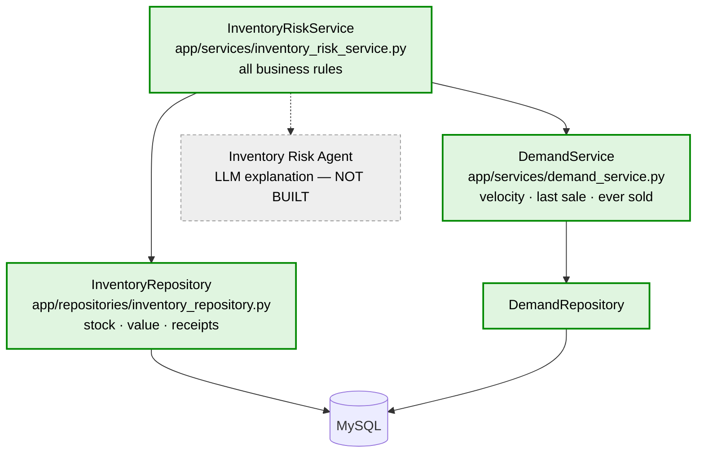
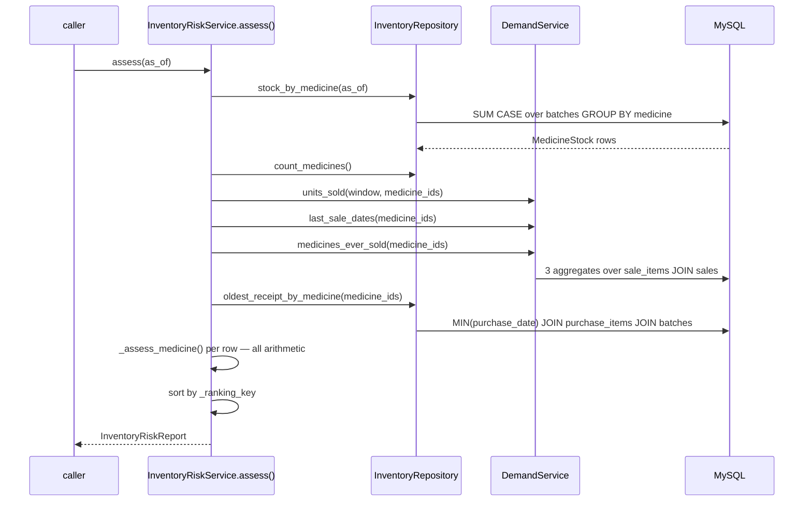

# Inventory Risk — deterministic domain and service

> Backend paths are relative to `pharmacy-core-backend/`.
> Last verified against the source: **2026-09-13**.

**Status: domain + service only.** No agent, no LangGraph node, no API endpoint, no
frontend, no LLM. Those are later steps. This document describes what exists.

---

## 1. Business problem

> "Which inventory is absorbing capital it shouldn't?"

Measured in the production database at discovery time:

```text
96 stocked medicines · Rs 28,38,654 total inventory at cost

zero stock (stockout now)          4
cover < 7d                         0
cover 7-30d                        1
cover 30-120d                      3
cover > 120d  (OVERSTOCK)         84   Rs 26,19,783
stock but no sales in 90d          8   Rs  1,96,191
never sold at all                  4
```

84 of 96 medicines hold more than four months of cover, carrying 92% of the capital,
and no existing report surfaces one of them. Stockout risk — the thing that *is*
already covered, by the Reorder agent — returns almost nothing on this data.

---

## 2. Supported use cases

| Capability | Supported | Why |
|---|---|---|
| Overstock | ✅ | stock, cost and velocity all exist |
| Dead stock | ✅ | last sale date from `DemandService` |
| Capital at risk | ✅ | `batches.cost_price` is NOT NULL |
| Stock age | ⚠️ **partial** | derivable, but only where a purchase line exists |
| Turnover ratio | ❌ | needs historical stock snapshots; none exist |
| Reorder priority | ❌ | `suppliers` has no lead time — do not invent one |
| Forecasting | ❌ | later milestone, deliberately out |

### The boundary with the Expiry agent

82 medicines appear on both the expiry list and the overstock list. That is not a bug
— one batch can be both "expires in 200 days" and "180 days of cover". The split:

```text
Expiry Risk       time-bound     will it expire before it sells?
Inventory Risk    capital-bound  is the money misallocated, regardless of dates?
```

So **this service never emits an expiry date.** Unsellable stock is reported as a unit
count only. `test_the_reasons_never_mention_an_expiry_date` enforces it. Without that
rule the two screens become indistinguishable.

---

## 3. Domain contract

`InventoryRiskItem`, a frozen dataclass in
[`app/services/inventory_risk_service.py`](../../pharmacy-core-backend/app/services/inventory_risk_service.py).

The grain is **per medicine**, not per batch: velocity is only knowable per medicine,
the decision ("stop reordering this") is per medicine, and the per-batch view already
exists in the expiry agent.

| Field | Type | Meaning | Source | Calculation |
|---|---|---|---|---|
| `medicine_id` | int | — | `medicines.id` | — |
| `medicine_name` | str | — | `medicines.name` | — |
| `stock_quantity` | int | Every unit on the shelf, expired or not | `batches.quantity` | `SUM` where `quantity > 0` |
| `inventory_value` | float | Money currently tied up | `batches` | `SUM(quantity × cost_price)` |
| `sellable_quantity` | int | Units that can still be dispensed | `batches` | `SUM` where `quantity > 0 AND expiry_date > as_of` |
| `weighted_avg_cost` | float | Value per unit across batches | derived | `inventory_value / stock_quantity` |
| `units_sold` | int | Units sold in the demand window | `DemandService` | `SUM(sale_items.quantity)` |
| `daily_velocity` | float | Units per day | `DemandService` | `units_sold / lookback_days` |
| `days_of_cover` | float \| **None** | How long sellable stock lasts | derived | `sellable_quantity / daily_velocity` |
| `last_sale_date` | date \| None | Most recent sale, all time | `DemandService` | `MAX(sales.sold_at)` |
| `days_since_last_sale` | int \| None | — | derived | `as_of − last_sale_date` |
| `ever_sold` | bool | Has any sales history | `DemandService` | existence check |
| `target_stock` | int | What the shop should hold | derived | `ceil(daily_velocity × target_cover_days)` |
| `excess_units` | int | Units above target | derived | `max(0, sellable_quantity − target_stock)` |
| `excess_value` | float | Money in the excess | derived | `excess_units × weighted_avg_cost` |
| `capital_at_risk` | float | Money being absorbed | derived | see §5 |
| `oldest_receipt_date` | date \| None | When the stock arrived | `purchases.purchase_date` | `MIN`, in-stock batches only |
| `stock_age_days` | int \| **None** | How long it has sat | derived | `as_of − oldest_receipt_date` |
| `risk_level` | enum | `dead`/`critical`/`high`/`medium`/`healthy` | derived | §7 |
| `risk_reasons` | list[str] | Facts behind the level | derived | §7 |

`InventoryRiskReport` wraps the items with `generated_for`, `demand_lookback_days`,
`target_cover_days`, `medicines_reviewed`, `medicines_without_stock`,
`total_inventory_value`, `total_capital_at_risk`, `counts_by_risk` and `notes`.

`counts_by_risk` is counted over **every** item, before any limit a caller applies
later. The expiry agent learned that one the hard way: counting after a limit caps
every summary card at the limit.

---

## 4. Database sources

Only columns that actually exist are used.

```text
medicines       id, name
batches         medicine_id, quantity, cost_price, expiry_date
sales           sold_at                  (via DemandService)
sale_items      medicine_id, quantity    (via DemandService)
purchases       purchase_date
purchase_items  batch_id, medicine_id, purchase_id
```

**Not used, because they do not exist:** reorder level, min stock, supplier lead time,
warehouse location, stock snapshots, order-placed vs order-received dates.

**Deliberately not used:** `batches.created_at`. Every in-stock batch in production
was written by one seeding run, so it puts all 238 of them in a single 30–90 day band
that has nothing to do with when stock arrived. A stock-age metric built on it would
be confident and wrong.

---

## 5. Formulas

```text
stock_quantity     = SUM(quantity)                      where quantity > 0
inventory_value    = SUM(quantity × cost_price)         where quantity > 0
sellable_quantity  = SUM(quantity)                      where quantity > 0 AND expiry_date > as_of
weighted_avg_cost  = inventory_value / stock_quantity

daily_velocity     = DemandService                      units_sold / 90, floored at 0
days_of_cover      = sellable_quantity / daily_velocity | None when velocity = 0

target_stock       = ceil(daily_velocity × target_cover_days)
excess_units       = max(0, sellable_quantity − target_stock)
excess_value       = excess_units × weighted_avg_cost

stock_age_days     = as_of − MIN(purchase_date)         | None when unknown

capital_at_risk    = inventory_value   if risk is DEAD
                   = excess_value      otherwise
```

### Capital is not cover

Expired stock is money already spent and cannot satisfy a day of demand. One number
cannot be both, so two flow through the service and are never mixed:

```text
stock_quantity     every positive batch       -> value, capital at risk
sellable_quantity  non-expired batches only   -> cover, target, excess
```

The reorder repository already excludes expired batches from cover for the same
reason. This is that rule, kept consistent.

### Zero velocity returns `None`, not infinity

Infinity is the tempting answer and it is wrong here. `inf` compares greater than
every cover threshold, so a never-sold medicine would be classified as overstock *by
the cover rule* — asserting it holds "365+ days of cover", a claim about a rate that
was never measured. `None` has no ordering, which forces the classifier to reach the
dead-stock rule instead. That is the honest description.

The reorder agent's own `days_of_cover` returns `inf`, and that is correct **there**:
it asks "is this urgent", and never-sold stock is never urgent to reorder. Different
question, different right answer.

### Capital at risk is not the whole shelf

A shop must hold stock to trade; the target cover is capital doing its job. Only the
part above target is trapped. Dead stock takes the full value — including the expired
part — because none of it is coming back through the till. A report that called all
inventory "at risk" would be telling a pharmacist to stop trading.

---

## 6. Thresholds

All in `InventoryRiskConfig`, all overridable by environment variable. None of these
is a fact about the world; they are business policy, which is exactly why they are
named and configurable rather than buried in an `if`.

| Threshold | Default | Env var | Why |
|---|---|---|---|
| `target_cover_days` | 60 | `INVENTORY_TARGET_COVER_DAYS` | Two months is a normal pharmacy reorder cycle — absorbs a supplier delay, still turns capital over |
| `overstock_cover_days` | 120 | `INVENTORY_OVERSTOCK_COVER_DAYS` | Twice the target. Past here, stock is storage, not a buffer |
| `high_cover_days` | 180 | `INVENTORY_HIGH_COVER_DAYS` | Half a year of capital in one product |
| `critical_cover_days` | 365 | `INVENTORY_CRITICAL_COVER_DAYS` | Most pharma stock has a two-year shelf life, so past a year there is a real chance of never selling it |
| `dead_stock_days` | 180 | `INVENTORY_DEAD_STOCK_DAYS` | Survives a seasonal product's off season; catches a genuinely dead line |
| `medium_value` | ₹2,000 | `INVENTORY_MEDIUM_VALUE` | Rupee gates exist because cover alone ranks a ₹40 slow mover above a ₹40,000 one |
| `high_value` | ₹10,000 | `INVENTORY_HIGH_VALUE` | |
| `critical_value` | ₹25,000 | `INVENTORY_CRITICAL_VALUE` | |
| `demand_lookback_days` | 90 | `INVENTORY_DEMAND_LOOKBACK_DAYS` | Matches the expiry agent |

`from_env()` validates that `target ≤ overstock < high < critical` and
`medium < high < critical`, and raises at construction if not. Overlapping thresholds
would make a risk level unreachable and the report silently misleading.

---

## 7. Risk classification

Checked worst-first; first match wins.

```text
DEAD       stock on hand AND (never sold OR days_since_last_sale >= 180)
CRITICAL   excess_value >= 25,000  OR  days_of_cover > 365
HIGH       excess_value >= 10,000  OR  days_of_cover > 180
MEDIUM     excess_value >=  2,000  OR  days_of_cover > 120
HEALTHY    otherwise
```

Dead is checked first because it is a statement about **movement**, and a medicine
with no movement has no meaningful cover figure to classify on.

Every level is reachable by **either** trapped capital **or** days of cover. Cover
alone would rank a ₹40 slow mover above a ₹40,000 one; capital alone would miss a
large pile of cheap stock that will never move. Both cases are tested.

### Three distinct dead-stock states

These are not the same business state and are not collapsed:

```text
never sold              ever_sold False, last_sale_date None   -> DEAD, "never sold"
sold, now inactive      days_since_last_sale >= 180            -> DEAD, "last sold N day(s) ago"
zero inventory          no capital tied up                     -> excluded from items,
                                                                  counted in medicines_without_stock
```

### No priority score

Ranking is `(risk order, −capital_at_risk, −inventory_value, medicine_id)`.

The M5 design report proposed `priority_score = excess_value × age_factor`. That was
dropped deliberately: it produces a number that looks precise, cannot be checked by
hand, and hides which of its two inputs drove the ranking. Sorting on the facts is
defensible all the way down. `medicine_id` last makes the order total, so a ranking
cannot flap between runs.

### Reasons

Plain statements of fact, no adjectives and no advice, each checkable against the
item's own fields:

```text
HIGH
- 400 unit(s) in stock
- last sold 30 day(s) ago
- selling 1.00 unit(s)/day
- 400 day(s) of cover
- 340 unit(s) above a 60-day target, worth Rs 34,000.00
- oldest stock received 120 day(s) ago
```

This is what makes the classification defensible without a score: a pharmacist can
disagree with a threshold, but not with the arithmetic.

---

## 8. Architecture



### Code-level flow



**Six queries total**, regardless of how many medicines exist. Not one per medicine.

---

## 9. Responsibilities

| Layer | Owns | Must not |
|---|---|---|
| `InventoryRepository` | stock, value, sellable split, receipt dates, catalogue size | any threshold, any risk judgement, any sales query |
| `DemandService` | velocity, last sale date, ever-sold | anything inventory-specific |
| `InventoryRiskService` | every formula, every threshold, classification, ranking, notes | any SQL, any LLM call |

The repository does **not** query sales. Adding a fourth sales query would recreate
exactly the divergence `DemandService` was extracted to end.

---

## 10. DemandService dependency

```python
window = DemandWindow.trailing(as_of=reference, lookback_days=90)
units_sold = self.demand.units_sold(window, medicine_ids=medicine_ids)
last_sales = self.demand.last_sale_dates(medicine_ids=medicine_ids)
ever_sold  = self.demand.medicines_ever_sold(medicine_ids)
```

Window semantics are inherited unchanged: `[midnight(as_of − 90), midnight(as_of))`
in `APP_TIMEZONE`, today excluded. The velocity division is
`demand_service.daily_velocity`, not a local copy — see
[`demand_service.md`](demand_service.md).

---

## 11. Edge cases

| Case | Behaviour |
|---|---|
| Zero inventory | Excluded from items, counted in `medicines_without_stock` |
| No batches at all | Same — counted, not dropped |
| Negative batch quantity | Excluded from totals, counted, reported in `notes`. Letting −20 cancel a real 100 would understate capital physically on the shelf |
| Only negative batches | Medicine excluded entirely |
| Zero velocity | `days_of_cover = None`, classified by the dead-stock rule |
| Never sold | `DEAD`, reason "never sold" |
| Sold once, long ago | `DEAD`, reason "last sold N day(s) ago" — a different state |
| Zero `cost_price` | Allowed. Value 0, stock still reported |
| Missing `cost_price` | Impossible — column is NOT NULL |
| Expired stock | Counts as capital, not as cover |
| Only expired stock | Still appears; zero cover, real capital |
| Expiring exactly today | Not sellable (`expiry_date > as_of`) |
| Multiple batches | Summed; cost is a weighted average |
| No purchase record | `stock_age_days = None`, never 0, and said in `notes` |
| Sold-out old batch | Does not age the medicine |
| Exactly at a threshold | Cover rules are `>`, so 120 is healthy and 121 is medium; rupee gates are `>=`, so exactly ₹25,000 is critical |
| 1,000,000 units | Arithmetic holds |

---

## 12. Testing

```text
tests/unit/test_inventory_repository.py     23 passed
tests/unit/test_inventory_risk_service.py   52 passed
                                            75 total
```

Both files exercise a real database session, so the SQL is under test rather than
mocked. Fixtures build one fact at a time; a shared scenario would make a failure
point at the fixture instead of the rule that broke.

One six-medicine pharmacy covers every reachable state end to end:

| medicine | stock | cost | sold | expected |
|---|---|---|---|---|
| Paracetamol 500 | 100 | ₹20 | 900 / 30d | healthy, 10 days cover |
| Amoxicillin 250 | 500 | ₹50 | never | dead, ₹25,000 |
| Cetirizine 10 | 400 | ₹100 | 90 / 30d | critical, 400 days cover |
| Cough Syrup 100ml | 60 | ₹40 | 50 / 200d | dead, inactive |
| Vitamin C 500 | 150 | ₹15 | 90 / 30d | medium, 150 days cover |
| Ibuprofen 400 | 60 + 40 expired | ₹10 | 90 / 30d | healthy, 40 unsellable |
| Domperidone 10 | 0 | ₹15 | never | excluded, counted |

Totals asserted exactly: ₹72,650 inventory, ₹62,750 capital at risk.

---

## 13. Known limitations

1. **Turnover is not computable.** Classic turnover is COGS ÷ *average* inventory, and
   there are no historical stock snapshots — only stock as it is now. Days-of-cover is
   the honest substitute. Real turnover needs a nightly snapshot table.
2. **Stock age has partial coverage.** `purchase_items.batch_id` is nullable, so a
   batch received before purchase tracking existed has no age. Reported as `None` and
   counted in `notes`, never guessed as 0.
3. **`purchase_items.batch_id` is unindexed.** The model indexes `purchase_id` and
   `medicine_id` only. At 500 purchase lines the scan is irrelevant, and the rule is
   not to add an index without evidence. Watch this query as purchase history grows;
   the fix is one index.
4. **Velocity is flat-projected history**, not a forecast. No seasonality, no trend,
   no confidence interval.
5. **Thresholds are policy, not truth.** The defaults are defensible for a general
   pharmacy; a shop with different cash flow should change them.
6. **No filtering or limiting yet.** `assess()` returns every stocked medicine. A
   query object arrives with the API step.
7. **No authentication.** This output exposes cost price and total capital — strictly
   more sensitive than the expiry report. Phase 5.

---

## 14. Recommended next step

Wrap this service in the API and agent layer: `InventoryRiskQuery` (a closed,
bounded Pydantic contract), `InventoryRepository`-backed tool, the three-node
LangGraph graph, and `POST /api/v1/inventory/{report,explain,analyze}` following the
expiry agent's two-call pattern.

The service stays authoritative. The model gets to explain it, never to compute it.
