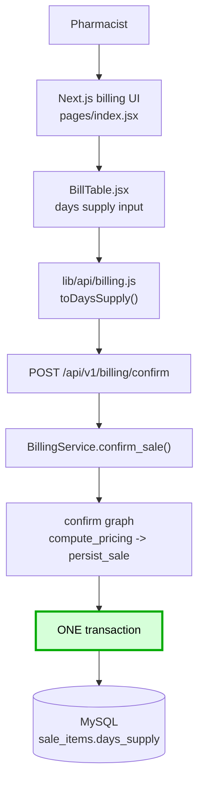
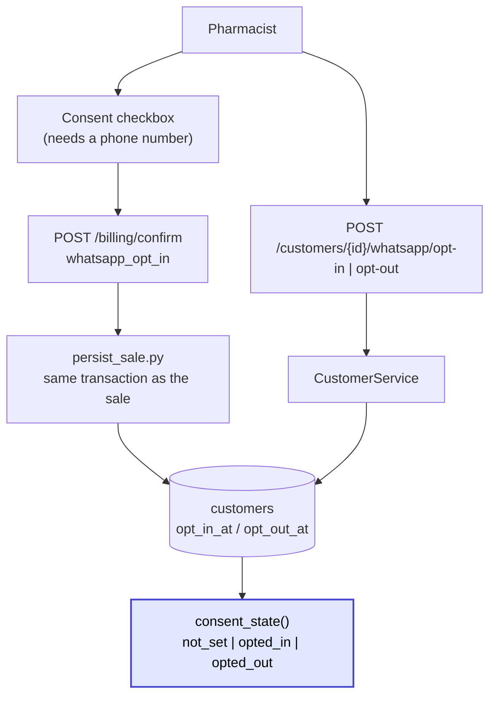
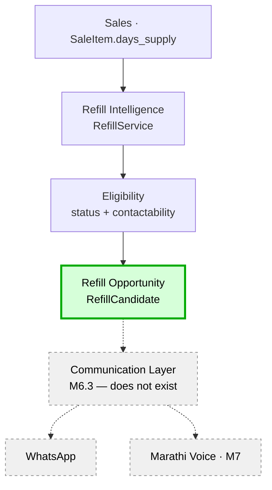
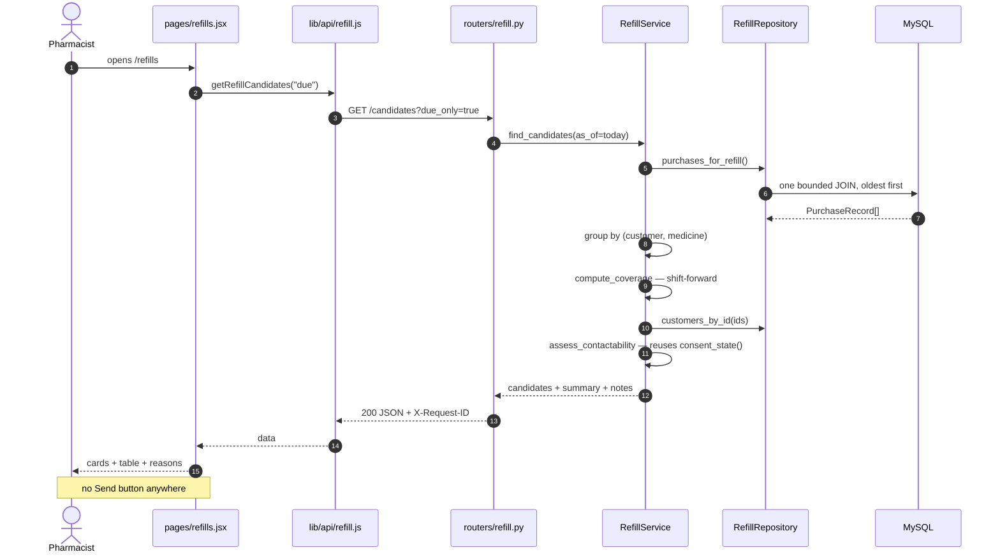

# Refill Intelligence — M6.1: Days Supply + WhatsApp Consent

> Last verified against the source, real MySQL and the full test suite: **2026-09-15**.
>
> This document covers **M6.1** (capturing the facts) and **M6.2** (the engine
> that interprets them). Jump to [M6.2](#m62--the-refill-intelligence--eligibility-engine).
>
> Neither milestone sends anything. There is no scheduler, no WhatsApp
> integration and no agent in the codebase.

---

## 1. Business purpose

A customer buys 10 tablets, takes 2 a day, and runs out in 5 days. If they have
not come back by then, the pharmacy would like to know — because the shop that
reminds you is the shop you return to.

The M6 research found that this is impossible today. **The system cannot compute
a refill date from any existing column.** `sale_items.quantity` alone is
meaningless: 10 tablets is 5 days or 10 days depending on a dosage nobody
records. A grep for `dosage|frequency|prescription|doctor|duration` across
`app/` returns three hits, all of them comments in fuzzy-matching code.

M6.1 closes that gap and nothing else. It records:

1. **how long each dispensed line is expected to last** (`days_supply`), and
2. **whether the customer agreed to be messaged** (WhatsApp consent).

It is deliberately valuable on its own: even with zero messaging built, a
pharmacist could query which customers are due and phone them.

## 2. Real-world scenario

```
Pharmacist bills 1 strip of Crocin for 9876543210.
The days-supply box is pre-filled with 5 from the catalogue.
The customer is on a 3-day course, so the pharmacist types 3.
The customer says yes to reminders; the pharmacist ticks the box.

Stored:  sale_items.days_supply = 3
         customers.whatsapp_opt_in_at = 2026-09-15 20:14
         customers.whatsapp_consent_source = "billing_counter"

The next customer does not know how long their medicine will last.
The pharmacist clears the box.

Stored:  sale_items.days_supply = NULL      -> no reminder will EVER be scheduled
```

## 3. Domain model

M6.1 adds **no new tables**. It adds columns to three existing ones, because the
facts belong to entities that already exist — a duration is a property of a
dispensed line, and consent is a property of a person.

| Entity | Column | Why it lives there |
|---|---|---|
| `SaleItem` | `days_supply` | The line is what was dispensed. Frozen, like `unit_price`. |
| `Medicine` | `default_days_supply` | A catalogue *hint* for the form. Never read when interpreting a past sale. |
| `Customer` | `whatsapp_opt_in_at`, `whatsapp_opt_out_at`, `whatsapp_opt_out_reason`, `whatsapp_consent_source` | Consent is about a person, not a transaction. |

### Why `days_supply` is frozen on the line

Identical reasoning to the existing frozen `unit_price`. If
`Medicine.default_days_supply` changes from 5 to 10 next year, every historic
sale must still read what was actually dispensed. A pinning test asserts exactly
this (`test_sale_item_days_supply_is_immune_to_a_later_catalogue_change`).

### Why consent is two timestamps, not a boolean

A boolean cannot answer *when* consent was given, and cannot represent a
re-opt-in. Three states are required and a boolean only has two — crucially,
**"never asked" and "asked and refused" must not collapse into one value**. The
first is a customer staff may still approach at the counter; the second is one
they may not.

```
both NULL                        -> not_set
opt_in only                      -> opted_in
opt_out only                     -> opted_out
both, opt_in strictly newer      -> opted_in     (re-opt-in)
both, otherwise                  -> opted_out    (ties favour "no consent")
```

Derived in exactly one place: `consent_state()` in
[`customer_service.py`](../../pharmacy-core-backend/app/services/customer_service.py).
Nothing is ever erased — an opt-out keeps the earlier opt-in timestamp, because
that history is precisely what an audit asks for.

**No `consent_version` column yet.** Versioning records *which wording* someone
agreed to, and in M6.1 no wording exists — nothing is sent and no template has
been written or approved. A version column now would store a fiction. It lands
in M6.3 with the real template.

## 4. Database changes

Migration `c7a1e4b90f21_m6_1_days_supply_and_whatsapp_consent.py`
(down_revision `a4750b4a1a2a`). Applied against live MySQL.

```sql
sale_items  + days_supply              INT NULL
            + CHECK (days_supply IS NULL OR days_supply BETWEEN 1 AND 365)
medicines   + default_days_supply      INT NULL  + same CHECK
customers   + whatsapp_opt_in_at       DATETIME NULL
            + whatsapp_opt_out_at      DATETIME NULL
            + whatsapp_opt_out_reason  VARCHAR(200) NULL
            + whatsapp_consent_source  VARCHAR(30) NULL
```

**Every column is nullable and there is no backfill.** That is a decision, not an
omission:

* All 537 historic sale lines keep `days_supply = NULL`, because nobody recorded
  a duration for them. Backfilling a guess would manufacture refill reminders
  for medicine bought months ago.
* All 41 existing customers keep `whatsapp_opt_in_at = NULL`, meaning "never
  asked". Under the DPDP Act consent cannot be inferred from a past
  transaction, so **the only lawful backfill is none**.

Verified post-migration: `0` sale_items with a non-null `days_supply`, `0`
customers with consent set.

No index was added.

> **Corrected by M6.2.** This section originally predicted that the refill engine
> would query its own `refill_schedules` table written at sale time, and would
> not scan `sale_items`. That is not what was built: M6.2 derives candidates
> from `sale_items` on every request, because a stored schedule goes stale the
> moment the customer buys again. The reasoning is in
> [M6.2 §2](#m62-2-persistence-decision--why-there-is-no-refill_schedules-table).
> No index is needed yet either — the scan is bounded by date and reads 1,140
> rows in about 40ms.

## 5. API contract

### `POST /api/v1/billing/confirm` — changed

```jsonc
{
  "items": [{
    "name": "Crocin 500", "quantity": 10, "unit": "strip",
    "medicine_id": 17, "batch_id": 1,
    "batch_number": "B1", "expiry_date": "2027-01-01",
    "days_supply": 5            // NEW. optional. null = unknown. 1..365
  }],
  "customer_name": "Anurag",
  "customer_phone": "9876543210",   // NOW NORMALISED AND VALIDATED
  "whatsapp_opt_in": false          // NEW. defaults to false, always
}
```

`POST /api/v1/billing/price-item` and the quote response now also return
`default_days_supply`, so the form can pre-fill.

### `/api/v1/customers` — new router

| Method | Path |
|---|---|
| `GET` | `/api/v1/customers?limit=` |
| `GET` | `/api/v1/customers/{id}` |
| `POST` | `/api/v1/customers/{id}/whatsapp/opt-in` |
| `POST` | `/api/v1/customers/{id}/whatsapp/opt-out` (optional `{"reason": "..."}`) |

Consent gets dedicated endpoints rather than a generic `PATCH`. **A PATCH that
can set `whatsapp_opt_in_at` to an arbitrary timestamp is a back-dating tool**,
and back-dated consent is the exact thing an audit exists to catch.
`POST .../opt-in` can only mean "they agreed, now".

`CustomerOut` returns the derived `consent_state`, the raw timestamps (an audit
asks *when*), and `phone_is_reachable` — separate from consent, because rows
written before M6.1 were never validated and a customer can be **opted in and
unreachable**.

## 6. Code-level round trip — days supply

```
pharmacy-frontend/pages/index.jsx
  handleAdd()                     seeds days_supply from line.default_days_supply
  handleDaysSupplyChange()        pharmacist overrides; raw string kept
  handleSaveBill()
   -> src/components/billing/BillTable.jsx    the per-row input
   -> src/lib/api/billing.js  confirmSale()
        toDaysSupply()            "" -> null, "5" -> 5, junk -> null
   -> src/lib/api/client.js   postJSON()
   -> POST /api/v1/billing/confirm
   -> app/routers/billing.py       confirm_sale()
   -> app/schemas/billing.py       ConfirmLineItem.days_supply  (ge=1 le=365)
                                   ConfirmSaleRequest._normalize_phone()
   -> app/services/billing_service.py  confirm_sale()
        packs days_supply into batched_items
   -> app/ai/graphs/billing_graph.py   get_confirm_graph()
   -> app/ai/nodes/compute_pricing.py  spreads **item, so days_supply rides through
   -> app/ai/nodes/persist_sale.py     with db.begin():
        SaleItem(..., days_supply=item.get("days_supply"))
   -> MySQL  sale_items.days_supply
```

`days_supply` **enters** at the `BillTable` input and is **persisted** at
`persist_sale.py`, inside the same `with db.begin():` block as the sale, its
lines, the customer and the stock decrement.

`.get("days_supply")` rather than `["days_supply"]` is deliberate: the spoken-
order path never carries a duration, and that absence must persist as `NULL`
rather than raise or become a guess.

## 7. Code-level round trip — consent

Two paths, because consent is captured at the counter but managed afterwards.

**Capture (at the sale):**
```
pages/index.jsx  whatsappOptIn checkbox  (disabled until a phone is entered)
 -> src/lib/api/billing.js  confirmSale(..., whatsappOptIn)
 -> POST /api/v1/billing/confirm   { "whatsapp_opt_in": true }
 -> app/schemas/billing.py     ConfirmSaleRequest.whatsapp_opt_in
 -> app/services/billing_service.py -> extracted_intent.whatsapp_opt_in
 -> app/ai/nodes/persist_sale.py    SAME transaction as the sale
      customer.whatsapp_opt_in_at   = datetime.now()
      customer.whatsapp_consent_source = "billing_counter"
 -> MySQL  customers
```

**Manage (afterwards):**
```
POST /api/v1/customers/{id}/whatsapp/opt-in | opt-out
 -> app/routers/customers.py
 -> app/services/customer_service.py   opt_in() / opt_out()
 -> app/repositories/customer_repository.py   get()
 -> MySQL  customers
```

Consent is written in the sale's transaction on purpose: **consent given for a
sale that never happened is not consent.** If the sale rolls back the consent
goes with it, asserted by
`test_a_failed_sale_persists_no_days_supply_and_no_consent`.

## 8. Architecture diagrams





No WhatsApp sending appears in either diagram, because none exists.

### The boundary this preserves

```
        Refill Domain  (M6.2 - does not exist yet)
              |
              v
        Refill Decision
              |
              v
      Communication Layer  (M6.3)
         |            |
         v            v
     WhatsApp       Voice (M7)
```

M6.1 captures **facts only**. Nothing in `app/core/phone.py`,
`customer_service.py` or the billing path imports a WhatsApp client, holds a
credential, or knows a template exists. `CustomerService` answers "may we contact
this person"; it does not contact anyone. That is what lets the Marathi voice
agent arrive later without touching consent — the question is the same whatever
wire carries the answer.

## 9. Validation rules

| Input | Rule | Where |
|---|---|---|
| `days_supply` omitted / `null` | Accepted — means **unknown**, no future reminder | schema default |
| `days_supply` 1..365 | Accepted | Pydantic `ge/le` + DB CHECK |
| `days_supply` = 0 | **Rejected (422)** | so "unknown" has exactly one spelling |
| negative, > 365, `"abc"`, `5.5` | Rejected (422) | Pydantic |
| `"5"` | Coerced to `5` | Pydantic |
| phone blank / whitespace | Accepted as "not given" | `normalize_indian_mobile` |
| phone `+91 98765-43210`, `09876543210`, `919876543210` | Normalised to `9876543210` | " |
| phone typed but no digits (`"abc"`, `"-"`) | **Rejected (422)** | " |
| phone not a 10-digit mobile starting 6-9 | Rejected (422) | " |

Two asymmetries are the interesting part:

**Zero is rejected, not treated as unknown.** Zero days of supply is not a thing.
Allowing it would give the refill engine two values meaning the same thing that
would behave differently in a date comparison.

**Blank phone is fine; a wrong phone is not.** A wrong number does not bounce —
it reaches a stranger, who receives an unsolicited message about medicine. The
field is optional, so rejecting never blocks a sale: the pharmacist clears it and
saves. Normalisation also means one human maps to one row, which the `UNIQUE`
index on `customers.phone` always assumed but nothing enforced.

## 10. Testing

| Tier | File | Count |
|---|---|---|
| Unit | `tests/unit/test_days_supply_and_consent.py` | 55 |
| Integration | `tests/integration/test_days_supply_api.py` | 23 |
| Frontend | `pharmacy-frontend/tests/billing-days-supply.test.jsx` | 18 |

Frontend tests mock at the `fetch` boundary per the project rule, so
`lib/api/billing.js` is real code under test — which matters here because
`toDaysSupply` is where an empty box becomes an explicit `null`, and mocking
`confirmSale` would skip exactly the conversion most likely to be wrong.

Notable cases:

* `test_omitted_days_supply_persists_as_null_not_a_default` — the catalogue
  default is 5 and must **not** leak into the sale. A hint that silently became
  the stored value would be indistinguishable from a pharmacist who actually
  confirmed 5 days, and the refill engine would schedule a reminder nobody
  authorised.
* `test_sale_item_days_supply_is_immune_to_a_later_catalogue_change` — history
  does not follow the catalogue.
* `test_a_failed_sale_persists_no_days_supply_and_no_consent` — the atomicity
  invariant, over HTTP.
* `test_identical_timestamps_resolve_to_opted_out` — an unknowable consent
  ordering reads as "no consent".
* `test_no_whatsapp_credentials_or_sending_happens_anywhere` — a guard against
  the most likely scope creep, quietly adding a send call to the opt-in path.

## 11. Security and privacy

* **No authentication exists in this project.** These endpoints are open, like
  every other endpoint. That is now more serious than before: `POST
  /customers/{id}/whatsapp/opt-in` records a legal consent and anyone who can
  reach the port can call it. Auth is Phase 5 and is **not** invented here.
  Documented, not hidden.
* **No credentials anywhere.** No WhatsApp token exists in this milestone, in
  the frontend or the backend, because nothing sends.
* **No health data in logs.** Nothing logs a medicine name against a phone
  number. The existing request logger records method, path, status and
  `request_id` only.
* **Consent is auditable**: who, when, from where, and the reason for withdrawal,
  with history preserved across re-opt-in.
* **Minimisation**: `days_supply` is a duration, not a diagnosis or a dosage. The
  system deliberately does not store what the medicine is *for*.

## 12. Current limitations

1. **No auth** (above) — the largest one.
2. **Consent can only be *captured* in the UI, not managed there.** The opt-out
   endpoint exists and is tested, but there is no customers screen yet. It lands
   with the M6.2 dashboard, where it has somewhere to live.
3. **`default_days_supply` can be set via the medicines API but has no UI field**
   in the add-medicine form yet, so in practice it is NULL for all 100 medicines
   and nothing pre-fills today.
4. **No `consent_version`** — deferred to M6.3 with the real template wording.
5. **Indian mobile numbers only.** `app/core/phone.py` is not a full E.164
   implementation; it is the seam where `phonenumbers` would go.
6. **Nothing validates that `days_supply` is plausible for the quantity.** A
   pharmacist can record 1 tablet lasting 300 days. Cross-checking would need
   dosage, which is out of the product boundary.
7. **The spoken-order path never captures duration.** A voice order produces
   `days_supply = NULL` on every line.

## 13. M6.2 readiness

M6.2 (the refill engine) can now be built, because the fact it needs exists.
Ready:

* `sale_items.days_supply` — the input to `supply_ends_on = sold_at + days_supply`
* `consent_state()` and `is_contactable()` — one definition, already tested,
  ready for the eligibility engine to inherit rather than re-implement
* normalised phone numbers, so one human is one row

Still missing, by design: `refill_schedules`, `notifications`, the eligibility
engine, the sweep command, and the dashboard.

**The real risk M6.2 inherits is not technical.** It is whether pharmacists
actually type the number. Until `default_days_supply` is populated and the field
proves itself at a real counter, every unused box is a `NULL` and a customer who
will never be reminded.

---
---

# M6.2 — The Refill Intelligence & Eligibility Engine

> Verified against the source, real MySQL and a real browser: **2026-09-15**.
>
> M6.2 decides **who looks due for a refill and why**. It contacts nobody. There
> is still no WhatsApp code, no scheduler, no message and no agent.

## M6.2 §1 Business purpose

M6.1 captured the fact. M6.2 turns facts into a decision a pharmacist can act on:

```
Bought Sept 10 · 5 days supply  ->  runs out Sept 15
Nothing bought since            ->  DUE, 0 days overdue
Opted in with a good number     ->  reachable
```

The deliverable is a **reliable business decision**, provable before any message
is ever sent.

## M6.2 §2 Persistence decision — why there is NO `refill_schedules` table

Four options were considered. **Approach A (derive from sales) was chosen.**

| | Why not |
|---|---|
| **B** persist `refill_schedules` | A stored schedule goes stale the instant the customer buys again, so every sale would have to invalidate rows — a second write path and a permanent source of drift from the sales data that is already the truth. |
| **C** persist `refill_opportunities` | Same staleness, plus it persists a *decision* rather than a fact. When a rule changes, every stored row is retrospectively wrong and there is no way to tell which. |
| **D** hybrid | Inherits both problems for a performance win the shop does not need yet. |
| **A** derive on read | One source of truth. Rules can change and history stays correct, because history is just the sales. |

**Idempotency follows for free: a pure query has nothing to duplicate.** Running
the scan twice produces identical output and writes zero rows — asserted by
`test_running_the_scan_twice_writes_nothing_and_changes_nothing`.

The idempotency *key* is still defined now, on `RefillCandidate.idempotency_key`:

```
refill:{source_sale_item_id}:{expected_refill_date}
```

Nothing uses it in M6.2. It exists so M6.3's `notifications` table can put a
UNIQUE constraint on exactly this string and get duplicate-send protection from
**the database** rather than from careful scheduler code. Keyed on the sale item
rather than `(customer, medicine, date)` so that correcting a sale line's
`days_supply` correctly becomes a *different* opportunity instead of silently
reusing the old one's "already sent" record.

**When this decision expires:** the scan reads every identified purchase in the
window (1,140 rows today, ~40ms). At roughly 100k purchases it should become an
incremental job with a persisted table. That is a scale problem, not a design
problem, and the engine's interface would not change.

## M6.2 §3 The coverage model — shift-forward

Refill dates use the pharmacy-standard **Proportion of Days Covered**
shift-forward rule, not naive `last_purchase + days_supply`:

```
coverage_end = max(purchase_date, previous_coverage_end) + days_supply
```

| Scenario | Naive | Shift-forward | Correct |
|---|---|---|---|
| Sept 1 (+5), Sept 3 (+5) | Sept 8 | **Sept 11** | shift-forward — they still had 3 days left on Sept 3 |
| Sept 1 (+5), Sept 20 (+5) | Sept 25 | **Sept 25** | both |
| Sept 1 (+30), Sept 25 (+30) | Oct 25 | **Oct 31** | shift-forward |

Naive reminds a customer who still has medicine in the drawer. Summing every
supply from the first purchase breaks the moment there is a gap.

**This also answers "already refilled" with no special case.** A customer who
bought again simply has coverage running into the future, so they are `NOT_DUE`.
That is why `ALREADY_REFILLED` is *not* a status — it would be a second state
that must behave identically to `NOT_DUE` everywhere, and one day would not. It
survives as a reason string, which is what a human reading the screen wants.

## M6.2 §4 Rules

| Question | Rule |
|---|---|
| **Same medicine?** | `medicine_id` only. The existing stable database identity, already on the sale line. No name, salt or fuzzy matching — it would make the engine non-deterministic for no MVP gain. Two brands of paracetamol are two medicines, which is also how the shelf works. |
| **Multiple purchases?** | Shift-forward over all of them. Not replace, not reset, not coexist. |
| **Multiple medicines?** | One candidate per `(customer, medicine)`, returned **flat** with `customer_id` on every row. Grouping is a presentation decision and the two consumers want different ones — the screen groups to avoid three rows for one person, M6.3 will group to send **one combined message** instead of three. |
| **Unknown duration?** | `UNKNOWN_DURATION`, no date, never a candidate. If the **latest** purchase has no `days_supply` the answer is unknown outright — falling back to an older known purchase would ignore what the customer most recently walked out with. |
| **`Medicine.default_days_supply`?** | **Never consulted.** It is a form pre-fill hint; using it retroactively would invent a duration for a sale where the pharmacist declined to give one — exactly what the NULL was recorded to prevent. |
| **Too old?** | Past `MAX_DAYS_OVERDUE` (120) it reverts to `NOT_DUE`. Someone 200 days past a 5-day course did not forget; a reminder then reads as a shop trawling old records. |
| **Walk-ins?** | Excluded at the SQL level. ~38% of this shop's sales are anonymous and a reminder needs someone to remind. |
| **Timezone** | `app.core.time_range.today()`, the app's single implementation. `sold_at` is a naive local datetime, so `.date()` gives the day the pharmacist would recognise — an 11:30 PM sale belongs to that day. |

## M6.2 §5 Two orthogonal axes, deliberately not merged

```
status         NOT_DUE | DUE | UNKNOWN_DURATION
contactability CONTACTABLE | NO_PHONE | NOT_OPTED_IN | OPTED_OUT
```

Merging them would give a state explosion (`DUE_BUT_OPTED_OUT`,
`DUE_BUT_NO_PHONE`…) and — far worse — **would let a consent gap delete a real
business opportunity**. A customer who is due but never opted in is still a
customer the pharmacist may want to phone. The engine reports both facts and lets
the caller decide.

`assess_contactability()` reuses `consent_state()` from the customer domain
rather than re-reading the timestamps. Phone validity is checked *as well as*
consent because they are independent: rows written before M6.1 were never
validated, so a customer can be **opted in and unreachable**.

Opt-out is checked **first**, before the phone. Reporting `NO_PHONE` for someone
who explicitly refused would hide the refusal behind a data-quality problem, and
a later "fix the numbers" job would quietly make them contactable again.

## M6.2 §6 API

```
GET /api/v1/refill/candidates
    ?as_of=            reference date (default: today, pharmacy timezone)
    &lookback_days=    default 400 — must exceed max days_supply (365)
    &due_only=         default true
    &contactable_only= default FALSE — a due customer with no consent still matters
    &customer_id= &medicine_id= &limit=
```

Read-only. There is no POST because M6.2 creates nothing. The future scheduler
will call `RefillService` directly rather than HTTP-requesting its own process.

`summary` counts the **whole scan**, before filters and limit, so the screen can
honestly say "1 of 143" rather than counting its own rows.

## M6.2 §7 Code-level round trip

```
app/main.py
  app.include_router(refill_router.router)
   -> app/routers/refill.py            list_candidates()
   -> app/schemas/refill.py            RefillCandidatesResponse (the contract)
   -> app/services/refill_service.py   RefillService.find_candidates()
        repository.purchases_for_refill(as_of, lookback_days)
         -> app/repositories/refill_repository.py
              SELECT customers, medicines, sales, sale_items
              WHERE customer_id IS NOT NULL AND sold_at IN [start, end)
              ORDER BY sold_at        -> list[PurchaseRecord]
         -> MySQL
        group by (customer_id, medicine_id)
        compute_coverage(records)          shift-forward
        repository.customers_by_id(ids)    one query, no N+1
        assess_contactability(customer)    reuses consent_state()
        RefillService._decide(...)         status + days_overdue + reason
   -> RefillCandidate[]  + RefillSummary + notes
   -> JSON over HTTP  (X-Request-ID)
   -> pharmacy-frontend/src/lib/api/client.js     getJSON()
   -> pharmacy-frontend/src/lib/api/refill.js     getRefillCandidates(view)
        toQuery(view) -> {due_only, contactable_only}
   -> pharmacy-frontend/pages/refills.jsx          picks loading/success/empty/error
   -> src/components/refill/RefillSummaryCards.jsx   counts from the API summary
      src/components/refill/RefillTable.jsx          the ranked rows
      src/components/refill/RefillStatusBadge.jsx    two separate style maps
   -> the browser
```

## M6.2 §8 Diagrams





## M6.2 §9 Observability

Reuses the existing `request_id` / `run_id` correlation. Events:

| Event | Level | Carries |
|---|---|---|
| `refill_scan_started` | INFO | `as_of`, `lookback_days` |
| `refill_candidate_found` | INFO | `customer_id`, `medicine_id`, `source_sale_item_id`, `days_overdue`, `contactability` |
| `refill_candidate_suppressed` | DEBUG | `customer_id`, `medicine_id`, `why` |
| `refill_scan_completed` | INFO | counts + `returned` |

`refill_candidate_found` deliberately carries **ids, not names or phone numbers**.
An application log is not the place to accumulate a readable list of who takes
what medicine. Ids are enough to investigate and are not meaningful at a glance
to anyone who happens to see the log.

## M6.2 §10 Why there is no LangGraph agent

There is nothing to plan, no tool to choose and no ambiguity to resolve. Every
rule is arithmetic on dates a pharmacist recorded. An LLM would make the engine
slower, more expensive and **non-deterministic** — and a non-deterministic answer
about somebody's medicine is a defect, not a feature.

AI earns its place later, on customer *replies* (including Marathi), where the
input really is free-form natural language. Not here.

## M6.2 §11 Testing

| Tier | File | Count |
|---|---|---|
| Unit | `tests/unit/test_refill_service.py` | 32 |
| Integration | `tests/integration/test_refill_api.py` | 20 |
| Frontend | `pharmacy-frontend/tests/refills-page.test.jsx` | 19 |

The integration tests use a **real database with no mocked repository**. Sales are
written through the ORM rather than the billing endpoint so `sold_at` can be
controlled precisely; the billing path's own persistence of `days_supply` is
already covered by M6.1's suite.

Two guard tests are worth naming:

* `test_the_response_never_mentions_a_channel` — fails if a message body or
  template name ever appears in the payload, i.e. if the refill domain starts
  knowing about WhatsApp.
* `offers no way to send anything` (frontend) — fails if a Send button appears.

## M6.2 §12 Verified round trip (real MySQL, real browser)

A real sale was made through `POST /api/v1/billing/confirm` with
`days_supply: 1`, `whatsapp_opt_in: true` and phone `+91 90000 11111`:

```
sale_id 552 · phone normalised to 9000011111 · customer created
GET /candidates                  -> due: 0     (bought today, 1 day supply)
GET /candidates?as_of=2026-09-16 -> due: 1, contactable_due: 1
   M62 Roundtrip · Paracetamol 500mg
   last=2026-09-15 runs_out=2026-09-16 overdue=0 due/contactable
   "Supply runs out today."
```

`/refills` in headless Chrome: empty state (correct — nobody due today), summary
showing **852 no-duration** and **42 customers scanned**, no skeletons left, no
"whatsapp" anywhere in the DOM, no Send button, no SQL or traceback leaked.

## M6.2 §13 Known limitations

1. **852 of 853 (customer, medicine) pairs report `unknown_duration`.** Every
   historic sale predates M6.1, so the engine is correct but nearly silent. This
   is the honest state of the product: the feature is gated on pharmacists
   entering the duration at billing, not on this engine.
2. **No persistence, so no suppression.** A pharmacist cannot dismiss or snooze a
   candidate — it would reappear on the next scan. Snoozing needs a table, and
   that table belongs with M6.3's notifications.
3. **Full scan on every request.** Fine at 1,140 purchases (~40ms); see §2 for
   when to revisit.
4. **No scheduler.** Nothing runs the scan automatically. The screen is
   pull-only.
5. **No auth**, as everywhere else — and this screen lists customer names and
   phone numbers alongside the medicines they take, which makes it the most
   privacy-sensitive page in the system.
6. **`MAX_DAYS_OVERDUE` and `lookback_days` are constants**, not per-pharmacy
   settings.
7. **Dose-level realism is out of scope.** A 30-tablet pack recorded as 30 days
   is trusted even if the customer takes two a day; the engine trusts the
   recorded duration and does not infer from quantity.

## M6.2 §14 M6.3 readiness

Ready to build the communication layer:

* `RefillCandidate` is a stable, channel-agnostic decision
* `idempotency_key` is defined and asserted stable — M6.3's `notifications`
  table can take a UNIQUE on it
* `contactability` already answers "may we message this person", from one
  definition shared with the customer domain
* candidates are flat and carry `customer_id`, so one combined message per
  customer is a grouping away

M6.3 adds: `notifications` + `notification_attempts`, the WhatsApp Cloud API
adapter, approved templates, webhooks for delivery status, quiet hours, and the
sweep that turns a candidate into a queued message. **None of it should require
changing this engine.** If it does, the boundary was drawn in the wrong place.
