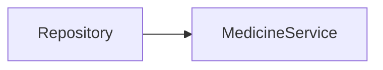
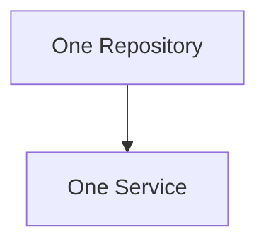
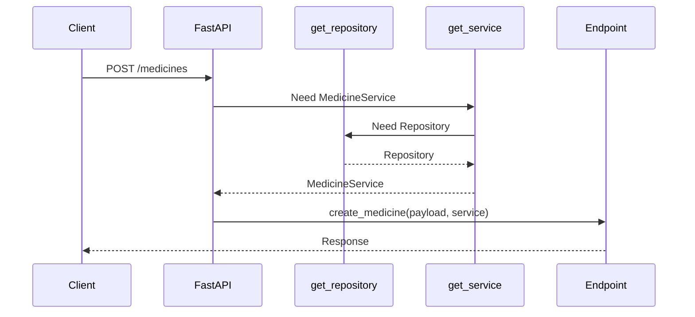
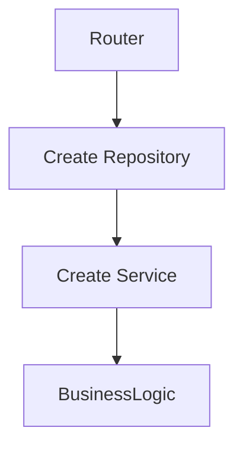
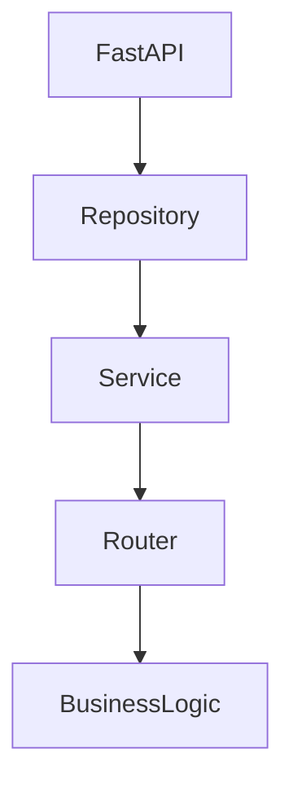
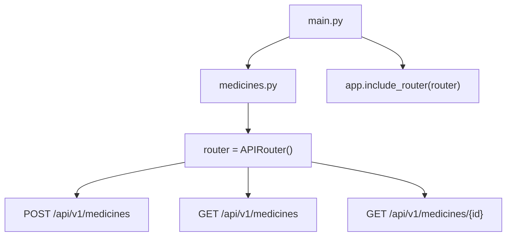
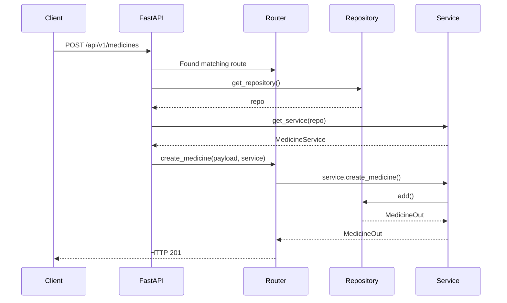

# FastAPI 3-Layer Architecture (Explained Like a Kid)

## The Big Picture

Think of a restaurant.

There are 3 people:

1. Router = Waiter
2. Service = Chef
3. Repository = Store Room

```text
Customer
   ↓
Router
   ↓
Service
   ↓
Repository
```

---

# Router (Waiter)

The router talks to the outside world.

Example:

```python
@router.get("/medicines/{id}")
def get_medicine(id: int):
    return service.get_medicine(id)
```

The router should:

- Receive HTTP requests
- Validate input
- Return HTTP responses

The router should NOT:

- Check business rules
- Talk directly to the database
- Calculate prices

Think:

> Router = "Someone asked for something."

---

# Repository (Store Room)

Repository only stores and fetches data.

Example:

```python
class MedicineRepository:

    def get_by_id(self, medicine_id: int):
        return self._store.get(medicine_id)
```

Repository should:

- Save data
- Read data
- Update data
- Delete data

Repository should NOT:

- Check duplicates
- Check expiry
- Calculate discounts
- Raise HTTP errors

Think:

> Repository = "I store things. That's all."

---

# Service (Chef)

Service is the brain.

Example:

```python
class MedicineService:

    def __init__(self, repo):
        self.repo = repo

    def get_medicine(self, medicine_id: int):

        medicine = self.repo.get_by_id(medicine_id)

        if medicine is None:
            raise MedicineNotFound()

        if medicine.is_expired:
            raise MedicineExpired()

        if medicine.stock == 0:
            raise OutOfStock()

        return medicine
```

Service should:

- Check duplicates
- Check stock
- Check expiry
- Apply business rules
- Coordinate repositories

Think:

> Service = "I make decisions."

---

# Bad Example (No Service Layer)

Everything goes into Router.

```python
@router.get("/medicines/{id}")
def get_medicine(id: int):

    medicine = repo.get_by_id(id)

    if medicine is None:
        raise HTTPException(404)

    if medicine.is_expired:
        raise HTTPException(400)

    if medicine.stock == 0:
        raise HTTPException(400)

    return medicine
```

Looks okay today.

But then:

```python
@router.post("/sale")
def sell_medicine(id: int):
```

needs the same checks.

And:

```python
@router.post("/reserve")
def reserve_medicine(id: int):
```

needs the same checks.

Now code gets copied everywhere.

---

# Good Example (With Service Layer)

Router:

```python
@router.get("/medicines/{id}")
def get_medicine(id: int):
    return service.get_medicine(id)
```

Service:

```python
def get_medicine(id: int):

    medicine = repo.get_by_id(id)

    if medicine is None:
        raise MedicineNotFound()

    if medicine.is_expired:
        raise MedicineExpired()

    if medicine.stock == 0:
        raise OutOfStock()

    return medicine
```

Repository:

```python
def get_by_id(id: int):
    return self._store.get(id)
```

Each layer has one responsibility.

---

# Why Keep Service Even If It Is One Line?

Today:

```python
def get_medicine(id):
    return repo.get_by_id(id)
```

Looks useless.

Tomorrow:

```python
def get_medicine(id):

    medicine = repo.get_by_id(id)

    if medicine.is_expired:
        raise MedicineExpired()

    if medicine.stock == 0:
        raise OutOfStock()

    if medicine.recalled:
        raise MedicineRecalled()

    return medicine
```

Now business logic exists.

If you remove Service today, you'll need to add it later.

---

# Simple Rule

## Router

Handles HTTP.

```text
Request → Response
```

---

## Service

Handles business rules.

```text
Decisions
```

---

## Repository

Handles data storage.

```text
Database
```

---

# One-Line Interview Answer

Router handles HTTP.

Service handles business logic.

Repository handles data storage.

That's the entire purpose of the 3-layer architecture.

# Medicine Service Layer - Simple Explanation

## Goal

Understand why we have a Service layer and what each method does.

---

# create_medicine()

This method contains business logic.

Flow:

```text
Client sends medicine
        ↓
Normalize name
        ↓
Check duplicate
        ↓
Duplicate?
    Yes → Raise DuplicateMedicineError
    No
        ↓
Ask Repository to save
        ↓
Return MedicineOut
```

---

## Example

Frontend sends:

```json
{
  "name": "Dolo",
  "mrp": 50,
  "hsn_code": "3004",
  "manufacturer": "Micro Labs"
}
```

Service receives:

```python
payload: MedicineCreate
```

---

### Step 1: Normalize Name

```python
normalized = normalize_medicine_name(payload.name)
```

Examples:

```text
"Dolo"      → "dolo"
" DOLO "    → "dolo"
"dolo"      → "dolo"
```

Purpose:

```text
Treat all variations as the same medicine.
```

---

### Step 2: Check Duplicate

Ask repository:

```python
existing = self._repo.find_by_normalized_name(normalized)
```

Repository checks storage.

Possible result:

```python
existing = None
```

means:

```text
Medicine does not exist.
```

OR

```python
existing = MedicineOut(...)
```

means:

```text
Medicine already exists.
```

---

### Step 3: Reject Duplicate

```python
if existing is not None:
    raise DuplicateMedicineError(payload.name)
```

Meaning:

```text
Stop immediately.
Do not save.
```

---

### Step 4: Save Medicine

Service already made the decision.

Now Repository does the storage.

```python
return self._repo.add(
    name=payload.name,
    mrp=payload.mrp,
    hsn_code=payload.hsn_code,
    manufacturer=payload.manufacturer,
)
```

---

## Why Service Calls Repository?

Because:

```text
Service = Decision Maker
Repository = Storage Layer
```

Service decides:

```text
Can this medicine be created?
```

Repository decides:

```text
How do I store it?
```

---

# get_medicine()

Current implementation:

```python
def get_medicine(self, medicine_id: int) -> MedicineOut | None:
    return self._repo.get_by_id(medicine_id)
```

---

## What Happens?

```text
User asks for Medicine #5
        ↓
Service asks Repository
        ↓
Repository returns medicine
        ↓
Service returns medicine
```

No business rules yet.

---

## Why Keep Service?

Today:

```python
return self._repo.get_by_id(id)
```

Tomorrow:

```python
medicine = self._repo.get_by_id(id)

if medicine.is_expired:
    raise MedicineExpired()

return medicine
```

Business logic may be added later.

---

# list_medicines()

Current implementation:

```python
def list_medicines(self) -> list[MedicineOut]:
    return self._repo.list_all()
```

---

## What Happens?

```text
User wants all medicines
        ↓
Service asks Repository
        ↓
Repository returns list
        ↓
Service returns list
```

No business rules yet.

---

# Why Not Call Repository Directly From Router?

Bad:

```python
@router.get("/{id}")
def get_medicine(id):

    medicine = repo.get_by_id(id)

    if medicine.is_expired:
        ...

    if medicine.stock == 0:
        ...

    if medicine.recalled:
        ...

    return medicine
```

Router becomes messy.

---

Good:

```python
@router.get("/{id}")
def get_medicine(id):
    return service.get_medicine(id)
```

Router stays simple.

---

# Responsibilities

## Router

Handles:

```text
HTTP Requests
HTTP Responses
Status Codes
```

Example:

```python
@router.get(...)
```

---

## Service

Handles:

```text
Business Rules
Duplicate Checks
Pricing Rules
Stock Rules
Expiry Rules
```

Example:

```python
create_medicine()
```

---

## Repository

Handles:

```text
Store Data
Read Data
Update Data
Delete Data
```

Example:

```python
add()
get_by_id()
list_all()
```

---

# One-Line Interview Answer

```text
Router handles HTTP.

Service handles business logic.

Repository handles data storage.
```

That is the essence of the 3-layer architecture.

# FastAPI Step 1.7 - APIRouter & Depends() (Explained Like a Kid)

## First Forget The Technical Terms

Imagine your pharmacy has grown.

Earlier:

```text
One person handled everything.
```

Now:

```text
Medicine Counter
Customer Counter
Sales Counter
Billing Counter
```

Each counter has a specialist.

This is exactly what APIRouter does.

---

# Before APIRouter

main.py

```python
app = FastAPI()

@app.get("/health")
def health():
    pass

@app.post("/medicines")
def create_medicine():
    pass

@app.get("/medicines")
def list_medicines():
    pass

@app.get("/customers")
def list_customers():
    pass

@app.post("/sales")
def create_sale():
    pass
```

Looks okay today.

After 6 months:

```python
@app.get(...)
@app.post(...)
@app.put(...)
@app.delete(...)
@app.get(...)
@app.post(...)
@app.put(...)
@app.delete(...)
@app.get(...)
@app.post(...)
```

Hundreds of endpoints.

main.py becomes a jungle.

---

# After APIRouter

Create:

```text
routers/
├── medicines.py
├── customers.py
├── sales.py
├── billing.py
```

Now:

## medicines.py

```python
router = APIRouter()

@router.post(...)
def create_medicine():
    pass

@router.get(...)
def list_medicines():
    pass
```

---

## sales.py

```python
router = APIRouter()

@router.post(...)
def create_sale():
    pass
```

---

## main.py

```python
app = FastAPI()

app.include_router(medicine_router)
app.include_router(sales_router)
app.include_router(customer_router)
```

Clean.

---

# What Is Prefix?

Router:

```python
router = APIRouter(
    prefix="/api/v1/medicines"
)
```

Means:

Every endpoint automatically gets:

```text
/api/v1/medicines
```

---

Example:

```python
@router.get("")
```

Actually becomes:

```text
GET /api/v1/medicines
```

---

Example:

```python
@router.get("/{id}")
```

Actually becomes:

```text
GET /api/v1/medicines/1
```

---

# What Are Tags?

```python
tags=["medicines"]
```

Only for Swagger UI.

Without tags:

```text
50 endpoints mixed together
```

With tags:

```text
Medicines
Customers
Sales
Billing
```

Much cleaner.

---

# What Is Depends()?

This is the most important concept.

Imagine:

```text
Router needs a Service.
```

Who creates the Service?

Instead of:

```python
service = MedicineService(...)
```

inside every endpoint,

FastAPI does it automatically.

---

# Without Depends()

```python
@router.post("")
def create_medicine(payload):

    repo = InMemoryMedicineRepository()

    service = MedicineService(repo)

    return service.create_medicine(payload)
```

You repeat this everywhere.

Bad.

---

# With Depends()

```python
@router.post("")
def create_medicine(
    payload,
    service = Depends(get_service)
):
```

FastAPI automatically does:

```python
service = get_service()
```

before endpoint runs.

Think:

```text
Router says:

"FastAPI, please give me a Service."

FastAPI says:

"Sure."
```

---

# Dependency Chain

Request arrives.

```text
POST /api/v1/medicines
```

FastAPI sees:

```python
Depends(get_service)
```

So:

```text
Call get_service()
```

---

Inside get_service():

```python
repo = get_repository()
```

---

Inside get_repository():

```python
return _repository
```

---

Final chain:

```text
Request
   ↓
get_repository()
   ↓
Repository
   ↓
get_service()
   ↓
MedicineService
   ↓
Endpoint
```

---

# Why Is This Useful?

Today:

```python
InMemoryMedicineRepository
```

Tomorrow:

```python
MySQLMedicineRepository
```

Only provider changes.

Service code remains same.

Router code remains same.

---

# What Is HTTPException?

Service raises:

```python
DuplicateMedicineError
```

Service knows:

```text
Business Rule Failed
```

Service DOES NOT know HTTP.

---

Router converts:

```python
DuplicateMedicineError
```

into:

```python
HTTPException(
    status_code=409
)
```

Think:

```text
Service says:
"This medicine already exists."

Router translates that into:

HTTP 409 Conflict
```

---

# Full Request Flow

Client:

```json
{
  "name": "Dolo"
}
```

↓

Router receives request

↓

FastAPI creates Service using Depends()

↓

Service normalizes name

↓

Service checks duplicate

↓

Repository searches storage

↓

Duplicate found?

YES

↓

Service raises:

```python
DuplicateMedicineError
```

↓

Router catches it

↓

Router converts it into:

```python
HTTPException(409)
```

↓

Client receives:

```json
{
  "detail": "Medicine already exists"
}
```

---

# Why Not Return DuplicateMedicineError Directly?

Because clients understand:

```text
HTTP Status Codes
```

They do NOT understand:

```text
Python Exceptions
```

Router acts as translator.

---

# One-Line Memory Trick

```text
APIRouter
=
Group related endpoints
```

```text
Depends()
=
Give me the object I need
```

```text
HTTPException
=
Convert Python errors into HTTP responses
```

---

# Interview Answer

Why separate APIRouter files?

1. Keeps main.py small and maintainable.

2. Each domain (medicines, customers, sales) owns its own endpoints, making the codebase easier to scale and navigate.

---

# Final Architecture

```text
Client
   ↓
Router
   ↓
Depends()
   ↓
Service
   ↓
Repository
   ↓
Storage
```

Router → HTTP

Service → Business Logic

Repository → Data Access

# FastAPI Depends() Explained Like a Software Engineer

## Forget FastAPI For 5 Minutes

Let's write normal Python.

---

# Step 1 - Create Repository

```python
repo = InMemoryMedicineRepository()
```

Now:

```text
repo
```

exists in memory.

---

# Step 2 - Create Service

Service needs a repository.

```python
service = MedicineService(repo)
```

Visual:



---

# Step 3 - Use Service

```python
service.create_medicine(payload)
```

Visual:

```mermaid
graph LR
    Repo[Repository] --> Service[MedicineService]
    Service --> Create[create_medicine()]
```

Nothing special.

Just Python.

---

# Problem Starts Here

Imagine 20 endpoints.

```python
@router.post("/medicines")
def create_medicine(payload):

    repo = InMemoryMedicineRepository()
    service = MedicineService(repo)

    return service.create_medicine(payload)
```

Another endpoint:

```python
@router.get("/medicines")
def list_medicines():

    repo = InMemoryMedicineRepository()
    service = MedicineService(repo)

    return service.list_medicines()
```

Another endpoint:

```python
@router.get("/medicines/{id}")
def get_medicine(id):

    repo = InMemoryMedicineRepository()
    service = MedicineService(repo)

    return service.get_medicine(id)
```

Same code everywhere.

---

# Bigger Problem

Look carefully.

Every request creates:

```python
repo = InMemoryMedicineRepository()
```

New repository.

New dictionary.

New storage.

Imagine:

Request 1:

```python
repo1 = {}
```

Store Dolo.

```python
{
    1: "Dolo"
}
```

Request ends.

---

Request 2:

```python
repo2 = {}
```

Fresh empty dictionary.

Now Dolo disappears.

Bad.

---

# Solution Before Depends()

Create one global repository.

```python
repo = InMemoryMedicineRepository()

service = MedicineService(repo)
```

Visual:



Endpoints:

```python
@router.post("")
def create_medicine(payload):
    return service.create_medicine(payload)

@router.get("")
def list_medicines():
    return service.list_medicines()
```

Works.

---

# Why Is Global Object Bad?

Today:

```python
service = MedicineService(repo)
```

Tomorrow:

```python
service = MedicineService(
    mysql_repo,
    redis_cache,
    email_service,
    logger,
)
```

Testing becomes hard.

Changing implementations becomes hard.

Everything becomes tightly coupled.

---

# FastAPI's Solution = Depends()

Instead of:

```python
service = MedicineService(repo)
```

manually,

tell FastAPI:

```python
service: MedicineService = Depends(get_service)
```

Meaning:

```text
FastAPI,
before calling my endpoint,
please create the service
and give it to me.
```

---

# What Actually Happens?

You write:

```python
def get_service():

    repo = get_repository()

    return MedicineService(repo)
```

---

Endpoint:

```python
@router.post("")
def create_medicine(
    payload,
    service: MedicineService = Depends(get_service)
):
```

---

FastAPI secretly does:

```python
service = get_service()

create_medicine(
    payload=payload,
    service=service
)
```

You never see this code.

FastAPI does it.

---

# Actual Runtime Flow



---

# Real Meaning Of Depends()

Depends means:

```text
I need an object.
I don't care how it's created.
FastAPI, please provide it.
```

---

# Why Do Big Companies Love This?

Today:

```python
return InMemoryMedicineRepository()
```

Tomorrow:

```python
return MySQLMedicineRepository()
```

Only this changes:

```python
def get_repository():
    return MySQLMedicineRepository()
```

Everything else remains unchanged.

Service:

```python
service.create_medicine()
```

still works.

Router:

```python
Depends(get_service)
```

still works.

---

# Most Important Mental Model

Without Depends:



Router creates everything.

Router becomes responsible for everything.

---

With Depends:



FastAPI creates dependencies.

Router only handles requests.

Cleaner.

---

# One Sentence Definition

Depends() is FastAPI's built-in dependency injection system.

It automatically creates and injects objects your endpoint needs, so you don't manually create them inside every route.

# How main.py and medicine.py Are Connected

## Step 1

When you run:

```bash id="c1g5v7"
uvicorn app.main:app --reload
```

Python opens:

```python id="j2r2jg"
app/main.py
```

and executes it from top to bottom.

---

## Step 2

Python sees:

```python id="d1qqxj"
from app.routers import medicines as medicines_router
```

Now Python loads:

```text id="u6jv7r"
app/routers/medicines.py
```

completely.

Everything inside medicines.py executes.

---

## Step 3

During loading:

```python id="t4rm7o"
router = APIRouter(
    prefix="/api/v1/medicines",
    tags=["medicines"]
)
```

is created.

Think:

```text id="7w3c4r"
A box of medicine endpoints is created.
```

Inside this box:

```python id="f9utcm"
@router.post("")
```

```python id="d73j5n"
@router.get("")
```

```python id="m2f2ul"
@router.get("/{medicine_id}")
```

are registered.

So router now knows:

```text id="9jh8wv"
POST  /api/v1/medicines

GET   /api/v1/medicines

GET   /api/v1/medicines/{id}
```

---

## Step 4

Control returns to:

```python id="0djv0k"
main.py
```

and reaches:

```python id="u5wyvk"
app.include_router(
    medicines_router.router
)
```

This is the MOST IMPORTANT LINE.

Think:

```text id="9g7s4l"
Hey FastAPI,

Take all endpoints from medicines.py

and register them into the application.
```

---

## Visual



---

# What Happens When Request Arrives?

Client sends:

```http id="w4vmgx"
POST /api/v1/medicines
```

---

FastAPI checks:

```text id="0qz6z8"
Which router owns this URL?
```

Finds:

```text id="69lvrt"
medicines.py
```

because:

```python id="0fxwdi"
prefix="/api/v1/medicines"
```

matches.

---

FastAPI then executes:

```python id="5mt0wa"
create_medicine()
```

inside medicines.py

---

# But Wait...

create_medicine() needs:

```python id="8h5z1i"
service: MedicineService
```

Where does it come from?

---

FastAPI sees:

```python id="ktlrj7"
Depends(get_service)
```

and says:

```text id="7q4w7f"
Before calling create_medicine()

I must execute get_service()
```

---

# get_service()

FastAPI executes:

```python id="k7zvub"
get_service()
```

But get_service needs:

```python id="7g6bjd"
repo
```

---

FastAPI sees:

```python id="a3pvbh"
Depends(get_repository)
```

and executes:

```python id="x9gzyh"
get_repository()
```

---

get_repository returns:

```python id="8pnv6t"
_repository
```

which is:

```python id="cb3v9w"
InMemoryMedicineRepository()
```

---

Now FastAPI has:

```python id="n9y1jf"
repo
```

and can create:

```python id="2ut2r7"
MedicineService(repo)
```

---

Now FastAPI finally calls:

```python id="hdk1u2"
create_medicine(
    payload=...,
    service=MedicineService(...)
)
```

---

# Full Runtime Flow



---

# One Simple Sentence

This line:

```python id="h3s4aq"
app.include_router(
    medicines_router.router
)
```

is the wiring.

Without it:

```text id="kfyh9d"
FastAPI does not know medicines.py exists.
```

With it:

```text id="clx3w4"
FastAPI imports all medicine endpoints
and makes them available as APIs.
```

That single line is literally connecting `main.py` to `medicines.py`.

# Phase 2 - Persistent Storage (Explained Like a Kid)

## What Is Changing?

### Phase 1

Current Architecture:

```text
Router
↓
Service
↓
Repository
↓
Python Dictionary (_store)
```

Repository stores data in:

```python
_store = {}
```

Example:

```python
{
    1: "Dolo",
    2: "Crocin"
}
```

Problem:

When server restarts:

```bash
uvicorn app.main:app --reload
```

everything disappears.

```python
{}
```

All medicines are lost.

---

## Phase 2

Replace:

```python
_store = {}
```

with:

```text
MySQL Database
```

New Architecture:

```text
Router
↓
Service
↓
Repository
↓
SQLAlchemy
↓
MySQL
```

Now data survives server restarts.

---

# Why Repository Pattern Was Worth It

Current:

```text
Router
↓
Service
↓
Repository
↓
Dictionary
```

Future:

```text
Router
↓
Service
↓
Repository
↓
MySQL
```

Only Repository changes.

Router stays the same.

Service stays the same.

This is the biggest advantage of clean architecture.

---

# MySQL

Think of MySQL as a giant filing cabinet.

Instead of storing data in memory:

```python
_store = {}
```

Store it permanently in tables.

Example:

| id  | name   |
| --- | ------ |
| 1   | Dolo   |
| 2   | Crocin |

Even after restarting the server:

```bash
CTRL + C
uvicorn app.main:app --reload
```

data still exists.

---

# SQLAlchemy

## What Is It?

SQLAlchemy is an ORM.

ORM means:

```text
Object Relational Mapper
```

---

## Why Do We Need It?

You write Python.

Database understands SQL.

Example:

You write:

```python
medicine = Medicine(
    name="Dolo",
    mrp=50
)
```

Database understands:

```sql
INSERT INTO medicines
(name, mrp)
VALUES ('Dolo', 50);
```

SQLAlchemy acts as a translator.

---

## Visual

```text
Python Code
      ↓
SQLAlchemy
      ↓
SQL Queries
      ↓
MySQL
```

---

## Without SQLAlchemy

You write:

```sql
SELECT *
FROM medicines
WHERE id = 1;
```

---

## With SQLAlchemy

You write:

```python
session.get(Medicine, 1)
```

SQLAlchemy generates SQL automatically.

---

# Alembic

## What Problem Does It Solve?

Suppose today your table is:

| id | name |

Tomorrow you want:

| id | name | expiry_date |

How do you track that change?

---

Bad Way:

Open MySQL manually.

Add columns manually.

Nobody knows what changed.

Production becomes messy.

---

Good Way:

Use Alembic.

Think:

```text
Git for Database Schema
```

Every database change is tracked.

Example:

```text
Migration 1:
Created medicines table

Migration 2:
Added expiry_date column

Migration 3:
Added stock column
```

Everything is version-controlled.

---

# Session

Most beginners get confused here.

Think:

```text
Temporary conversation with the database
```

Request arrives.

```text
Need medicine data
```

Open session.

Read data.

Save data.

Close session.

---

Visual

```text
Request Starts
      ↓
Open Session
      ↓
Read / Write Database
      ↓
Close Session
      ↓
Request Ends
```

Each request gets its own session.

---

# Transactions

Most Important Database Concept

---

## Bank Transfer Example

Your account:

```text
1000
```

Friend account:

```text
500
```

Transfer:

```text
100
```

Steps:

```text
1. Deduct from your account
2. Add to friend's account
```

---

Problem:

```text
Step 1 succeeds

Server crashes

Step 2 fails
```

Now:

```text
You = 900
Friend = 500
```

₹100 disappeared.

Disaster.

---

## Transaction Solution

```text
Either BOTH succeed

OR

BOTH fail
```

No middle state.

---

## Pharmacy Example

Medicine Sale:

```text
Decrease Stock
Create Invoice
Create Sale Record
```

If any step fails:

```text
Rollback Everything
```

Database returns to original state.

---

# Three Production Mistakes

## Mistake 1

Manually changing database schema.

Bad:

```text
Open MySQL Workbench

Add column manually
```

Problem:

Alembic doesn't know about the change.

Future migrations break.

---

Correct:

```bash
alembic revision --autogenerate
alembic upgrade head
```

All schema changes go through migrations.

---

## Mistake 2

No UNIQUE or Index.

Example:

```text
normalized_name
```

used for duplicate checks.

Without index:

```text
Scan 100,000 rows
```

Slow.

With index:

```text
Jump directly to row
```

Fast.

---

## Mistake 3

No Transaction.

Example:

```text
Decrease Stock
Create Invoice
Create Sale Record
```

If middle step fails:

```text
Broken data
```

Use transaction so everything succeeds or everything rolls back.

---

# Tools You Must Remember

## MySQL

```text
Stores data permanently
```

---

## SQLAlchemy

```text
Python ↔ SQL Translator
```

Also known as ORM.

---

## Alembic

```text
Version control for database schema
```

---

## Session

```text
Temporary database conversation
for one request
```

---

## Transaction

```text
All operations succeed

OR

All operations fail
```

No partial updates.

---

# Ultimate Phase 2 Mental Model

Phase 1:

```text
Router
↓
Service
↓
Repository
↓
Dictionary
```

Phase 2:

```text
Router
↓
Service
↓
Repository
↓
SQLAlchemy ORM
↓
MySQL Database
```

Everything above Repository remains exactly the same.

Only the storage layer becomes real, persistent, scalable, and production-ready.

# ERD Design Explained Like a Kid Before Writing Any SQLAlchemy

## First Understand What ERD Means

ERD = Entity Relationship Diagram

Big words.

Think:

```text
ERD = Blueprint of Database
```

Before building a house, an architect draws:

```text
Bedroom
Kitchen
Bathroom
Doors
Windows
```

Before building a database, a backend engineer draws:

```text
Tables
Columns
Relationships
```

That drawing is called ERD.

---

# Why Design ERD Before Writing Code?

Imagine you directly start coding:

```python
class Medicine(Base):
```

After 3 months you realize:

```text
Oops...
One medicine can have multiple batches.
```

Now:

```text
Database
API
Services
Queries
```

everything must be rewritten.

Expensive mistake.

---

# Think Like A Real Pharmacy

A pharmacy is NOT just medicines.

It has:

```text
Medicines
Batches
Customers
Sales
Sale Items
Users
```

Each becomes a database table.

---

# Entity 1: Medicines

Question:

```text
What products do we sell?
```

Answer:

```text
Crocin
Dolo
Pantop
```

Store in:

```text
MEDICINES
```

Example:

| id  | name   | mrp |
| --- | ------ | --- |
| 1   | Crocin | 25  |
| 2   | Dolo   | 30  |

Think:

```text
Medicine table = Product Catalog
```

Like Amazon catalog.

---

# Entity 2: Batches

This is where beginners get confused.

Medicine:

```text
Crocin
```

is a concept.

But physical stock arrives in batches.

Example:

January Purchase:

```text
Batch A
100 boxes
Expiry Dec 2026
```

March Purchase:

```text
Batch B
50 boxes
Expiry May 2027
```

Same medicine.

Different stock.

Different expiry.

Different supplier.

Different cost.

Therefore:

```text
One Medicine
       ↓
Many Batches
```

Visual:

```text
Crocin
   ↓
Batch A
Batch B
Batch C
```

---

# Why FEFO Needs Batches

FEFO:

```text
First Expire First Out
```

Suppose:

```text
Batch A expires in Dec 2026

Batch B expires in May 2027
```

Customer buys Crocin.

Which batch should be sold?

```text
Batch A
```

because it expires first.

Without Batch table:

```text
Impossible
```

---

# Entity 3: Customers

Question:

```text
Who bought the medicine?
```

Store:

```text
Name
Phone
```

Example:

| id  | name  |
| --- | ----- |
| 1   | Rahul |
| 2   | Priya |

---

# Entity 4: Sales

Question:

```text
One bill / invoice
```

Example:

```text
Bill #101

Customer:
Rahul

Total:
₹300
```

Store in:

```text
SALES
```

---

# Entity 5: Sale Items

Most important concept.

One Sale:

```text
Invoice #101
```

contains:

```text
Crocin × 2
Dolo × 3
Pantop × 1
```

Can we store all this in SALES table?

No.

Create:

```text
SALE_ITEMS
```

Example:

| sale_id | medicine |
| ------- | -------- |
| 101     | Crocin   |
| 101     | Dolo     |
| 101     | Pantop   |

Think:

```text
SALE = Invoice

SALE_ITEMS = Lines inside invoice
```

---

# Entity 6: Users

Question:

```text
Which employee created the sale?
```

Store:

```text
Admin
Pharmacist
```

Example:

| id  | email                             |
| --- | --------------------------------- |
| 1   | [admin@x.com](mailto:admin@x.com) |

---

# Relationships

This is the REAL reason for ERD.

---

## Relationship 1

```text
Medicine
     ↓
Many Batches
```

Example:

```text
Crocin
   ↓
Batch A
Batch B
Batch C
```

Database:

```text
MEDICINES 1 → MANY BATCHES
```

---

## Relationship 2

```text
Customer
     ↓
Many Sales
```

Example:

```text
Rahul
```

can buy:

```text
Invoice 1
Invoice 2
Invoice 3
```

Database:

```text
CUSTOMERS 1 → MANY SALES
```

---

## Relationship 3

```text
Sale
     ↓
Many Sale Items
```

Example:

```text
Invoice #101
```

contains:

```text
Crocin
Dolo
Pantop
```

Database:

```text
SALES 1 → MANY SALE_ITEMS
```

---

## Relationship 4

```text
Batch
     ↓
Many Sale Items
```

Example:

```text
Batch B1142
```

sold many times.

Database:

```text
BATCHES 1 → MANY SALE_ITEMS
```

---

# Why Sale Items Links To Batch

Not Medicine.

Example:

Government says:

```text
Recall Batch B1142
```

Need answer:

```text
Which customers received
medicine from Batch B1142?
```

If sale_items only stores medicine:

```text
Impossible
```

If sale_items stores batch:

```text
Easy
```

---

# Why Store Unit Price In Sale Item?

January:

```text
Crocin = ₹25
```

June:

```text
Crocin = ₹30
```

Customer bought in January.

Invoice should still show:

```text
₹25
```

Therefore:

```text
SALE_ITEMS.unit_price
```

stores historical snapshot.

---

# Why Cost Price Belongs To Batch

Scenario 1:

```text
Supplier A → ₹18

Supplier B → ₹22
```

Same medicine.

Different costs.

---

Scenario 2:

```text
Jan Batch → ₹18

Jul Batch → ₹25
```

Costs changed over time.

Batch stores history correctly.

Medicine table cannot.

---

# Final ERD Mental Model

```text
USERS
  ↓
SALES
  ↓
SALE_ITEMS
  ↓
BATCHES
  ↓
MEDICINES

CUSTOMERS
  ↓
SALES
```

Think of it as:

```text
Customer buys
        ↓
Sale created
        ↓
Sale contains items
        ↓
Items came from batches
        ↓
Batches belong to medicines
```

This entire design is completed BEFORE writing a single SQLAlchemy model.

That's why senior engineers spend hours on ERD design and minutes writing actual table code.

# Complete Pharmacy Business Flow Example

The easiest way to understand the entire ERD is to follow one real customer purchase.

---

## Customer Buys Medicine

Customer:

```text
Rahul
```

comes to the pharmacy and wants:

```text
2 Crocin
1 Dolo
```

---

## Step 1 - Customer Record

Customers Table:

| id  | name  |
| --- | ----- |
| 1   | Rahul |

Think:

```text
Who is buying?
```

Answer:

```text
Rahul
```

---

## Step 2 - Sale Created

A bill is generated.

Sales Table:

| id  | customer_id | total_amount |
| --- | ----------- | ------------ |
| 101 | 1           | 80           |

Think:

```text
A Sale = One Invoice
```

Example:

```text
Invoice #101
Customer: Rahul
Total: ₹80
```

---

## Step 3 - Sale Contains Items

What is inside Invoice #101?

```text
Crocin × 2
Dolo × 1
```

Sale Items Table:

| id  | sale_id | batch_id | quantity |
| --- | ------- | -------- | -------- |
| 1   | 101     | 501      | 2        |
| 2   | 101     | 601      | 1        |

Think:

```text
Sale = Invoice

Sale Items = Products inside invoice
```

---

## Step 4 - Items Came From Batches

Crocin stock may exist in multiple batches.

Batches Table:

| id  | medicine_id | batch_number | expiry_date |
| --- | ----------- | ------------ | ----------- |
| 501 | 1           | CRO-A1       | Dec 2026    |
| 502 | 1           | CRO-B1       | May 2027    |
| 601 | 2           | DOL-A1       | Jan 2027    |

Because of FEFO:

```text
First Expire First Out
```

the system chooses:

```text
Batch CRO-A1
```

since it expires earlier.

---

## Step 5 - Batch Belongs To Medicine

Medicines Table:

| id  | name   |
| --- | ------ |
| 1   | Crocin |
| 2   | Dolo   |

Relationship:

```text
Batch CRO-A1
        ↓
      Crocin
```

A batch is physical stock.

A medicine is the product definition.

---

# Complete Story

```text
Rahul
  ↓
Invoice #101
  ↓
Crocin × 2
Dolo × 1
  ↓
Batch CRO-A1
Batch DOL-A1
  ↓
Crocin
Dolo
```

---

# Full Business Flow

```text
Customer Rahul
      ↓
creates
      ↓
Sale #101
      ↓
contains
      ↓
2 Crocin
1 Dolo
      ↓
sold from
      ↓
Batch CRO-A1
Batch DOL-A1
      ↓
which belong to
      ↓
Crocin Medicine
Dolo Medicine
```

---

# Why This Design Matters

Imagine a government recall notice arrives:

```text
Recall Batch CRO-A1
```

Question:

```text
Which customers received medicine
from Batch CRO-A1?
```

Database Trace:

```text
Batch CRO-A1
      ↓
Sale Items
      ↓
Sale #101
      ↓
Rahul
```

Result:

```text
Rahul received medicine
from recalled Batch CRO-A1
```

This is why pharmaceutical systems are designed around:

```text
Customer
   ↓
Sale
   ↓
Sale Item
   ↓
Batch
   ↓
Medicine
```

Every relationship exists because it answers a real business question.

# From Frontend → MySQL (What Really Happens Internally)

## Goal

User clicks:

```text
Add Medicine
```

Frontend sends:

```json
{
  "name": "Crocin",
  "mrp": 25,
  "hsn_code": "3004",
  "manufacturer": "GSK"
}
```

How does this become a row inside MySQL?

---

# Phase 1 Architecture

Today

```text
Frontend
   ↓
Router
   ↓
Service
   ↓
Repository
   ↓
Dictionary
```

---

# Phase 2 Architecture

Tomorrow

```text
Frontend
   ↓
Router
   ↓
Service
   ↓
Repository
   ↓
SQLAlchemy
   ↓
MySQL
```

---

# Step 1 - Frontend Sends Request

Frontend:

```javascript
await fetch("/api/v1/medicines", {
  method: "POST",
  body: JSON.stringify({
    name: "Crocin",
    mrp: 25,
    hsn_code: "3004",
  }),
});
```

Request reaches FastAPI.

---

# Step 2 - Router Receives Request

File:

```text
routers/medicines.py
```

Endpoint:

```python
@router.post("")
def create_medicine(
    payload: MedicineCreate,
    service: MedicineService
):
```

FastAPI automatically converts:

```json
{
  "name": "Crocin",
  "mrp": 25
}
```

into:

```python
MedicineCreate(
    name="Crocin",
    mrp=25
)
```

---

# Step 3 - Router Calls Service

```python
service.create_medicine(payload)
```

Visual:

```text
Router
  ↓
Service
```

Router does not know database.

Router does not know SQL.

---

# Step 4 - Service Applies Business Rules

File:

```text
services/medicine_service.py
```

```python
service.create_medicine()
```

Service:

```text
Normalize name
Check duplicate
Validate business rules
```

Example:

```python
normalized = "crocin"
```

---

Then:

```python
repo.add(...)
```

Visual:

```text
Router
  ↓
Service
  ↓
Repository
```

---

# Step 5 - Repository Creates ORM Object

File:

```text
repositories/medicine_repository.py
```

Instead of:

```python
_store[id] = medicine
```

we now create:

```python
medicine = Medicine(
    name="Crocin",
    mrp=25,
    hsn_code="3004"
)
```

Question:

Is this in database?

Answer:

```text
NO
```

Very important.

Right now:

```text
Only Python Memory
```

---

# What Is Medicine?

File:

```text
models/medicine.py
```

```python
class Medicine(Base):
```

This is called:

```text
ORM Model
```

---

Think:

```text
Medicine Class
        ↕
medicines Table
```

---

Visual

```text
Python Object

Medicine(
   name="Crocin"
)

        ↕

MySQL Row

+----+---------+
| id | Crocin  |
+----+---------+
```

---

# How SQLAlchemy Knows This Mapping?

Model:

```python
class Medicine(Base):

    __tablename__ = "medicines"

    id = Column(Integer)

    name = Column(String)

    mrp = Column(DECIMAL)
```

This means:

```text
Python Class
      ↓
Database Table
```

Mapping:

```text
Medicine.id
       ↓
medicines.id

Medicine.name
       ↓
medicines.name

Medicine.mrp
       ↓
medicines.mrp
```

---

# What Is Session?

Most Important Concept

Think:

```text
Session = Conversation With Database
```

Example:

You enter bank.

Talk to employee.

Finish work.

Leave.

---

Database equivalent:

```text
Open Session
     ↓
Read Data
     ↓
Write Data
     ↓
Close Session
```

---

Visual

```text
Request Starts
      ↓
Session Opens
      ↓
Database Work
      ↓
Session Closes
      ↓
Request Ends
```

---

# Why Not Talk To MySQL Directly?

Because opening connections is expensive.

Session manages:

```text
Connection

Transactions

Caching

Tracking Changes
```

for us.

---

# Session.add()

Repository:

```python
session.add(medicine)
```

Question:

Did SQL execute?

Answer:

```text
NO
```

Still not.

---

Current state:

```text
Python Object Created
Session Tracking It
```

Think:

```text
Medicine object placed
inside a "pending changes" basket
```

---

# Session.commit()

Now:

```python
session.commit()
```

Everything changes.

---

SQLAlchemy looks at:

```text
Pending Changes Basket
```

and says:

```text
Need INSERT
```

---

Generates SQL automatically:

```sql
INSERT INTO medicines
(
 name,
 mrp,
 hsn_code
)
VALUES
(
 'Crocin',
 25,
 '3004'
);
```

---

MySQL executes SQL.

---

MySQL responds:

```text
Inserted Successfully
```

and generates:

```text
id = 1
```

because AUTO_INCREMENT.

---

# Session.refresh()

After commit:

```python
session.refresh(medicine)
```

SQLAlchemy asks:

```text
Give me latest database row
```

MySQL returns:

```text
id = 1
created_at = ...
```

Object becomes:

```python
Medicine(
    id=1,
    name="Crocin"
)
```

---

# Complete Internal Flow

```text
Frontend
   ↓
POST /medicines
   ↓
Router
   ↓
Service
   ↓
Repository
   ↓
Medicine ORM Object
   ↓
session.add()
   ↓
Pending Changes
   ↓
session.commit()
   ↓
SQL Generated
   ↓
INSERT INTO medicines...
   ↓
MySQL
   ↓
Row Stored
   ↓
ID Generated
   ↓
ORM Object Updated
   ↓
MedicineOut
   ↓
Router
   ↓
JSON Response
   ↓
Frontend
```

---

# The 4 Things You Must Remember

## MySQL

Stores data.

```text
Actual filing cabinet
```

---

## SQLAlchemy Model

Defines mapping.

```text
Python Class
     ↕
Database Table
```

---

## Session

Temporary conversation with database.

```text
Open
Work
Close
```

---

## Commit

Actually saves data.

```text
add()
    ≠ save

commit()
    = save
```

This is the single most important SQLAlchemy concept beginners miss.

# Phase 3 - LangGraph Explained Like a Kid

## The Biggest Mindset Shift

### Phase 1 & Phase 2

Traditional Backend:

```text
User
 ↓
API
 ↓
Database
```

Example:

```text
Create Medicine
      ↓
Router
      ↓
Service
      ↓
Repository
      ↓
MySQL
```

Everything is predictable.

---

## Phase 3

Now we introduce AI.

Example input:

```text
2 strips Crocin 500mg for Anurag
```

The system must figure out:

```text
What medicine?
How many?
Which customer?
Which batch?
How much price?
Create invoice?
```

Now the system needs multiple steps.

---

# Think Factory Assembly Line

A car factory doesn't have one worker doing everything.

```text
Worker 1 → Install Engine

Worker 2 → Install Doors

Worker 3 → Paint Car

Worker 4 → Quality Check
```

Each worker does one job.

LangGraph works exactly the same way.

---

# AI Billing Workflow

```text
Pharmacist Input

"2 strips Crocin 500mg for Anurag"

        ↓

Extract Intent

        ↓

Resolve Medicine

        ↓

Select Batch

        ↓

Compute Pricing

        ↓

Persist Sale

        ↓

Return Invoice
```

Each box above is called a Node.

---

# What Is A Node?

A node is one small job.

Example:

```text
Extract Intent
```

File:

```text
app/ai/nodes/extract_intent.py
```

Input:

```text
2 strips Crocin 500mg for Anurag
```

Output:

```json
{
  "medicine_name": "Crocin 500mg",
  "qty": 2,
  "customer_name": "Anurag"
}
```

The node has one responsibility.

---

# Why One Node Per File?

Bad:

```text
billing_graph.py

2000 lines
```

Contains:

```text
Prompts
Nodes
Pricing
Tools
Database Calls
```

Nobody understands it.

---

Good:

```text
nodes/

extract_intent.py

resolve_medicine.py

select_batch.py

compute_pricing.py

persist_sale.py
```

Each file:

```text
One Job
```

Easy to test.

Easy to maintain.

Easy to debug.

---

# What Is State?

Most Important LangGraph Concept.

Think:

```text
Clipboard
```

The clipboard travels through every station.

---

Initially:

```python
state = {
    "input_text":
        "2 strips Crocin 500mg for Anurag"
}
```

---

After Extract Intent:

```python
state = {
    "input_text": "...",

    "medicine_name":
        "Crocin 500mg",

    "qty":
        2,

    "customer_name":
        "Anurag"
}
```

---

After Resolve Medicine:

```python
state = {
    ...
    "medicine_id": 1
}
```

---

After Select Batch:

```python
state = {
    ...
    "batch_id": 5
}
```

---

After Pricing:

```python
state = {
    ...
    "total": 51.00
}
```

---

Think:

```text
State = Shared Memory

for all nodes
```

Every node reads and updates the clipboard.

---

# What Is Graph?

Graph is simply the wiring between nodes.

Example:

```text
Extract Intent
      ↓
Resolve Medicine
      ↓
Select Batch
      ↓
Pricing
      ↓
Persist Sale
```

File:

```text
app/ai/graphs/billing_graph.py
```

Think:

```text
Graph = Factory Floor Plan
```

The graph decides:

```text
Which node runs next?
```

---

# What Are Tools?

Tools are functions the AI can use.

Example:

```text
search_medicines.py
```

Tool:

```python
search_medicine("crocin")
```

returns:

```json
{
  "id": 1,
  "name": "Crocin 500mg"
}
```

Think:

```text
Tool = Function AI Can Call
```

Instead of guessing, the AI asks a tool.

---

# What Are Prompts?

Prompt tells AI how to behave.

Example:

```text
You are a pharmacy assistant.

Extract:
- Medicine Name
- Quantity
- Customer Name
```

Stored in:

```text
app/ai/prompts/billing_prompts.py
```

Why separate file?

Because:

```text
Prompt Changes Frequently

Code Changes Less Frequently
```

Different responsibilities.

---

# What Are AI Schemas?

You already have:

```text
app/schemas/
```

Examples:

```python
MedicineCreate
MedicineOut
```

These are API schemas.

---

AI also needs schemas.

Example:

```python
ExtractedIntent
```

```python
{
  "medicine_name": str,
  "qty": int,
  "customer_name": str
}
```

Stored in:

```text
app/ai/schemas/
```

Purpose:

```text
Validate LLM Output
```

---

# Why State Uses TypedDict

Bad:

```python
state = {}
```

Node 1:

```python
state["medicine_name"]
```

Node 4:

```python
state["medicine"]
```

Typo.

Crash.

---

Good:

```python
class BillingState(TypedDict):
    medicine_name: str
    qty: int
```

IDE helps.

Type checker helps.

Safer.

---

# Complete Folder Structure

```text
app/ai/

├── config.py
├── llm.py

├── state/
│   └── billing_state.py

├── graphs/
│   └── billing_graph.py

├── nodes/
│   ├── extract_intent.py
│   ├── resolve_medicine.py
│   ├── select_batch.py
│   ├── compute_pricing.py
│   └── persist_sale.py

├── tools/
│   ├── search_medicines.py
│   └── lookup_customer.py

├── prompts/
│   └── billing_prompts.py

└── schemas/
    └── extracted_intent.py
```

---

# Complete Request Flow

Input:

```text
2 strips Crocin 500mg for Anurag
```

Flow:

```text
Router
  ↓

Billing Service
  ↓

Billing Graph
  ↓

Node 1
Extract Intent
  ↓

Node 2
Resolve Medicine
  ↓

Node 3
Select Batch
  ↓

Node 4
Compute Pricing
  ↓

Node 5
Persist Sale
  ↓

Database
  ↓

Invoice Generated
  ↓

Frontend
```

---

# Real Example Of State Changes

Initial:

```python
{
    "input_text":
        "2 strips Crocin 500mg for Anurag"
}
```

---

After Extract Intent:

```python
{
    "medicine_name":
        "Crocin 500mg",

    "qty":
        2,

    "customer_name":
        "Anurag"
}
```

---

After Resolve Medicine:

```python
{
    "medicine_id":
        1
}
```

---

After Batch Selection:

```python
{
    "batch_id":
        5
}
```

---

After Pricing:

```python
{
    "total":
        51.00
}
```

---

After Persist Sale:

```python
{
    "sale_id":
        42
}
```

---

Final Response:

```json
{
  "sale_id": 42,
  "total": 51.0
}
```

---

# Biggest Learning

Backend Thinking:

```text
Function A
 ↓
Function B
 ↓
Function C
```

---

LangGraph Thinking:

```text
State
 ↓
Node
 ↓
Updated State
 ↓
Node
 ↓
Updated State
 ↓
Node
```

The State moves through the workflow.

Each node updates the state.

The graph controls where the state goes next.

That is the core idea behind LangGraph.
