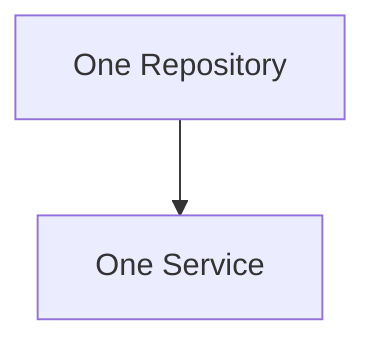
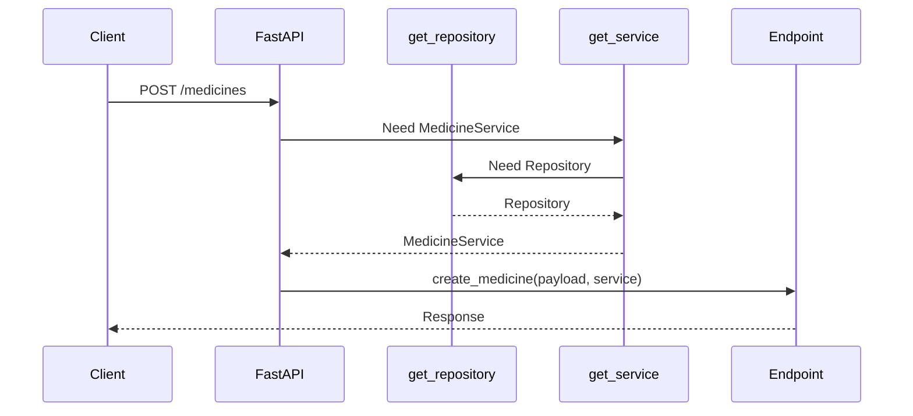
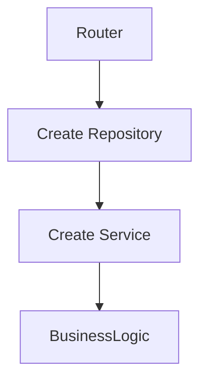
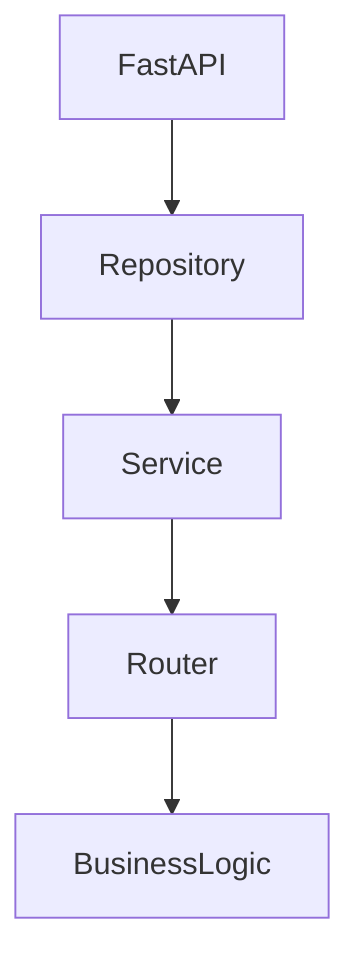
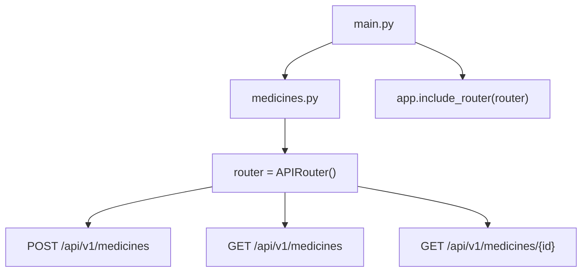
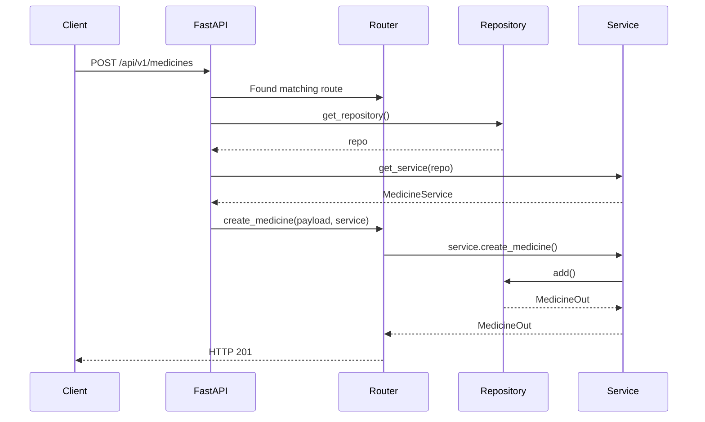

# FastAPI 3-Layer Architecture (Explained Like a Kid)

## The Big Picture

Think of a restaurant.

There are 3 people:

1. Router = Waiter
2. Service = Chef
3. Repository = Store Room

```text
Customer
   ↓
Router
   ↓
Service
   ↓
Repository
```

---

# Router (Waiter)

The router talks to the outside world.

Example:

```python
@router.get("/medicines/{id}")
def get_medicine(id: int):
    return service.get_medicine(id)
```

The router should:

- Receive HTTP requests
- Validate input
- Return HTTP responses

The router should NOT:

- Check business rules
- Talk directly to the database
- Calculate prices

Think:

> Router = "Someone asked for something."

---

# Repository (Store Room)

Repository only stores and fetches data.

Example:

```python
class MedicineRepository:

    def get_by_id(self, medicine_id: int):
        return self._store.get(medicine_id)
```

Repository should:

- Save data
- Read data
- Update data
- Delete data

Repository should NOT:

- Check duplicates
- Check expiry
- Calculate discounts
- Raise HTTP errors

Think:

> Repository = "I store things. That's all."

---

# Service (Chef)

Service is the brain.

Example:

```python
class MedicineService:

    def __init__(self, repo):
        self.repo = repo

    def get_medicine(self, medicine_id: int):

        medicine = self.repo.get_by_id(medicine_id)

        if medicine is None:
            raise MedicineNotFound()

        if medicine.is_expired:
            raise MedicineExpired()

        if medicine.stock == 0:
            raise OutOfStock()

        return medicine
```

Service should:

- Check duplicates
- Check stock
- Check expiry
- Apply business rules
- Coordinate repositories

Think:

> Service = "I make decisions."

---

# Bad Example (No Service Layer)

Everything goes into Router.

```python
@router.get("/medicines/{id}")
def get_medicine(id: int):

    medicine = repo.get_by_id(id)

    if medicine is None:
        raise HTTPException(404)

    if medicine.is_expired:
        raise HTTPException(400)

    if medicine.stock == 0:
        raise HTTPException(400)

    return medicine
```

Looks okay today.

But then:

```python
@router.post("/sale")
def sell_medicine(id: int):
```

needs the same checks.

And:

```python
@router.post("/reserve")
def reserve_medicine(id: int):
```

needs the same checks.

Now code gets copied everywhere.

---

# Good Example (With Service Layer)

Router:

```python
@router.get("/medicines/{id}")
def get_medicine(id: int):
    return service.get_medicine(id)
```

Service:

```python
def get_medicine(id: int):

    medicine = repo.get_by_id(id)

    if medicine is None:
        raise MedicineNotFound()

    if medicine.is_expired:
        raise MedicineExpired()

    if medicine.stock == 0:
        raise OutOfStock()

    return medicine
```

Repository:

```python
def get_by_id(id: int):
    return self._store.get(id)
```

Each layer has one responsibility.

---

# Why Keep Service Even If It Is One Line?

Today:

```python
def get_medicine(id):
    return repo.get_by_id(id)
```

Looks useless.

Tomorrow:

```python
def get_medicine(id):

    medicine = repo.get_by_id(id)

    if medicine.is_expired:
        raise MedicineExpired()

    if medicine.stock == 0:
        raise OutOfStock()

    if medicine.recalled:
        raise MedicineRecalled()

    return medicine
```

Now business logic exists.

If you remove Service today, you'll need to add it later.

---

# Simple Rule

## Router

Handles HTTP.

```text
Request → Response
```

---

## Service

Handles business rules.

```text
Decisions
```

---

## Repository

Handles data storage.

```text
Database
```

---

# One-Line Interview Answer

Router handles HTTP.

Service handles business logic.

Repository handles data storage.

That's the entire purpose of the 3-layer architecture.

# Medicine Service Layer - Simple Explanation

## Goal

Understand why we have a Service layer and what each method does.

---

# create_medicine()

This method contains business logic.

Flow:

```text
Client sends medicine
        ↓
Normalize name
        ↓
Check duplicate
        ↓
Duplicate?
    Yes → Raise DuplicateMedicineError
    No
        ↓
Ask Repository to save
        ↓
Return MedicineOut
```

---

## Example

Frontend sends:

```json
{
  "name": "Dolo",
  "mrp": 50,
  "hsn_code": "3004",
  "manufacturer": "Micro Labs"
}
```

Service receives:

```python
payload: MedicineCreate
```

---

### Step 1: Normalize Name

```python
normalized = normalize_medicine_name(payload.name)
```

Examples:

```text
"Dolo"      → "dolo"
" DOLO "    → "dolo"
"dolo"      → "dolo"
```

Purpose:

```text
Treat all variations as the same medicine.
```

---

### Step 2: Check Duplicate

Ask repository:

```python
existing = self._repo.find_by_normalized_name(normalized)
```

Repository checks storage.

Possible result:

```python
existing = None
```

means:

```text
Medicine does not exist.
```

OR

```python
existing = MedicineOut(...)
```

means:

```text
Medicine already exists.
```

---

### Step 3: Reject Duplicate

```python
if existing is not None:
    raise DuplicateMedicineError(payload.name)
```

Meaning:

```text
Stop immediately.
Do not save.
```

---

### Step 4: Save Medicine

Service already made the decision.

Now Repository does the storage.

```python
return self._repo.add(
    name=payload.name,
    mrp=payload.mrp,
    hsn_code=payload.hsn_code,
    manufacturer=payload.manufacturer,
)
```

---

## Why Service Calls Repository?

Because:

```text
Service = Decision Maker
Repository = Storage Layer
```

Service decides:

```text
Can this medicine be created?
```

Repository decides:

```text
How do I store it?
```

---

# get_medicine()

Current implementation:

```python
def get_medicine(self, medicine_id: int) -> MedicineOut | None:
    return self._repo.get_by_id(medicine_id)
```

---

## What Happens?

```text
User asks for Medicine #5
        ↓
Service asks Repository
        ↓
Repository returns medicine
        ↓
Service returns medicine
```

No business rules yet.

---

## Why Keep Service?

Today:

```python
return self._repo.get_by_id(id)
```

Tomorrow:

```python
medicine = self._repo.get_by_id(id)

if medicine.is_expired:
    raise MedicineExpired()

return medicine
```

Business logic may be added later.

---

# list_medicines()

Current implementation:

```python
def list_medicines(self) -> list[MedicineOut]:
    return self._repo.list_all()
```

---

## What Happens?

```text
User wants all medicines
        ↓
Service asks Repository
        ↓
Repository returns list
        ↓
Service returns list
```

No business rules yet.

---

# Why Not Call Repository Directly From Router?

Bad:

```python
@router.get("/{id}")
def get_medicine(id):

    medicine = repo.get_by_id(id)

    if medicine.is_expired:
        ...

    if medicine.stock == 0:
        ...

    if medicine.recalled:
        ...

    return medicine
```

Router becomes messy.

---

Good:

```python
@router.get("/{id}")
def get_medicine(id):
    return service.get_medicine(id)
```

Router stays simple.

---

# Responsibilities

## Router

Handles:

```text
HTTP Requests
HTTP Responses
Status Codes
```

Example:

```python
@router.get(...)
```

---

## Service

Handles:

```text
Business Rules
Duplicate Checks
Pricing Rules
Stock Rules
Expiry Rules
```

Example:

```python
create_medicine()
```

---

## Repository

Handles:

```text
Store Data
Read Data
Update Data
Delete Data
```

Example:

```python
add()
get_by_id()
list_all()
```

---

# One-Line Interview Answer

```text
Router handles HTTP.

Service handles business logic.

Repository handles data storage.
```

That is the essence of the 3-layer architecture.

# FastAPI Step 1.7 - APIRouter & Depends() (Explained Like a Kid)

## First Forget The Technical Terms

Imagine your pharmacy has grown.

Earlier:

```text
One person handled everything.
```

Now:

```text
Medicine Counter
Customer Counter
Sales Counter
Billing Counter
```

Each counter has a specialist.

This is exactly what APIRouter does.

---

# Before APIRouter

main.py

```python
app = FastAPI()

@app.get("/health")
def health():
    pass

@app.post("/medicines")
def create_medicine():
    pass

@app.get("/medicines")
def list_medicines():
    pass

@app.get("/customers")
def list_customers():
    pass

@app.post("/sales")
def create_sale():
    pass
```

Looks okay today.

After 6 months:

```python
@app.get(...)
@app.post(...)
@app.put(...)
@app.delete(...)
@app.get(...)
@app.post(...)
@app.put(...)
@app.delete(...)
@app.get(...)
@app.post(...)
```

Hundreds of endpoints.

main.py becomes a jungle.

---

# After APIRouter

Create:

```text
routers/
├── medicines.py
├── customers.py
├── sales.py
├── billing.py
```

Now:

## medicines.py

```python
router = APIRouter()

@router.post(...)
def create_medicine():
    pass

@router.get(...)
def list_medicines():
    pass
```

---

## sales.py

```python
router = APIRouter()

@router.post(...)
def create_sale():
    pass
```

---

## main.py

```python
app = FastAPI()

app.include_router(medicine_router)
app.include_router(sales_router)
app.include_router(customer_router)
```

Clean.

---

# What Is Prefix?

Router:

```python
router = APIRouter(
    prefix="/api/v1/medicines"
)
```

Means:

Every endpoint automatically gets:

```text
/api/v1/medicines
```

---

Example:

```python
@router.get("")
```

Actually becomes:

```text
GET /api/v1/medicines
```

---

Example:

```python
@router.get("/{id}")
```

Actually becomes:

```text
GET /api/v1/medicines/1
```

---

# What Are Tags?

```python
tags=["medicines"]
```

Only for Swagger UI.

Without tags:

```text
50 endpoints mixed together
```

With tags:

```text
Medicines
Customers
Sales
Billing
```

Much cleaner.

---

# What Is Depends()?

This is the most important concept.

Imagine:

```text
Router needs a Service.
```

Who creates the Service?

Instead of:

```python
service = MedicineService(...)
```

inside every endpoint,

FastAPI does it automatically.

---

# Without Depends()

```python
@router.post("")
def create_medicine(payload):

    repo = InMemoryMedicineRepository()

    service = MedicineService(repo)

    return service.create_medicine(payload)
```

You repeat this everywhere.

Bad.

---

# With Depends()

```python
@router.post("")
def create_medicine(
    payload,
    service = Depends(get_service)
):
```

FastAPI automatically does:

```python
service = get_service()
```

before endpoint runs.

Think:

```text
Router says:

"FastAPI, please give me a Service."

FastAPI says:

"Sure."
```

---

# Dependency Chain

Request arrives.

```text
POST /api/v1/medicines
```

FastAPI sees:

```python
Depends(get_service)
```

So:

```text
Call get_service()
```

---

Inside get_service():

```python
repo = get_repository()
```

---

Inside get_repository():

```python
return _repository
```

---

Final chain:

```text
Request
   ↓
get_repository()
   ↓
Repository
   ↓
get_service()
   ↓
MedicineService
   ↓
Endpoint
```

---

# Why Is This Useful?

Today:

```python
InMemoryMedicineRepository
```

Tomorrow:

```python
MySQLMedicineRepository
```

Only provider changes.

Service code remains same.

Router code remains same.

---

# What Is HTTPException?

Service raises:

```python
DuplicateMedicineError
```

Service knows:

```text
Business Rule Failed
```

Service DOES NOT know HTTP.

---

Router converts:

```python
DuplicateMedicineError
```

into:

```python
HTTPException(
    status_code=409
)
```

Think:

```text
Service says:
"This medicine already exists."

Router translates that into:

HTTP 409 Conflict
```

---

# Full Request Flow

Client:

```json
{
  "name": "Dolo"
}
```

↓

Router receives request

↓

FastAPI creates Service using Depends()

↓

Service normalizes name

↓

Service checks duplicate

↓

Repository searches storage

↓

Duplicate found?

YES

↓

Service raises:

```python
DuplicateMedicineError
```

↓

Router catches it

↓

Router converts it into:

```python
HTTPException(409)
```

↓

Client receives:

```json
{
  "detail": "Medicine already exists"
}
```

---

# Why Not Return DuplicateMedicineError Directly?

Because clients understand:

```text
HTTP Status Codes
```

They do NOT understand:

```text
Python Exceptions
```

Router acts as translator.

---

# One-Line Memory Trick

```text
APIRouter
=
Group related endpoints
```

```text
Depends()
=
Give me the object I need
```

```text
HTTPException
=
Convert Python errors into HTTP responses
```

---

# Interview Answer

Why separate APIRouter files?

1. Keeps main.py small and maintainable.

2. Each domain (medicines, customers, sales) owns its own endpoints, making the codebase easier to scale and navigate.

---

# Final Architecture

```text
Client
   ↓
Router
   ↓
Depends()
   ↓
Service
   ↓
Repository
   ↓
Storage
```

Router → HTTP

Service → Business Logic

Repository → Data Access

# FastAPI Depends() Explained Like a Software Engineer

## Forget FastAPI For 5 Minutes

Let's write normal Python.

---

# Step 1 - Create Repository

```python
repo = InMemoryMedicineRepository()
```

Now:

```text
repo
```

exists in memory.

---

# Step 2 - Create Service

Service needs a repository.

```python
service = MedicineService(repo)
```

Visual:


---

# Step 3 - Use Service

```python
service.create_medicine(payload)
```

Visual:

```mermaid
graph LR
    Repo[Repository] --> Service[MedicineService]
    Service --> Create[create_medicine()]
```

Nothing special.

Just Python.

---

# Problem Starts Here

Imagine 20 endpoints.

```python
@router.post("/medicines")
def create_medicine(payload):

    repo = InMemoryMedicineRepository()
    service = MedicineService(repo)

    return service.create_medicine(payload)
```

Another endpoint:

```python
@router.get("/medicines")
def list_medicines():

    repo = InMemoryMedicineRepository()
    service = MedicineService(repo)

    return service.list_medicines()
```

Another endpoint:

```python
@router.get("/medicines/{id}")
def get_medicine(id):

    repo = InMemoryMedicineRepository()
    service = MedicineService(repo)

    return service.get_medicine(id)
```

Same code everywhere.

---

# Bigger Problem

Look carefully.

Every request creates:

```python
repo = InMemoryMedicineRepository()
```

New repository.

New dictionary.

New storage.

Imagine:

Request 1:

```python
repo1 = {}
```

Store Dolo.

```python
{
    1: "Dolo"
}
```

Request ends.

---

Request 2:

```python
repo2 = {}
```

Fresh empty dictionary.

Now Dolo disappears.

Bad.

---

# Solution Before Depends()

Create one global repository.

```python
repo = InMemoryMedicineRepository()

service = MedicineService(repo)
```

Visual:



Endpoints:

```python
@router.post("")
def create_medicine(payload):
    return service.create_medicine(payload)

@router.get("")
def list_medicines():
    return service.list_medicines()
```

Works.

---

# Why Is Global Object Bad?

Today:

```python
service = MedicineService(repo)
```

Tomorrow:

```python
service = MedicineService(
    mysql_repo,
    redis_cache,
    email_service,
    logger,
)
```

Testing becomes hard.

Changing implementations becomes hard.

Everything becomes tightly coupled.

---

# FastAPI's Solution = Depends()

Instead of:

```python
service = MedicineService(repo)
```

manually,

tell FastAPI:

```python
service: MedicineService = Depends(get_service)
```

Meaning:

```text
FastAPI,
before calling my endpoint,
please create the service
and give it to me.
```

---

# What Actually Happens?

You write:

```python
def get_service():

    repo = get_repository()

    return MedicineService(repo)
```

---

Endpoint:

```python
@router.post("")
def create_medicine(
    payload,
    service: MedicineService = Depends(get_service)
):
```

---

FastAPI secretly does:

```python
service = get_service()

create_medicine(
    payload=payload,
    service=service
)
```

You never see this code.

FastAPI does it.

---

# Actual Runtime Flow



---

# Real Meaning Of Depends()

Depends means:

```text
I need an object.
I don't care how it's created.
FastAPI, please provide it.
```

---

# Why Do Big Companies Love This?

Today:

```python
return InMemoryMedicineRepository()
```

Tomorrow:

```python
return MySQLMedicineRepository()
```

Only this changes:

```python
def get_repository():
    return MySQLMedicineRepository()
```

Everything else remains unchanged.

Service:

```python
service.create_medicine()
```

still works.

Router:

```python
Depends(get_service)
```

still works.

---

# Most Important Mental Model

Without Depends:



Router creates everything.

Router becomes responsible for everything.

---

With Depends:



FastAPI creates dependencies.

Router only handles requests.

Cleaner.

---

# One Sentence Definition

Depends() is FastAPI's built-in dependency injection system.

It automatically creates and injects objects your endpoint needs, so you don't manually create them inside every route.

# How main.py and medicine.py Are Connected

## Step 1

When you run:

```bash id="c1g5v7"
uvicorn app.main:app --reload
```

Python opens:

```python id="j2r2jg"
app/main.py
```

and executes it from top to bottom.

---

## Step 2

Python sees:

```python id="d1qqxj"
from app.routers import medicines as medicines_router
```

Now Python loads:

```text id="u6jv7r"
app/routers/medicines.py
```

completely.

Everything inside medicines.py executes.

---

## Step 3

During loading:

```python id="t4rm7o"
router = APIRouter(
    prefix="/api/v1/medicines",
    tags=["medicines"]
)
```

is created.

Think:

```text id="7w3c4r"
A box of medicine endpoints is created.
```

Inside this box:

```python id="f9utcm"
@router.post("")
```

```python id="d73j5n"
@router.get("")
```

```python id="m2f2ul"
@router.get("/{medicine_id}")
```

are registered.

So router now knows:

```text id="9jh8wv"
POST  /api/v1/medicines

GET   /api/v1/medicines

GET   /api/v1/medicines/{id}
```

---

## Step 4

Control returns to:

```python id="0djv0k"
main.py
```

and reaches:

```python id="u5wyvk"
app.include_router(
    medicines_router.router
)
```

This is the MOST IMPORTANT LINE.

Think:

```text id="9g7s4l"
Hey FastAPI,

Take all endpoints from medicines.py

and register them into the application.
```

---

## Visual



---

# What Happens When Request Arrives?

Client sends:

```http id="w4vmgx"
POST /api/v1/medicines
```

---

FastAPI checks:

```text id="0qz6z8"
Which router owns this URL?
```

Finds:

```text id="69lvrt"
medicines.py
```

because:

```python id="0fxwdi"
prefix="/api/v1/medicines"
```

matches.

---

FastAPI then executes:

```python id="5mt0wa"
create_medicine()
```

inside medicines.py

---

# But Wait...

create_medicine() needs:

```python id="8h5z1i"
service: MedicineService
```

Where does it come from?

---

FastAPI sees:

```python id="ktlrj7"
Depends(get_service)
```

and says:

```text id="7q4w7f"
Before calling create_medicine()

I must execute get_service()
```

---

# get_service()

FastAPI executes:

```python id="k7zvub"
get_service()
```

But get_service needs:

```python id="7g6bjd"
repo
```

---

FastAPI sees:

```python id="a3pvbh"
Depends(get_repository)
```

and executes:

```python id="x9gzyh"
get_repository()
```

---

get_repository returns:

```python id="8pnv6t"
_repository
```

which is:

```python id="cb3v9w"
InMemoryMedicineRepository()
```

---

Now FastAPI has:

```python id="n9y1jf"
repo
```

and can create:

```python id="2ut2r7"
MedicineService(repo)
```

---

Now FastAPI finally calls:

```python id="hdk1u2"
create_medicine(
    payload=...,
    service=MedicineService(...)
)
```

---

# Full Runtime Flow



---

# One Simple Sentence

This line:

```python id="h3s4aq"
app.include_router(
    medicines_router.router
)
```

is the wiring.

Without it:

```text id="kfyh9d"
FastAPI does not know medicines.py exists.
```

With it:

```text id="clx3w4"
FastAPI imports all medicine endpoints
and makes them available as APIs.
```

That single line is literally connecting `main.py` to `medicines.py`.
